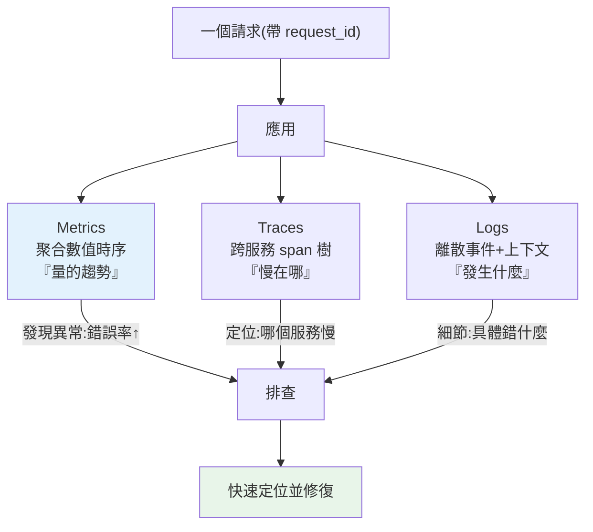

# 可觀測性 logging / metrics / tracing

> 服務在正式環境變慢了、偶爾報錯——但你連不上去、也不能加 `print`。你只能靠它「往外送的訊號」來理解裡面發生什麼。**可觀測性（observability）** 就是讓系統對外可被理解的能力，三大支柱：**logs、metrics、traces**。這章講三者的分工與 Python 的實作。

## 💡 白話導讀（建議先讀）

服務在正式環境變慢了——但你連不進去、不能加 `print`、不能開 debugger。
這像**醫生看診**:打不開病人的身體,只能靠病人「往外送的訊號」判斷裡面怎麼了。

可觀測性（observability）的三大支柱,就是醫生的三樣工具:

- **Metrics ＝生命徵象監視器**:體溫、心跳、血壓的**數值曲線**——
  請求量、錯誤率、p99 延遲。看**趨勢**、設**警報**（發燒了叫醒值班的人）,便宜、可聚合。
- **Logs ＝病歷紀錄**:一條條**離散事件**的細節——
  「ERROR 訂單 123 付款失敗:餘額不足」。回答「那個當下發生了什麼」。
- **Traces ＝顯影劑造影**:打一劑顯影,看一個請求**流過哪些器官、卡在哪**——
  「這個請求 800ms:gateway 10ms → 訂單服務 50ms → **資料庫 740ms**」。瓶頸無所遁形。

排查流程幾乎總是這個順序:**監視器發現發燒**(metrics 警報)→
**造影找到病灶**(trace 指出慢在哪個服務)→ **翻病歷看細節**(logs 查那筆請求的上下文)。

Python 落地的三件套,這章逐一動手:結構化日誌(JSON 格式、帶 request id,
機器可查詢)、Prometheus 格式的 metrics 端點、OpenTelemetry 自動埋 trace。
配一條鐵律:**日誌只往 stdout 印**([12-factor](04-12-factor.md)),收集交給平台。

## Why（為什麼）

開發時出問題，你可以加 `print`、用 debugger、重跑。正式環境完全不同：你**不能**登進去加 `print`、不能中斷服務、問題可能是**偶發**的（每 1000 個請求錯 1 個）、可能只在**特定負載**下出現、可能橫跨**多個微服務**（請求經過 5 個服務才出錯）。你唯一能依靠的，是系統**主動往外送出的訊號**。

**可觀測性（observability）** 就是設計系統時，讓它輸出足夠的訊號，使你能從外部**回答任何關於它內部狀態的問題**——不只「它掛了嗎」，而是「為什麼慢」「哪個請求出錯」「這個延遲花在哪個服務」。三大支柱各司其職：

- **Logs（日誌）**：離散的事件記錄——「發生了什麼」（某請求報了什麼錯、某操作的細節）。
- **Metrics（指標）**：可聚合的數值時間序列——「量的趨勢」（每秒請求數、錯誤率、p99 延遲、記憶體用量）。
- **Traces（追蹤）**：一個請求跨服務的完整路徑——「這個請求經過哪些服務、各花多久」。

沒有可觀測性，正式環境的問題就像在黑箱裡摸索。有了它，你能快速定位、理解、修復。這章講三者的分工、Python 的做法，以及雲原生環境的關鍵實踐：**結構化日誌**。

## Theory（理論：三大支柱的分工）

三者回答不同層次的問題，互補而非替代：

| 支柱 | 回答 | 形式 | 範例 |
|------|------|------|------|
| **Logs** | 「發生了什麼？」 | 離散事件（帶時間、上下文） | `ERROR 訂單 123 付款失敗：餘額不足` |
| **Metrics** | 「量的趨勢如何？」 | 數值時間序列（可聚合） | `http_requests_total`、`p99_latency=250ms` |
| **Traces** | 「請求經過哪裡、慢在哪？」 | 跨服務的 span 樹 | `請求耗 800ms：gateway 10ms→訂單 50ms→DB 740ms` |

**典型的排查流程**：**Metrics 發現異常**（錯誤率飆升、p99 延遲上升）→ **Traces 定位瓶頸**（哪個服務/操作慢）→ **Logs 看細節**（那個請求具體錯在哪）。三者串起來，從「有問題」到「問題在哪」到「為什麼」。

**監控（monitoring）vs 可觀測性（observability）**：監控是「盯著預先定義好的指標與告警」（已知問題）；可觀測性是「能探索、回答事先沒預期的問題」（未知問題）。可觀測性是更強的性質——好的可觀測性讓你能調查從沒想過的故障。

## Specification（規範：Python 實作）

**Logs——用標準庫 `logging`、輸出結構化 JSON、寫 stdout**（見 [logging](../11-stdlib/README.md)、[12-factor](04-12-factor.md)）：

```python
import logging, sys
logging.basicConfig(stream=sys.stdout, level=logging.INFO)
logger = logging.getLogger("myapp")
# 結構化：帶上下文欄位，方便機器解析與查詢
logger.info("payment_failed", extra={"order_id": 123, "reason": "insufficient_balance"})
```

實務常用 `structlog` 或自訂 formatter 輸出 JSON。**關鍵**：帶 **correlation id / request id**，讓同一請求的所有 log 能被串起來。

**Metrics——用 `prometheus_client` 暴露指標**：

```python
from prometheus_client import Counter, Histogram
REQUESTS = Counter("http_requests_total", "總請求數", ["method", "status"])
LATENCY = Histogram("http_request_duration_seconds", "請求延遲")

REQUESTS.labels(method="GET", status="200").inc()
with LATENCY.time():
    handle_request()
```

四個黃金訊號（Google SRE）：**延遲（latency）、流量（traffic）、錯誤（errors）、飽和度（saturation）**。

**Traces——用 OpenTelemetry**：

```python
from opentelemetry import trace
tracer = trace.get_tracer("myapp")
with tracer.start_as_current_span("process_order"):
    with tracer.start_as_current_span("query_db"):
        ...   # 每個 span 記錄操作與耗時，串成請求的完整路徑
```

**OpenTelemetry（OTel）** 是可觀測性的開放標準，統一 logs/metrics/traces 的產生與匯出。

## Implementation（底層：結構化日誌與 trace 傳播）

**為何結構化日誌（structured logging）在雲原生是必須的**：傳統的純文字 log（`"2024-01-01 訂單 123 付款失敗 餘額不足"`）人看得懂，但**機器難解析、難查詢、難聚合**。在雲原生環境，log 從**成百上千個容器**匯集到中央系統（如 Elasticsearch/Loki），你需要「找出所有 `order_id=123` 的 log」「統計每種錯誤原因的次數」——這要求 log 是**結構化的**（JSON），每個欄位可被索引查詢：

```json
{"time": "...", "level": "ERROR", "event": "payment_failed", "order_id": 123, "reason": "insufficient_balance", "request_id": "abc-123"}
```

結構化後，log 系統能依任意欄位過濾、聚合、關聯——這是純文字做不到的。所以雲原生應用應輸出 JSON log 到 stdout，交給平台收集索引。

**correlation id / trace context 的傳播**：一個請求跨越多個服務時，怎麼把它們的 log/trace 串起來？靠一個**貫穿全程的 id**：入口（gateway）為請求生成一個 `request_id`（或 trace id），並在**跨服務呼叫時透過 HTTP header 傳遞**（如 `traceparent`，OTel 標準）。每個服務把這個 id 放進自己的 log 與 span。於是你能用同一個 id 撈出「這個請求在所有服務裡的完整足跡」——這是排查分散式問題的關鍵（見 [分散式追蹤](../22-distributed-systems/08-distributed-tracing.md)）。

**metrics 的聚合本質**：metrics 不是每個事件都存（那是 log），而是**在應用端累加/取樣成數值**（Counter 累加、Histogram 分桶），由 Prometheus 定期「拉取（scrape）」。這讓它能以極低成本表示「每秒幾萬請求」的趨勢——你存的是聚合後的數字，不是每個請求。

## Code Example（可執行的 Python 範例）

以下實作結構化 JSON 日誌與簡單指標計數（純標準庫，可執行）：

```python
# observability_demo.py — 結構化日誌 + 指標計數（純標準庫）
from __future__ import annotations

import json
from collections import Counter
from dataclasses import dataclass, field


def structured_log(level: str, event: str, request_id: str, **fields: object) -> str:
    """輸出一行結構化 JSON 日誌（機器可解析、可依欄位查詢）。"""
    record = {"level": level, "event": event, "request_id": request_id, **fields}
    return json.dumps(record, ensure_ascii=False, sort_keys=True)


@dataclass
class Metrics:
    """簡易指標：計數請求數與各狀態碼（模擬 Prometheus Counter）。"""

    requests_total: int = 0
    by_status: Counter[int] = field(default_factory=Counter)

    def observe(self, status: int) -> None:
        self.requests_total += 1
        self.by_status[status] += 1

    def error_rate(self) -> float:
        errors = sum(n for s, n in self.by_status.items() if s >= 500)
        return errors / self.requests_total if self.requests_total else 0.0


def main() -> None:
    metrics = Metrics()

    # 模擬處理幾個請求：輸出結構化 log + 記錄指標
    events = [("abc-1", 200), ("abc-2", 200), ("abc-3", 500)]
    for rid, status in events:
        metrics.observe(status)
        level = "ERROR" if status >= 500 else "INFO"
        event = "request_failed" if status >= 500 else "request_ok"
        print(structured_log(level, event, rid, status=status))

    # 指標聚合（Metrics 支柱）
    print(f"\n總請求數: {metrics.requests_total}")
    print(f"各狀態: {dict(metrics.by_status)}")
    print(f"錯誤率: {metrics.error_rate():.1%}")


if __name__ == "__main__":
    main()
```

**預期輸出**：

```pycon
$ python observability_demo.py
{"event": "request_ok", "level": "INFO", "request_id": "abc-1", "status": 200}
{"event": "request_ok", "level": "INFO", "request_id": "abc-2", "status": 200}
{"event": "request_failed", "level": "ERROR", "request_id": "abc-3", "status": 500}

總請求數: 3
各狀態: {200: 2, 500: 1}
錯誤率: 33.3%
```

逐段解說：

- **`structured_log`**：輸出 JSON 而非純文字——每筆帶 `request_id`（correlation id），log 系統可依 `request_id`/`status`/`event` 任意過濾聚合。這是雲原生日誌的正確形式。
- **`request_id`**：貫穿請求的 id，讓同一請求（甚至跨服務）的所有 log 能被串起來查詢。
- **`Metrics`**：模擬 Prometheus Counter——累加請求數與各狀態碼，算出**錯誤率**（33.3%）。這是「可聚合的數值趨勢」，與離散的 log 互補。
- **要點**：log 記「發生什麼」（每筆事件）、metrics 記「量的趨勢」（聚合數字）；結構化 + correlation id 是可觀測性的基礎。

## Diagram（圖解：三大支柱協作）



## Best Practice（最佳實踐）

- **輸出結構化 JSON 日誌到 stdout**：機器可解析、可依欄位查詢；交平台收集（見 [12-factor](04-12-factor.md)）。
- **每筆 log 帶 correlation/request id**：串起同一請求（跨服務）的所有足跡。
- **用適當的 log level**：ERROR/WARNING/INFO/DEBUG 分明，正式環境通常 INFO 以上。
- **暴露黃金訊號指標**：延遲、流量、錯誤、飽和度（用 `prometheus_client`）。
- **用 OpenTelemetry 做分散式追蹤**：跨服務傳播 trace context（見 [分散式追蹤](../22-distributed-systems/08-distributed-tracing.md)）。
- **別把敏感資料寫進 log**：密碼、token、個資（見 [資安](../20-security-system-design/README.md)）。
- **設有意義的告警**（基於指標）：對症狀（錯誤率/延遲）告警，而非雜訊。
- **排查用「metrics 發現 → traces 定位 → logs 細節」的流程**串三支柱。

## Common Mistakes（常見誤解）

- **用純文字非結構化 log**：機器難解析、無法依欄位查詢與聚合。
- **log 不帶 request/trace id**：分散式問題無法把跨服務的足跡串起來。
- **在正式環境靠 `print` 除錯**：無法登入、無法加、偶發問題重現不了。
- **把密碼/token/個資寫進 log**：資安與合規事故。
- **log level 亂用**（全 INFO 或全 DEBUG）：不是雜訊淹沒重點，就是漏掉重要事件。
- **只有 log 沒有 metrics/traces**：能看單筆事件，卻看不出趨勢與跨服務瓶頸。
- **告警設在雜訊上**：告警疲勞，真問題被忽略。
- **log 寫本地檔案而非 stdout**：容器重啟消失、多實例無法匯總（見 [12-factor](04-12-factor.md)）。

## Interview Notes（面試重點）

- **能說出可觀測性三大支柱的分工**：logs（發生什麼）、metrics（量的趨勢）、traces（跨服務路徑/瓶頸），及它們如何互補。
- **能解釋結構化日誌為何在雲原生是必須的**（機器可解析、可查詢聚合、多容器匯集）。
- **知道 correlation/trace id 的傳播**如何串起跨服務的請求足跡。
- **知道四個黃金訊號**（延遲/流量/錯誤/飽和度）與 metrics 的聚合本質。
- **知道 OpenTelemetry 是統一標準**，以及 monitoring（已知）vs observability（未知）的差別。
- **能描述排查流程**：metrics 發現 → traces 定位 → logs 細節，並知道別把敏感資料寫進 log。

---

⬅️ 這是 Part 19 的最後一章。

[⬆️ 回 Part 19 索引](README.md) ｜ [下一 Part：安全與系統設計面試 ➡️](../20-security-system-design/README.md)
