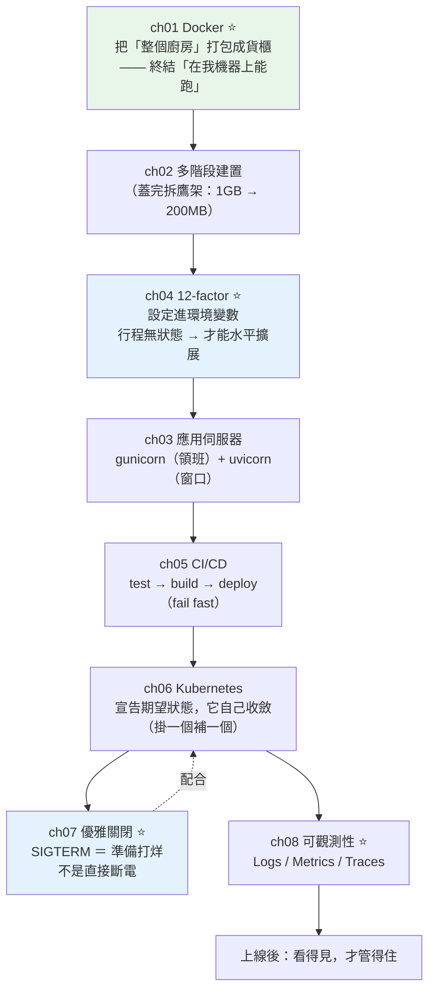

# Part 19 統整：雲原生與部署全貌

> 把這 8 章串成一張圖——它們一起終結一句話：**「在我機器上明明能跑。」**

## 🗺️ 知識地圖（這 8 章怎麼串起來）

Part 19 是「**把程式交出去**」的完整流程。它有一條清楚的時間軸：



**一句話串起來**：

**[Docker](01-docker.md)（ch01）** 把「應用 + 整個執行環境」打包成貨櫃——
**「在我機器上能跑」從此不再是藉口**。
[多階段建置](02-multistage-build.md)（ch02）則是「**蓋完拆鷹架**」：
編譯工具留在工地，交屋時只給乾淨的房子。

但光有貨櫃不夠——**應用本身也得「適合被搬運」**，
這就是 **[12-factor](04-12-factor.md)（ch04）**：
**設定進環境變數**（同一個映像檔，換個環境變數就能跑 dev/prod）、
**行程無狀態**（session 放外部）——**無狀態，才能無腦加機器**。

接著 **[CI/CD](05-ci-cd.md)（ch05）** 把「測試→建置→部署」自動化，
**[K8s](06-kubernetes.md)（ch06）** 接手「維持 N 個副本活著」。

而上線之後，兩件事決定你半夜會不會被叫醒：
**[優雅關閉](07-graceful-shutdown.md)（ch07，換版時不切斷在途請求）**
與 **[可觀測性](08-observability.md)（ch08，看得見才管得住）**。

## ⚡ 速查表（什麼情境用什麼）

| 情境 | 怎麼做 | 章節 |
|------|--------|------|
| **「在我機器上能跑」** | **Docker**——把環境一起打包 | [ch01](01-docker.md) |
| 映像檔太肥（1 GB+） | **多階段建置**：builder 階段編譯，最終階段只留成品 | [ch02](02-multistage-build.md) |
| Dockerfile 每次都重裝依賴 | **先 COPY 依賴清單裝套件、再 COPY 程式碼**（善用**層快取**） | [ch01](01-docker.md) |
| 資料庫密碼放哪 | **環境變數**（絕不寫死、絕不進 git） | [ch04](04-12-factor.md) |
| 想水平擴展（多開幾台） | **行程必須無狀態**——session／上傳檔放外部（Redis／S3） | [ch04](04-12-factor.md) |
| 正式環境怎麼跑 FastAPI | **`gunicorn -k uvicorn.workers.UvicornWorker -w 4`**（領班 + 非同步窗口） | [ch03](03-gunicorn-uvicorn.md) |
| 日誌寫去哪 | **只印到 stdout**——收集是平台的事（別自己寫檔案輪替） | [ch04](04-12-factor.md)、[ch08](08-observability.md) |
| CI 怎麼排順序 | **fail fast**：lint（秒）→ 型別 → 測試 → 建置（分鐘） | [ch05](05-ci-cd.md) |
| **K8s 的 Pod 一直重啟** | 檢查 **liveness 是不是寫太深**（別在裡面檢查資料庫！） | [ch06](06-kubernetes.md)、[ch07](07-graceful-shutdown.md) |
| **liveness vs readiness** | **liveness 要淺**（只看行程活著，失敗→**重啟**）；**readiness 可以深**（依賴不通→**只摘流量、不重啟**） | [ch06](06-kubernetes.md) |
| 換版時使用者收到 502 | **優雅關閉**：攔 `SIGTERM` → readiness 轉紅 → 等在途請求做完 → 釋放資源 | [ch07](07-graceful-shutdown.md) |
| Docker 裡收不到 SIGTERM | **用 exec 形式**：`CMD ["python", "app.py"]`（**不要 `CMD python app.py`**） | [ch07](07-graceful-shutdown.md) |
| 排查「服務變慢了」 | **Metrics 發現** → **Traces 定位** → **Logs 看細節** | [ch08](08-observability.md) |
| 日誌要能被查詢 | **結構化日誌（JSON）** + request id | [ch08](08-observability.md) |

## 🔑 核心心智模型（帶得走的幾句話）

- **Docker ＝ 把整個廚房打包成貨櫃。** 不只帶菜刀（程式碼），
  連瓦斯、鍋具、醬油（Python 版本、系統函式庫、依賴）全裝進去——
  **運到哪裡，打開就是同一個廚房**。
- **12-factor 的靈魂：無狀態。** 行程不能記住任何東西
  （session、上傳的檔案都放外部）——**因為無狀態，才能隨便砍、隨便加**。
  這是水平擴展的**前提**，不是建議。
- **K8s 是宣告式的。** 你不說「開一台、再開一台」，你說「**我要 3 個副本**」——
  controller 無限迴圈地「比對現況與期望，不符就修正」。
  **自癒不是魔法，是「盯著看 + 自動修正」。**
- **liveness 要淺，readiness 可以深。** 這是**最容易搞砸的一件事**：
  把「資料庫連不上」寫進 liveness → 資料庫抖一下 → **K8s 把全部 Pod 重啟** →
  小故障變成全面停機。
- **`SIGTERM` 是「準備打烊」，不是「斷電」。** 它**可以攔、應該攔**：
  先讓 readiness 轉紅（不再進新客人），等在途請求做完，再收拾資源。
  **30 秒內沒退出，才會被 `SIGKILL` 強殺**（那時在途請求就被硬生生折斷）。
- **看不見，就管不住。** 上線後你連不進去、不能加 `print`——
  只能靠它「往外送的訊號」：**Metrics 發現異常 → Traces 定位瓶頸 → Logs 看細節**。

## 🛠️ 小實作：一支「雲原生就緒」的服務骨架

這支腳本示範四件**上線前必做**的事：
**12-factor 設定** → **結構化日誌** → **健康檢查（淺/深）** → **優雅關閉**。

```python
# cloud_native_demo.py —— Part 19 主線：讓服務「適合被搬運、被觀測、被關閉」
from __future__ import annotations

import json
import logging
import os
import signal
import sys
import time
from dataclasses import dataclass, field
from typing import Any


# ── ch08 可觀測性：結構化日誌（JSON）—— 機器可查詢，不是給人看的散文 ──
class JsonFormatter(logging.Formatter):
    def format(self, record: logging.LogRecord) -> str:
        payload: dict[str, Any] = {
            "level": record.levelname,
            "msg": record.getMessage(),
            "logger": record.name,
        }
        payload.update(getattr(record, "extra_fields", {}))
        return json.dumps(payload, ensure_ascii=False)


handler = logging.StreamHandler(sys.stdout)     # ch04：只印到 stdout，收集是平台的事
handler.setFormatter(JsonFormatter())
logging.basicConfig(level=logging.INFO, handlers=[handler])
log = logging.getLogger("app")


def log_with(level: int, msg: str, **fields: Any) -> None:
    log.log(level, msg, extra={"extra_fields": fields})


# ── ch04 12-factor：設定一律從環境變數來（不寫死、不進 git）──
@dataclass
class Settings:
    app_env: str = field(default_factory=lambda: os.getenv("APP_ENV", "development"))
    port: int = field(default_factory=lambda: int(os.getenv("PORT", "8000")))
    db_url: str = field(
        default_factory=lambda: os.getenv("DATABASE_URL", "sqlite:///:memory:")
    )

    def masked(self) -> dict[str, str]:
        """密鑰絕不進日誌。"""
        return {
            "app_env": self.app_env,
            "port": str(self.port),
            "db_url": self.db_url.split("://")[0] + "://***",
        }


# ── ch06 / ch07 健康檢查 + 優雅關閉 ──
class App:
    def __init__(self, settings: Settings) -> None:
        self.settings = settings
        self.ready = False
        self.shutting_down = False
        self.inflight = 0

    def healthz(self) -> tuple[int, str]:
        """liveness：只問「行程還活著嗎」——⚠️ 絕不檢查外部依賴！

        （若在這裡檢查 DB，資料庫一抖，K8s 會把「全部」Pod 重啟。）
        """
        return (200, "ok")

    def readyz(self) -> tuple[int, str]:
        """readiness：可以「深」——依賴不通就別接客（但不重啟）。"""
        if self.shutting_down:
            return (503, "shutting down")
        if not self.ready:
            return (503, "warming up")
        return (200, "ready")

    def handle_sigterm(self, signum: int, frame: object) -> None:
        """ch07 優雅關閉：SIGTERM ＝ 準備打烊，不是直接斷電。"""
        log_with(logging.WARNING, "收到 SIGTERM，開始優雅關閉", signal=signum)

        self.shutting_down = True
        log_with(logging.INFO, "1. readiness 轉紅 → K8s 停止把新流量導進來")

        log_with(logging.INFO, "2. 等待在途請求做完", inflight=self.inflight)
        while self.inflight > 0:
            self.inflight -= 1
            time.sleep(0.01)

        log_with(logging.INFO, "3. 釋放資源（DB 連線池、背景任務）")
        log_with(logging.INFO, "優雅關閉完成 ✅ 沒有任何請求被硬生生切斷")


def demo() -> None:
    settings = Settings()
    app = App(settings)
    log_with(logging.INFO, "服務啟動", **settings.masked())

    print("\n  ── 啟動中（還沒 ready）──")
    print(f"    GET /healthz → {app.healthz()}   ← 活著（淺：不看外部依賴）")
    print(f"    GET /readyz  → {app.readyz()}   ← 還沒準備好接客")

    app.ready = True
    app.inflight = 3
    print("\n  ── 就緒，正在服務 ──")
    print(f"    GET /healthz → {app.healthz()}")
    print(f"    GET /readyz  → {app.readyz()}")

    print("\n  ── K8s 要換版了，送出 SIGTERM ──")
    app.handle_sigterm(signal.SIGTERM, None)
    print(f"\n    GET /readyz  → {app.readyz()}   ← 已摘除，不再有新流量")


if __name__ == "__main__":
    demo()
```

**執行**（注意：**同一份程式碼，換個環境變數就變成 production**）：

```pycon
$ APP_ENV=production PORT=8080 DATABASE_URL="postgresql://user:secret@db/prod" \
    python cloud_native_demo.py

{"level": "INFO", "msg": "服務啟動", "logger": "app", "app_env": "production",
 "port": "8080", "db_url": "postgresql://***"}

  ── 啟動中（還沒 ready）──
    GET /healthz → (200, 'ok')   ← 活著（淺：不看外部依賴）
    GET /readyz  → (503, 'warming up')   ← 還沒準備好接客

  ── 就緒，正在服務 ──
    GET /healthz → (200, 'ok')
    GET /readyz  → (200, 'ready')

  ── K8s 要換版了，送出 SIGTERM ──
{"level": "WARNING", "msg": "收到 SIGTERM，開始優雅關閉", "logger": "app", "signal": 15}
{"level": "INFO", "msg": "1. readiness 轉紅 → K8s 停止把新流量導進來", "logger": "app"}
{"level": "INFO", "msg": "2. 等待在途請求做完", "logger": "app", "inflight": 3}
{"level": "INFO", "msg": "3. 釋放資源（DB 連線池、背景任務）", "logger": "app"}
{"level": "INFO", "msg": "優雅關閉完成 ✅ 沒有任何請求被硬生生切斷", "logger": "app"}

    GET /readyz  → (503, 'shutting down')   ← 已摘除，不再有新流量
```

**四個上線前必做的事，全在這裡**：

**① 12-factor：同一份程式碼，環境變數決定它是誰。**
`APP_ENV=production` 就變 production——**不必改一行程式碼、不必重新打包**。
而且 `db_url` 在日誌裡被**遮蔽成 `postgresql://***`**——**密碼絕不進日誌**。

**② 結構化日誌（JSON）。**
不是給人讀的散文，是**給機器查詢的欄位**——
你可以直接查「所有 `level=WARNING` 且 `inflight > 0` 的事件」。

**③ liveness 要淺、readiness 可以深。**
啟動中時，`/healthz` **回 200**（行程確實活著），
但 `/readyz` **回 503**（還沒準備好）——
**K8s 因此「不重啟它，只是先不給它流量」**。
（如果反過來把 DB 檢查寫進 `/healthz`，資料庫一抖 → **全部 Pod 被重啟** → 小故障變全面停機。）

**④ 優雅關閉的順序不能亂。**
收到 `SIGTERM` → **先把 readiness 轉紅**（止血：不再進新客人）→
**等在途請求做完** → 再釋放資源。
少了第一步，你會在「還在收新請求」的時候關閉連線池——直接 502。

## ✅ 自測清單（答不出來就回去讀）

- [ ] Docker 和虛擬機差在哪？（提示：kernel）（[ch01](01-docker.md)）
- [ ] Dockerfile 的層快取怎麼運作？COPY 的順序為什麼重要？（[ch01](01-docker.md)）
- [ ] 多階段建置解決什麼問題？（[ch02](02-multistage-build.md)）
- [ ] 12-factor 裡「無狀態」為什麼是水平擴展的前提？（[ch04](04-12-factor.md)）
- [ ] 為什麼設定要放環境變數而不是設定檔？（[ch04](04-12-factor.md)）
- [ ] gunicorn 和 uvicorn 是什麼關係？為什麼常一起用？（[ch03](03-gunicorn-uvicorn.md)）
- [ ] CI 的 fail fast 是什麼意思？步驟該怎麼排？（[ch05](05-ci-cd.md)）
- [ ] K8s 的「宣告式」和「命令式」差在哪？（[ch06](06-kubernetes.md)）
- [ ] Pod、Deployment、Service 各是什麼？（[ch06](06-kubernetes.md)）
- [ ] **liveness 和 readiness 探針差在哪？各自失敗會怎樣？**（[ch06](06-kubernetes.md)、[ch07](07-graceful-shutdown.md)）
- [ ] 為什麼 liveness 不能檢查資料庫？（[ch07](07-graceful-shutdown.md)）
- [ ] SIGTERM 和 SIGKILL 差在哪？優雅關閉的正確順序？（[ch07](07-graceful-shutdown.md)）
- [ ] Dockerfile 的 `CMD` 為什麼要用 exec 形式？（[ch07](07-graceful-shutdown.md)）
- [ ] 可觀測性三支柱各回答什麼問題？排查的順序？（[ch08](08-observability.md)）

## 🎯 面試速查

| 考點 | 面試官想聽到什麼 | 章節 |
|------|------------------|------|
| **Docker 和 VM 的差別？** | 「**VM 虛擬化整個作業系統**（自帶 kernel）——肥重、啟動慢。**容器共享宿主機的 kernel**，只隔離**行程與檔案系統**——輕量、秒啟、密度高。所以微服務用容器而非 VM。」 | [ch01](01-docker.md) |
| **12-factor 最重要的是什麼？** | 「① **設定進環境變數**（同一份映像檔跑遍所有環境，密鑰不進版控）；② **行程無狀態**——session、上傳檔放外部（Redis／S3）。**因為無狀態，才能隨意砍掉、隨意加開**，這是**水平擴展的前提**。」 | [ch04](04-12-factor.md) |
| **liveness vs readiness？**（高頻） | 「**liveness**：『行程還活著嗎』——失敗會**重啟容器**，所以**必須淺**（絕不檢查外部依賴）。**readiness**：『能接流量嗎』——失敗只是**從 Service 摘除、不重啟**，所以**可以深**（檢查 DB／Redis）。**把 DB 檢查寫進 liveness 是經典事故**：資料庫抖一下，K8s 把全部 Pod 重啟，小故障變全面停機。」 | [ch06](06-kubernetes.md)、[ch07](07-graceful-shutdown.md) |
| **優雅關閉怎麼做？** | 「攔截 **`SIGTERM`**（K8s 先送這個，30 秒寬限期後才 `SIGKILL`）。順序：① **readiness 轉紅**（先止血，不再進新請求，且要等傳播延遲）；② **等在途請求做完**；③ **釋放資源**（連線池、背景任務）。Docker 要用 **exec 形式的 `CMD`**，否則訊號送給 shell、Python 收不到。」 | [ch07](07-graceful-shutdown.md) |
| **K8s 的自癒原理？** | 「**宣告式 + reconciliation loop**。你宣告『我要 3 個副本』，controller **無限迴圈地比對『現況 vs 期望』，不符就修正**——掛一個補一個，多一個砍一個。所以自癒不是魔法，是**持續盯著看 + 自動修正**。」 | [ch06](06-kubernetes.md) |
| **服務變慢了，怎麼查？** | 「照三支柱的順序：**Metrics 發現異常**（p99 延遲飆升、錯誤率上升）→ **Traces 定位瓶頸**（哪個服務／哪個操作慢）→ **Logs 看細節**（那筆請求的上下文）。日誌要**結構化（JSON）+ 帶 request id**，才能把三者串起來。」 | [ch08](08-observability.md) |

---

🎉 **恭喜完成 Part 19！** 你的服務現在**能被可靠地送上去、看得見、關得掉**。

接下來 [Part 20 安全與系統設計](../20-security-system-design/README.md) 要問一個更危險的問題：
**如果有人「故意」要弄壞它呢？**
——從 SQL injection 到密碼雜湊，再到系統設計面試的四道經典題。

➡️ 下一 Part：[安全與系統設計 Security & System Design](../20-security-system-design/README.md)

[⬆️ 回 Part 19 索引](README.md)
