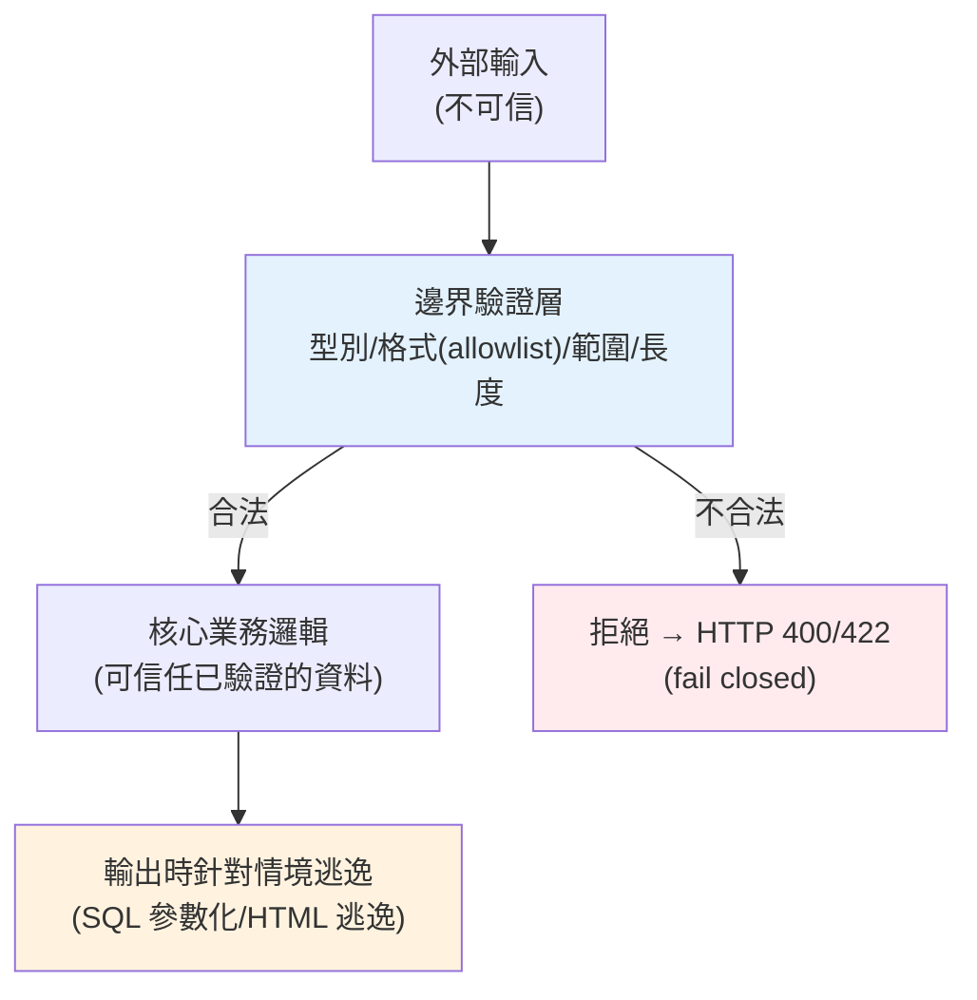

# 輸入驗證

> 資安的第一道防線只有一句話：**「絕不信任來自外部的資料」**。使用者輸入、API 參數、上傳檔案、來自其他服務的資料——全都可能是攻擊。這章講輸入驗證（input validation）的原則：在資料進入系統的邊界就擋下不合法、不安全的輸入。

## 💡 白話導讀（建議先讀）

資安第一課,一句話:**絕不信任來自外部的資料**。
使用者輸入、API 參數、上傳檔案、甚至「自己人」的其他服務傳來的資料——一律當成可疑包裹。

把守大門有兩種思路,想像夜店保全:

- **白名單（allowlist）＝賓客名單**:名單上有才放行,其餘一律擋。
  「使用者名稱只准 `[a-zA-Z0-9_]`」——沒想到的怪東西**預設被擋**。✅
- **黑名單（denylist）＝只擋已知鬧事者**:過濾掉 `<script>` 就放心了?
  攻擊者換件外套（`<ScRiPt>`、編碼繞過）就混進來——**黑名單永遠追不完**。🔴

**原則:永遠優先白名單**——定義「什麼是合法」,而不是列舉「什麼是壞」。

Python 落地的主力是你已認識的 [Pydantic](../14-web/README.md):
型別、範圍、格式、長度在**入口處一次驗完**,不合法直接 422,
髒資料根本進不了業務邏輯。這章講驗證的分層（格式驗證 vs 業務驗證）、
上傳檔案的特殊處理（副檔名與 Content-Type 都能造假,驗魔術位元組）、
以及「驗證」與「消毒（sanitization）」的分工。

## Why（為什麼）

幾乎所有嚴重的資安漏洞，根源都是**信任了不該信任的輸入**：SQL injection（信任了輸入直接拼進 SQL）、XSS（信任了輸入直接塞進 HTML）、路徑穿越（信任了檔名 `../../etc/passwd`）、緩衝區溢位、命令注入……。攻擊者把惡意內容藏在看似普通的輸入裡，若你的程式照單全收，就中招了。

**輸入驗證**是最根本的防禦：在資料**進入系統的邊界**（API 入口、表單、外部呼叫）就檢查——型別對不對、範圍合不合理、格式符不符合、長度會不會過長。不合格的輸入**在源頭就被拒絕**，不讓它有機會流進系統深處造成傷害。

這帶來的好處不只資安：也擋下「壞資料汙染系統」（不合理的年齡 `-5`、超長字串撐爆記憶體）、讓錯誤**早暴露**（在邊界回明確的 400，而非流到深層才神秘崩潰）、讓下游程式碼可以**信任**已驗證的資料。這章講輸入驗證的原則與 Python 的做法（`pydantic` 是現代首選，見 [pydantic 驗證](../14-web/06-pydantic-validation.md)），以及「驗證 vs 淨化」的分野。

## Theory（理論：allowlist 優於 denylist）

輸入驗證的核心策略選擇：

- **allowlist（白名單，正面表列）**：**只允許「明確合法」的**，其餘一律拒絕。例：使用者名稱只允許 `[a-zA-Z0-9_]`。**這是正確的做法**——你明確定義什麼是好的，任何沒想到的惡意輸入都被預設擋下。
- **denylist（黑名單，負面表列）**：**只擋「已知的壞」**，其餘放行。例：過濾掉 `<script>`。**這是脆弱的做法**——攻擊者總能找到你沒列進黑名單的變體（`<ScRiPt>`、編碼繞過、新的攻擊手法），黑名單永遠追不完。

**原則：優先用 allowlist**。定義「合法長什麼樣」，比枚舉「所有壞的樣子」可靠得多。

**驗證（validation）vs 淨化（sanitization）**，兩個常被混淆的概念：

- **驗證**：判斷輸入「合不合法」，不合法就**拒絕**（回 400）。輸入不變。
- **淨化 / 逃逸（sanitization / escaping）**：把輸入**轉換成安全的形式**再用（如把 HTML 特殊字元逃逸）。

**關鍵原則：驗證在輸入時、逃逸在輸出時（context-specific）**。不要試圖在輸入時「清洗」資料成「安全」——因為「安全」取決於用途（用在 SQL、HTML、shell 各需不同處理）。正確做法是：輸入時驗證格式合法，使用時針對**該情境**逃逸（見 [注入](02-injection.md)、[XSS](07-owasp-xss-csrf.md)）。

## Specification（規範：驗證什麼）

一筆輸入該驗證的面向：

- **型別（type）**：是數字還是字串？`"abc"` 當年齡是非法的。
- **範圍 / 值域（range）**：年齡 0–150、數量 > 0、狀態只能是列舉中的值。
- **格式（format）**：email、電話、URL、日期符合預期樣式（常用正規表達式，見 [re](../11-stdlib/README.md)，但複雜格式優先用專門驗證）。
- **長度（length）**：字串不超過上限（防記憶體耗盡、DB 欄位溢位）。
- **必填 / 選填**：必要欄位不可缺。
- **業務規則**：結束日期晚於開始日期、折扣不超過原價。

**Python 的做法**：

- **`pydantic`（現代首選）**：用型別註解宣告 schema，自動驗證、轉型、給明確錯誤（見 [pydantic 驗證](../14-web/06-pydantic-validation.md)）。FastAPI 內建整合——請求 body 自動依 model 驗證，不合法自動回 422。
- **手動驗證**：小場景可手寫檢查（如下例），但大型應用用 pydantic 更省事可靠。
- **標準庫輔助**：`re`（格式）、`ipaddress`、`email` 等。

## Implementation（底層：邊界驗證與 fail closed）

**在邊界驗證的意義**：把驗證集中在系統的**入口邊界**（API layer、表單處理），驗證過的資料才往內流。這樣內層的業務邏輯（[service 層](../16-architecture/01-layered-architecture.md)）可以**信任**收到的資料已經合法，不必到處重複檢查。這也呼應分層架構——邊界負責把關，核心專注業務。

**fail closed（預設拒絕）vs fail open（預設放行）**：安全的系統應**fail closed**——遇到不確定、無法驗證、發生錯誤時，**拒絕**而非放行。allowlist 天生 fail closed（沒明確允許的就擋）。denylist 傾向 fail open（沒明確擋的就放）。驗證邏輯本身出錯時也該倒向拒絕。

**為何淨化不能取代驗證、也不能取代逃逸**：常見的錯誤是「在輸入時把資料清乾淨（如移除所有 `<`）就以為安全了」。問題是：

- 清洗會**破壞合法資料**（使用者的名字真的有 `<`？數學公式 `a < b`？）。
- 「安全」是**情境相依**的：同一個字串放進 HTML、SQL、shell、URL 各有不同的危險字元，輸入時無法預知用途，一次清洗無法涵蓋所有情境，還可能兩頭不討好。

正解：**輸入時驗證（是否合法格式）+ 輸出時針對情境逃逸/參數化**。這是資安的黃金分工。下面範例示範 allowlist 驗證。

## Code Example（可執行的 Python 範例）

```python
# input_validation.py — allowlist 輸入驗證（純標準庫，可獨立執行/測試）
from __future__ import annotations

import re
from dataclasses import dataclass

# allowlist：使用者名稱只允許字母、數字、底線，長度 3-20
_USERNAME_RE = re.compile(r"^[a-zA-Z0-9_]{3,20}$")
# email 的基本格式（實務更嚴謹用專門驗證）
_EMAIL_RE = re.compile(r"^[^@\s]+@[^@\s]+\.[^@\s]+$")


class ValidationError(Exception):
    """驗證失敗（應對應到 HTTP 400/422）。"""


@dataclass(frozen=True)
class UserInput:
    username: str
    email: str
    age: int


def validate_user(raw: dict[str, object]) -> UserInput:
    """在邊界驗證輸入：型別、格式(allowlist)、範圍、長度。fail closed。"""
    # 型別 + allowlist 格式
    username = raw.get("username")
    if not isinstance(username, str) or not _USERNAME_RE.match(username):
        raise ValidationError("username 只允許 3-20 個字母/數字/底線")

    email = raw.get("email")
    if not isinstance(email, str) or not _EMAIL_RE.match(email):
        raise ValidationError("email 格式不正確")

    # 型別 + 範圍
    age = raw.get("age")
    if not isinstance(age, int) or isinstance(age, bool) or not (0 <= age <= 150):
        raise ValidationError("age 必須是 0-150 的整數")

    return UserInput(username=username, email=email, age=age)


def main() -> None:
    # 合法輸入 → 通過
    ok = validate_user({"username": "alice_01", "email": "alice@example.com", "age": 30})
    print(f"合法: {ok}")

    # 各種非法輸入 → 被擋（fail closed）
    bad_inputs = [
        {"username": "a", "email": "x@y.z", "age": 30},  # username 太短
        {"username": "alice", "email": "not-an-email", "age": 30},  # email 格式錯
        {"username": "alice", "email": "a@b.c", "age": 999},  # age 超範圍
        {"username": "rm -rf; DROP TABLE", "email": "a@b.c", "age": 30},  # 惡意字元
    ]
    for raw in bad_inputs:
        try:
            validate_user(raw)
        except ValidationError as exc:
            print(f"擋下 {raw.get('username')!r}: {exc}")


if __name__ == "__main__":
    main()
```

**預期輸出**：

```pycon
$ python input_validation.py
合法: UserInput(username='alice_01', email='alice@example.com', age=30)
擋下 'a': username 只允許 3-20 個字母/數字/底線
擋下 'alice': email 格式不正確
擋下 'alice': age 必須是 0-150 的整數
擋下 'rm -rf; DROP TABLE': username 只允許 3-20 個字母/數字/底線
```

逐段解說：

- **allowlist 正規式**：`_USERNAME_RE` 只允許明確合法的字元集與長度——這是正面表列，任何含特殊字元（`;`、空白、`<`）的輸入自動被擋，不必去枚舉所有壞字元。
- **型別檢查**：先確認是 `str`/`int` 再檢格式/範圍——輸入可能是任意型別（來自 JSON），不檢型別會出錯。注意 `isinstance(age, bool)` 排除——Python 裡 `bool` 是 `int` 子類，`True` 會通過 `isinstance(x, int)`，要額外排除。
- **範圍驗證**：`0 <= age <= 150` 擋下不合理值。
- **fail closed**：任何不符就 `raise ValidationError`（對應 HTTP 400/422）——預設拒絕。最後一筆惡意輸入 `rm -rf; DROP TABLE` 直接被 username 的 allowlist 擋下，根本沒機會流進系統。
- **實務**：這些手動檢查用 `pydantic` 幾行就能宣告完成（型別 + `Field(min_length=3, ...)` + validator），且自動回 422（見 [pydantic 驗證](../14-web/06-pydantic-validation.md)）。

## Diagram（圖解：邊界驗證）



## Best Practice（最佳實踐）

- **絕不信任外部輸入**：使用者、API、檔案、其他服務——全部驗證。
- **用 allowlist（正面表列）而非 denylist**：定義什麼合法，別枚舉所有壞的。
- **在系統邊界集中驗證**：核心層才能信任資料（見 [分層架構](../16-architecture/01-layered-architecture.md)）。
- **驗證型別、範圍、格式、長度、必填、業務規則**：面面俱到。
- **用 `pydantic` 宣告式驗證**（FastAPI 自動整合）：省事、可靠、錯誤明確（見 [pydantic 驗證](../14-web/06-pydantic-validation.md)）。
- **fail closed**：不確定/出錯時拒絕，別放行。
- **驗證在輸入、逃逸在輸出（情境相依）**：別想用一次淨化解決所有情境（見 [注入](02-injection.md)、[XSS](07-owasp-xss-csrf.md)）。
- **限制長度**：防記憶體耗盡與 DoS。

## Common Mistakes（常見誤解）

- **信任前端已驗證**：前端驗證只為 UX，攻擊者可繞過直接打 API——**後端必須再驗證**。
- **用 denylist 過濾壞字元**：`<script>` 有無數變體，黑名單永遠追不完。
- **在輸入時「淨化」以為就安全**：破壞合法資料、且「安全」隨情境而異，無法一次搞定。
- **只驗證格式不驗證業務規則**：格式對但邏輯錯（結束日期早於開始）。
- **不檢型別直接用**：來自 JSON 的值型別不定，直接運算會崩。
- **忘了 `bool` 是 `int` 子類**：`True` 通過 `isinstance(x, int)`，數值驗證要排除。
- **不限長度**：超長輸入撐爆記憶體/DB 欄位，成 DoS 面向。
- **每層重複驗證卻沒有權威來源**：邊界集中驗證，內層信任。

## Interview Notes（面試重點）

- **能講「絕不信任外部輸入」是資安第一原則**，並舉多數漏洞源於信任輸入。
- **能對比 allowlist 與 denylist**，說明為何 allowlist（正面表列 + fail closed）更安全。
- **能清楚區分驗證（判斷合法、拒絕）與淨化/逃逸（轉換成安全形式）**，並知道「驗證在輸入、逃逸在輸出且情境相依」。
- **知道該驗證哪些面向**（型別/範圍/格式/長度/業務規則）與在邊界集中驗證。
- **知道前端驗證不可信、後端必須驗證**。
- **知道 `pydantic` 是 Python 現代驗證首選**，以及 `bool` 是 `int` 子類等細節。

---

➡️ 下一章：[SQL injection 與注入攻擊](02-injection.md)

[⬆️ 回 Part 20 索引](README.md)
