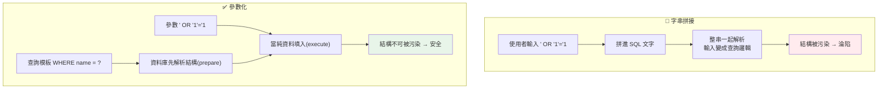

# SQL injection 與注入攻擊

> 一個把使用者輸入直接拼進 SQL 的查詢，可能讓攻擊者讀走整個資料庫、刪光你的表。**SQL injection** 是最古老也最致命的漏洞之一，而它的解法簡單到不可思議：**參數化查詢**。這章講注入攻擊的原理、為何字串拼接是災難，以及正確的防禦。

## 💡 白話導讀（建議先讀）

想像銀行的申請表,「姓名」欄有人填了:**「王小明,並把我的帳戶餘額改成一億」**——
而承辦人竟然照著執行了。荒謬吧?但這正是 SQL injection 的本質:

```python
query = f"SELECT * FROM users WHERE name = '{name}'"   # 🔴 拼字串
```

使用者輸入 `' OR '1'='1`,你拼出來的 SQL 裡,**資料越界變成了程式碼**——
資料庫分不清哪些是你寫的邏輯、哪些是使用者塞的值,整串照著執行。

解法不是「過濾引號」（黑名單,必被繞過）,而是**從結構上讓資料永遠是資料**:

```python
cursor.execute("SELECT * FROM users WHERE name = ?", (name,))   # ✅ 參數化
```

**參數化查詢**把「程式碼」與「資料」分兩條通道送給資料庫:
SQL 骨架先編譯定型,參數之後才填入、**永遠只被當值看待**——
不管使用者填什麼鬼東西,都只是一個奇怪的字串,動不了查詢結構。

同一個病根還有很多變體,這章一起講:命令注入（`os.system(f"ping {host}")`——
用 `subprocess` 參數列表解）、路徑穿越（`../../etc/passwd`——正規化後驗證前綴解）、
模板注入。認出共同模式:**凡是「拼字串交給某個直譯器執行」的地方,都是注入點**。

## Why（為什麼）

想像一個登入查詢，你用字串拼接組出 SQL：

```python
query = f"SELECT * FROM users WHERE name = '{username}'"   # 🔴 災難
```

正常使用者輸入 `alice`，查詢是 `... WHERE name = 'alice'`，沒問題。但攻擊者輸入 `' OR '1'='1`，查詢變成：

```sql
SELECT * FROM users WHERE name = '' OR '1'='1'
```

`'1'='1'` 永遠為真——回傳**所有使用者**，登入驗證被繞過。更糟的，輸入 `'; DROP TABLE users; --` 可能直接**刪掉整張表**。這就是 **SQL injection（SQL 注入）**：使用者輸入被當成 **SQL 程式碼**執行，而非**資料**。

注入是一整類攻擊的統稱（SQL injection、command injection、LDAP injection…），共通原理都是**「資料」與「程式碼」的界線被混淆**——攻擊者把程式碼藏進本該是資料的輸入裡。SQL injection 長年高居 OWASP Top 10（見 [OWASP](07-owasp-xss-csrf.md)），因為後果嚴重（資料外洩、竄改、刪除）且太多程式碼還在用字串拼接。

好消息是：防禦簡單且徹底——**參數化查詢（parameterized query）**。理解它為何有效，你就能一勞永逸地免疫 SQL injection。這章講清楚。

## Theory（理論：資料與程式碼的混淆）

注入攻擊的**根本原因**：**把不可信的資料，直接嵌入了會被「解譯執行」的字串**。

以 SQL 為例，一句 SQL 同時包含：

- **程式碼結構**：`SELECT ... FROM ... WHERE ... = ...`（查詢的邏輯）。
- **資料**：`'alice'`（要比對的值）。

當你用字串拼接把使用者輸入塞進去，資料庫**無法區分**「哪些是你本意的程式碼、哪些是使用者塞的資料」——它把整串當 SQL 解析。於是使用者輸入的 `' OR '1'='1` 被當成**查詢邏輯的一部分**執行，而非單純的字串值。**界線消失了**。

**參數化查詢的洞見**：把「程式碼結構」和「資料」**分開傳給資料庫**。你傳一個帶**佔位符（placeholder）** 的查詢模板（`WHERE name = ?`）和一組參數值（`('alice',)`），資料庫**先解析好查詢結構、再把參數當純資料填入**。此時參數**永遠是資料、永遠不會被當程式碼解析**——即使值是 `' OR '1'='1`，它就是一個要比對的字串（比對「名字剛好等於這串怪字元的使用者」，當然找不到），無法改變查詢邏輯。**界線被強制維持**。

這也是所有注入的通用解法：**分離程式碼與資料**（SQL 用參數化、shell 用參數陣列而非字串、避免 `eval`）。

## Specification（規範：參數化查詢）

**參數化查詢**（Python DB-API，見 [DB-API](../15-database/11-db-api.md)）：

```python
# ✅ 正確：佔位符 + 參數（值當純資料）
cursor.execute("SELECT * FROM users WHERE name = ?", (username,))
cursor.execute("INSERT INTO users (name, age) VALUES (?, ?)", (name, age))

# 🔴 錯誤：字串拼接/格式化（值被當 SQL 解析）
cursor.execute(f"SELECT * FROM users WHERE name = '{username}'")   # 危險
cursor.execute("SELECT * FROM users WHERE name = '%s'" % username) # 危險
```

**佔位符風格依 driver 而異**：sqlite3 用 `?`、psycopg（PostgreSQL）用 `%s`（注意：這是 driver 的佔位符，**不是** Python 的字串格式化！）。

**ORM 自動參數化**（見 [SQLAlchemy](../15-database/14-sqlalchemy-orm.md)）：

```python
session.query(User).filter(User.name == username)   # ORM 自動參數化，安全
```

**危險區——動態的「識別符」不能參數化**：佔位符只能用在**值**，不能用在**表名/欄名**（`SELECT * FROM ?` 無效）。若表名/排序欄來自使用者輸入（如「依某欄排序」），必須用 **allowlist** 驗證（只允許預先定義的欄名清單），絕不拼接：

```python
ALLOWED_COLUMNS = {"name", "age", "created_at"}
if sort_by not in ALLOWED_COLUMNS:      # allowlist 驗證
    raise ValueError("非法排序欄")
query = f"SELECT * FROM users ORDER BY {sort_by}"   # 已驗證，安全
```

**其他注入的防禦**：命令注入用 `subprocess` 的**參數陣列**（`["ls", user_input]`）而非 `shell=True` 的字串；避免 `eval`/`exec` 執行使用者輸入。

## Implementation（底層：prepared statement）

**參數化查詢底層是 prepared statement（預備語句）**。過程分兩步：

1. **prepare（準備）**：資料庫先收到帶佔位符的查詢模板（`SELECT * FROM users WHERE name = ?`），**解析、編譯、規劃好執行計畫**。此時查詢的**結構已經定型**——`WHERE name = <一個值>`。
2. **execute（執行）**：再把參數值（`'alice'` 或 `"' OR '1'='1"`）送進去，填入那個已定型的佔位符位置。

關鍵在於：**查詢結構在收到參數「之前」就已經解析完成**。所以參數值無論長什麼樣，都只能填進「一個值」的位置，**不可能改變已經定型的查詢結構**。攻擊字串 `' OR '1'='1` 被當成一個完整的字串值去比對 `name` 欄——資料庫會老實地找「名字等於這串奇怪字元的使用者」，當然找不到，攻擊失效。

這和字串拼接的差別是本質的：拼接是「先把值混進 SQL 文字、再整串解析」（值能污染結構）；參數化是「先解析結構、再填值」（值無法污染結構）。**這就是為何參數化能徹底免疫 SQL injection，而不只是「過濾了危險字元」**——它根本不給資料當程式碼的機會。

順帶一提，prepared statement 還有**效能好處**：同一個查詢模板重複執行時，資料庫可重用編譯好的執行計畫。

## Code Example（可執行的 Python 範例）

```python
# sql_injection_demo.py — 字串拼接 vs 參數化查詢（純標準庫 sqlite3，可執行）
from __future__ import annotations

import sqlite3


def setup() -> sqlite3.Connection:
    conn = sqlite3.connect(":memory:")
    conn.execute("CREATE TABLE users (id INTEGER PRIMARY KEY, name TEXT, secret TEXT)")
    conn.executemany(
        "INSERT INTO users (name, secret) VALUES (?, ?)",
        [("alice", "alice_token"), ("bob", "bob_token")],
    )
    conn.commit()
    return conn


def login_vulnerable(conn: sqlite3.Connection, username: str) -> list[str]:
    """🔴 字串拼接：使用者輸入被當 SQL 解析。"""
    query = f"SELECT name FROM users WHERE name = '{username}'"  # noqa: S608
    return [row[0] for row in conn.execute(query)]


def login_safe(conn: sqlite3.Connection, username: str) -> list[str]:
    """✅ 參數化：輸入永遠是純資料。"""
    return [row[0] for row in conn.execute(
        "SELECT name FROM users WHERE name = ?", (username,)
    )]


def main() -> None:
    conn = setup()

    # 正常查詢：兩者都對
    print("正常輸入 'alice':")
    print(f"  拼接版: {login_vulnerable(conn, 'alice')}")
    print(f"  參數版: {login_safe(conn, 'alice')}")

    # 注入攻擊：' OR '1'='1（想撈出所有人）
    attack = "' OR '1'='1"
    print(f"\n注入攻擊輸入 {attack!r}:")
    print(f"  🔴 拼接版洩漏全部: {login_vulnerable(conn, attack)}")
    print(f"  ✅ 參數版擋下: {login_safe(conn, attack)}")


if __name__ == "__main__":
    main()
```

**預期輸出**：

```pycon
$ python sql_injection_demo.py
正常輸入 'alice':
  拼接版: ['alice']
  參數版: ['alice']

注入攻擊輸入 "' OR '1'='1":
  🔴 拼接版洩漏全部: ['alice', 'bob']
  ✅ 參數版擋下: []
```

逐段解說：

- **正常輸入**：`alice` 在兩版都正確回傳 `['alice']`——功能一樣。
- **注入攻擊 `' OR '1'='1`**：
  - **拼接版**：查詢變成 `... WHERE name = '' OR '1'='1'`，`'1'='1'` 恆真 → **洩漏全部使用者** `['alice', 'bob']`。登入驗證被繞過，若查的是 secret 就整庫外洩。
  - **參數版**：攻擊字串被當成**一個完整的字串值**去比對 `name`——資料庫找「名字剛好等於 `' OR '1'='1` 這串字元的使用者」，當然沒有 → 回 `[]`。攻擊**完全失效**。
- **要點**：同一個攻擊輸入，拼接版淪陷、參數版免疫——差別只在「值有沒有被當程式碼解析」。這就是參數化查詢的威力。（`# noqa: S608` 是刻意標註此為教學用的危險示範。）

## Diagram（圖解：拼接 vs 參數化）



## Best Practice（最佳實踐）

- **永遠用參數化查詢**（佔位符 + 參數），**絕不字串拼接/格式化 SQL**。
- **用 ORM**（SQLAlchemy）：自動參數化，另有其他好處（見 [SQLAlchemy ORM](../15-database/14-sqlalchemy-orm.md)）。
- **動態識別符（表名/欄名/排序）用 allowlist 驗證**：佔位符只能用於值。
- **命令注入：用 `subprocess` 參數陣列**，別用 `shell=True` 拼字串。
- **避免 `eval`/`exec` 執行任何含使用者輸入的字串**。
- **最小權限資料庫帳號**：應用用的 DB 帳號只給必要權限（縱深防禦，萬一淪陷也限縮損害）。
- **輸入驗證作為輔助**（見 [輸入驗證](01-input-validation.md)）：但**參數化才是主防線**，別只靠過濾。
- **用靜態掃描（ruff 的 S 規則/bandit）抓字串拼接 SQL**。

## Common Mistakes（常見誤解）

- **用 f-string / `%` / `.format()` 組 SQL**：直接開注入大門，最常見的致命錯誤。
- **以為「過濾單引號」就安全**：編碼繞過、其他 payload、數字欄位無需引號——過濾追不完，參數化才根本。
- **把佔位符 `%s` 當成 Python 字串格式化**：`execute("... %s" % x)` 是拼接（危險）；`execute("... %s", (x,))` 才是參數化（安全）。
- **想參數化表名/欄名**：佔位符不支援識別符；用 allowlist。
- **`subprocess` 用 `shell=True` 拼使用者輸入**：命令注入；用參數陣列。
- **只靠輸入驗證擋注入**：驗證是輔助，參數化是主防線。
- **DB 帳號權限過大**：一旦有漏洞，損害無上限；用最小權限。
- **信任「內部」來源不參數化**：內部服務、批次匯入的資料也可能含惡意內容。

## Interview Notes（面試重點）

- **能解釋 SQL injection 的原理**：使用者輸入被當 SQL 程式碼執行，根因是「資料與程式碼界線被混淆」。
- **能說明參數化查詢為何徹底有效**：prepared statement 先解析結構再填值，參數永遠是資料、無法污染已定型的查詢結構。
- **能區分「參數化」與「過濾危險字元」**：後者是脆弱的 denylist，前者才是根本解。
- **知道 `execute("...%s" % x)` 是拼接、`execute("...%s", (x,))` 才是參數化**。
- **知道識別符（表名/欄名）不能參數化，要用 allowlist**。
- **知道注入是一整類（SQL/command/LDAP），通用解法是分離程式碼與資料**（參數陣列、避免 eval）。
- **知道縱深防禦**：參數化 + 輸入驗證 + 最小權限 DB 帳號。

---

➡️ 下一章：[認證與授權](03-authn-authz.md)

[⬆️ 回 Part 20 索引](README.md)
