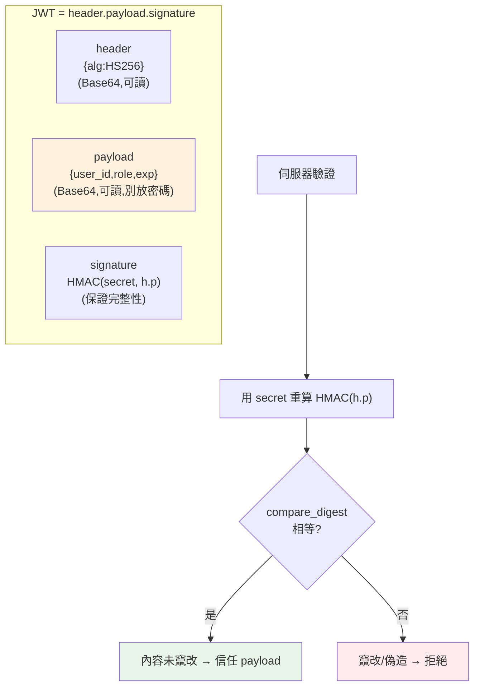

# JWT

> JWT（JSON Web Token）是現代 API 認證最常見的 token 格式：一段自帶簽章、無需查資料庫就能驗證的憑證。但它也最常被用錯——把敏感資料放進去、把它當可撤銷的 session、甚至被 `alg: none` 攻擊繞過。這章拆解 JWT 的結構、簽章原理與正確用法。

## Why（為什麼）

[上一章](03-authn-authz.md)提到認證後要「記住」登入狀態，兩條路：伺服器端 session、或客戶端 token。**JWT** 是後者最流行的實作——尤其在**微服務**與**無狀態 API** 場景。

它解決的痛點：傳統 session 需要伺服器**每個請求都查儲存**（Redis/DB）確認 session 有效，多服務還要共享 session 儲存。JWT 不同——token **本身就攜帶使用者資訊，且帶簽章**。伺服器收到後**只要驗簽章**（用密鑰算一下），就能信任裡面的內容，**完全不必查資料庫**。這讓認證變得**無狀態、可水平擴展**：任何服務只要有密鑰就能獨立驗證 token，不需共享 session 儲存——非常適合微服務（見 [微服務](../21-microservices/README.md)）。

但 JWT 的便利也是它的陷阱來源：因為內容在客戶端、且「無需查儲存」，就衍生出「內容可被讀取（別放密碼）」「難以即時撤銷（別當可登出的 session）」「簽章一旦被繞過就全盤淪陷（`alg: none` 攻擊）」等問題。**用對了很好用，用錯了很危險**。這章講清楚它的原理與正確姿勢。

## Theory（理論：三段式結構）

一個 JWT 是三段用 `.` 連接的 Base64URL 字串：**`header.payload.signature`**。

- **Header（標頭）**：JSON，描述 token 型別與**簽章演算法**，如 `{"alg": "HS256", "typ": "JWT"}`。
- **Payload（載荷）**：JSON，攜帶**claims（宣告）**——使用者資訊與中繼資料，如 `{"user_id": 42, "role": "admin", "exp": 1700000000}`。標準 claims：`sub`（主體）、`exp`（過期時間）、`iat`（簽發時間）、`iss`（簽發者）等。
- **Signature（簽章）**：對 `header.payload` 用密鑰計算的簽章，**保證這兩段沒被竄改**。

**最重要的認知：header 與 payload 只是 Base64 編碼，不是加密！** 任何人都能解碼讀取內容（去 jwt.io 貼上就看得到）。**簽章保證的是「完整性」（integrity，沒被改），不是「機密性」（confidentiality，看不到）**。所以：

- **絕不把敏感資料放進 payload**（密碼、信用卡、私密個資）——它等同明文公開。
- 簽章的作用是：如果有人改了 payload（如把 `role` 改成 `admin`），簽章就對不上、驗證失敗——**能改內容但無法產生有效簽章**（因為不知道密鑰）。

**簽章演算法兩類**：

- **對稱（HS256，HMAC-SHA256）**：簽和驗用**同一把密鑰**。簡單，適合單一方同時簽發與驗證。
- **非對稱（RS256，RSA）**：**私鑰簽、公鑰驗**。適合「一方簽發、多方驗證」——驗證方只需公鑰（不能拿來偽造 token），適合分散式/第三方場景。

## Specification（規範：簽發、驗證、使用）

**流程**：

1. 使用者登入成功 → 伺服器**簽發** JWT（含 user_id、role、exp），回給客戶端。
2. 客戶端後續請求帶上 token：`Authorization: Bearer <token>`。
3. 伺服器**驗簽 + 檢查 exp** → 通過就信任 payload 裡的身分。

**Python 實務用 `PyJWT` 函式庫**（別自己實作上正式環境）：

```python
import jwt   # PyJWT

# 簽發
token = jwt.encode(
    {"user_id": 42, "role": "admin", "exp": ...},
    key=SECRET, algorithm="HS256",
)

# 驗證（自動檢查簽章與 exp，失敗拋例外）
try:
    payload = jwt.decode(token, key=SECRET, algorithms=["HS256"])  # 明確指定演算法！
except jwt.ExpiredSignatureError:
    ...   # 過期
except jwt.InvalidTokenError:
    ...   # 簽章無效/格式錯
```

**關鍵安全點**：`jwt.decode` 必須**明確傳 `algorithms=[...]`**（allowlist），**絕不接受 token 自報的 alg**——否則會遭 `alg: none` 或演算法混淆攻擊（見下）。

**effective 撤銷策略**（JWT 難即時撤銷）：

- **短效 access token（如 15 分鐘）+ 長效 refresh token**：access token 短命，就算外洩也很快失效；用 refresh token 換新的（refresh token 存伺服器、可撤銷）。
- **黑名單**：維護已撤銷 token 清單（但這又引入了狀態，違背無狀態初衷）。

## Implementation（底層：HMAC 簽章與常見攻擊）

**HMAC 簽章怎麼運作**（HS256）：簽章 = `HMAC-SHA256(密鑰, "header.payload")`。HMAC 是「帶密鑰的雜湊」——只有知道密鑰的人才能算出正確的簽章。驗證時，伺服器用**同一把密鑰**對收到的 `header.payload` 重算一次 HMAC，比對是否等於 token 帶的簽章：

- **相等** → 內容沒被改、且是持有密鑰者簽發的 → 信任。
- **不等** → 內容被竄改，或不是用正確密鑰簽的 → 拒絕。

攻擊者能讀 payload、能改 payload，但**改了之後算不出對應的新簽章**（不知道密鑰），所以偽造必被偵測。這就是「無需查資料庫就能信任」的數學基礎。

**驗簽必須用「定時比較」防時序攻擊**：比較簽章要用 `hmac.compare_digest`（見 [密碼雜湊](08-password-hashing.md)），而非 `==`。因為 `==` 逐字元比較、遇到不同就提早返回，攻擊者能從**回應時間**推測簽章正確了幾個字元，逐步猜出。`compare_digest` 是**定時（constant-time）** 的，不論哪裡不同都花一樣久，堵住這個側信道。

**兩個經典 JWT 攻擊**：

- **`alg: none` 攻擊**：攻擊者把 header 的 `alg` 改成 `"none"`、拿掉簽章，若伺服器**信任 token 自報的 alg** 而跳過驗簽 → 直接接受任意 payload。**防禦：驗證時明確指定允許的演算法清單，不信任 token 的 alg**。
- **演算法混淆（RS256→HS256）**：系統用 RS256（公鑰驗證），攻擊者把 alg 改成 HS256，並用**公開的公鑰**當 HMAC 密鑰去簽——若伺服器用「公鑰 + HS256」驗，就會通過。**防禦：同樣是明確指定演算法**，不讓攻擊者選。

下面用純標準庫（`hmac`/`hashlib`/`base64`）實作 HS256 JWT，展示簽發、驗證、竄改偵測——理解原理用，正式環境請用 `PyJWT`。

## Code Example（可執行的 Python 範例）

```python
# jwt_demo.py — 從零實作 HS256 JWT 的簽發與驗證（純標準庫；正式請用 PyJWT）
from __future__ import annotations

import base64
import hashlib
import hmac
import json
import time


def _b64url(data: bytes) -> str:
    return base64.urlsafe_b64encode(data).rstrip(b"=").decode()


def _b64url_decode(s: str) -> bytes:
    return base64.urlsafe_b64decode(s + "=" * (-len(s) % 4))


def sign(payload: dict[str, object], secret: str, exp_seconds: int = 3600) -> str:
    header = {"alg": "HS256", "typ": "JWT"}
    body = {**payload, "exp": int(time.time()) + exp_seconds}
    h = _b64url(json.dumps(header, separators=(",", ":")).encode())
    p = _b64url(json.dumps(body, separators=(",", ":")).encode())
    signing_input = f"{h}.{p}".encode()
    sig = hmac.new(secret.encode(), signing_input, hashlib.sha256).digest()
    return f"{h}.{p}.{_b64url(sig)}"


def verify(token: str, secret: str) -> dict[str, object]:
    try:
        h, p, s = token.split(".")
    except ValueError:
        raise ValueError("token 格式錯誤") from None
    expected = hmac.new(secret.encode(), f"{h}.{p}".encode(), hashlib.sha256).digest()
    # 定時比較防時序攻擊（別用 ==）
    if not hmac.compare_digest(expected, _b64url_decode(s)):
        raise ValueError("簽章無效（可能被竄改）")
    body: dict[str, object] = json.loads(_b64url_decode(p))
    if float(body.get("exp", 0)) < time.time():  # type: ignore[arg-type]
        raise ValueError("token 已過期")
    return body


def main() -> None:
    secret = "my-secret-key"
    token = sign({"user_id": 42, "role": "admin"}, secret)
    print(f"token 為三段式: {token.count('.') == 2}")

    # 正常驗證
    decoded = verify(token, secret)
    print(f"驗證通過: user_id={decoded['user_id']} role={decoded['role']}")

    # 竄改 payload：把 role 改成 superadmin（想提權）
    h, p, s = token.split(".")
    evil_p = _b64url(
        json.dumps({"user_id": 42, "role": "superadmin", "exp": decoded["exp"]},
                   separators=(",", ":")).encode()
    )
    try:
        verify(f"{h}.{evil_p}.{s}", secret)
    except ValueError as exc:
        print(f"竄改被偵測: {exc}")

    # 用錯誤密鑰簽發的 token（偽造）
    try:
        verify(token, "wrong-secret")
    except ValueError as exc:
        print(f"錯誤密鑰: {exc}")


if __name__ == "__main__":
    main()
```

**預期輸出**：

```pycon
$ python jwt_demo.py
token 為三段式: True
驗證通過: user_id=42 role=admin
竄改被偵測: 簽章無效（可能被竄改）
錯誤密鑰: 簽章無效（可能被竄改）
```

逐段解說：

- **`sign`**：把 header、payload 各自 Base64URL 編碼，對 `header.payload` 用密鑰算 HMAC-SHA256 當簽章，三段接起來。payload 自動加 `exp`（過期時間）。
- **`verify`**：重算簽章、用 `hmac.compare_digest`（**定時比較**，防時序攻擊）比對，再檢查 `exp`。
- **竄改被偵測**：攻擊者把 `role` 改成 `superadmin` 想提權——但他不知道密鑰，算不出對應的新簽章，於是重算的簽章對不上 → **被擋**。這就是簽章保護完整性的效果。
- **錯誤密鑰**：用錯密鑰簽的 token 驗不過——只有持正確密鑰者能簽發有效 token。
- **注意**：payload 只是 Base64（`_b64url_decode(p)` 就能讀出 `role=admin`）——**沒有加密**，別放敏感資料。正式環境用 `PyJWT`，別自己實作（易出微妙的安全漏洞）。

## Diagram（圖解：JWT 結構與驗簽）



## Best Practice（最佳實踐）

- **用成熟函式庫（`PyJWT`），別自己實作**：自製易有微妙漏洞。
- **驗證時明確指定 `algorithms=[...]`**：防 `alg: none` 與演算法混淆攻擊。
- **絕不把敏感資料放 payload**：它是 Base64、明文可讀，非加密。
- **設短效期 `exp`（access token 幾分鐘）+ refresh token**：限縮外洩 token 的可用時間。
- **驗簽用定時比較**（函式庫已處理）：防時序攻擊。
- **密鑰要夠強、妥善保管**（見 [密鑰管理](05-secrets-management.md)）：密鑰洩漏 = 能偽造任意 token。
- **走 HTTPS 傳輸**：避免 token 在網路上被竊聽（見 [OWASP](07-owasp-xss-csrf.md)）。
- **需要即時撤銷（登出/封鎖）就搭配黑名單或用 session**：JWT 天生難撤銷。
- **token 存放注意 XSS/CSRF**：存 `httpOnly` cookie 防 XSS 竊取（見 [XSS/CSRF](07-owasp-xss-csrf.md)）。

## Common Mistakes（常見誤解）

- **以為 JWT 內容是加密的**：只是 Base64，任何人可讀——放了密碼/個資就等於公開。
- **驗證時信任 token 自報的 alg**：遭 `alg: none` 攻擊繞過簽章；要明確指定允許演算法。
- **用 `==` 比較簽章**：時序攻擊側信道；用定時比較。
- **把 JWT 當可即時撤銷的 session**：token 過期前一直有效，登出/封鎖不生效；用短效期 + refresh。
- **效期設很長（幾天/永久）**：一旦外洩，長期被濫用。
- **密鑰太弱或寫死在程式/進版控**：能被暴力破解或洩漏 → 偽造任意 token（見 [密鑰管理](05-secrets-management.md)）。
- **把 token 存 localStorage**：易遭 XSS 竊取；敏感場景用 `httpOnly` cookie。
- **自己手刻 JWT 上正式環境**：微妙的簽章/解析漏洞；用 PyJWT。

## Interview Notes（面試重點）

- **能畫出 JWT 三段結構**（header.payload.signature）並說明各段作用。
- **能強調「Base64 非加密、簽章保完整性非機密性」**——payload 可讀、別放敏感資料。
- **能解釋 HMAC 簽章如何讓「無需查庫就能信任」**，以及竄改為何必被偵測。
- **能講 JWT vs session 的取捨**（無狀態易擴展 vs 難即時撤銷）與 refresh token 策略。
- **知道 `alg: none`、演算法混淆攻擊與防禦（明確指定 algorithms）**。
- **知道驗簽要定時比較、密鑰保管、HTTPS、token 存放（XSS/CSRF）** 等實務。
- **知道對稱（HS256）vs 非對稱（RS256）** 的適用場景。

---

➡️ 下一章：[密鑰管理](05-secrets-management.md)

[⬆️ 回 Part 20 索引](README.md)
