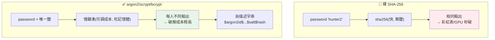

# 密碼雜湊 (bcrypt / argon2)

> 資料庫被拖走是遲早的事——問題是那天，你的使用者密碼會不會跟著淪陷。**明文存密碼**是死罪，**用 MD5/SHA-256 存**幾乎一樣糟。正確做法是用**慢雜湊 + 加鹽**（bcrypt、argon2、scrypt）。這章講為什麼、以及怎麼做。

## 💡 白話導讀（建議先讀）

先接受一個悲觀前提:**資料庫遲早會被拖走**。那天的差別在於——
攻擊者拿到的是所有人的明文密碼,還是一堆算不回去的亂碼。

正確姿勢是**存指紋,不存本人**:雜湊是單向的,你永遠不需要「解開」密碼——
登入時把輸入再雜湊一次、比對指紋即可。但光雜湊不夠,還缺兩味藥:

- **鹽（salt）＝每人不同的調味料**:同一道菜（相同密碼「hunter2」）,
  加了不同的鹽就長得完全不同。作用:預先算好的「彩虹表」全部作廢、
  破解一個人不等於破解所有用同密碼的人。鹽不用保密,跟雜湊存一起就好。
- **慢（slow hashing）＝故意算得慢**:MD5/SHA-256 是為「快」設計的——
  攻擊者一秒能試幾十億個。bcrypt/argon2 故意把一次雜湊拖到 ~0.1 秒:
  使用者登入無感,暴力破解者一年試不完。**用 SHA-256 存密碼,約等於沒設防**。

所以答案永遠是:**argon2 或 bcrypt**（自帶鹽、自帶慢、可調成本參數）,
Python 用 `passlib` 或 `argon2-cffi`,幾行搞定。

這章還講:成本參數怎麼挑（隨硬體進步調高）、舊系統怎麼平滑升級雜湊演算法
（登入時驗舊存新）、以及面試必考的「雜湊 vs 加密差在哪、為什麼密碼用雜湊」。

## Why（為什麼）

假設你的 `users` 表被攻擊者拖走了。如果密碼是**明文**（`password = "hunter2"`），攻擊者立刻拿到所有人的密碼——而且很多人到處用同一組密碼，災難蔓延到他們的其他帳號。所以**絕不明文存密碼**，這是常識。

那用 SHA-256 雜湊呢？`sha256("hunter2")` 存進去，看起來不可逆？**還是不行**，因為：

- **快雜湊可被暴力破解**：SHA-256/MD5 設計成**快**（每秒可算數十億次）。攻擊者用 GPU 對常見密碼字典逐一算雜湊比對，弱密碼幾秒就破。
- **不加鹽 → 彩虹表 + 批次破解**：`sha256("hunter2")` 對所有人都一樣。攻擊者可用預先算好的**彩虹表**（rainbow table）直接查，且「一次破解適用所有用同密碼的人」。

正確做法是**專為存密碼設計的慢雜湊函式**——**bcrypt、argon2、scrypt、PBKDF2**。它們刻意**慢**（可調的計算成本）、**強制加鹽**、抗 GPU/ASIC，讓暴力破解變得極其昂貴。這章講清楚「快雜湊 vs 慢雜湊」「鹽（salt）的作用」「為何 argon2 是現代首選」，以及 Python 的做法。密碼傳輸與驗證流程還連結 [認證](03-authn-authz.md)。

## Theory（理論：慢雜湊 + 鹽）

**雜湊 vs 加密**：雜湊是**單向**的（無法還原），這正是存密碼要的——你不需要「解密」密碼，登入時只要「把使用者輸入的密碼用同樣方式雜湊，比對是否等於存的雜湊」。所以密碼該**雜湊**，不是加密。

**兩個關鍵要素**：

- **鹽（salt）**：一段**每個密碼唯一的隨機值**，和密碼一起雜湊。作用：
  - 讓相同密碼產生**不同**雜湊（`hash("hunter2" + salt_A)` ≠ `hash("hunter2" + salt_B)`）→ 破壞彩虹表（預算表對不上）、破壞「一次破解適用所有人」（每個人要各別破）。
  - 鹽**不需保密**，和雜湊一起存即可——它的價值在於「唯一」，不在於「秘密」。
- **慢（work factor / cost）**：慢雜湊有可調的**計算成本參數**（bcrypt 的 cost、argon2 的 time/memory、PBKDF2 的迭代次數）。調高成本，讓算一次雜湊要花「對登入無感（如 100ms）但對暴力破解致命」的時間——攻擊者每秒能試的次數從數十億降到數千。且成本可隨硬體進步調高，保持領先。

**現代選擇（優劣排序）**：

- **Argon2（argon2id）**：2015 密碼雜湊競賽冠軍，**現代首選**。可調 time + **memory** 成本（記憶體密集，抗 GPU/ASIC 特別強）。
- **scrypt**：也是記憶體密集，標準庫 `hashlib.scrypt` 內建。
- **bcrypt**：成熟、久經考驗、廣泛支援，仍是穩健選擇（但有 72 byte 密碼長度上限）。
- **PBKDF2**：標準庫 `hashlib.pbkdf2_hmac` 內建，被 NIST 認可，但抗 GPU 較弱（不吃記憶體），是「沒有前三者時的底線」。

## Specification（規範：雜湊與驗證）

**Python 實務——用 `passlib` 或 `argon2-cffi` / `bcrypt` 函式庫**（正式環境）：

```python
from argon2 import PasswordHasher   # argon2-cffi
ph = PasswordHasher()

# 註冊：雜湊密碼（自動加鹽、參數編進結果字串）
hashed = ph.hash("user_password")   # 存進 DB

# 登入：驗證（自動取出鹽與參數比對）
try:
    ph.verify(hashed, "user_input")   # 成功回 True，失敗拋例外
except VerifyMismatchError:
    ...   # 密碼錯
```

**雜湊字串的自描述格式**：慢雜湊的輸出通常是**自包含**的字串，把「演算法、成本參數、鹽、雜湊」全編進去：

```text
$argon2id$v=19$m=65536,t=3,p=4$<salt>$<hash>
$2b$12$<salt+hash>              # bcrypt，12 是 cost
```

驗證時從這字串取出鹽與參數，不必另外存——這也讓**參數可升級**（新密碼用更高成本，舊的驗證時仍用它當初的參數）。

**驗證必須用定時比較**：比對雜湊要用 `hmac.compare_digest`（函式庫已內建），防時序攻擊（見 [JWT](04-jwt.md)）。

**別自己實作**：用 `passlib`/`argon2-cffi`/`bcrypt`，它們處理了鹽、參數、格式、定時比較等細節。下面用標準庫 `hashlib.scrypt` 示範原理。

## Implementation（底層：為何慢 + 鹽有效）

**慢為何擋暴力破解**：破解密碼 = 對候選密碼逐一算雜湊、比對。快雜湊（SHA-256）每秒可算數十億次，字典裡的常見密碼瞬間破。慢雜湊把「算一次」的成本提高數個數量級（如 argon2 調成 100ms/次）——對合法登入無感（你只算一次），但對攻擊者是災難：原本 1 秒能試 10 億個，現在 1 秒只能試 10 個，破解時間從幾秒變幾世紀。**記憶體成本（argon2/scrypt）** 更狠：GPU/ASIC 擅長平行算雜湊，但每次要吃大量記憶體時，平行度被記憶體頻寬卡死，攻擊硬體優勢大減。

**鹽為何破壞彩虹表與批次破解**：彩虹表是「預先算好 `hash(常見密碼)` 的巨大對照表」，拖到雜湊直接查表。但如果每個密碼加了**唯一的鹽**，攻擊者要算的是 `hash(密碼 + 你的鹽)`——他的預算表（沒有你的鹽）完全對不上，等於白算。而且因為每個人鹽不同，`hash("hunter2"+salt_A)` ≠ `hash("hunter2"+salt_B)`，攻擊者**無法「破一個就套用到所有用同密碼的人」**，必須對每個帳號**各別**發動昂貴的暴力破解。慢 + 唯一鹽疊加，讓大規模破解在經濟上不可行。

**為何相同密碼該有不同雜湊**：這是鹽的直接效果，也是一個安全指標——如果你看到兩個使用者的密碼雜湊一樣，代表沒加鹽（或鹽固定），是漏洞。下面範例會驗證「同密碼兩次雜湊結果不同」。

## Code Example（可執行的 Python 範例）

```python
# password_hashing.py — 加鹽慢雜湊(scrypt)存密碼（純標準庫；正式建議 argon2-cffi）
from __future__ import annotations

import base64
import hashlib
import hmac
import os


def hash_password(password: str) -> str:
    """用 scrypt 加隨機鹽雜湊；回傳自描述字串(含參數與鹽)。"""
    salt = os.urandom(16)  # 每次唯一的隨機鹽
    n, r, p = 2**14, 8, 1  # 成本參數（可調高）
    dk = hashlib.scrypt(password.encode(), salt=salt, n=n, r=r, p=p, dklen=32)
    return f"scrypt${n}${r}${p}${_b64(salt)}${_b64(dk)}"


def verify_password(password: str, stored: str) -> bool:
    """從自描述字串取出參數與鹽，重算並定時比較。"""
    try:
        _algo, n, r, p, salt_b64, hash_b64 = stored.split("$")
    except ValueError:
        return False
    salt, expected = _unb64(salt_b64), _unb64(hash_b64)
    dk = hashlib.scrypt(
        password.encode(), salt=salt, n=int(n), r=int(r), p=int(p), dklen=len(expected)
    )
    return hmac.compare_digest(dk, expected)  # 定時比較防時序攻擊


def _b64(b: bytes) -> str:
    return base64.b64encode(b).decode()


def _unb64(s: str) -> bytes:
    return base64.b64decode(s)


def main() -> None:
    stored = hash_password("correct horse battery staple")
    print(f"儲存字串(自描述含參數與鹽): {stored[:40]}...")

    # 同一密碼雜湊兩次 → 因鹽不同，結果不同（破壞彩虹表/批次破解）
    h1, h2 = hash_password("hunter2"), hash_password("hunter2")
    print(f"同密碼兩次雜湊不同(有加鹽): {h1 != h2}")

    # 驗證：正確密碼通過、錯誤密碼失敗
    print(f"正確密碼: {verify_password('correct horse battery staple', stored)}")
    print(f"錯誤密碼: {verify_password('wrong', stored)}")

    # 反例：裸 SHA-256 不加鹽 → 相同密碼相同輸出（可被彩虹表/批次破解）
    bad1 = hashlib.sha256(b"hunter2").hexdigest()
    bad2 = hashlib.sha256(b"hunter2").hexdigest()
    print(f"🔴 裸 sha256 相同密碼相同輸出(可批次破解): {bad1 == bad2}")


if __name__ == "__main__":
    main()
```

**預期輸出**（雜湊字串內容依隨機鹽）：

```pycon
$ python password_hashing.py
儲存字串(自描述含參數與鹽): scrypt$16384$8$1$Xk3...
同密碼兩次雜湊不同(有加鹽): True
正確密碼: True
錯誤密碼: False
🔴 裸 sha256 相同密碼相同輸出(可批次破解): True
```

逐段解說：

- **`hash_password`**：用 `hashlib.scrypt`（慢、記憶體密集）+ **每次唯一的隨機鹽**（`os.urandom(16)`）。回傳**自描述字串**——把演算法、成本參數（n/r/p）、鹽、雜湊全編進去，驗證時才取得出。
- **同密碼兩次雜湊不同**：因為鹽不同，`hash("hunter2")` 兩次結果不同 → **破壞彩虹表、破壞批次破解**。這是「有正確加鹽」的驗證。
- **驗證**：`verify_password` 取出鹽與參數重算，用 `hmac.compare_digest`（**定時比較**）比對——正確密碼通過、錯誤失敗。
- **反例**：裸 `sha256("hunter2")` 兩次結果**相同**——沒加鹽、且快，可被彩虹表直接查、一次破解適用所有用此密碼的人。這正是「用 SHA-256 存密碼幾乎和明文一樣糟」的示範。
- **要點**：慢雜湊 + 唯一鹽 + 定時比較 = 正確存密碼。正式環境用 argon2-cffi/bcrypt/passlib（scrypt 這裡展示原理）。

## Diagram（圖解：加鹽慢雜湊）



## Best Practice（最佳實踐）

- **用 argon2id（首選）/ bcrypt / scrypt 存密碼**，透過 `argon2-cffi`/`bcrypt`/`passlib`，別自己實作。
- **絕不明文、絕不用 MD5/SHA-1/SHA-256 等快雜湊存密碼**。
- **每個密碼用唯一隨機鹽**（函式庫自動處理）：破壞彩虹表與批次破解。
- **調整成本參數**讓單次雜湊約 100ms 上下：對登入無感、對破解致命；隨硬體進步調高。
- **驗證用定時比較**（函式庫內建）：防時序攻擊。
- **儲存自描述雜湊字串**（含演算法/參數/鹽）：支援參數平滑升級。
- **搭配密碼政策 + MFA**（見 [認證](03-authn-authz.md)）：最小長度、擋常見弱密碼、多因素。
- **走 HTTPS 傳密碼、絕不記進 log**（見 [密鑰管理](05-secrets-management.md)、[可觀測性](../19-cloud-native/08-observability.md)）。

## Common Mistakes（常見誤解）

- **明文存密碼**：資料庫一被拖，所有密碼直接外洩。
- **用 MD5/SHA-256 存密碼**：快雜湊，GPU 字典攻擊秒破，幾乎和明文一樣糟。
- **不加鹽 / 用固定鹽**：彩虹表直接查、一次破解適用所有同密碼者。
- **自己實作密碼雜湊**：容易漏掉鹽/定時比較/參數等細節；用成熟函式庫。
- **成本參數設太低**：慢雜湊調得太快等於沒慢，仍易破。
- **用 `==` 比較雜湊**：時序攻擊；用定時比較。
- **把密碼記進 log / 錯誤訊息 / URL**：繞過雜湊直接洩漏明文。
- **雜湊卻可逆（其實是加密）**：存密碼要單向雜湊，不是加密。

## Interview Notes（面試重點）

- **能說明為何 SHA-256 存密碼幾乎和明文一樣糟**：快雜湊 + 不加鹽 → 彩虹表 + GPU 字典攻擊。
- **能解釋鹽的作用**（唯一、不需保密、破壞彩虹表與批次破解）與慢雜湊的作用（可調成本、抗暴力）。
- **能排序現代選擇**：argon2id（首選，吃記憶體抗 GPU）> scrypt > bcrypt > PBKDF2，並知道各特性。
- **知道密碼要雜湊不是加密**（單向、不需還原）。
- **知道驗證要定時比較、雜湊字串自描述（含參數可升級）**。
- **知道別自己實作、用 argon2-cffi/bcrypt/passlib**，並搭配密碼政策與 MFA。

---

➡️ 下一章：[反序列化安全 (pickle 風險)](09-deserialization-security.md)

[⬆️ 回 Part 20 索引](README.md)
