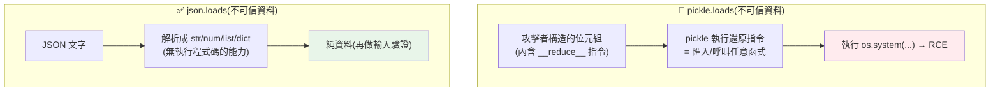

# 反序列化安全 (pickle 風險)

> `pickle.loads(untrusted_data)` 這一行，可能讓攻擊者在你的伺服器上執行任意指令。**不安全的反序列化（insecure deserialization）** 是 OWASP 榜上的高危漏洞，而 Python 的 `pickle` 是最經典的地雷。這章講反序列化為何危險、pickle 的風險原理，以及安全的替代方案。

## Why（為什麼）

序列化（serialization）是把物件轉成可儲存/傳輸的位元組（存檔、進佇列、走網路），反序列化（deserialization）是反過來還原。聽起來人畜無害——但如果**反序列化的資料來自不可信來源**，就可能是災難。

Python 的 `pickle` 特別危險，因為它的設計不只還原「資料」，還能還原「**任意 Python 物件**」——包括在還原過程中**執行程式碼**。攻擊者只要能控制傳給 `pickle.loads()` 的位元組，就能構造一個「反序列化時執行 `os.system('rm -rf /')`」的 payload。這是**遠端程式碼執行（RCE，Remote Code Execution）**——資安裡最嚴重的漏洞等級。

真實的中招場景：把 pickle 當快取格式存進 Redis（若 Redis 或網路被入侵）、用 pickle 傳遞 Celery 任務、接受使用者上傳的 pickle 檔、session 用 pickle 序列化存 cookie……任何「反序列化了你無法完全信任的資料」的地方，都是 RCE 的溫床。

**核心教訓：絕不對不可信資料使用 `pickle.loads`（或 `yaml.load`、`marshal` 等能執行程式碼的反序列化）**。改用**只還原資料、不執行程式碼**的格式——**JSON**。這章講清楚 pickle 為何能執行程式碼、以及安全的做法。

## Theory（理論：資料反序列化 vs 物件反序列化）

反序列化格式分兩類，安全性天差地別：

- **資料格式（data-only）**：只表達**資料結構**（字串、數字、list、dict、bool、null）。反序列化就是「把文字解析回這些基本資料」——**不涉及執行任何程式碼**。代表：**JSON**、部分 YAML（safe 模式）、MessagePack。安全（對不可信資料）。
- **物件序列化（object serialization）**：能序列化**任意物件**，還原時需要「重建物件」——這可能**呼叫建構子、執行 `__reduce__` 等鉤子、匯入任意模組**。代表：Python 的 **`pickle`**、`marshal`、`shelve`，YAML 的 `yaml.load`（非 safe）。**對不可信資料極危險**。

**危險的根源**：物件序列化為了「還原任意物件」，賦予了序列化資料「**指示反序列化器做什麼**」的能力——而「做什麼」可以是「呼叫這個函式、匯入那個模組」。這等於讓資料變成了**指令**。攻擊者控制資料 = 控制指令 = RCE。這又回到 [注入](02-injection.md) 的老主題：**資料與程式碼的界線被打破**。

**原則**：**反序列化不可信資料時，用只還原資料的格式（JSON）**。需要傳輸複雜物件時，明確地把它轉成資料結構（欄位）再序列化成 JSON，而非直接 pickle 整個物件。

## Specification（規範：安全與危險的做法）

**🔴 危險——絕不對不可信資料用**：

```python
import pickle
pickle.loads(untrusted_bytes)        # RCE 風險！
import yaml
yaml.load(untrusted_str)             # 危險（用 yaml.safe_load）
```

**✅ 安全——只還原資料**：

```python
import json
data = json.loads(untrusted_str)     # 只還原 dict/list/str/int/...，不執行程式碼
import yaml
data = yaml.safe_load(untrusted_str) # safe_load 只還原基本型別
```

**pickle 的正當用途**：pickle 不是不能用，而是**只用於完全可信的資料**——如你自己程式內部的快取、你自己產生且未經不可信通道的資料。判準：**「這串位元組有沒有任何可能被攻擊者影響？」** 只要有一絲可能（來自網路、使用者、外部儲存、跨信任邊界），就別用 pickle。

**需要傳輸自訂物件時**：明確序列化（把物件轉成 dict）：

```python
# 把物件轉成資料 → JSON（安全）
def to_dict(user): return {"id": user.id, "name": user.name}
json.dumps(to_dict(user))
# 還原：從 dict 建物件（你控制建構，不執行任意程式碼）
def from_dict(d): return User(id=d["id"], name=d["name"])
```

用 `pydantic` / `dataclasses` + JSON 是型別安全又安全的組合（見 [pydantic](../14-web/06-pydantic-validation.md)）。

## Implementation（底層：__reduce__ 如何執行程式碼）

**pickle 為何能執行程式碼**：pickle 的格式其實是一套**小型堆疊虛擬機的指令碼**——反序列化時，`pickle.loads` 像直譯器一樣執行這些指令來「重建物件」。其中有指令能**匯入模組、取得可呼叫物件、呼叫它**。

物件可以定義 **`__reduce__`** 方法，告訴 pickle「要還原我，請呼叫**這個函式**、帶**這些參數**」。正常用途是還原複雜物件，但攻擊者可以讓 `__reduce__` 回傳 `(os.system, ("惡意指令",))`——於是 `pickle.loads` 在「還原」這個物件時，就**呼叫了 `os.system("惡意指令")`**。整個過程不需要你主動做任何事，**光是 `loads` 就觸發了程式碼執行**。

這就是為何「反序列化不可信 pickle = RCE」：攻擊者構造的位元組裡藏著「呼叫某函式」的指令，`loads` 忠實地執行了它。下面的範例用**無害的 `print`**（而非真的 `os.system`）當 payload，證明「光是 loads 就執行了程式碼」——把 `print` 換成任何危險呼叫，就是真實的攻擊。

**JSON 為何安全**：JSON 的解析器只做一件事——**把文字解析成 str/number/bool/null/array/object 這些基本資料**。JSON 的規格裡**根本沒有「呼叫函式」「匯入模組」的表達能力**——它只能描述資料，不能描述動作。所以無論 JSON 內容多惡意，`json.loads` 最多還原出一個（可能很怪的）dict/list，**不會執行任何程式碼**。這就是「資料格式」與「物件序列化」的本質差異。（當然，還原出的資料仍要 [驗證](01-input-validation.md) 才能信任其內容——安全的是「不執行程式碼」，不代表「內容一定合法」。）

## Code Example（可執行的 Python 範例）

```python
# deserialization_demo.py — pickle 的 RCE 風險 vs JSON 的安全（純標準庫）
# 注意：Exploit 的 payload 用無害的 print 證明「loads 即執行程式碼」，
#       真實攻擊會把 print 換成 os.system 等危險呼叫。
from __future__ import annotations

import json
import pickle


class Exploit:
    """惡意物件：__reduce__ 讓 pickle.loads 時執行任意程式碼。"""

    def __reduce__(self) -> tuple[object, tuple[object, ...]]:
        # 真實攻擊: return (os.system, ("rm -rf /",))
        return (print, ("  [!] pickle.loads 時執行了任意程式碼（此為無害示範）",))


def main() -> None:
    # 🔴 pickle：光是 loads 不可信資料就觸發程式碼執行
    payload = pickle.dumps(Exploit())  # 攻擊者構造的位元組
    print("呼叫 pickle.loads(不可信資料) →")
    pickle.loads(payload)  # noqa: S301  # RCE！這行執行了 __reduce__ 裡的程式碼

    # ✅ JSON：只還原資料，不執行程式碼
    print("\n呼叫 json.loads(不可信資料) →")
    restored = json.loads('{"user": "alice", "role": "admin"}')
    print(f"  只還原出純資料: {restored}")

    # JSON 無法序列化任意物件（沒有「執行程式碼」的表達能力）
    try:
        json.dumps(Exploit())
    except TypeError as exc:
        print(f"  JSON 拒絕序列化任意物件: {type(exc).__name__}")


if __name__ == "__main__":
    main()
```

**預期輸出**：

```pycon
$ python deserialization_demo.py
呼叫 pickle.loads(不可信資料) →
  [!] pickle.loads 時執行了任意程式碼（此為無害示範）

呼叫 json.loads(不可信資料) →
  只還原出純資料: {'user': 'alice', 'role': 'admin'}
  JSON 拒絕序列化任意物件: TypeError
```

逐段解說：

- **`Exploit.__reduce__`**：告訴 pickle「還原我時，請呼叫 `print(...)`」。真實攻擊會換成 `os.system("危險指令")`。
- **`pickle.loads(payload)`**：**光是這一行**就執行了 `__reduce__` 指定的程式碼——輸出那行 `[!]` 訊息。你沒有主動呼叫任何東西，`loads` 本身就觸發了。這若是 `os.system` 就是 RCE。（`# noqa: S301` 標註這是教學用的危險示範。）
- **`json.loads`**：只把 JSON 文字還原成 `dict`——**不執行任何程式碼**，無論內容多惡意最多得到一個資料結構。
- **`json.dumps(Exploit())` 失敗**：JSON 根本無法表達任意物件/程式碼（`TypeError`）——它只能描述資料，這正是它安全的原因。
- **要點**：pickle「還原物件」會執行程式碼 → 對不可信資料是 RCE；JSON「只還原資料」→ 安全。**不可信資料一律用 JSON。**

## Diagram（圖解：pickle vs JSON）



## Best Practice（最佳實踐）

- **絕不對不可信資料用 `pickle.loads`**（或 `yaml.load` 非 safe、`marshal`、`shelve`）。
- **不可信資料用只還原資料的格式**：JSON（`json.loads`）、`yaml.safe_load`、MessagePack。
- **pickle 只用於完全可信、不跨信任邊界的資料**（自己內部的快取等）。
- **傳輸自訂物件時明確轉 dict → JSON**，還原時由你控制建構（用 pydantic/dataclass）。
- **反序列化後仍要驗證內容**（見 [輸入驗證](01-input-validation.md)）：安全的是「不執行程式碼」，內容仍可能非法。
- **Celery/佇列用 JSON serializer**（別用預設可能的 pickle）。
- **判準**：資料有任何可能被攻擊者影響 → 不用 pickle。
- **用靜態掃描（bandit / ruff S301 等）抓 `pickle.loads`**。

## Common Mistakes（常見誤解）

- **用 pickle 存/傳可能被影響的資料**（Redis 快取、佇列訊息、session cookie、上傳檔）：RCE 溫床。
- **以為「內部服務傳來的 pickle」就安全**：內部服務也可能被攻破、網路可能被竊聽/竄改。
- **用 `yaml.load` 而非 `yaml.safe_load`**：同樣能執行程式碼。
- **以為 JSON 反序列化後的資料就一定合法**：不執行程式碼 ≠ 內容合法；仍要驗證。
- **為了「方便傳物件」而 pickle 整個物件過網路**：明確轉 dict + JSON。
- **Celery 用預設 serializer 沒改成 JSON**：任務資料若被影響就 RCE。
- **把 pickle 檔當設定/資料交換格式給外部**：外部可構造惡意 pickle。

## Interview Notes（面試重點）

- **能說明為何 `pickle.loads(不可信資料)` 是 RCE**：pickle 還原「物件」會執行程式碼（`__reduce__` 可指定呼叫任意函式），資料變成了指令。
- **能區分「資料格式（JSON）」與「物件序列化（pickle）」**，並說明前者為何安全（無執行程式碼的表達能力）。
- **知道安全替代**：JSON、`yaml.safe_load`、MessagePack；pickle 只用於完全可信資料。
- **能給判準**：資料有任何可能被攻擊者影響就別 pickle。
- **知道常見中招點**：Redis 快取、Celery、session、上傳檔。
- **知道反序列化後仍要做輸入驗證**（不執行程式碼不代表內容合法）。

---

➡️ 下一章：[系統設計：短網址](10-system-design-url-shortener.md)

[⬆️ 回 Part 20 索引](README.md)
