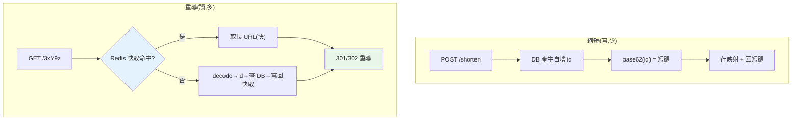

# 系統設計：短網址

> 「設計一個像 bit.ly 的短網址服務」是系統設計面試的經典開場題。它看似簡單，卻能考出你對**編碼、資料庫、快取、擴展、讀寫比**的理解。這章用它示範系統設計的思考框架：從需求釐清、容量估算，到核心演算法（base62）與擴展策略。

## Why（為什麼）

短網址服務把長 URL（`https://example.com/very/long/path?...`）轉成短碼（`bit.ly/3xY9z`），點擊短碼會重導到原網址。它是系統設計面試的**入門經典**，因為麻雀雖小五臟俱全：要設計 API、選資料模型、想短碼怎麼生成（核心演算法）、估算容量、處理**極高的讀寫比**（讀遠多於寫）、考慮快取與擴展。

更重要的是，它示範了**系統設計題的通用解法框架**——面試官考的不是「你會不會寫短網址」，而是「你會不會**結構化地思考一個系統**」：

1. **釐清需求**（功能/非功能，別急著寫）。
2. **估算規模**（QPS、儲存、頻寬——量化決定設計）。
3. **設計 API 與資料模型**。
4. **攻克核心難點**（這題是「短碼生成」）。
5. **擴展與優化**（快取、分片、讀寫分離）。

這章用短網址帶你走一遍這個框架，並實作核心的 **base62 編碼**。學會這套思路，其他系統設計題（[限流器](11-system-design-rate-limiter.md)、[聊天](12-system-design-chat.md)、[分散式 ID](13-system-design-distributed-id.md)）都能套用。

## Theory（理論：系統設計框架）

**第一步永遠是釐清需求，別急著設計**：

- **功能需求**：縮短一個長 URL 成短碼；訪問短碼重導到原 URL。（可選：自訂短碼、過期、統計點擊。）
- **非功能需求**：**高可用**（服務不能掛，短碼壞了一堆連結就死）、**低延遲**（重導要快）、**高讀寫比**（讀 : 寫 常達 100:1 甚至更高——縮短一次、被點很多次）。

**第二步估算規模**（用假設的數字，展示量化思維）：

- 假設每月 1 億個新短網址 → 寫入約 40/秒；讀取若 100:1 → 約 4000/秒。
- 短碼長度：用 base62（0-9a-zA-Z，62 個字元），**7 碼可表示 62⁷ ≈ 3.5 兆**個 URL——遠夠用。這說明「為什麼短碼是 6-7 碼」。
- 儲存：每筆約 500 bytes × 1 億/月 × 保存數年 → 幾百 GB，單機 DB 撐得住但要規劃。

**第三步核心難點——短碼怎麼生成？** 三種方案：

- **自增 ID + base62 編碼**：DB 自增主鍵（1, 2, 3…），把 id 用 base62 編成短碼。**簡單、無碰撞、短碼隨 id 遞增**。缺點：短碼可被枚舉/預測（可加擾動）。
- **隨機生成 + 查重**：隨機產 7 碼，檢查 DB 是否已存在，衝突就重試。無法預測，但要處理碰撞。
- **雜湊（如 MD5 取前幾碼）**：對長 URL 雜湊取前段。要處理碰撞，且相同 URL 得相同短碼（可能是優點或缺點）。

本章聚焦最經典的 **自增 ID + base62**。

## Specification（規範：API 與資料模型）

**API**：

```text
POST /shorten        { "url": "https://long..." }  → { "short": "bit.ly/3xY9z" }
GET  /{short_code}                                  → 301/302 重導到原 URL
```

**資料模型**（一張表）：

```text
urls(
  id          BIGINT PRIMARY KEY AUTO_INCREMENT,  -- 自增 id
  long_url    TEXT NOT NULL,
  created_at  TIMESTAMP,
  -- 短碼 = base62(id)，可不存(即時算)或存成欄位加索引
)
```

**核心演算法——base62 編碼**：把自增 id（整數）轉成 62 進位字串：

```python
ALPHABET = "0123456789abc...XYZ"   # 62 個字元
# id=125 → base62 → "21"；訪問時 base62 解碼回 125 → 查 DB
```

**重導狀態碼**：`301`（永久，瀏覽器會快取，減少後續請求但難統計點擊）vs `302`（暫時，每次都回來，可統計點擊）——依需求選。

## Implementation（底層：base62 與擴展）

**base62 編碼原理**：就是**進位轉換**——把十進位的 id 轉成 62 進位。`encode(n)` 反覆對 62 取餘數、取字元、除以 62，直到 0；`decode(s)` 反過來累加。這是一對一映射（雙射），所以**無碰撞**（不同 id 必得不同短碼），且**可逆**（短碼能解回 id 直接查主鍵，超快）。62⁷ ≈ 3.5 兆的容量，讓 7 碼綽綽有餘。

**為何自增 id + base62 是好方案**：主鍵天生唯一遞增 → 短碼無碰撞、不需查重；短碼解碼回 id 是**主鍵查詢**（O(1)、走索引），重導極快。缺點是短碼可被枚舉（`/3xY9z` 的下一個可能是 `/3xY9A`），洩漏「總量」與「順序」——若在意，可對 id 做可逆的擾動（如乘上一個與 62ⁿ 互質的數再模，或用加密），讓短碼看起來隨機但仍無碰撞。

**擴展策略（面試加分）**——這是高讀寫比系統的典型：

- **快取（讀優化）**：短碼→長 URL 的映射放 Redis（見 [快取](../15-database/18-redis.md)）。讀 4000/秒 大多命中快取，DB 壓力大減——**這是最關鍵的優化**，因為讀遠多於寫。
- **讀寫分離**：寫走主庫、讀走多個唯讀副本，分攤讀流量。
- **分片（sharding）**：資料量大時依 id 範圍或 hash 分片到多個 DB。
- **多機生成 id 的挑戰**：單一自增主鍵在多機/分片時會成瓶頸或衝突——這時需要[分散式 ID 生成](13-system-design-distributed-id.md)（如 Snowflake），這也是為何那是獨立一章。
- **CDN / 地理分佈**：重導是純讀，可用 CDN 或多區部署降延遲。

## Code Example（可執行的 Python 範例）

```python
# url_shortener.py — 自增 id + base62 短碼生成（純標準庫，可執行）
from __future__ import annotations

ALPHABET = "0123456789abcdefghijklmnopqrstuvwxyzABCDEFGHIJKLMNOPQRSTUVWXYZ"
BASE = len(ALPHABET)  # 62


def encode(n: int) -> str:
    """把自增 id 轉成 base62 短碼（進位轉換，無碰撞、可逆）。"""
    if n == 0:
        return ALPHABET[0]
    chars: list[str] = []
    while n > 0:
        n, r = divmod(n, BASE)
        chars.append(ALPHABET[r])
    return "".join(reversed(chars))


def decode(code: str) -> int:
    """把短碼解回 id（→ 主鍵查 DB，O(1)）。"""
    n = 0
    for ch in code:
        n = n * BASE + ALPHABET.index(ch)
    return n


class URLShortener:
    """自增 id + base62 的短網址服務（記憶體版；真實用 DB + 快取）。"""

    def __init__(self) -> None:
        self._store: dict[int, str] = {}
        self._next_id = 1

    def shorten(self, long_url: str) -> str:
        url_id = self._next_id
        self._store[url_id] = long_url
        self._next_id += 1
        return encode(url_id)

    def resolve(self, code: str) -> str | None:
        return self._store.get(decode(code))


def main() -> None:
    # base62 編碼示範（含 round-trip 驗證）
    print("base62 編碼:")
    for id_ in [1, 62, 125, 3844, 999999999]:
        code = encode(id_)
        ok = decode(code) == id_
        print(f"  id={id_:>10} → /{code:<6} → decode={decode(code)} ({'ok' if ok else 'FAIL'})")

    # 7 碼容量
    print(f"\n7 碼容量: 62^7 = {BASE**7:,}（≈ 3.5 兆，足夠）")

    # 服務示範
    svc = URLShortener()
    code1 = svc.shorten("https://example.com/very/long/path")
    code2 = svc.shorten("https://python.org")
    print(f"\n縮短: /{code1} /{code2}")
    print(f"還原 /{code1}: {svc.resolve(code1)}")
    print(f"無效短碼 /zzz: {svc.resolve('zzz')}")


if __name__ == "__main__":
    main()
```

**預期輸出**：

```pycon
$ python url_shortener.py
base62 編碼:
  id=         1 → /1      → decode=1 (ok)
  id=        62 → /10     → decode=62 (ok)
  id=       125 → /21     → decode=125 (ok)
  id=      3844 → /100    → decode=3844 (ok)
  id= 999999999 → /15FTGf → decode=999999999 (ok)

7 碼容量: 62^7 = 3,521,614,606,208（≈ 3.5 兆，足夠）

縮短: /1 /2
還原 /1: https://example.com/very/long/path
無效短碼 /zzz: None
```

逐段解說：

- **`encode`**：進位轉換——反覆對 62 取餘、映射到字元。id 越大短碼越長，但即使近 10 億也只要 6 碼（`15FTGf`）。
- **`decode`**：反向累加解回 id——**round-trip 驗證都通過**（編碼再解碼回原值），證明是無碰撞的雙射。
- **容量**：62⁷ ≈ 3.5 兆——這量化說明「為何 7 碼夠用」，是面試該講的估算。
- **`URLShortener`**：自增 id + base62。`shorten` 存映射、回短碼；`resolve` 解碼短碼→id→查映射。真實系統這裡的 `_store` 是 DB + Redis 快取，`_next_id` 是 DB 自增主鍵（多機時換 [分散式 ID](13-system-design-distributed-id.md)）。
- **要點**：自增 id + base62 = 無碰撞、可逆、短碼緊湊、重導是主鍵查詢（快）。擴展靠快取（讀優化）與分片。

## Diagram（圖解：短網址架構）



## Best Practice（最佳實踐）

- **系統設計先釐清需求、再估算規模、才設計**：別跳過就畫架構。
- **量化決策**：用 QPS、儲存、容量的估算支撐設計選擇（如「7 碼夠用」）。
- **自增 id + base62 是短碼生成的簡潔解**：無碰撞、可逆、緊湊。
- **針對高讀寫比重度用快取**（Redis）：讀優化是本題最關鍵的擴展。
- **考慮短碼可枚舉的隱私問題**：需要就對 id 做可逆擾動/加密。
- **重導狀態碼依需求選**：301（快取、省請求）vs 302（可統計點擊）。
- **多機/分片時用分散式 ID**（見 [分散式 ID](13-system-design-distributed-id.md)）取代單一自增主鍵。
- **講擴展時涵蓋快取、讀寫分離、分片、CDN**：展示全面性。

## Common Mistakes（常見誤解）

- **一上來就畫架構、不釐清需求/估規模**：面試大忌，顯得沒章法。
- **不估算容量就選短碼長度**：說不出「為何 7 碼」。
- **用隨機生成卻不處理碰撞**：短碼衝突導致覆蓋錯連結。
- **忽略讀寫比、不談快取**：本題核心是讀遠多於寫，沒提快取是重大遺漏。
- **短碼可枚舉卻沒意識到隱私風險**：連結總量/順序被推測。
- **多機還用單一自增主鍵**：成瓶頸或衝突；該用分散式 ID。
- **base62 編碼把 0 的情況漏掉**：`encode(0)` 要特判。
- **只講功能不談非功能（可用性/延遲/擴展）**：系統設計要兩者兼顧。

## Interview Notes（面試重點）

- **能走完系統設計框架**：釐清需求 → 估算規模 → API/資料模型 → 核心難點 → 擴展，別急著畫架構。
- **能做容量估算**：QPS、儲存、短碼長度（62⁷ ≈ 3.5 兆 → 7 碼），用數字支撐設計。
- **能解釋 base62（自增 id 編碼）為何無碰撞、可逆、緊湊**，並比較隨機/雜湊方案的取捨。
- **能強調高讀寫比 → 快取是關鍵優化**，並談讀寫分離、分片、CDN。
- **知道短碼可枚舉的隱私問題與擾動/加密解法**。
- **知道多機時單一自增主鍵的瓶頸，引出分散式 ID**（見 [分散式 ID](13-system-design-distributed-id.md)）。

---

➡️ 下一章：[系統設計：限流器](11-system-design-rate-limiter.md)

[⬆️ 回 Part 20 索引](README.md)
