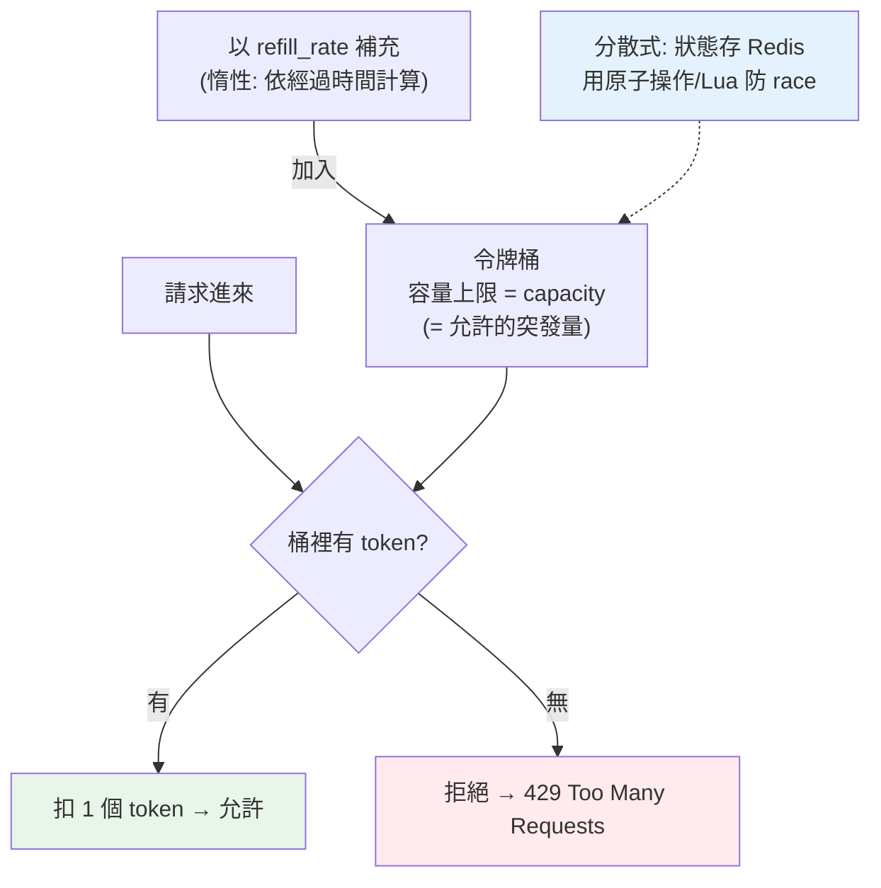

# 系統設計：限流器

> 沒有限流的 API，一個爆量的客戶端（或 DDoS 攻擊、失控的重試迴圈）就能拖垮整個服務。**限流器（rate limiter）** 控制「單位時間內允許多少請求」，保護系統、公平分配資源。這章講常見的限流演算法（token bucket、sliding window），並實作 token bucket。

## Why（為什麼）

你的 API 對外開放，就會遇到：某個客戶端的程式有 bug、瘋狂重試，每秒打你幾千次；有人想用爬蟲把你的資料撈光；惡意的 DDoS 攻擊；或單純某個大客戶用量遠超其他人。沒有限流，這些都會**耗盡你的資源**（CPU、DB 連線、頻寬），拖垮服務，讓**所有**使用者受影響。

**限流器**控制「一個來源（IP/使用者/API key）在單位時間內能發多少請求」，超過就**拒絕或延遲**（回 `429 Too Many Requests`）。它的價值：

- **保護系統**：防止過載、DoS、失控的客戶端拖垮服務。
- **公平分配**：避免單一使用者霸佔資源，保障其他人。
- **成本控制**：對付費 API 分級（免費 100 次/天、付費 10000 次/天）。
- **防濫用**：擋暴力破解登入、爬蟲、垃圾請求。

限流也是系統設計面試的高頻題，考點在**演算法選擇**（各有精度/記憶體/突發流量的取捨）與**分散式環境的挑戰**（多台伺服器如何共享計數）。這章講清楚主流演算法並實作 token bucket，也連結微服務的[限流與熔斷](../21-microservices/07-rate-limit-circuit-breaker.md)。

## Theory（理論：四種限流演算法）

- **Fixed Window（固定視窗）**：把時間切成固定區間（每分鐘），每區間計數，超過上限就拒絕。簡單，但有**邊界突發問題**——視窗交界處（59 秒和下一分鐘的 1 秒）可能瞬間放行 2 倍流量。
- **Sliding Window Log（滑動視窗日誌）**：記錄每個請求的時間戳，統計「過去 N 秒內」的請求數。**精確**，但要存所有時間戳，**記憶體開銷大**。
- **Sliding Window Counter（滑動視窗計數）**：固定視窗的改良，用當前與前一視窗的加權估算，平滑邊界突發。精度與成本的折衷。
- **Token Bucket（令牌桶）**：一個桶裝 token，以固定速率補充（每秒 r 個），桶有容量上限 C。每個請求消耗一個 token，沒 token 就拒絕。**允許突發**（桶滿時可一次放行 C 個），平均速率受補充率限制。最常用、最實用。
- **Leaky Bucket（漏桶）**：請求進桶、以固定速率漏出處理，超過桶容量就丟棄。**平滑輸出**（強制固定處理速率），但不允許突發。

**token bucket vs leaky bucket 的關鍵差異**：token bucket **允許突發**（累積的 token 可一次用掉，適合「平常閒、偶爾爆」的真實流量）；leaky bucket **強制平滑**（輸出速率恆定，適合保護下游固定容量）。token bucket 因為貼近真實流量、實作簡單，是最常見的選擇。

## Specification（規範：token bucket）

**核心參數**：

- **capacity（容量 C）**：桶最多裝幾個 token = **允許的突發量**。
- **refill_rate（補充率 r）**：每秒補幾個 token = **長期平均允許速率**。

**演算法**：

```text
每次請求時：
  1. 依「距上次的經過時間 × 補充率」補充 token（不超過 capacity）
  2. 若 token >= 1：扣 1，允許
  3. 否則：拒絕（429）
```

**回應**：超限回 `429 Too Many Requests`，並帶 `Retry-After` header（告訴客戶端多久後再試）與 `X-RateLimit-*`（剩餘額度）。

**限流的維度（依什麼限）**：per-IP、per-user、per-API-key、per-endpoint——依需求選，常組合（如「每個 API key 每秒 10 次」）。

**分散式限流**：多台伺服器要共享計數，通常用 **Redis**（原子操作 `INCR`+`EXPIRE`，或 Lua 腳本實作 token bucket）集中維護狀態——否則每台各自限流，總量變成 N 倍（見 Implementation）。

## Implementation（底層：token bucket 的優雅之處與分散式挑戰）

**token bucket 為何優雅**：它不需要記錄每個請求的時間戳（不像 sliding window log），只需維護兩個數：**當前 token 數**和**上次更新時間**。每次請求時「**惰性補充**」——根據「現在距上次過了多久 × 補充率」一次算出該補多少 token（而非用背景計時器持續補）。這讓它**記憶體 O(1)**（每個限流對象只存兩個數）、計算 O(1)，且天然支援突發（桶裡累積的 token 可一次用掉）。

用剛才的公式看：容量 5、每秒補 1。桶滿時瞬間來 7 個請求——前 5 個用掉存量（允許），後 2 個沒 token（拒絕）。等 2 秒補了 2 個 token，又能放行 2 個。**平均速率被補充率（1/秒）限制，但允許最多 5 個的突發**——這正符合真實流量「平常閒、偶爾一波」的特性。

**分散式限流的挑戰**：如果你有 3 台 API 伺服器，各自在**本機記憶體**跑限流器，那「每秒 10 次」的限制實際變成「每秒 30 次」（每台各放 10 個）——限流失效。解法是**集中狀態**：把 token bucket 的狀態（token 數、時間戳）存在 **Redis**，所有伺服器對同一個 key 操作。但要注意**原子性**——「讀 token 數 → 判斷 → 扣減」若非原子，多台並發會有 race condition（都讀到還有 token、都放行、超發）。所以用 Redis 的**原子操作或 Lua 腳本**把「補充+判斷+扣減」做成一個不可分割的動作。這是分散式限流的核心難點，也是面試常深入的點。

## Code Example（可執行的 Python 範例）

```python
# rate_limiter.py — Token Bucket 限流器（純標準庫，用可注入時鐘保證確定性）
from __future__ import annotations


class TokenBucket:
    """令牌桶限流：容量 capacity、每秒補 refill_rate 個 token。
    允許最多 capacity 的突發，長期平均速率受 refill_rate 限制。"""

    def __init__(self, capacity: int, refill_rate: float, now: float = 0.0) -> None:
        self.capacity = capacity
        self.refill_rate = refill_rate
        self.tokens = float(capacity)  # 初始裝滿
        self.last = now

    def allow(self, now: float) -> bool:
        # 惰性補充：依經過時間補 token（不超過容量），O(1) 記憶體與計算
        elapsed = now - self.last
        self.tokens = min(self.capacity, self.tokens + elapsed * self.refill_rate)
        self.last = now
        if self.tokens >= 1:
            self.tokens -= 1
            return True
        return False


def main() -> None:
    # 容量 5、每秒補 1 個
    bucket = TokenBucket(capacity=5, refill_rate=1.0, now=0.0)

    # 瞬間打 7 個請求：前 5 個用掉存量(允許)、後 2 個沒 token(拒絕)
    burst = [bucket.allow(0.0) for _ in range(7)]
    allowed = sum(burst)
    print(f"瞬間 7 請求(容量 5): {burst}")
    print(f"  → 允許 {allowed} 個、拒絕 {7 - allowed} 個（允許突發到容量）")

    # 等 2 秒 → 補充 2 個 token
    print("\n等 2 秒後(補充 2 個 token):")
    print(f"  第 1 個: {bucket.allow(2.0)}")  # True
    print(f"  第 2 個: {bucket.allow(2.0)}")  # True
    print(f"  第 3 個: {bucket.allow(2.0)}")  # False（只補了 2 個）


if __name__ == "__main__":
    main()
```

**預期輸出**：

```pycon
$ python rate_limiter.py
瞬間 7 請求(容量 5): [True, True, True, True, True, False, False]
  → 允許 5 個、拒絕 2 個（允許突發到容量）

等 2 秒後(補充 2 個 token):
  第 1 個: True
  第 2 個: True
  第 3 個: False（只補了 2 個）
```

逐段解說：

- **`TokenBucket`**：只維護 `tokens`（當前令牌數）和 `last`（上次更新時間）——**O(1) 記憶體**。用可注入的 `now` 參數當時鐘，讓測試**確定性**（不依賴真實時間）。
- **惰性補充**：`allow` 時才根據「經過時間 × 補充率」一次補足，不需背景計時器。
- **突發**：瞬間 7 個請求（`now=0`，沒時間補充），前 5 個用掉初始存量（允許）、後 2 個沒 token（拒絕）——**允許突發到容量 5**。
- **補充**：`now=2.0`（過了 2 秒）→ 補了 2×1=2 個 token → 放行 2 個，第 3 個又沒了。**平均速率被 refill_rate（1/秒）限制**。
- **要點**：token bucket 用兩個數 + 惰性補充，實現「限平均速率、允許突發」，記憶體/計算都 O(1)。分散式時把這兩個數放 Redis 並用原子操作。

## Diagram（圖解：token bucket）



## Best Practice（最佳實踐）

- **用 token bucket 應付一般 API 限流**：允許突發、實作簡單、記憶體 O(1)。
- **超限回 `429` + `Retry-After`**：讓客戶端知道多久後再試（禮貌且有效）。
- **選對限流維度**：per-IP/user/API-key/endpoint，常組合使用。
- **分散式限流用 Redis 集中狀態 + 原子操作/Lua**：避免每台各自限流變 N 倍。
- **容量與補充率依業務調**：突發容忍度（capacity）與長期速率（rate）分開設。
- **回傳 `X-RateLimit-*` header**：告知剩餘額度，方便客戶端自我調節。
- **分層限流**：全域、per-user、per-endpoint 多層防護。
- **限流之外搭配熔斷**（見 [限流與熔斷](../21-microservices/07-rate-limit-circuit-breaker.md)）保護下游。

## Common Mistakes（常見誤解）

- **fixed window 的邊界突發**：視窗交界瞬間放行 2 倍流量；用 sliding window 或 token bucket。
- **多台伺服器各自本機限流**：總量變成 N 倍，限流失效；要集中狀態（Redis）。
- **分散式限流沒做原子操作**：「讀-判斷-扣減」有 race，並發下超發。
- **sliding window log 存所有時間戳**：高流量下記憶體爆炸；用 token bucket/counter。
- **超限直接斷線不回 429**：客戶端不知發生什麼、無腦重試加劇問題。
- **不帶 `Retry-After`**：客戶端盲目重試，形成重試風暴。
- **只限全域不分維度**：一個大用戶就吃光全域額度，其他人餓死。
- **限流參數拍腦袋**：沒依真實流量/容量估算，設太鬆(沒保護)或太緊(誤殺)。

## Interview Notes（面試重點）

- **能列主流限流演算法並比較**：fixed/sliding window、token bucket、leaky bucket，及各自的精度/記憶體/突發取捨。
- **能解釋 token bucket**：capacity=突發量、refill_rate=平均速率，惰性補充達成 O(1)。
- **能對比 token bucket（允許突發）vs leaky bucket（強制平滑）** 的適用場景。
- **能講分散式限流的挑戰與解法**：集中狀態（Redis）+ 原子操作/Lua 防 race。
- **知道超限回 429 + Retry-After + X-RateLimit header**、限流維度選擇。
- **能連結熔斷、分層限流** 等更完整的保護策略。

---

➡️ 下一章：[系統設計：聊天系統](12-system-design-chat.md)

[⬆️ 回 Part 20 索引](README.md)
