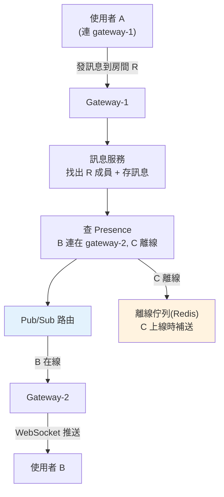

# 系統設計：聊天系統

> 「設計一個像 WhatsApp / Slack 的即時聊天系統」考的是**即時通訊**的核心難題：如何把一則訊息即時推送給對的人、離線的人上線後怎麼補收、上百萬連線怎麼扛。這章講聊天系統的架構要點——WebSocket、訊息 fan-out、離線投遞、擴展。

## Why（為什麼）

聊天系統和一般的「請求-回應」API 有本質不同：一般 API 是**客戶端問、伺服器答**（pull）；聊天需要**伺服器主動把訊息推給客戶端**（push）——別人傳訊息給你時，伺服器要**即時**送到你的裝置，而不是等你來問。這個「伺服器主動推送」的需求，帶出一連串設計難題：

- **連線怎麼維持**：HTTP 是無狀態的請求-回應，怎麼做到「伺服器隨時能推」？→ **WebSocket**（長連線、雙向）。
- **訊息怎麼送到對的人**：一則群組訊息要送給房間裡的所有成員（**fan-out**），且那些成員可能連在**不同的伺服器**上。
- **離線的人怎麼辦**：對方沒上線時訊息不能丟，要**暫存**，等他上線**補送**。
- **怎麼擴展到上百萬同時連線**：單機扛不住幾百萬 WebSocket，要水平擴展，但擴展後「跨伺服器的訊息路由」變複雜。
- **可靠性**：訊息不能丟、不能重複、要保序（至少同一對話內）。

這是系統設計面試中偏難的題，考點集中在**即時推送、fan-out、跨機路由、離線處理、擴展**。這章講清楚這些核心，並實作一個訊息 fan-out 的核心邏輯。它也和[分散式系統](../22-distributed-systems/README.md)的訊息投遞、[微服務](../21-microservices/README.md)的通訊密切相關。

## Theory（理論：推送與 fan-out）

**為何用 WebSocket**：傳統 HTTP 只能客戶端發起。要「伺服器主動推」，早期用輪詢（polling，客戶端一直問「有新訊息嗎」——浪費、延遲高）或 long polling。**WebSocket** 是正解——一條**持久的雙向連線**，建立後伺服器可**隨時**往客戶端推資料，客戶端也能隨時發。聊天、通知、即時協作都靠它。

**fan-out（訊息扇出）**：一則訊息要送給多個接收者。兩種模式：

- **fan-out on write（寫時扇出）**：訊息一送出，就立刻推給所有在線成員。即時性好，適合群組不大的即時聊天。
- **fan-out on read（讀時扇出）**：訊息先存起來，接收者來讀時才拉取。適合超大群組/廣播（如百萬粉絲，寫時扇出會爆）。

**訊息投遞的核心流程**：

1. 使用者 A 透過他的 WebSocket 連線發訊息到房間 R。
2. 伺服器找出 R 的所有成員。
3. 對每個**在線**成員，透過他們各自的 WebSocket 連線推送；對**離線**成員，存進**離線訊息佇列**。
4. 離線成員上線時，先把佇列裡的訊息補送給他。

**投遞保證**：至少一次（可能重複，需去重）vs 最多一次（可能丟）——聊天通常要**至少一次 + 訊息 id 去重**，並用序號保序（見 [冪等性](../22-distributed-systems/06-idempotency.md)）。

## Specification（規範：元件與資料）

**核心元件**：

- **WebSocket Gateway**：維持客戶端的長連線。記錄「哪個使用者連在哪台 gateway」。
- **訊息服務**：處理訊息的接收、儲存、fan-out。
- **Presence（在線狀態）服務**：追蹤誰在線、在哪台。
- **訊息儲存**：歷史訊息（DB）、離線佇列（Redis/佇列）。
- **Pub/Sub（跨機路由）**：成員連在不同 gateway 時，用 Redis Pub/Sub 或訊息佇列把訊息路由到對的 gateway。

**資料模型**（簡化）：

```text
messages(id, room_id, sender_id, content, seq, created_at)   -- 歷史/保序
room_members(room_id, user_id)                               -- 房間成員
user_connection(user_id → gateway_id)                        -- 誰連在哪台(Presence)
offline_queue(user_id → [messages])                          -- 離線訊息
```

**跨機路由的關鍵**：使用者 A（連在 gateway-1）發訊息給 B（連在 gateway-2）。gateway-1 收到後，透過 **Pub/Sub** 發布到「B 所在的 gateway-2」（查 Presence 得知 B 在 gateway-2），gateway-2 再透過 B 的 WebSocket 推給他。**單機記憶體裝不下所有連線，所以必須解決「訊息如何跨 gateway 送達」**。

## Implementation（底層：跨機路由與離線投遞）

**為何需要 Pub/Sub 做跨機路由**：假設你有 100 台 WebSocket gateway 扛百萬連線，使用者隨機連到其中一台。當 A（gateway-1）發訊息給同房間的 B（gateway-50），gateway-1 的記憶體裡**根本沒有 B 的連線**——B 的 socket 在 gateway-50。所以 gateway-1 不能直接推給 B，它要:

1. 查 **Presence**（如 Redis）得知「B 連在 gateway-50」。
2. 透過 **Pub/Sub**（Redis Pub/Sub、Kafka）把訊息**發布**到 gateway-50 訂閱的頻道。
3. gateway-50 收到後，用它記憶體裡 B 的 WebSocket 把訊息推給 B。

這個「gateway 間透過 Pub/Sub 轉發」的機制，是聊天系統水平擴展的核心——它讓「連在任意兩台機器的使用者」都能互通，而每台 gateway 只需管自己的連線。

**離線投遞的機制**：接收者不在線時，訊息不能丟。伺服器把訊息存進該使用者的**離線佇列**（Redis list / 訊息佇列 / DB）。使用者的裝置重新連上時（WebSocket 重連），伺服器先**把離線佇列裡積壓的訊息全部補送**，再開始接收即時訊息。客戶端用**訊息 id 去重**（避免重連時的重複）、用**序號（seq）保序**。下面的範例實作了這個「在線直送、離線暫存、上線補送」的核心邏輯。

**擴展與可靠性要點**：

- **連線量**：百萬 WebSocket 需多台 gateway + 負載平衡（注意 WebSocket 是長連線，負載平衡要支援 sticky 或連線感知）。
- **訊息持久化**：歷史訊息存 DB，離線佇列存 Redis；重要訊息走可靠佇列（見 [訊息佇列](../22-distributed-systems/04-message-queue.md)）。
- **保序與去重**：每則訊息帶 seq 與唯一 id（[冪等](../22-distributed-systems/06-idempotency.md)）。
- **超大群組**：改用 fan-out on read（讀時拉取）避免寫時扇出爆炸。

## Code Example（可執行的 Python 範例）

```python
# chat_hub.py — 聊天訊息 fan-out：在線直送/離線暫存/上線補送（純標準庫，可執行）
from __future__ import annotations

from collections import defaultdict, deque


class ChatHub:
    """聊天核心：房間成員管理 + 訊息 fan-out + 離線投遞。
    (單機模型；真實系統跨機用 Presence + Pub/Sub 路由。)"""

    def __init__(self) -> None:
        self.rooms: dict[str, set[str]] = defaultdict(set)  # room → 成員
        self.inbox: dict[str, deque[str]] = defaultdict(deque)  # user → 已送達訊息
        self.offline: dict[str, deque[str]] = defaultdict(deque)  # user → 離線佇列
        self.online: set[str] = set()

    def connect(self, user: str) -> None:
        self.online.add(user)
        # 上線時把離線佇列補送（重連補投遞）
        while self.offline[user]:
            self.inbox[user].append(self.offline[user].popleft())

    def disconnect(self, user: str) -> None:
        self.online.discard(user)

    def join(self, user: str, room: str) -> None:
        self.rooms[room].add(user)

    def send(self, sender: str, room: str, text: str) -> None:
        """fan-out：推給房間內每個成員（自己除外）。"""
        msg = f"[{room}] {sender}: {text}"
        for member in sorted(self.rooms[room]):
            if member == sender:
                continue
            if member in self.online:
                self.inbox[member].append(msg)  # 在線直送
            else:
                self.offline[member].append(msg)  # 離線暫存


def main() -> None:
    hub = ChatHub()
    for user in ("alice", "bob", "carol"):
        hub.connect(user)
        hub.join(user, "general")

    # alice 發訊息 → fan-out 給 bob、carol（自己不收）
    hub.send("alice", "general", "hi all")
    print(f"bob 收到:   {list(hub.inbox['bob'])}")
    print(f"carol 收到: {list(hub.inbox['carol'])}")
    print(f"alice 自己: {list(hub.inbox['alice'])}")

    # carol 離線 → 訊息進離線佇列
    hub.disconnect("carol")
    hub.send("bob", "general", "carol 在嗎")
    print(f"\ncarol 離線時佇列: {list(hub.offline['carol'])}")

    # carol 重新上線 → 補送離線訊息
    hub.connect("carol")
    print(f"carol 上線後收到: {list(hub.inbox['carol'])}")


if __name__ == "__main__":
    main()
```

**預期輸出**：

```pycon
$ python chat_hub.py
bob 收到:   ['[general] alice: hi all']
carol 收到: ['[general] alice: hi all']
alice 自己: []

carol 離線時佇列: ['[general] bob: carol 在嗎']
carol 上線後收到: ['[general] alice: hi all', '[general] bob: carol 在嗎']
```

逐段解說：

- **`join` / `rooms`**：維護房間成員——fan-out 時要知道「這則訊息該送給誰」。
- **`send`（fan-out）**：對房間內每個成員推送（**自己除外**）。在線成員直送 `inbox`（真實系統即 WebSocket 推送）；離線成員進 `offline` 佇列。
- **fan-out 效果**：alice 發訊息，bob、carol 都收到，alice 自己不收。
- **離線暫存**：carol 離線後，bob 的訊息進 carol 的離線佇列（不丟）。
- **上線補送**：carol `connect` 時，把離線佇列的訊息補進 inbox——重連補投遞。carol 最終收到她離線期間錯過的所有訊息，且**保序**。
- **要點**：房間 fan-out + 在線直送/離線暫存/上線補送，是聊天投遞的核心。真實系統的 `inbox` 是跨機的 WebSocket 推送（靠 Presence + Pub/Sub 路由），`offline` 是 Redis/佇列。

## Diagram（圖解：跨機訊息路由）



## Best Practice（最佳實踐）

- **即時推送用 WebSocket**（長連線雙向），別用輪詢。
- **跨機路由用 Presence + Pub/Sub**：讓連在不同 gateway 的使用者互通。
- **離線訊息進佇列、上線補送**：訊息不丟，重連補投遞。
- **訊息帶唯一 id + 序號**：去重（至少一次投遞會重複）+ 保序（見 [冪等](../22-distributed-systems/06-idempotency.md)）。
- **歷史訊息持久化到 DB、離線佇列用 Redis**：分層儲存。
- **超大群組用 fan-out on read**：避免寫時扇出爆炸。
- **水平擴展 gateway + 連線感知的負載平衡**：扛百萬長連線。
- **考慮已讀回執、輸入中、在線狀態**等即時特性（都靠同一套推送機制）。

## Common Mistakes（常見誤解）

- **用輪詢做即時聊天**：延遲高、浪費資源；用 WebSocket。
- **假設所有連線都在同一台**：百萬連線必跨機，要 Presence + Pub/Sub 路由。
- **離線訊息直接丟棄**：對方沒上線就收不到訊息；要離線佇列 + 補送。
- **不做去重/保序**：至少一次投遞會重複、亂序；用 id 去重、seq 保序。
- **超大群組用 fan-out on write**：百萬接收者寫時扇出瞬間爆炸；改讀時扇出。
- **WebSocket 負載平衡沒考慮長連線特性**：連線被亂切、狀態錯亂。
- **訊息不持久化**：伺服器重啟訊息全丟。
- **只想單機、不談擴展**：面試要點就在跨機路由與百萬連線。

## Interview Notes（面試重點）

- **能說明為何用 WebSocket**（伺服器主動推 vs 請求-回應），以及它解決的即時性問題。
- **能講 fan-out**（on write vs on read）及其適用場景（一般群組 vs 超大廣播）。
- **能解釋跨機路由的必要與機制**：百萬連線跨多 gateway，用 Presence + Pub/Sub 把訊息送到對的 gateway。
- **能描述離線投遞**：離線佇列 + 重連補送，並用 id 去重、seq 保序。
- **知道擴展要點**：多 gateway、連線感知負載平衡、Redis/佇列、訊息持久化。
- **能連結至少一次投遞、冪等、訊息佇列** 等分散式概念。

---

➡️ 下一章：[系統設計：分散式 ID](13-system-design-distributed-id.md)

[⬆️ 回 Part 20 索引](README.md)
