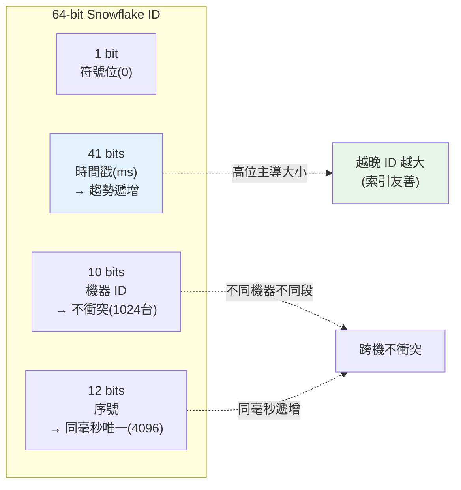

# 系統設計：分散式 ID

> 單機時，資料庫的自增主鍵就能生成唯一 ID。但當你有幾十台伺服器、資料庫分片、每秒要產幾百萬個 ID，「自增」就成了瓶頸與衝突源。**分散式 ID 生成**要在多機環境產出「全域唯一、大致有序、高效能」的 ID。這章講 Snowflake 演算法。

## Why（為什麼）

每筆訂單、每則訊息、每個使用者都需要一個**唯一 ID**。單機時很簡單——資料庫自增主鍵（`AUTO_INCREMENT`）保證唯一遞增。但規模一大就崩：

- **多機/分片後自增主鍵衝突**：資料庫分成 10 個 shard，每個各自從 1 開始自增 → 不同 shard 產出重複 ID。
- **中央發號成瓶頸**：讓所有機器都向「單一 ID 服務」要 ID，那個服務就成了單點瓶頸與故障點，且每次要 ID 都多一次網路往返。
- **UUID 雖唯一但有代價**：`uuid4()` 隨機、全域唯一、無需協調——但**128 bit 太長**（佔空間、索引效率差）、**無序**（隨機值當主鍵，插入時 B-tree 索引到處分裂，寫入效能差、局部性差）。

理想的分散式 ID 要同時滿足：**全域唯一**（不衝突）、**大致有序**（趨勢遞增，對資料庫索引友善）、**高效能**（本機生成、無需中央協調）、**緊湊**（64 bit，能塞進 `BIGINT`）。

**Snowflake**（Twitter 提出）是最經典的解法——用「時間戳 + 機器 ID + 序號」拼成一個 64 bit 整數，每台機器**本機獨立生成**、無需協調、趨勢遞增。這章講清楚它的位元佈局與原理，並實作出來。它是 [短網址](10-system-design-url-shortener.md) 那類「多機發號」問題的通用解。

## Theory（理論：Snowflake 位元佈局）

**Snowflake ID 是一個 64 bit 整數**，切成幾段：

```text
| 1 bit  | 41 bits        | 10 bits    | 12 bits   |
| 符號位  | 時間戳(毫秒)    | 機器 ID     | 序號       |
| 0(不用) | 距 epoch 的毫秒 | 支援 1024 台 | 同毫秒 4096 |
```

- **符號位（1 bit）**：固定 0（保證 ID 為正數）。
- **時間戳（41 bits）**：距離某個自訂 epoch 的毫秒數。41 bit 可表示約 **69 年**的毫秒。**放在高位**是關鍵——讓 ID 隨時間**趨勢遞增**。
- **機器 ID（10 bits）**：識別是哪台機器產的，支援 **1024 台**（可拆成資料中心 ID + 機器 ID）。**這保證不同機器不衝突**。
- **序號（12 bits）**：**同一台機器、同一毫秒內**的遞增計數，支援 **4096 個**。同毫秒內第幾個 ID。

**為何這樣拼就唯一**：兩個 ID 要相同，得「同一毫秒 + 同一機器 + 同一序號」。但同機器同毫秒內序號遞增（不重複），不同機器有不同機器 ID——所以**任兩個 ID 必不相同**。無需任何跨機協調。

**為何大致有序**：時間戳在最高位，所以**越晚產生的 ID 數值越大**（同一台機器內嚴格遞增，跨機器因時鐘可能有微小亂序，故「大致」有序）。這讓 ID 當資料庫主鍵時，新資料總是插在索引尾端，**B-tree 友善、寫入高效**——這是相對 UUID 的最大優勢。

**容量**：同一台機器同一毫秒能產 4096 個（序號 12 bit），即**每台每秒約 400 萬個**——遠超實際需求。

## Specification（規範：生成演算法）

```text
生成一個 ID：
  1. 取當前毫秒時間戳 now
  2. 若 now == 上次時間戳：序號 +1（同毫秒內）
       若序號溢位(超過 4095)：等到下一毫秒、序號歸 0
  3. 若 now > 上次時間戳：序號歸 0
  4. 記錄 now 為上次時間戳
  5. 組裝：(now - epoch) << 22 | machine_id << 12 | sequence
```

**位元組裝**：時間戳左移 22 位（讓出機器 ID 10 + 序號 12），機器 ID 左移 12 位，序號填最低 12 位，用 OR 拼起來。

**解析（反向）**：右移 + 遮罩取出各段——可從 ID 反推「何時、哪台機器、第幾個」產的。

**關鍵考量**：

- **機器 ID 分配**：每台機器要有**唯一**的機器 ID——用設定、ZooKeeper/etcd 協調分配、或從主機名/IP 推導。分配錯（兩台同 ID）會產生衝突。
- **時鐘回撥（clock skew）**：機器時鐘若**往回跳**（NTP 校正、手動改），可能產出比之前小、甚至重複的時間戳。要偵測並處理（拒絕生成/等待/告警）——這是 Snowflake 的頭號實務陷阱。

## Implementation（底層：位元運算與時鐘回撥）

**位元組裝的原理**：把三段資訊塞進 64 bit 的不同區段，用**位移 + OR**。時間戳佔高 41 bit，所以要左移 22 位（22 = 機器 ID 的 10 + 序號的 12），把低 22 位讓給後兩段；機器 ID 左移 12 位（讓出序號的 12 位）；序號直接放最低 12 位。三者 OR 起來就是完整 ID。因為各段位元區間不重疊，OR 不會互相干擾，且能用位移 + 遮罩（AND）**無損地解析**回來。

**為何「時間戳放高位」使 ID 趨勢遞增**：整數比大小由高位主導。時間戳在最高位，所以時間越晚、高位越大、整個 ID 就越大。這正是我們要的——ID 大致隨時間遞增，對資料庫索引友善。若把序號或機器 ID 放高位，ID 就不再隨時間有序，失去這個好處。

**時鐘回撥問題**：Snowflake 依賴「時間單調遞增」。但真實時鐘可能**回撥**——NTP 同步把時鐘往回調、VM 遷移、手動改時間。如果當前時間戳**小於**上次記錄的時間戳，就可能：產出比之前小的 ID（破壞有序）、甚至和過去某毫秒重複（破壞唯一）。生產級實作必須**偵測回撥**（`now < last_timestamp`）並處理：短暫回撥就**等待**追上、大幅回撥就**拒絕生成並告警**。這是 Snowflake 最重要的實務細節，面試常問。

**同毫秒序號用盡**：同一毫秒內產超過 4096 個（序號 12 bit 溢位），就**等到下一毫秒**再繼續（序號歸 0）。下面範例實作了這個邏輯。

## Code Example（可執行的 Python 範例）

```python
# snowflake.py — Snowflake 分散式 ID 生成（純標準庫，用可注入時鐘保證確定性）
from __future__ import annotations

_MACHINE_BITS = 10
_SEQUENCE_BITS = 12
_MAX_MACHINE = (1 << _MACHINE_BITS) - 1  # 1023
_MAX_SEQUENCE = (1 << _SEQUENCE_BITS) - 1  # 4095
_EPOCH = 1_700_000_000_000  # 自訂 epoch (ms)


class Snowflake:
    """64-bit ID = 時間戳(41) | 機器ID(10) | 序號(12)。本機生成、無需協調。"""

    def __init__(self, machine_id: int) -> None:
        if not 0 <= machine_id <= _MAX_MACHINE:
            raise ValueError(f"machine_id 必須在 0-{_MAX_MACHINE}")
        self.machine_id = machine_id
        self.last_ts = -1
        self.sequence = 0

    def next_id(self, now_ms: int) -> int:
        if now_ms < self.last_ts:  # 時鐘回撥偵測
            raise RuntimeError(f"時鐘回撥：now={now_ms} < last={self.last_ts}")
        if now_ms == self.last_ts:  # 同毫秒 → 序號遞增
            self.sequence = (self.sequence + 1) & _MAX_SEQUENCE
            if self.sequence == 0:  # 序號用盡 → 等下一毫秒
                now_ms += 1
        else:  # 新毫秒 → 序號歸 0
            self.sequence = 0
        self.last_ts = now_ms
        return (
            ((now_ms - _EPOCH) << (_MACHINE_BITS + _SEQUENCE_BITS))
            | (self.machine_id << _SEQUENCE_BITS)
            | self.sequence
        )

    @staticmethod
    def parse(snowflake_id: int) -> tuple[int, int, int]:
        """反解出 (時間戳ms, 機器ID, 序號)。"""
        sequence = snowflake_id & _MAX_SEQUENCE
        machine = (snowflake_id >> _SEQUENCE_BITS) & _MAX_MACHINE
        ts = (snowflake_id >> (_MACHINE_BITS + _SEQUENCE_BITS)) + _EPOCH
        return ts, machine, sequence


def main() -> None:
    gen = Snowflake(machine_id=5)

    # 同一毫秒產 3 個 → 序號遞增、全唯一
    ids = [gen.next_id(1_700_000_100_000) for _ in range(3)]
    print(f"同毫秒 3 個 ID: {ids}")
    print(f"  全唯一: {len(set(ids)) == 3}, 遞增: {ids == sorted(ids)}")
    for i in ids:
        ts, machine, seq = Snowflake.parse(i)
        print(f"  parse({i}) → ts={ts} machine={machine} seq={seq}")

    # 不同機器同時刻 → 不衝突（靠機器 ID 區分）
    a = Snowflake(machine_id=1).next_id(1_700_000_100_000)
    b = Snowflake(machine_id=2).next_id(1_700_000_100_000)
    print(f"\n不同機器同時刻不衝突: {a != b}")

    # 較晚時間 → ID 較大（趨勢遞增，索引友善）
    later = gen.next_id(1_700_000_200_000)
    print(f"較晚時間 ID 較大(可排序): {later > ids[-1]}")

    # 時鐘回撥被偵測
    try:
        gen.next_id(1_700_000_050_000)  # 比 last 小
    except RuntimeError as exc:
        print(f"時鐘回撥偵測: {exc}")


if __name__ == "__main__":
    main()
```

**預期輸出**：

```pycon
$ python snowflake.py
同毫秒 3 個 ID: [419430420480, 419430420481, 419430420482]
  全唯一: True, 遞增: True
  parse(419430420480) → ts=1700000100000 machine=5 seq=0
  parse(419430420481) → ts=1700000100000 machine=5 seq=1
  parse(419430420482) → ts=1700000100000 machine=5 seq=2
不同機器同時刻不衝突: True
較晚時間 ID 較大(可排序): True
時鐘回撥偵測: 時鐘回撥：now=1700000050000 < last=1700000200000
```

逐段解說：

- **`next_id`**：組裝三段。同毫秒內序號遞增（`ids` 是 `...480, 481, 482`，末位就是序號 0,1,2）；序號用盡則等下一毫秒；新毫秒序號歸 0。
- **同毫秒全唯一且遞增**：3 個 ID 唯一且遞增——同機器同毫秒靠序號區分。
- **`parse`**：反解出時間戳、機器 ID（5）、序號——證明各段無損可還原。
- **不同機器不衝突**：machine 1 和 2 同一時刻產的 ID 不同——靠機器 ID 那 10 bit 區分，無需協調。
- **趨勢遞增**：較晚時間（`...200_000`）產的 ID 比較早的大——時間戳在高位使 ID 隨時間遞增，索引友善。
- **時鐘回撥偵測**：傳入比上次小的時間戳 → 拋錯（真實系統會等待或告警）。這是 Snowflake 的關鍵實務保護。
- **要點**：時間戳(高位,有序) + 機器 ID(不衝突) + 序號(同毫秒唯一) = 全域唯一、趨勢遞增、本機生成的 64 bit ID。

## Diagram（圖解：Snowflake 位元佈局）



## Best Practice（最佳實踐）

- **需要全域唯一 + 大致有序 + 高效能 ID 時用 Snowflake**（或其變體）。
- **時間戳放高位**：確保 ID 趨勢遞增、對資料庫索引友善。
- **確保每台機器有唯一的機器 ID**：用設定/協調服務（etcd/ZooKeeper）分配，別重複。
- **一定要處理時鐘回撥**：偵測 `now < last`，小回撥等待、大回撥拒絕 + 告警。
- **自訂 epoch 設在專案起始日**：最大化 41 bit 時間戳的可用年限。
- **依需求調整位元分配**：機器多就多給機器 ID、單機高頻就多給序號。
- **UUID 適合「無需有序、不在意長度、要絕對無協調」的場景**；要有序/緊湊用 Snowflake。
- **ID 別洩漏敏感資訊**：Snowflake 會洩漏產生時間與大致順序（多數場景可接受，敏感場景注意）。

## Common Mistakes（常見誤解）

- **多機還用資料庫自增主鍵**：分片後衝突或成瓶頸。
- **用 UUID 當主鍵卻在意寫入效能**：隨機無序導致 B-tree 分裂、索引效率差；要有序用 Snowflake。
- **不處理時鐘回撥**：NTP 校正時鐘往回跳 → 產生重複或亂序 ID。
- **機器 ID 分配重複**：兩台同 ID → 產生衝突 ID。
- **時間戳沒放高位**：ID 失去時間有序性，索引不友善。
- **中央發號服務單點**：成瓶頸與故障點；Snowflake 本機生成避免這點。
- **epoch 設太早/用 1970**：浪費時間戳位元，縮短可用年限。
- **以為 Snowflake ID 完全嚴格有序**：跨機器因時鐘差是「趨勢遞增」非嚴格全序。

## Interview Notes（面試重點）

- **能畫出 Snowflake 的 64-bit 佈局**（符號1 + 時間戳41 + 機器10 + 序號12）並說明每段作用。
- **能解釋它如何同時達成唯一（機器ID+序號）、有序（時間戳高位）、高效（本機生成無協調）**。
- **能比較 Snowflake vs UUID vs 資料庫自增**：有序性、長度、協調需求、寫入效能的取捨。
- **知道時鐘回撥是頭號陷阱**及處理方式（偵測 + 等待/拒絕/告警）。
- **知道機器 ID 要唯一分配**（設定/協調服務）與 epoch 選擇。
- **能連結到分片、短網址發號** 等「多機唯一 ID」場景。

---

➡️ 下一章：[行為面試](14-behavioral-interview.md)

[⬆️ 回 Part 20 索引](README.md)
