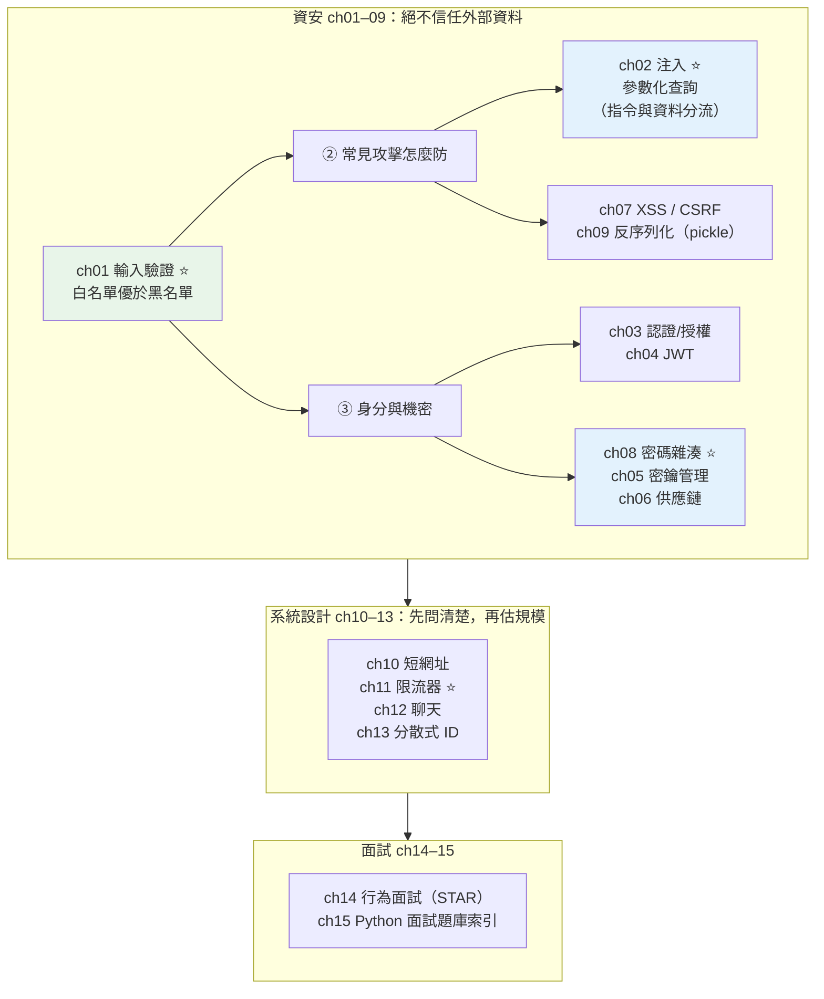

# Part 20 統整：安全與系統設計全貌

> 把這 15 章串成一張圖——資安只有一句心法：**絕不信任來自外部的資料。** 系統設計只有一句心法：**先問清楚，再動手畫。**

## 🗺️ 知識地圖（這 15 章怎麼串起來）

Part 20 其實是**兩個主題**：前半是**資安**（ch01–09），後半是**系統設計面試**（ch10–15）。



**一句話串起來**：

**資安的整個第一原則只有一句：[絕不信任來自外部的資料](01-input-validation.md)**（ch01）——
使用者輸入、API 參數、上傳檔案、甚至「自己人」的其他服務，一律當可疑包裹。
守門要用**白名單**（只放行明確合法的），不是黑名單（黑名單永遠追不完）。

而最致命的攻擊——**[注入](02-injection.md)**（ch02）——病根都一樣：
**「不可信的資料被當成程式碼執行了」**。
解法不是「過濾壞字元」，而是**從結構上讓資料永遠是資料**（參數化查詢）。

機密面的三根柱子：
**[密碼雜湊](08-password-hashing.md)**（ch08，**存指紋不存本人** + 慢雜湊 + 鹽）、
**[密鑰管理](05-secrets-management.md)**（ch05，別進 git）、
**[供應鏈](06-supply-chain.md)**（ch06，你沒讀過的依賴也是攻擊面）。

後半的**系統設計**（ch10–13）則是另一套心法：
**先釐清需求、估算規模，再設計**——面試官考的是**思考過程**，不是背答案。

## ⚡ 速查表（什麼情境用什麼）

| 情境 | 怎麼做 | 章節 |
|------|--------|------|
| **接收任何外部輸入** | **驗證**（白名單）——用 [pydantic](../14-web/06-pydantic-validation.md)，不合法擋在門外 | [ch01](01-input-validation.md) |
| **拼 SQL** | **參數化查詢** `execute(sql, (params,))`——**絕不字串拼接** | [ch02](02-injection.md) |
| 跑外部指令 | `subprocess.run([...])` 用列表——**絕不 `shell=True`** | [ch02](02-injection.md) |
| 存密碼 | **argon2 / bcrypt**（自帶鹽 + 慢）——**絕不用 MD5/SHA-256**（太快） | [ch08](08-password-hashing.md) |
| 比對密碼／token | **定時比較**（`hmac.compare_digest`）——防時序攻擊 | [ch08](08-password-hashing.md) |
| API 認證 | **JWT**——但別放敏感資料（payload 只是 Base64，人人可讀） | [ch04](04-jwt.md) |
| 「你能不能看**這一筆**」 | **授權**（每個資源都要查）——別只做認證（防 IDOR） | [ch03](03-authn-authz.md) |
| 密碼/金鑰放哪 | **環境變數 / 密鑰管理系統**——**絕不進 git**（歷史是永久的） | [ch05](05-secrets-management.md) |
| 裝第三方套件 | 釘死版本 + **lockfile + 雜湊**；`pip-audit` 掃漏洞 | [ch06](06-supply-chain.md) |
| 把使用者輸入塞進 HTML | **輸出時逃逸**（模板自動做）；cookie 設 `HttpOnly` | [ch07](07-owasp-xss-csrf.md) |
| 反序列化 | **只用 JSON**；`pickle.loads` / `yaml.load` **絕不碰不可信資料** | [ch09](09-deserialization-security.md) |
| **限流** | **令牌桶**（允許短暫尖峰、長期鎖死）；回 **429 + Retry-After** | [ch11](11-system-design-rate-limiter.md) |
| 系統設計面試 | **先問需求 → 估規模 → 設計核心 → 針對瓶頸加料**（別急著畫） | [ch10](10-system-design-url-shortener.md) |
| 分散式唯一 ID | **Snowflake**（時間戳 + 機器 ID + 序號，零協調） | [ch13](13-system-design-distributed-id.md) |
| 即時推送 | **WebSocket** + fan-out（寫時/讀時扇出） | [ch12](12-system-design-chat.md) |
| 行為面試 | **STAR**（Situation/Task/Action/Result）+ 講「我」不是「我們」 | [ch14](14-behavioral-interview.md) |
| 面試前總複習 | **Python 面試題庫索引** | [ch15](15-python-interview-questions.md) |

## 🔑 核心心智模型（帶得走的幾句話）

- **絕不信任來自外部的資料。** 這是資安的第一句話，也是最後一句話。
  驗證用**白名單**（定義什麼是好的），不是黑名單（列舉什麼是壞的——永遠列不完）。
- **注入的病根：指令與資料混在一起。** SQL injection、命令注入、XSS——
  都是「不可信的資料被當成程式碼」。**參數化查詢**從結構上把兩者分流，
  讓使用者輸入**永遠只被當成「值」**。
- **密碼要「存指紋，不存本人」。** 雜湊是單向的（你不需要解密）。而且要：
  **每人不同的鹽**（破壞彩虹表）+ **慢雜湊**（argon2/bcrypt，讓暴力破解一年試不完）。
  **用 SHA-256 存密碼 ≈ 沒設防**（它太快了）。
- **密鑰進 git = 永久外洩。** git 歷史是永久的，下一個 commit 刪掉也撈得回來。
  假設「遲早會外洩」，讓外洩的代價小（可輪替），比幻想「永不外洩」實際。
- **JWT 的 payload 人人可讀。** 它只是 Base64**編碼**，不是加密——
  簽章保證的是「沒被竄改」，不是「看不到」。**別把敏感資料放進去。**
- **系統設計：先問，別急著畫。** 面試官考的是**思考過程**：
  釐清需求 → 估算規模（展示量化思維）→ 設計核心 → 針對瓶頸（如讀寫比 100:1 → 快取）加料。
  **第一分鐘就開畫的人出局。**

## 🛠️ 小實作：三個最高頻的資安主題，各示範一次

```python
# security_demo.py —— Part 20 主線：注入防護 + 密碼雜湊 + 限流
from __future__ import annotations

import hashlib
import hmac
import secrets
import sqlite3
import time


def setup_db() -> sqlite3.Connection:
    conn = sqlite3.connect(":memory:")
    conn.execute("CREATE TABLE users (id INTEGER PRIMARY KEY, name TEXT, is_admin INTEGER)")
    conn.executemany(
        "INSERT INTO users (name, is_admin) VALUES (?, ?)",
        [("alice", 0), ("bob", 0), ("admin", 1)],
    )
    conn.commit()
    return conn


def login_vulnerable(conn: sqlite3.Connection, name: str) -> list[tuple]:
    """🔴 字串拼接——使用者輸入越界，變成了查詢邏輯的一部分。"""
    query = f"SELECT name, is_admin FROM users WHERE name = '{name}'"  # noqa: S608
    return conn.execute(query).fetchall()


def login_safe(conn: sqlite3.Connection, name: str) -> list[tuple]:
    """✅ 參數化查詢——使用者輸入「永遠只被當成值」，動不了 SQL 結構。"""
    return conn.execute(
        "SELECT name, is_admin FROM users WHERE name = ?", (name,)
    ).fetchall()


def hash_password(password: str) -> tuple[str, str]:
    """ch08：每人不同的鹽 + 慢雜湊（pbkdf2，10 萬次迭代）。"""
    salt = secrets.token_hex(16)            # ⚠️ 用 secrets 不是 random！
    digest = hashlib.pbkdf2_hmac("sha256", password.encode(), bytes.fromhex(salt), 100_000)
    return salt, digest.hex()


def verify_password(password: str, salt: str, expected: str) -> bool:
    digest = hashlib.pbkdf2_hmac("sha256", password.encode(), bytes.fromhex(salt), 100_000)
    return hmac.compare_digest(digest.hex(), expected)   # 定時比較，防時序攻擊


class TokenBucket:
    """ch11：令牌桶限流——允許短暫尖峰，長期被鎖死。"""

    def __init__(self, capacity: int, refill_per_sec: float) -> None:
        self.capacity = capacity
        self.tokens = float(capacity)
        self.refill = refill_per_sec
        self.last = time.monotonic()

    def allow(self) -> bool:
        now = time.monotonic()
        self.tokens = min(self.capacity, self.tokens + (now - self.last) * self.refill)
        self.last = now
        if self.tokens >= 1:
            self.tokens -= 1
            return True
        return False


def demo() -> None:
    conn = setup_db()

    print("【ch02 SQL injection】攻擊輸入: alice' OR '1'='1")
    attack = "alice' OR '1'='1"
    vuln = login_vulnerable(conn, attack)
    safe = login_safe(conn, attack)
    print(f"    🔴 字串拼接: 撈出 {len(vuln)} 筆 → {[r[0] for r in vuln]}  ← 連 admin 都被撈出來！")
    print(f"    ✅ 參數化  : 撈出 {len(safe)} 筆 → {[r[0] for r in safe]}  ← 找不到叫這個名字的人")

    print("\n【ch08 密碼雜湊】存指紋，不存本人")
    salt, digest = hash_password("hunter2")
    _, digest2 = hash_password("hunter2")       # 同密碼，不同鹽
    print(f"    密碼 'hunter2' 第一次: {digest[:24]}...")
    print(f"    密碼 'hunter2' 第二次: {digest2[:24]}...  ← 同密碼但雜湊不同（鹽不同）")
    print(f"    驗證正確密碼: {verify_password('hunter2', salt, digest)}")
    print(f"    驗證錯誤密碼: {verify_password('wrong', salt, digest)}")

    print("\n【ch11 令牌桶限流】容量 3、每秒補 2 個")
    bucket = TokenBucket(capacity=3, refill_per_sec=2)
    results = [bucket.allow() for _ in range(5)]
    print(f"    連續 5 個請求: {['放行' if r else '429擋下' for r in results]}")
    print("    ← 前 3 個用光桶裡的令牌（允許尖峰），之後被擋（長期被鎖死）")


if __name__ == "__main__":
    demo()
```

**預期輸出**：

```pycon
$ python security_demo.py
【ch02 SQL injection】攻擊輸入: alice' OR '1'='1
    🔴 字串拼接: 撈出 3 筆 → ['alice', 'bob', 'admin']  ← 連 admin 都被撈出來！
    ✅ 參數化  : 撈出 0 筆 → []  ← 找不到叫這個名字的人

【ch08 密碼雜湊】存指紋，不存本人
    密碼 'hunter2' 第一次: 036c22ff48fd4d614603339c...
    密碼 'hunter2' 第二次: 5e90a4fc8b8605f0c30e53ff...  ← 同密碼但雜湊不同（鹽不同）
    驗證正確密碼: True
    驗證錯誤密碼: False

【ch11 令牌桶限流】容量 3、每秒補 2 個
    連續 5 個請求: ['放行', '放行', '放行', '429擋下', '429擋下']
    ← 前 3 個用光桶裡的令牌（允許尖峰），之後被擋（長期被鎖死）
```

**三段輸出，說完資安的三個核心**：

**① 注入：`3 筆（含 admin）` vs `0 筆`。**
攻擊字串 `alice' OR '1'='1` 在字串拼接版裡，那個 `'` **提前關掉了字串**，
`OR '1'='1'` 變成了**查詢邏輯的一部分**——於是**整張表被撈出來，連 `admin` 都跑出來了**。
參數化版呢？它把整個 `alice' OR '1'='1` 當成**一個奇怪的名字**去找——
**當然找不到（0 筆）**。差別不是「過濾了壞字元」，而是**資料永遠是資料**。

**② 密碼：同一個密碼，兩次雜湊卻不同。**
`hunter2` 雜湊兩次得到**完全不同的結果**——因為**每次用不同的鹽**。
這破壞了「彩虹表」（預先算好的密碼→雜湊對照表），也讓「破解一個人 ≠ 破解所有用同密碼的人」。
而 `pbkdf2` 的**10 萬次迭代**讓它**故意很慢**——你登入無感，暴力破解者一年試不完。

**③ 限流：前 3 個放行，之後擋下。**
令牌桶容量 3 → **允許前 3 個請求的短暫尖峰**（桶裡的令牌一次用光），
之後只能按「每秒補 2 個」的速度放行——**短期有彈性，長期被鎖死**。
這正是 nginx、雲端 API 限流的做法。

## ✅ 自測清單（答不出來就回去讀）

- [ ] 白名單和黑名單，資安上該用哪個？為什麼？（[ch01](01-input-validation.md)）
- [ ] SQL injection 的根本原因是什麼？參數化查詢為什麼能防？（[ch02](02-injection.md)）
- [ ] 認證（authN）和授權（authZ）差在哪？只做認證會有什麼漏洞？（[ch03](03-authn-authz.md)）
- [ ] JWT 的三段是什麼？payload 能放密碼嗎？（[ch04](04-jwt.md)）
- [ ] 為什麼不能用 MD5/SHA-256 存密碼？該用什麼？（[ch08](08-password-hashing.md)）
- [ ] 鹽（salt）的作用是什麼？它需要保密嗎？（[ch08](08-password-hashing.md)）
- [ ] 密鑰不小心 commit 進 git 了，怎麼辦？（[ch05](05-secrets-management.md)）
- [ ] 供應鏈攻擊有哪些手法？怎麼防？（[ch06](06-supply-chain.md)）
- [ ] XSS 和 CSRF 差在哪？各自怎麼防？（[ch07](07-owasp-xss-csrf.md)）
- [ ] `pickle.loads` 為什麼危險？什麼時候才能用？（[ch09](09-deserialization-security.md)）
- [ ] 系統設計面試的四個步驟是什麼？（[ch10](10-system-design-url-shortener.md)）
- [ ] 令牌桶和固定視窗限流各有什麼特性？（[ch11](11-system-design-rate-limiter.md)）
- [ ] Snowflake ID 的位元怎麼分配？它怎麼做到「零協調」？（[ch13](13-system-design-distributed-id.md)）
- [ ] 聊天系統為什麼用 WebSocket？fan-out 有哪兩種？（[ch12](12-system-design-chat.md)）
- [ ] STAR 是什麼？行為面試為什麼要講「我」不是「我們」？（[ch14](14-behavioral-interview.md)）

## 🎯 面試速查

| 考點 | 面試官想聽到什麼 | 章節 |
|------|------------------|------|
| **怎麼防 SQL injection？** | 「**參數化查詢**（prepared statement）——把 **SQL 骨架與參數分兩條通道**送給資料庫，SQL 先編譯定型，參數之後才填、**永遠只被當值看待**。不管使用者填什麼，都動不了查詢結構。**不是『過濾引號』**（那可被繞過），是從結構上分流指令與資料。」 | [ch02](02-injection.md) |
| **密碼該怎麼存？** | 「**雜湊，不是加密**（不需要解密）。用 **argon2 或 bcrypt**（自帶**鹽** + **慢**）。鹽讓相同密碼產生不同雜湊（破壞彩虹表）；慢雜湊讓暴力破解代價極高（bcrypt 一次 ~0.1 秒）。**絕不用 MD5/SHA-256**——它們為『快』設計，攻擊者一秒能試幾十億個。」 | [ch08](08-password-hashing.md) |
| **authN vs authZ？** | 「**認證（authN）確認『你是誰』，授權（authZ）確認『你能做什麼』**。順序：先認證再授權。最常見的漏洞是**只做認證忘了授權**——使用者登入後把 URL 的 `/orders/42` 改成 `/orders/43`，就看到別人的訂單（**IDOR**）。所以**每個資源存取都要查權限**。」 | [ch03](03-authn-authz.md) |
| **JWT 的注意事項？** | 「① payload 只是 **Base64 編碼、人人可讀**——**別放敏感資料**；② **難以撤銷**（發出去就在客戶端）——存活期設短 + refresh token；③ 驗證要**指定允許的演算法白名單**（防 `alg:none` 攻擊）。」 | [ch04](04-jwt.md) |
| **系統設計怎麼答？** | 「**別急著畫**。① **釐清需求**（功能 + 非功能：可用性、延遲、讀寫比）；② **估算規模**（如每月 1 億 → 寫入 40/秒、讀 4000/秒——展示量化思維）；③ **設計核心流程**；④ **針對瓶頸加料**（讀寫比 100:1 → 快取是主角）。考的是**思考過程**。」 | [ch10](10-system-design-url-shortener.md) |
| **令牌桶怎麼運作？** | 「一個容量 N 的桶，**以固定速率補充令牌**；每個請求拿一個，沒令牌就拒絕（429）。精髓：**允許短暫尖峰**（桶裡存的令牌可一次用掉）**但長期平均被鎖死**。nginx、雲端 API 多用它或近親 leaky bucket。」 | [ch11](11-system-design-rate-limiter.md) |
| **分散式唯一 ID？** | 「**Snowflake**：64 bit = 時間戳（41 bit）+ 機器 ID（10 bit）+ 同毫秒序號（12 bit）。**零協調、本機生成、微秒級**，還**大致遞增**（對 B+tree 插入友善）。面試追問：**時鐘回撥**（拒發並等待）與**機器 ID 分配**（ZooKeeper/etcd）。」 | [ch13](13-system-design-distributed-id.md) |

---

🎉 **恭喜完成 Part 20！** 你會**防住惡意的人**，也會**答系統設計題**了。

到這裡，一個**單體服務**該會的都會了。
但當系統長大——**一個服務變成幾十個服務**——新的問題出現了：
它們怎麼溝通？一個掛了會不會拖垮全部？

接下來 [Part 21 微服務](../21-microservices/README.md) 要回答這些——
而它的第一課，是一個**反直覺的建議：先別拆**。

➡️ 下一 Part：[微服務 Microservices](../21-microservices/README.md)

[⬆️ 回 Part 20 索引](README.md)
