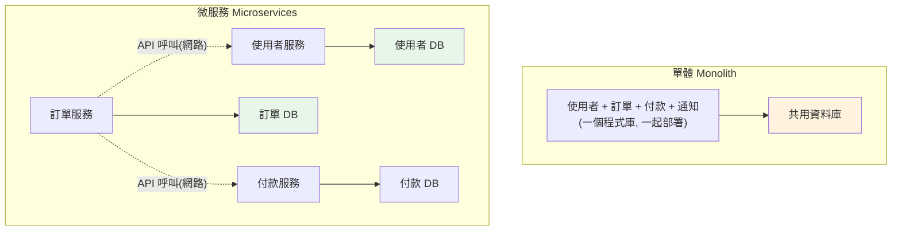

# 微服務概論與服務拆分

> 「把單體拆成微服務」是過去十年最熱門也最被誤用的架構決策。微服務不是銀彈——它用「分散式系統的複雜度」換「團隊自治與獨立部署」。這章講微服務是什麼、何時該用（更重要的是何時**不該**用）、以及怎麼拆分服務。

## 💡 白話導讀（建議先讀）

**單體（monolith）＝一間大餐廳**:一個廚房、一份菜單、一本帳。
所有廚師在同一個廚房工作——初期效率極高:傳菜是喊一聲的事（函式呼叫）,
記帳一本搞定（單一資料庫、交易容易）。
但店大了就痛:改一道菜要全店重新開業（整體部署）、
川菜區失火整間店停業（一處故障全域受累）、二十個廚師擠一個廚房互相絆腳。

**微服務＝美食街**:每攤自己的廚房、自己的進貨、自己的帳本。
一攤翻新不影響別攤（獨立部署）、哪攤生意好就多開一攤（按服務擴展）、
每攤自組小團隊（團隊自治）。

但天下沒有白吃的午餐,美食街的代價:
客人一餐要跑三攤（一個請求跨多服務,網路呼叫**慢且會失敗**）、
攤位間喊話會聽錯（跨服務溝通要處理逾時/重試/熔斷）、
對帳變成惡夢（各自帳本,沒有跨攤交易,只有**最終一致性**)、
查一筆消費要翻三攤的紀錄（跨服務除錯要分散式追蹤)。

所以這章的核心結論先講:**微服務不是先進,是取捨**——
用「分散式系統的複雜度」換「團隊自治與獨立部署」。
團隊不夠大、痛點不明確,**先寫好[模組化的單體](../16-architecture/12-modular-monolith.md)**（Part 16 的分層與邊界）,
等真的痛了再拆——「先單體,後微服務」是業界血淚共識,不是保守。

## Why（為什麼）

一開始，你的應用是一個**單體（monolith）**——所有功能（使用者、訂單、付款、通知）在一個程式碼庫、一起部署、共用一個資料庫。單體很好：簡單、好開發、好測試、一次部署。**大多數專案應該從單體開始。**

但當團隊變大、系統變複雜，單體會遇到瓶頸：

- **部署耦合**：改一行通知的程式碼，要重新部署整個龐大單體、所有團隊被卡住。
- **擴展不靈活**：只有付款模組需要更多資源，卻得整個單體一起擴。
- **技術鎖定**：整個單體綁死一種語言/框架，無法針對不同需求選型。
- **團隊協作衝突**：幾十個工程師在同一個程式碼庫上，衝突不斷。

**微服務（microservices）** 把系統拆成多個**獨立部署、獨立擴展、圍繞業務能力**的小服務，各自擁有資料、透過網路 API 溝通。好處是**團隊自治**（各團隊獨立開發部署自己的服務）、**獨立擴展**、**技術異質**、**故障隔離**。

但天下沒有白吃的午餐——微服務用**分散式系統的複雜度**（網路延遲/失敗、資料一致性、部署運維、除錯困難）換取這些好處。**很多團隊在還不需要時就上微服務，結果是「分散式單體」——擁有微服務的所有痛苦，卻沒有它的好處。** 這章講清楚微服務的本質、取捨、以及拆分原則，幫你做對決策。

## Theory（理論：微服務的取捨）

**微服務 vs 單體的本質**是一個取捨（trade-off），不是「先進 vs 落後」：

| 面向 | 單體 Monolith | 微服務 Microservices |
|------|--------------|---------------------|
| 部署 | 一起部署（簡單） | 獨立部署（靈活但複雜） |
| 擴展 | 整體擴 | 按服務擴 |
| 開發 | 單一程式庫（初期快） | 多服務（團隊自治） |
| 溝通 | 函式呼叫（快、可靠） | 網路呼叫（慢、會失敗） |
| 資料 | 共用 DB（易交易） | 各自 DB（最終一致性） |
| 除錯 | 單一行程（好追） | 跨服務（需分散式追蹤） |
| 運維 | 簡單 | 複雜（需編排/監控/治理） |

**關鍵認知——微服務引入的成本是真實且高昂的**：網路呼叫會**失敗、逾時、變慢**（見 [服務間通訊](03-service-communication.md)）；跨服務的資料一致性只能是**最終一致**（見 [Saga](../22-distributed-systems/07-saga.md)）；除錯要跨多個服務（需 [分散式追蹤](../22-distributed-systems/08-distributed-tracing.md)）；運維要處理服務發現、負載平衡、限流熔斷、[K8s 編排](../19-cloud-native/06-kubernetes.md)。

**Martin Fowler 的忠告——「Monolith First」**：**先從單體開始**，當它真的遇到瓶頸、且你已足夠理解領域邊界時，再拆微服務。過早拆分是常見的災難，因為你還不知道正確的邊界在哪。

## Specification（規範：怎麼拆服務）

**拆分原則——圍繞業務能力（business capability），而非技術層**：

- **✅ 對**：按**領域/業務能力**拆——`使用者服務`、`訂單服務`、`付款服務`、`通知服務`。每個服務**完整擁有**一塊業務（含它的資料）。
- **🔴 錯**：按**技術層**拆——`資料庫服務`、`業務邏輯服務`、`API 服務`。這只是把單體的層變成跨網路呼叫，得到所有分散式痛苦卻沒有自治。

**關鍵原則**：

- **高內聚、低耦合**：一個服務內的東西緊密相關，服務間依賴最少。
- **每個服務擁有自己的資料（database per service）**：服務**不共用資料庫**，只透過對方的 API 存取其資料。這保證服務可獨立演進 schema、獨立部署。共用 DB = 假微服務（改一個 schema 全部受影響）。
- **[DDD](../16-architecture/08-ddd.md) 的 Bounded Context** 是找服務邊界的好工具——一個 bounded context 通常對應一個服務。
- **服務大小適中**：「micro」不是越小越好——太小會產生過多服務間呼叫（chatty）、運維爆炸。以「一個團隊能擁有、業務內聚」為準。

**遷移策略——Strangler Fig（絞殺榕）模式**：不要一次重寫，而是逐步把單體的功能一塊塊抽出成服務，新舊並存，慢慢「絞殺」掉單體。

## Implementation（底層：為何「各自資料庫」是關鍵）

**database per service 為何是微服務的核心**：微服務的承諾是「獨立部署、獨立演進」。要做到這點，服務必須**擁有並封裝自己的資料**——只有它能直接讀寫自己的資料庫，別的服務只能透過它的 API 存取。為什麼？

- 若多個服務**共用一個資料庫**，那麼改一張表的 schema 可能**破壞所有讀它的服務**——它們被資料庫耦合在一起，無法獨立演進、獨立部署。這是「分散式單體」的典型症狀。
- 各自資料庫則讓每個服務能**自由改自己的 schema、選自己適合的資料庫**（訂單用 PostgreSQL、商品搜尋用 Elasticsearch、購物車用 Redis），只要對外的 API 契約不變。

代價是：**跨服務的資料一致性變難**。單體裡「下訂單 + 扣庫存 + 扣款」可以是一個資料庫[交易](../15-database/16-transactions.md)（ACID）；拆成三個服務後，它們各有各的 DB，無法用單一交易——只能用**最終一致性**與 [Saga](../22-distributed-systems/07-saga.md) 模式協調。這正是微服務複雜度的核心來源之一。

**服務間通訊的不可靠性**：單體內的函式呼叫幾乎不會失敗、延遲奈秒級。微服務間是**網路呼叫**——會逾時、會失敗、有延遲、對方可能掛掉。所以每個跨服務呼叫都要考慮：逾時、重試、[熔斷](07-rate-limit-circuit-breaker.md)、降級。這是「把函式呼叫變成網路呼叫」的隱藏成本，也是為何微服務需要 [服務發現](04-service-discovery.md)、[API gateway](05-api-gateway.md)、[限流熔斷](07-rate-limit-circuit-breaker.md) 等一整套基礎設施。

## Code Example（可執行的 Python 範例）

以下用 Python 模擬「服務邊界與 database-per-service」——展示好的拆分（各擁資料、透過 API 互動）與壞的拆分（共用資料）的差異（純標準庫，可執行）：

```python
# service_boundaries.py — database-per-service 的服務邊界（純標準庫，可執行）
from __future__ import annotations

from dataclasses import dataclass, field


class UserService:
    """使用者服務：完整擁有使用者資料，只透過 API 對外提供。"""

    def __init__(self) -> None:
        self._users: dict[int, str] = {}  # 私有資料庫，外部不能直接碰

    def create_user(self, user_id: int, name: str) -> None:
        self._users[user_id] = name

    def get_user_name(self, user_id: int) -> str | None:
        """對外的 API——別的服務只能透過這個存取，不能直接讀 _users。"""
        return self._users.get(user_id)


@dataclass
class OrderService:
    """訂單服務：擁有訂單資料；需要使用者資訊時「呼叫」使用者服務的 API。"""

    users: UserService  # 依賴使用者服務的 API（不是它的資料庫）
    _orders: dict[int, dict[str, object]] = field(default_factory=dict)
    _next_id: int = 1

    def place_order(self, user_id: int, amount: int) -> dict[str, object]:
        # 透過 API 取使用者名（不直接存取 UserService 的 _users）
        user_name = self.users.get_user_name(user_id)
        if user_name is None:
            raise ValueError(f"使用者 {user_id} 不存在")
        order = {"id": self._next_id, "user": user_name, "amount": amount}
        self._orders[self._next_id] = order
        self._next_id += 1
        return order


def main() -> None:
    # 每個服務獨立擁有資料，透過 API 協作
    users = UserService()
    users.create_user(1, "alice")

    orders = OrderService(users=users)
    order = orders.place_order(user_id=1, amount=500)
    print(f"下單成功: {order}")

    # 訂單服務透過 API 取得使用者資訊，而非直接讀對方資料庫
    print(f"訂單服務不直接碰 UserService 的資料庫，只用其 API")

    # 使用者不存在 → 明確錯誤（跨服務呼叫要處理失敗）
    try:
        orders.place_order(user_id=999, amount=100)
    except ValueError as exc:
        print(f"跨服務呼叫失敗處理: {exc}")


if __name__ == "__main__":
    main()
```

**預期輸出**：

```pycon
$ python service_boundaries.py
下單成功: {'id': 1, 'user': 'alice', 'amount': 500}
訂單服務不直接碰 UserService 的資料庫，只用其 API
跨服務呼叫失敗處理: 使用者 999 不存在
```

逐段解說：

- **`UserService`**：完整擁有 `_users`（它的私有資料庫）。外部**只能透過 `get_user_name` API** 存取——這就是 database-per-service 的封裝。
- **`OrderService`**：擁有自己的訂單資料，但需要使用者名時**呼叫 `users.get_user_name` API**，而非直接讀 `UserService._users`。這保證使用者服務能獨立演進其資料結構，只要 API 契約不變。
- **跨服務失敗處理**：`place_order(999, ...)` 時使用者不存在——真實系統中這是一次可能逾時/失敗的網路呼叫，必須處理。這裡示範明確的失敗處理。
- **要點**：服務各擁資料、透過 API 協作（不共用資料庫），是微服務可獨立演進/部署的基礎。真實系統中這些 API 呼叫走網路（REST/gRPC，見 [服務間通訊](03-service-communication.md)），需加上逾時、重試、熔斷。

## Diagram（圖解：單體 vs 微服務）



## Best Practice（最佳實踐）

- **從單體開始（Monolith First）**：等真的遇到瓶頸、領域邊界清晰後再拆。
- **按業務能力/領域拆，不按技術層拆**：每個服務完整擁有一塊業務。
- **database per service**：服務不共用資料庫，只透過 API 存取彼此資料。
- **用 [DDD Bounded Context](../16-architecture/08-ddd.md) 找服務邊界**：高內聚、低耦合。
- **服務大小適中**：以「一團隊能擁有、業務內聚」為準，別過度拆分。
- **每個跨服務呼叫都設計失敗處理**：逾時、重試、[熔斷](07-rate-limit-circuit-breaker.md)、降級。
- **用 Strangler Fig 漸進遷移**：別一次大重寫。
- **投資基礎設施**：服務發現、gateway、監控、追蹤——微服務需要這些才跑得動。

## Common Mistakes（常見誤解）

- **過早拆微服務**：領域還不清楚就拆，邊界拆錯、比單體更痛苦。
- **按技術層拆（DB 服務/邏輯服務）**：得到分散式的所有痛苦、沒有自治的好處。
- **多個服務共用資料庫**：schema 改動互相破壞——「分散式單體」，假微服務。
- **服務拆太細（nano-service）**：過多服務間呼叫、運維爆炸、延遲累積。
- **把網路呼叫當函式呼叫**：不處理逾時/失敗，一個服務慢就雪崩。
- **忽略微服務的運維成本**：沒有服務發現/監控/追蹤/CI-CD 就上微服務。
- **跨服務用分散式交易硬求強一致**：該接受最終一致 + Saga。
- **以為微服務比單體「先進」**：它是取捨，多數專案單體更合適。

## Interview Notes（面試重點）

- **能講微服務 vs 單體的取捨**：用分散式複雜度換團隊自治/獨立部署擴展，不是先進與否。
- **能說「Monolith First」**：多數專案該從單體開始，領域清晰後再拆。
- **能講拆分原則**：按業務能力（非技術層）、database per service、DDD bounded context、適中大小。
- **能解釋 database-per-service 為何是核心**（獨立演進），以及它帶來的最終一致性代價。
- **知道微服務的隱藏成本**：網路不可靠、資料一致性、除錯、運維，需要一整套基礎設施。
- **知道分散式單體、過度拆分、共用 DB** 等反模式。

---

➡️ 下一章：[gRPC 與 protobuf](02-grpc-protobuf.md)

[⬆️ 回 Part 21 索引](README.md)
