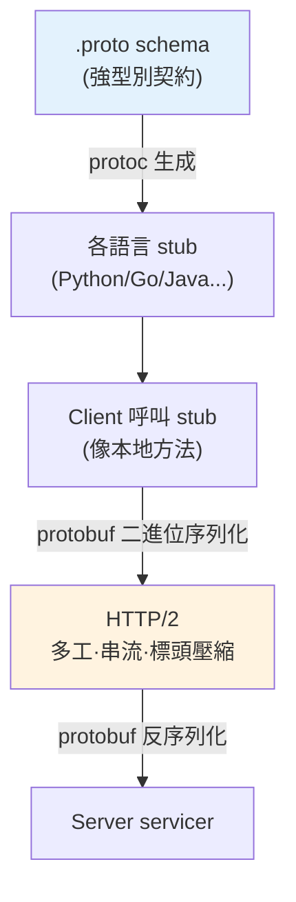

# gRPC 與 protobuf

> 微服務之間每秒要通訊成千上萬次。用 JSON over HTTP 雖然通用，但又慢又肥。**gRPC + Protocol Buffers** 是高效能服務間通訊的主流選擇：用二進位序列化（protobuf）+ HTTP/2，比 JSON/REST 快數倍、小數倍，還有強型別契約。這章講它們的原理與取捨。

## Why（為什麼）

微服務靠網路呼叫互相溝通。最直覺的做法是 **REST + JSON**——通用、人可讀、工具成熟。但在**服務間**高頻通訊的場景，JSON/REST 有明顯代價：

- **JSON 又肥又慢**：JSON 是**文字**格式——欄位名重複出現（每筆都寫 `"user_id"`）、數字用字串表示、要解析文字。序列化/反序列化慢、傳輸體積大。
- **無強型別契約**：JSON 沒有 schema 強制，欄位型別靠約定，容易對接出錯（一方傳字串、一方期待數字）。
- **HTTP/1.1 的限制**：每個請求要建連線、無法多工，高頻呼叫下開銷大。

**gRPC + Protocol Buffers（protobuf）** 為服務間通訊而生：

- **protobuf**：**二進位**序列化格式 + **schema（.proto 檔）**。用欄位編號取代欄位名、緊湊的二進位編碼——比 JSON **小 3-10 倍、快數倍**，且 schema 提供**強型別契約**與**跨語言**程式碼生成。
- **gRPC**：基於 **HTTP/2** 的 RPC 框架，用 protobuf 當序列化。支援多工、串流、雙向通訊，效能遠勝 REST/JSON。

代價是：**不如 REST/JSON 通用**（瀏覽器原生不支援 gRPC、需要工具、二進位不可讀難除錯）。所以**對外 API 常用 REST，服務間內部通訊用 gRPC**。這章講清楚它們的原理與適用場景。

## Theory（理論：protobuf 的緊湊編碼）

**Protocol Buffers 的核心**：先定義一個 **schema（`.proto` 檔）**，宣告訊息的欄位與**欄位編號（field number）**：

```protobuf
syntax = "proto3";
message User {
  int32 id = 1;        // 欄位編號 1
  string name = 2;     // 欄位編號 2
  bool is_active = 3;  // 欄位編號 3
}
```

然後用 `protoc` 編譯器**生成各語言的程式碼**（Python、Go、Java…），得到強型別的類別與序列化方法。

**為何 protobuf 比 JSON 緊湊**：

- **用欄位編號取代欄位名**：JSON 每筆都寫完整欄位名 `"is_active": true`；protobuf 二進位裡只存**編號 3** + 值——省下重複的欄位名字串。
- **二進位編碼數值**：JSON 把數字寫成文字（`"12345"` 佔 5 bytes）；protobuf 用 **varint**（變長整數）等緊湊二進位編碼。
- **無多餘符號**：沒有 JSON 的 `{`、`"`、`,`、空白。

**欄位編號是契約的關鍵**：一旦分配，**欄位編號不能改**（改了就對不上舊資料）。要**演進 schema**：加新欄位用新編號（舊程式忽略不認得的欄位）、廢棄欄位保留編號別重用。這讓 protobuf 支援**向前/向後相容**——新舊版本的服務能互通，這對獨立部署的微服務至關重要。

## Specification（規範：gRPC 的四種呼叫）

**gRPC 定義服務（`.proto`）**：

```protobuf
service UserService {
  rpc GetUser(GetUserRequest) returns (User);              // 一元(unary)
  rpc ListUsers(ListRequest) returns (stream User);         // 伺服器串流
  rpc UploadLogs(stream LogEntry) returns (UploadSummary);  // 客戶端串流
  rpc Chat(stream Message) returns (stream Message);        // 雙向串流
}
```

**四種呼叫模式**（HTTP/2 使串流成為可能）：

- **Unary（一元）**：一個請求、一個回應（最常見，類似普通 RPC）。
- **Server streaming（伺服器串流）**：一個請求、多個回應（如訂閱、大結果分批）。
- **Client streaming（客戶端串流）**：多個請求、一個回應（如上傳、批次）。
- **Bidirectional streaming（雙向串流）**：雙方持續互傳（如即時聊天）。

**Python 使用**：用 `grpcio` + `grpcio-tools`，`protoc` 生成 stub，實作 servicer、啟動 server、client 用 stub 呼叫（像呼叫本地方法）。

**選型準則**：

- **服務間內部、高效能、強型別 → gRPC**。
- **對外公開 API、瀏覽器、通用性 → REST/JSON**（見 [服務間通訊](03-service-communication.md)）。
- 也有 gRPC-Web、gRPC gateway 讓 gRPC 服務對外提供 REST。

## Implementation（底層：varint 與 HTTP/2）

**varint（變長整數編碼）——protobuf 省空間的關鍵之一**：一般整數固定用 4 或 8 bytes，但大多數整數其實很小（如 id=5、count=3）。varint 用**變長**編碼——小數字用少 bytes：每個 byte 用 7 bit 存值、1 bit 標記「還有沒有下一 byte」。所以 0-127 只要 1 byte、128-16383 要 2 bytes……。id=5 在 JSON 是 `"id":5`（6 bytes），在 protobuf 是「欄位 1 + varint 5」約 2 bytes。大量小整數時省下可觀空間。

**HTTP/2 讓 gRPC 高效**：REST 通常跑在 HTTP/1.1，一個連線一次一個請求-回應（隊頭阻塞）。gRPC 跑在 **HTTP/2**，特性包括：**多工（multiplexing）**——一條連線上並行多個請求，不互相阻塞；**二進位分幀**——傳輸更有效率；**標頭壓縮**——減少重複標頭開銷；**原生串流**——支援上述四種串流模式。這些讓 gRPC 在高頻服務間通訊時效能遠勝 REST/JSON。

**強型別契約的價值**：因為有 `.proto` schema，序列化/反序列化是**型別安全**的，且各語言從同一份 schema 生成程式碼——不會有「一方傳 string、一方讀 int」的對接問題。schema 也是**文件**與**契約**，用欄位編號規則支援版本演進。這對「多語言、獨立部署、需要穩定契約」的微服務環境很重要。

下面用純標準庫模擬「二進位緊湊編碼 vs JSON」的體積差異，說明 protobuf 為何更省。

## Code Example（可執行的 Python 範例）

```python
# protobuf_vs_json.py — 緊湊二進位編碼 vs JSON 的體積對比（純標準庫，示意）
from __future__ import annotations

import json
import struct


def encode_varint(n: int) -> bytes:
    """varint：小整數用少 bytes（protobuf 的省空間關鍵之一）。"""
    out = bytearray()
    while True:
        byte = n & 0x7F
        n >>= 7
        if n:
            out.append(byte | 0x80)  # 高位 1 = 還有下一 byte
        else:
            out.append(byte)
            return bytes(out)


def encode_binary(user_id: int, name: str, is_active: bool) -> bytes:
    """模擬 protobuf 風格：欄位編號 + 緊湊二進位（無欄位名、無多餘符號）。"""
    out = bytearray()
    out += b"\x01" + encode_varint(user_id)  # 欄位 1: id (varint)
    name_bytes = name.encode()
    out += b"\x02" + encode_varint(len(name_bytes)) + name_bytes  # 欄位 2: name
    out += b"\x03" + (b"\x01" if is_active else b"\x00")  # 欄位 3: bool
    return bytes(out)


def encode_json(user_id: int, name: str, is_active: bool) -> bytes:
    return json.dumps(
        {"id": user_id, "name": name, "is_active": is_active}, separators=(",", ":")
    ).encode()


def main() -> None:
    user_id, name, is_active = 12345, "alice", True

    binary = encode_binary(user_id, name, is_active)
    js = encode_json(user_id, name, is_active)

    print(f"JSON:   {js!r}")
    print(f"        {len(js)} bytes")
    print(f"二進位:  {binary!r}")
    print(f"        {len(binary)} bytes")
    print(f"\n二進位比 JSON 省 {(1 - len(binary) / len(js)) * 100:.0f}% 體積")

    # varint 示範：小數字用少 bytes
    print("\nvarint 編碼長度:")
    for n in (5, 300, 100000):
        print(f"  {n:>7} → {len(encode_varint(n))} bytes（固定 int32 要 4 bytes）")

    # 大量筆數時差距放大（欄位名不再重複佔空間）
    total_json = sum(len(encode_json(i, f"user{i}", True)) for i in range(1000))
    total_bin = sum(len(encode_binary(i, f"user{i}", True)) for i in range(1000))
    print(f"\n1000 筆總體積: JSON={total_json} bytes, 二進位={total_bin} bytes")


if __name__ == "__main__":
    main()
```

**預期輸出**（實際 bytes 依內容）：

```pycon
$ python protobuf_vs_json.py
JSON:   b'{"id":12345,"name":"alice","is_active":true}'
        44 bytes
二進位:  b'\x01\xb9`\x02\x05alice\x03\x01'
        12 bytes

二進位比 JSON 省 73% 體積

varint 編碼長度:
     5 → 1 bytes（固定 int32 要 4 bytes）
   300 → 2 bytes（固定 int32 要 4 bytes）
  100000 → 3 bytes（固定 int32 要 4 bytes）

1000 筆總體積: JSON=43780 bytes, 二進位=13762 bytes
```

逐段解說：

- **`encode_varint`**：小整數用少 bytes——5 用 1 byte、300 用 2 bytes，而固定 int32 一律 4 bytes。大量小整數時省空間。
- **`encode_binary`**：模擬 protobuf——用**欄位編號**（`\x01`、`\x02`）取代欄位名、緊湊二進位值、無 JSON 的引號逗號。
- **體積對比**：同一筆資料，JSON 44 bytes、二進位 12 bytes——**省 73%**。關鍵是 JSON 重複寫欄位名（`"id"`、`"name"`、`"is_active"`）與符號，二進位用編號取代。
- **1000 筆放大差距**：欄位名在每筆都重複，筆數越多 JSON 越吃虧——1000 筆時二進位只有 JSON 的約 1/3。這就是為何高頻服務間通訊用 protobuf。
- **要點**：protobuf 用「欄位編號 + varint + 二進位」大幅壓縮體積、加快序列化，配 HTTP/2 就是 gRPC 的高效能。代價是不可讀、需 schema 與工具。

## Diagram（圖解：gRPC 技術棧）



## Best Practice（最佳實踐）

- **服務間內部高頻通訊用 gRPC**、對外公開 API 用 REST/JSON：各取所長。
- **用 `.proto` 定義強型別契約**，`protoc` 跨語言生成程式碼。
- **欄位編號一旦分配就不改、廢棄的別重用**：保障向前/向後相容。
- **演進 schema 用「加新欄位（新編號）」**：舊服務忽略不認得的欄位，新舊互通。
- **適時用串流**：大結果用伺服器串流、批次上傳用客戶端串流、即時互動用雙向。
- **設逾時、重試、[熔斷](07-rate-limit-circuit-breaker.md)**：gRPC 呼叫仍是網路呼叫、會失敗。
- **除錯二進位時用 grpcurl/反射**：彌補不可讀的缺點。
- **需對外時用 gRPC gateway/gRPC-Web** 提供 REST 介面。

## Common Mistakes（常見誤解）

- **對外公開 API 硬用 gRPC**：瀏覽器不原生支援、通用性差；對外用 REST。
- **改動已分配的欄位編號或重用廢棄編號**：破壞相容性，新舊資料對不上。
- **以為 gRPC 呼叫不會失敗**：它是網路呼叫，要逾時/重試/熔斷。
- **不設逾時**：下游慢時呼叫方無限等待、雪崩。
- **二進位不可讀卻沒有除錯工具**：出問題難查；備好 grpcurl。
- **所有通訊都用 JSON/REST**：服務間高頻場景效能與體積吃虧。
- **schema 演進時刪欄位/改型別**：破壞相容；只加不改。
- **忽略 protobuf 的預設值語意**（proto3 沒設值 = 型別預設值，無法區分「未設」與「設為 0」）。

## Interview Notes（面試重點）

- **能說明 gRPC + protobuf 相對 REST/JSON 的優勢**：二進位緊湊（欄位編號+varint）、快、強型別契約、HTTP/2 多工串流。
- **能解釋 protobuf 為何比 JSON 小**：欄位編號取代欄位名、varint、無多餘符號。
- **知道欄位編號是契約、不能改、演進靠加新編號**（向前/向後相容）。
- **能列 gRPC 四種呼叫模式**（unary/server/client/雙向串流）及適用。
- **知道 HTTP/2 的多工/串流如何讓 gRPC 高效**。
- **能給選型建議**：服務間內部用 gRPC、對外用 REST，並知道 gRPC 的除錯/通用性代價。

---

➡️ 下一章：[服務間通訊 (REST / gRPC / 訊息)](03-service-communication.md)

[⬆️ 回 Part 21 索引](README.md)
