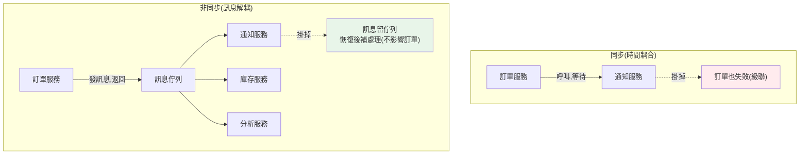

# 服務間通訊 (REST / gRPC / 訊息)

> 服務怎麼互相溝通，決定了整個系統的耦合度、韌性與效能。最根本的選擇是：**同步（等對方回應）還是非同步（丟訊息不等）**？這章講服務間通訊的兩大範式與三種主流方式（REST、gRPC、訊息佇列），以及如何選擇。

## Why（為什麼）

[微服務](01-microservices-intro.md)拆好後，服務間要協作——訂單服務下單後要通知庫存扣貨、通知服務寄信、分析服務記錄。**怎麼通訊**是核心設計決策，因為它決定：

- **耦合度**：服務彼此依賴多深？一個掛了會不會拖垮別人？
- **韌性**：下游慢/掛時，上游會等死、雪崩，還是能繼續？
- **一致性**：操作是即時完成，還是最終一致？
- **效能與複雜度**：同步簡單但脆弱，非同步韌性但複雜。

最根本的分野是**同步 vs 非同步**：

- **同步（synchronous）**：上游呼叫下游、**等待回應**才繼續（REST、gRPC）。像打電話——對方要在線、要即時回。簡單直覺，但**時間耦合**（下游慢/掛，上游就卡/失敗）。
- **非同步（asynchronous）**：上游發一則**訊息**到佇列就繼續，下游稍後處理（訊息佇列/事件）。像寄信——不必對方即時在線。**解耦、有韌性**，但**最終一致**、較複雜。

選錯範式會讓系統要嘛脆弱（該非同步卻同步、一個服務慢就雪崩），要嘛過度複雜（該同步卻非同步、簡單查詢硬做最終一致）。這章講清楚兩範式與三方式的取捨。它連結 [事件驅動](../16-architecture/10-event-driven-mq.md)、[訊息佇列](../22-distributed-systems/04-message-queue.md)。

## Theory（理論：同步 vs 非同步）

**同步通訊（request-response）**：

- **模式**：A 呼叫 B、阻塞等待 B 回應。
- **技術**：REST（HTTP/JSON）、[gRPC](02-grpc-protobuf.md)（HTTP/2/protobuf）。
- **優點**：簡單、直覺、即時得到結果、易於推理。
- **缺點**：**時間耦合**——B 慢則 A 慢、B 掛則 A 失敗。呼叫鏈越長越脆弱（A→B→C→D，任一環節慢/掛，整條受影響）。需要 [逾時、重試、熔斷](07-rate-limit-circuit-breaker.md) 保護。

**非同步通訊（訊息/事件）**：

- **模式**：A 發訊息到**訊息佇列（message broker）**（Kafka、RabbitMQ）就返回，B 稍後從佇列消費處理。
- **優點**：**解耦**（A 不需知道誰處理、B 不需在線）、**有韌性**（B 掛了訊息留在佇列、B 恢復後繼續）、**削峰填谷**（流量暴增時佇列緩衝）、**一對多**（一個事件多個訂閱者）。
- **缺點**：**最終一致**（不是即時完成）、**複雜**（要處理訊息重複、順序、失敗、[冪等](../22-distributed-systems/06-idempotency.md)）、除錯難（非同步流程難追）。

**選擇準則**：

- **需要即時結果、簡單查詢 → 同步**（如「查使用者資料」）。
- **不需即時、要解耦/韌性/削峰 → 非同步**（如「下單後寄信、更新分析」——這些不該卡住下單主流程）。
- **核心即時一致的操作同步、周邊反應非同步** 是常見的務實組合。

## Specification（規範：三種方式）

**REST（同步，最通用）**：

```text
GET  /users/123        → 200 {user data}     # 查詢
POST /orders           → 201 {order}          # 建立
```

HTTP + JSON，人可讀、工具成熟、對外友善。適合對外 API 與一般同步呼叫。

**gRPC（同步，高效能）**（見 [gRPC](02-grpc-protobuf.md)）：二進位 + HTTP/2，服務間高頻內部通訊。

**訊息佇列（非同步）**：

```text
# 生產者：發事件就返回（不等處理）
broker.publish("order.placed", {"order_id": 123, ...})

# 消費者：從佇列消費（可多個訂閱者各自反應）
inventory_service:  訂閱 order.placed → 扣庫存
notification_service: 訂閱 order.placed → 寄信
```

兩種訊息模式：**工作佇列（point-to-point，一訊息一消費者，分工）** vs **pub/sub（一事件多訂閱者，廣播）**（見 [訊息佇列](../22-distributed-systems/04-message-queue.md)）。

**通訊可靠性要素**（同步與非同步都需要）：逾時、重試（配合[冪等](../22-distributed-systems/06-idempotency.md)）、[熔斷](07-rate-limit-circuit-breaker.md)、降級。

## Implementation（底層：時間耦合與訊息解耦）

**同步的「時間耦合」為何危險**：同步呼叫要求「呼叫的當下，下游必須在線且即時回應」。考慮呼叫鏈 訂單→庫存→定價→…：如果定價服務變慢（如 GC、負載高），庫存服務等它、訂單服務又等庫存——**延遲沿呼叫鏈累積放大**。更糟的是**級聯失敗（cascading failure）**：定價掛了，庫存的執行緒都卡在等它、耗盡執行緒池，庫存也掛，接著訂單也掛——**一個服務的故障沿呼叫鏈雪崩**。這就是為何同步呼叫**必須**配 [逾時 + 熔斷](07-rate-limit-circuit-breaker.md)：逾時讓你不無限等、熔斷讓你在下游明顯掛掉時快速失敗（不再送請求過去等死）。

**訊息佇列如何解耦**：非同步把「發生的事」與「對它的反應」在**時間上分開**。訂單服務發一則 `order.placed` 到佇列就**立刻返回**（下單完成，快）；庫存、通知、分析服務**各自**從佇列消費、獨立處理。好處：

- **下游掛了不影響上游**：通知服務掛了，`order.placed` 訊息留在佇列，下單照樣成功；通知服務恢復後補處理——**故障被佇列隔離**。
- **削峰填谷**：大促時訂單暴增，佇列緩衝，下游按自己的速度消費，不被瞬間壓垮。
- **一對多**：一個 `order.placed` 事件，庫存/通知/分析各自訂閱反應，新增訂閱者不影響生產者——**低耦合、易擴展**。

代價是**最終一致**（下單成功時信還沒寄）與**訊息語意的複雜度**：訊息佇列通常是「至少一次投遞」，所以消費者必須**冪等**（同一訊息處理兩次結果一致，見 [冪等](../22-distributed-systems/06-idempotency.md)），且要處理失敗（重試、[死信佇列](../22-distributed-systems/04-message-queue.md)）、順序不保證等問題。

下面範例對比「同步（下游掛則上游失敗）」與「非同步（下游掛不影響上游、恢復後補處理）」。

## Code Example（可執行的 Python 範例）

```python
# service_comm.py — 同步(時間耦合) vs 非同步(訊息解耦)（純標準庫，可執行）
from __future__ import annotations

from collections import deque


class NotificationService:
    """通知服務：可能掛掉。"""

    def __init__(self) -> None:
        self.healthy = True
        self.sent: list[str] = []

    def send(self, msg: str) -> None:
        if not self.healthy:
            raise ConnectionError("通知服務掛了")
        self.sent.append(msg)


# --- 同步：下游掛掉 → 上游失敗（時間耦合）---
def place_order_sync(notifier: NotificationService, order: str) -> str:
    # 下單後「同步」呼叫通知，等它完成
    notifier.send(f"訂單 {order} 已成立")  # 若通知掛了，這裡就拋錯
    return f"下單成功: {order}"


# --- 非同步：發訊息就返回，下游稍後消費（解耦）---
class MessageBroker:
    def __init__(self) -> None:
        self.queue: deque[str] = deque()

    def publish(self, msg: str) -> None:
        self.queue.append(msg)  # 丟進佇列就返回

    def consume_all(self, notifier: NotificationService) -> int:
        """消費者處理佇列；掛掉的訊息留著，恢復後補處理。"""
        processed = 0
        while self.queue:
            msg = self.queue[0]
            try:
                notifier.send(msg)
            except ConnectionError:
                break  # 下游還沒好，訊息留在佇列
            self.queue.popleft()
            processed += 1
        return processed


def main() -> None:
    # 同步：通知服務掛掉 → 連下單都失敗（級聯）
    down = NotificationService()
    down.healthy = False
    try:
        place_order_sync(down, "A001")
    except ConnectionError as exc:
        print(f"[同步] 通知掛 → 下單也失敗: {exc}")

    # 非同步：通知服務掛掉 → 下單照樣成功，訊息留佇列
    broker = MessageBroker()
    notifier = NotificationService()
    notifier.healthy = False
    broker.publish("訂單 B001 已成立")  # 下單只發訊息 → 立即成功
    print(f"[非同步] 下單成功（通知掛也不影響），佇列積壓 {len(broker.queue)} 則")

    # 通知服務恢復 → 補處理積壓訊息
    notifier.healthy = True
    n = broker.consume_all(notifier)
    print(f"[非同步] 通知恢復後補送 {n} 則: {notifier.sent}")


if __name__ == "__main__":
    main()
```

**預期輸出**：

```pycon
$ python service_comm.py
[同步] 通知掛 → 下單也失敗: 通知服務掛了
[非同步] 下單成功（通知掛也不影響），佇列積壓 1 則
[非同步] 通知恢復後補送 1 則: ['訂單 B001 已成立']
```

逐段解說：

- **同步 `place_order_sync`**：下單後**同步呼叫**通知服務。通知掛掉 → 這個呼叫拋錯 → **連下單都失敗**。這就是時間耦合：一個不重要的下游（通知）掛掉，拖垮了核心操作（下單）。
- **非同步 `MessageBroker`**：下單只**發訊息到佇列**就返回——**立即成功**，不管通知服務死活。訊息積壓在佇列。
- **恢復補處理**：通知服務恢復後，`consume_all` 把積壓的訊息補送。**故障被佇列隔離**，且不丟訊息。
- **要點**：核心操作（下單）不該被周邊反應（通知）的可用性綁架。非同步用訊息佇列解耦，讓下游故障不影響上游、恢復後補處理——代價是通知變成最終一致（下單成功時信可能還沒寄）。

## Diagram（圖解：同步 vs 非同步）



## Best Practice（最佳實踐）

- **核心即時一致操作用同步、周邊反應用非同步**：別讓不重要的下游拖垮核心。
- **同步呼叫必配逾時 + [熔斷](07-rate-limit-circuit-breaker.md) + 重試**：防級聯失敗與雪崩。
- **非同步用訊息佇列解耦 + 削峰 + 一對多**：下游故障隔離、可獨立擴展。
- **非同步消費者要冪等**（見 [冪等](../22-distributed-systems/06-idempotency.md)）：至少一次投遞會重複。
- **對外 API 用 REST、服務間高頻用 gRPC、解耦事件用訊息佇列**：適材適所。
- **重試配指數退避 + 抖動**：避免重試風暴。
- **設計失敗處理**：死信佇列、降級、補償（見 [Saga](../22-distributed-systems/07-saga.md)）。
- **用[分散式追蹤](../22-distributed-systems/08-distributed-tracing.md)串起跨服務流程**：否則非同步難除錯。

## Common Mistakes（常見誤解）

- **所有通訊都同步**：一個下游慢/掛就沿呼叫鏈雪崩。
- **同步呼叫不設逾時**：下游卡住，呼叫方執行緒耗盡、級聯失敗。
- **該非同步的周邊操作硬做同步**：下單被寄信、寫分析拖累、綁架核心。
- **該同步的簡單查詢硬做非同步**：徒增最終一致的複雜度。
- **非同步消費者不冪等**：至少一次投遞下重複扣款/重複寄信。
- **不處理訊息失敗**：訊息丟失或無限重試卡住；用死信佇列。
- **重試無退避**：重試風暴加劇下游壓力。
- **非同步流程沒有追蹤**：跨服務問題無從查起。

## Interview Notes（面試重點）

- **能區分同步 vs 非同步通訊**及各自優缺（時間耦合/即時 vs 解耦/最終一致）。
- **能解釋同步的級聯失敗風險**，以及逾時/熔斷/重試如何防護。
- **能說明訊息佇列如何解耦**（故障隔離、削峰、一對多）與其代價（最終一致、需冪等）。
- **能給選型**：對外 REST、服務間 gRPC、解耦事件用訊息佇列；核心同步、周邊非同步。
- **知道非同步的複雜度**：訊息重複（需冪等）、順序、失敗（死信）、除錯（需追蹤）。
- **能連結事件驅動、Saga、冪等** 等相關概念。

---

➡️ 下一章：[service discovery 服務發現](04-service-discovery.md)

[⬆️ 回 Part 21 索引](README.md)
