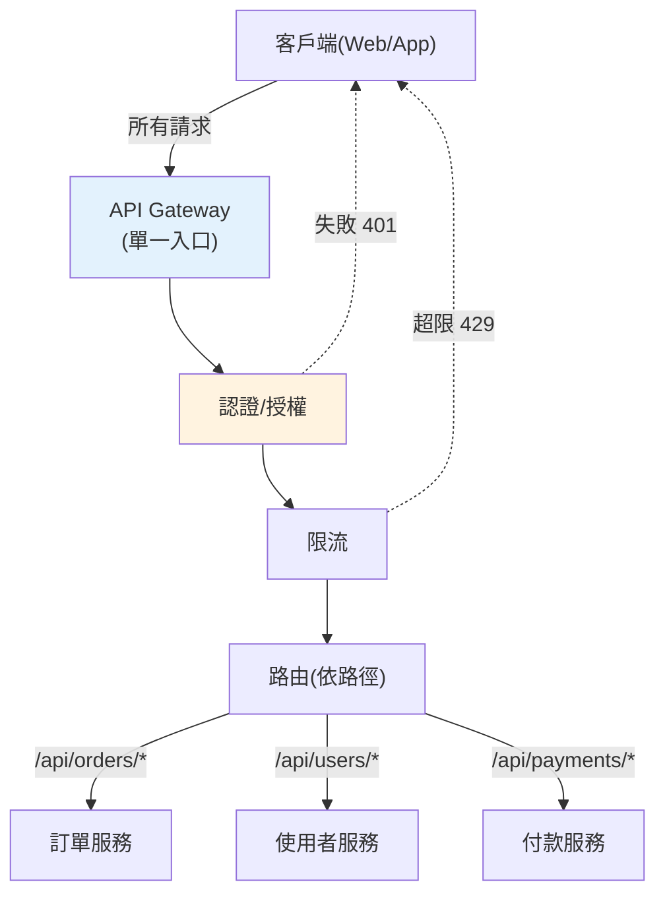

# API gateway

> 你有 20 個微服務，客戶端難道要記住 20 個位址、各自處理認證、各自限流嗎？**API gateway** 是所有外部請求的**單一入口**——它負責路由到對的服務，並集中處理認證、限流、日誌等**橫切關注**。這章講 gateway 的角色、模式與實作。

## Why（為什麼）

微服務把系統拆成很多服務，但客戶端（瀏覽器、App）不該直接面對這個複雜性：

- **客戶端要知道所有服務位址**：訂單找訂單服務、使用者找使用者服務……客戶端要維護一堆端點，且服務位址會變（見 [服務發現](04-service-discovery.md)）。
- **橫切關注在每個服務重複**：認證、授權、限流、日誌、CORS——每個服務都要各做一遍，重複又易不一致。
- **暴露內部結構**：客戶端直連內部服務，內部拆分/重構就影響客戶端。
- **一個頁面要呼叫多個服務**：客戶端要發多個請求再自己拼裝，慢又麻煩。

**API gateway** 是解法——一個**位於客戶端與微服務之間的單一入口**。所有外部請求先到 gateway，由它：**路由**到對的後端服務、集中處理**橫切關注**（認證、限流、日誌）、**聚合**多個服務的回應、**隱藏**內部結構。

好處：客戶端只需面對一個入口、橫切邏輯集中一處（不重複）、內部服務可自由演進、內部服務可專注業務（不必各自處理認證/限流）。它是微服務對外的門面，也是 [K8s Ingress](../19-cloud-native/06-kubernetes.md)、Kong、AWS API Gateway 等的角色。這章講清楚。

## Theory（理論：gateway 的職責）

**API gateway 的核心職責**：

- **路由（routing）**：依請求的路徑/方法/標頭，把請求**轉發到對的後端服務**（`/orders/*` → 訂單服務、`/users/*` → 使用者服務）。結合[服務發現](04-service-discovery.md)找到當前健康實例。
- **橫切關注（cross-cutting concerns）**：集中處理所有服務共通的事——**認證/授權**（見 [認證](../20-security-system-design/03-authn-authz.md)，驗證 token 後才轉發）、**限流**（見 [限流器](07-rate-limit-circuit-breaker.md)）、**日誌/追蹤**、**CORS**、**TLS 終結**。
- **聚合（aggregation）**：把「一個客戶端請求需要的多個服務呼叫」合併——客戶端發一個請求，gateway 呼叫多個後端、拼裝回應（減少客戶端往返）。
- **協定轉換**：對外 REST、對內轉 [gRPC](02-grpc-protobuf.md)。

**BFF（Backend for Frontend）模式**：為不同的前端（Web、iOS、Android）各建一個專屬 gateway，各自聚合/裁剪成該前端需要的樣子——避免「一個 gateway 服務所有前端」的臃腫。

**gateway 是「橫切關注的集中點」**——這是它最大的價值。認證、限流這些每個服務都需要但與業務無關的事，集中在 gateway 做一次，內部服務就能專注業務邏輯，且策略一致、易於統一調整。

## Specification（規範：gateway 的處理鏈）

**請求處理流程**（一連串中介層/filter）：

```text
外部請求 → [TLS 終結] → [認證] → [限流] → [路由] → 轉發到後端服務 → [聚合/轉換回應] → 回客戶端
             (任一步失敗就提早拒絕，如認證失敗回 401、超限回 429)
```

**路由規則**（依路徑前綴分派）：

```text
/api/orders/*   → order-service
/api/users/*    → user-service
/api/payments/* → payment-service
```

**常見實作**：

- **K8s Ingress + Ingress Controller**（Nginx/Traefik）：K8s 原生的 gateway。
- **專用 gateway**：Kong、Traefik、Envoy、AWS API Gateway、Spring Cloud Gateway。
- **自建**：用 FastAPI/Nginx 寫簡單的 gateway（小系統）。

**注意——別讓 gateway 變成單體/瓶頸**：gateway 該做「通用的橫切關注 + 路由」，**別把業務邏輯塞進去**（那該在服務裡）。否則 gateway 變成一個什麼都管的巨物、單點瓶頸、且改任何服務的邏輯都要動 gateway。gateway 本身也要高可用（多實例）。

## Implementation（底層：中介鏈與提早拒絕）

**gateway 是一條中介層（middleware）鏈**：每個請求依序通過認證、限流、路由等處理階段，每個階段可以「放行到下一階段」或「提早拒絕並回應」。這和 [Web 框架的 middleware](../14-web/README.md)、[CI pipeline 的 fail fast](../19-cloud-native/05-ci-cd.md) 是同一個模式——**在最外層、用最小成本擋掉不該進來的請求**。

為何「提早拒絕」重要：一個沒帶有效 token 的請求，在**認證階段**就被 gateway 擋下回 `401`——**根本不會**打到後端服務。同理超限的請求在**限流階段**回 `429`，不消耗後端資源。這讓 gateway 成為**保護後端的第一道防線**：惡意/無效/超量的流量在邊界就被過濾，後端只處理「已認證、未超限、路由正確」的乾淨請求。這比「讓每個服務各自檢查」更有效率、更一致，也集中了防護。

**路由結合服務發現**：gateway 收到 `/api/orders/123` → 依規則對應到 `order-service` → 向[服務發現](04-service-discovery.md)查 order-service 的健康實例 → 負載平衡挑一個 → 轉發。所以 gateway 通常整合服務發現與負載平衡，把「邏輯路由」轉成「打到某個實際實例」。

**gateway 不做業務邏輯的原則**：gateway 判斷「這個請求該去哪個服務、有沒有權限進來、有沒有超量」，但**不判斷業務規則**（訂單金額對不對、庫存夠不夠——那是服務的事）。守住這條界線，gateway 才不會膨脹成瓶頸。下面範例實作一個帶認證、限流、路由的簡單 gateway。

## Code Example（可執行的 Python 範例）

```python
# api_gateway.py — API gateway：認證 + 限流 + 路由（純標準庫，可執行）
from __future__ import annotations

from dataclasses import dataclass, field


@dataclass
class Request:
    path: str
    token: str | None = None


@dataclass
class Gateway:
    """API gateway：中介鏈(認證→限流→路由)，提早拒絕保護後端。"""

    routes: dict[str, str]  # 路徑前綴 → 服務名
    valid_tokens: set[str]
    rate_limit: int  # 每個 token 的請求上限
    _counts: dict[str, int] = field(default_factory=dict)

    def handle(self, req: Request) -> tuple[int, str]:
        # 1) 認證：無效 token → 401（不打到後端）
        if req.token not in self.valid_tokens:
            return 401, "Unauthorized"

        # 2) 限流：超量 → 429（保護後端）
        count = self._counts.get(req.token, 0) + 1
        self._counts[req.token] = count
        if count > self.rate_limit:
            return 429, "Too Many Requests"

        # 3) 路由：依路徑前綴分派到後端服務
        for prefix, service in self.routes.items():
            if req.path.startswith(prefix):
                return 200, f"轉發到 {service}"
        return 404, "Not Found"


def main() -> None:
    gateway = Gateway(
        routes={
            "/api/orders": "order-service",
            "/api/users": "user-service",
            "/api/payments": "payment-service",
        },
        valid_tokens={"valid-token"},
        rate_limit=3,
    )

    # 無 token → 認證失敗（後端零負擔）
    print("無 token:", gateway.handle(Request("/api/orders/1")))

    # 有效 token → 路由到對的服務
    print("訂單路由:", gateway.handle(Request("/api/orders/1", "valid-token")))
    print("使用者路由:", gateway.handle(Request("/api/users/5", "valid-token")))

    # 未知路徑 → 404
    print("未知路徑:", gateway.handle(Request("/api/unknown", "valid-token")))

    # 超過限流（已用 3 次）→ 429
    gateway.handle(Request("/api/orders/2", "valid-token"))  # 第 4 次
    print("超限:", gateway.handle(Request("/api/orders/3", "valid-token")))  # 第 5 次


if __name__ == "__main__":
    main()
```

**預期輸出**：

```pycon
$ python api_gateway.py
無 token: (401, 'Unauthorized')
訂單路由: (200, '轉發到 order-service')
使用者路由: (200, '轉發到 user-service')
未知路徑: (404, 'Not Found')
超限: (429, 'Too Many Requests')
```

逐段解說：

- **中介鏈**：`handle` 依序做認證 → 限流 → 路由，**任一步失敗就提早回應**，不再往下。
- **認證（401）**：無效 token 在第一關就被擋，**根本不路由到後端**——後端零負擔。這是 gateway 保護後端的價值。
- **路由（200）**：有效 token 的請求依路徑前綴分派——`/api/orders/*` → order-service、`/api/users/*` → user-service。客戶端只需知道 gateway 一個入口。
- **未知路徑（404）**：沒對應路由規則。
- **限流（429）**：同一 token 超過上限（3 次）後被擋——超量流量在邊界過濾，不消耗後端資源。
- **要點**：gateway 集中處理認證/限流/路由（橫切關注），提早拒絕保護後端，客戶端只面對單一入口。真實 gateway 還結合服務發現找實例、聚合回應、TLS 終結等。

## Diagram（圖解：API gateway）



## Best Practice（最佳實踐）

- **用 gateway 當單一入口**：客戶端只面對一個端點，內部結構隱藏。
- **橫切關注集中在 gateway**：認證、限流、日誌、CORS、TLS 終結——一處做、策略一致。
- **gateway 只做路由 + 通用橫切，別放業務邏輯**：避免膨脹成瓶頸/單體。
- **結合[服務發現](04-service-discovery.md)路由到健康實例**、加負載平衡。
- **提早拒絕保護後端**：無效/超量請求在邊界過濾。
- **gateway 要高可用（多實例）**：它是所有流量的入口、單點風險。
- **需要時用 BFF 模式**：為不同前端各建專屬 gateway。
- **用成熟方案**（K8s Ingress/Kong/Envoy），別重造輪子。

## Common Mistakes（常見誤解）

- **客戶端直連內部服務**：暴露內部結構、橫切邏輯重複、位址變動就壞。
- **把業務邏輯塞進 gateway**：變成什麼都管的巨物、單點瓶頸。
- **gateway 單點無備援**：它掛了全體對外服務中斷。
- **每個服務各自做認證/限流**：重複、易不一致；該集中在 gateway。
- **gateway 不結合服務發現**：路由到寫死的位址，實例變動就失效。
- **不做提早拒絕**：無效/超量流量打到後端，浪費資源。
- **一個 gateway 硬服務所有前端**：臃腫；適時用 BFF。
- **gateway 做太多聚合變慢**：過度聚合讓 gateway 成效能瓶頸。

## Interview Notes（面試重點）

- **能說出 API gateway 的角色**：單一入口、路由、集中橫切關注、聚合、隱藏內部結構。
- **能列 gateway 處理的橫切關注**：認證、限流、日誌、CORS、TLS 終結。
- **能解釋「提早拒絕保護後端」**與 gateway 作為第一道防線的價值。
- **知道 gateway 該做什麼、不該做什麼**（路由+橫切 vs 業務邏輯），避免膨脹。
- **知道 BFF 模式**、gateway 結合服務發現/負載平衡。
- **知道常見實作**（K8s Ingress、Kong、Envoy、AWS API Gateway）與 gateway 高可用的必要。

---

➡️ 下一章：[健康檢查與就緒/存活探針](06-health-checks.md)

[⬆️ 回 Part 21 索引](README.md)
