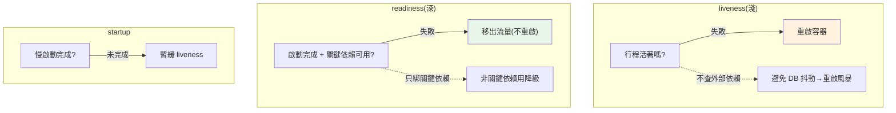

# 健康檢查與就緒/存活探針

> 「這個服務還活著嗎？準備好接流量了嗎？」——編排系統（K8s）、負載平衡器、服務發現，全都靠**健康檢查**來回答。答錯了，流量就導向壞掉的實例，或好實例被誤殺。這章講三種探針（liveness/readiness/startup）的語意分工與正確設計。

## Why（為什麼）

在動態的微服務環境，系統要不斷自動判斷每個服務實例的狀態，才能做對決策：

- **[K8s](../19-cloud-native/06-kubernetes.md)**：這個 Pod 死了嗎？要不要重啟？準備好了嗎？要不要導流量？
- **[負載平衡器 / 服務發現](04-service-discovery.md)**：這個實例健康嗎？要不要把它放進可用清單？
- **[gateway](05-api-gateway.md)**：這個後端能不能收請求？

這些決策全靠實例暴露的**健康檢查端點**（health check endpoint）。答錯的後果很嚴重：

- **把流量導向壞實例**：readiness 說「我好了」但其實 DB 斷了 → 使用者收到錯誤。
- **誤殺好實例**：liveness 檢查太嚴（把「DB 暫時慢」當「我死了」）→ K8s 重啟一個其實沒問題的 Pod，甚至引發重啟風暴。
- **啟動中就被判死**：慢啟動的服務還沒暖好，liveness 就失敗 → 永遠重啟、起不來。

正確設計健康檢查——**三種探針各司其職、深淺得宜**——是微服務可靠運行的基礎。這章接續 [K8s 探針](../19-cloud-native/06-kubernetes.md)，深入健康檢查的設計。

## Theory（理論：三種探針的分工）

**三種探針，語意與後果各不同**（K8s 的模型，但原理通用）：

- **liveness probe（存活探針）**：**「這個行程還活著、需要重啟嗎？」** 失敗 → **重啟容器**。用於偵測「卡死、無法自行恢復」的狀態（死鎖、事件迴圈卡住）。**應該淺（shallow）**——只檢查「行程本身還能回應」，**不檢查外部依賴**。
- **readiness probe（就緒探針）**：**「準備好接流量了嗎？」** 失敗 → **從負載平衡/Service 移出**（不導流量），**但不重啟**。用於「暫時無法服務」（啟動中、依賴暫時不可用、正在排空）。**可以深（deep）**——檢查關鍵依賴（DB、快取）是否可用。
- **startup probe（啟動探針）**：**「啟動完成了嗎？」** 給**慢啟動**的服務足夠時間，在它成功前**暫緩** liveness 檢查（避免啟動太久被誤判死亡重啟）。

**最關鍵的設計原則——liveness 淺、readiness 深**：

- **liveness 不該檢查外部依賴**。為什麼？如果 liveness 檢查 DB，而 DB 短暫斷線 → liveness 失敗 → K8s 重啟這個 Pod。但**重啟 Pod 救不了 DB**！於是所有 Pod 一個個因 DB 斷線被重啟——**重啟風暴**，讓情況更糟。DB 斷線時，正確的反應是「暫時別導流量進來（readiness 失敗），等 DB 回來」，而**不是**「把自己重啟」。
- **readiness 可以檢查依賴**，因為它的後果是「移出流量」（溫和、可逆），不是「重啟」。

這個「失敗後果不同 → 檢查深淺不同」的分工，是健康檢查最常考也最常配錯的點（見 [K8s Common Mistakes](../19-cloud-native/06-kubernetes.md)）。

## Specification（規範：健康端點設計）

**典型的健康端點**：

```text
GET /healthz  (liveness)  → 200 若行程活著（淺：不查依賴）
GET /readyz   (readiness) → 200 若可服務（深：查 DB/快取等關鍵依賴）
```

**回應**：健康回 `200`，不健康回非 2xx（如 `503`），body 可附各項檢查細節。

**K8s 配置**（見 [K8s](../19-cloud-native/06-kubernetes.md)）：

```yaml
livenessProbe:
  httpGet: { path: /healthz, port: 8000 }
  initialDelaySeconds: 5    # 啟動後多久開始檢查
  periodSeconds: 10         # 檢查頻率
  failureThreshold: 3       # 連續失敗幾次才判定失敗（避免偶發抖動）
readinessProbe:
  httpGet: { path: /readyz, port: 8000 }
  periodSeconds: 5
startupProbe:               # 慢啟動用
  httpGet: { path: /healthz, port: 8000 }
  failureThreshold: 30      # 給足啟動時間
```

**檢查什麼**：

- **liveness**：行程能回應即可（甚至只回 200）——證明沒卡死。
- **readiness**：關鍵依賴——DB 連得上、快取可用、必要的下游可達。**但別把「非關鍵依賴」也算進去**（見下）。

## Implementation（底層：依賴檢查的取捨與抖動）

**readiness 該檢查哪些依賴——關鍵 vs 非關鍵**：readiness 深檢查是為了「依賴壞了就別收流量」，但要小心**別把非關鍵依賴也綁進去**。如果你的服務有一個「非關鍵的推薦引擎」下游，把它也放進 readiness——那推薦引擎掛了，你的服務就整個被移出流量（即使核心功能還能用）。正確做法：readiness 只檢查「**沒有它就無法提供核心服務**」的依賴（如主資料庫），非關鍵依賴用**降級**處理（推薦掛了就不顯示推薦，而非整個服務不可用）。這是「依賴檢查範圍」的關鍵取捨。

**級聯健康失敗的陷阱**：如果 A 的 readiness 檢查「B 是否健康」、B 的 readiness 又檢查「C 是否健康」……那 C 一抖動，會沿鏈讓 A、B、C 全部 not ready——**健康檢查本身造成級聯失敗**。所以健康檢查應檢查「**直接的關鍵依賴**」，且盡量檢查「連得上」而非「遞迴健康」，避免把整條依賴鏈的健康綁在一起。

**failureThreshold / 抖動處理**：健康檢查偶爾失敗很正常（瞬間網路抖動、GC 暫停）。若「一次失敗就判死」，會因抖動誤殺健康實例。所以設 **failureThreshold**（連續失敗 N 次才判定），過濾偶發抖動——這是穩定性的重要細節。同理 readiness 也不該因單次抖動就把實例移出。

**探針要輕量**：探針會被**頻繁**呼叫（每幾秒一次 × 每個實例），所以健康端點本身要**快、輕**——別在裡面做重量級操作（複雜查詢、呼叫一堆下游），否則探針本身成了負擔，甚至因為慢而超時被判失敗。下面範例實作淺 liveness 與深 readiness（區分關鍵/非關鍵依賴）。

## Code Example（可執行的 Python 範例）

```python
# health_checks.py — liveness(淺) vs readiness(深, 區分關鍵依賴)（純標準庫，可執行）
from __future__ import annotations

from collections.abc import Callable
from dataclasses import dataclass, field


@dataclass
class HealthChecker:
    """健康檢查：liveness 淺(不查依賴)、readiness 深(查關鍵依賴)。"""

    started: bool = False
    # 關鍵依賴：沒有它就無法服務（進 readiness）
    critical_deps: dict[str, Callable[[], bool]] = field(default_factory=dict)

    def liveness(self) -> tuple[int, str]:
        """存活：只檢查行程本身能回應（不查外部依賴，避免重啟風暴）。"""
        return 200, "alive"

    def readiness(self) -> tuple[int, dict[str, object]]:
        """就緒：啟動完成 + 所有關鍵依賴可用，才適合接流量。"""
        if not self.started:
            return 503, {"ready": False, "reason": "starting"}
        checks = {name: check() for name, check in self.critical_deps.items()}
        ready = all(checks.values())
        return (200 if ready else 503), {"ready": ready, "checks": checks}


def main() -> None:
    db_ok = {"value": True}
    checker = HealthChecker(
        started=True,
        critical_deps={
            "database": lambda: db_ok["value"],  # 關鍵依賴
            "cache": lambda: True,
        },
    )

    # 正常：liveness 與 readiness 都 OK
    print(f"liveness: {checker.liveness()}")
    print(f"readiness(正常): {checker.readiness()}")

    # DB 斷線：readiness 失敗(移出流量)，但 liveness 仍 200(不重啟！)
    db_ok["value"] = False
    print(f"\nDB 斷線時:")
    print(f"  liveness:  {checker.liveness()}  ← 仍存活，不重啟(重啟救不了 DB)")
    print(f"  readiness: {checker.readiness()}  ← 移出流量，等 DB 回來")

    # 啟動中：readiness 未就緒
    starting = HealthChecker(started=False)
    print(f"\n啟動中 readiness: {starting.readiness()}")


if __name__ == "__main__":
    main()
```

**預期輸出**：

```pycon
$ python health_checks.py
liveness: (200, 'alive')
readiness(正常): (200, {'ready': True, 'checks': {'database': True, 'cache': True}})

DB 斷線時:
  liveness:  (200, 'alive')  ← 仍存活，不重啟(重啟救不了 DB)
  readiness: (503, {'ready': False, 'checks': {'database': False, 'cache': True}})  ← 移出流量，等 DB 回來
```

（啟動中 readiness 會印出 `(503, {'ready': False, 'reason': 'starting'})`。）

逐段解說：

- **`liveness`**：**淺**——只回「alive」，**不檢查任何外部依賴**。因為它失敗會導致重啟，而重啟只能救「行程卡死」，救不了外部依賴問題。
- **`readiness`**：**深**——檢查啟動完成 + 所有**關鍵依賴**（DB、快取）可用，全 OK 才回 200。
- **DB 斷線的關鍵對比**：`readiness` 變 503（移出流量、等 DB 回來），但 `liveness` 仍 200（**不重啟**）。這正是「liveness 淺、readiness 深」的價值——避免因 DB 斷線觸發重啟風暴。
- **啟動中**：`started=False` 時 readiness 回 503（未就緒）——K8s 不導流量進來，等它就緒。
- **要點**：liveness 淺（判「該不該重啟」，不查依賴）、readiness 深（判「該不該收流量」，查關鍵依賴），且 readiness 只綁關鍵依賴、非關鍵依賴用降級。

## Diagram（圖解：探針語意分工）



## Best Practice（最佳實踐）

- **liveness 淺、readiness 深**：liveness 只檢查行程活著、不查依賴；readiness 檢查關鍵依賴。
- **外部依賴（DB）放 readiness 不放 liveness**：避免依賴抖動觸發重啟風暴。
- **readiness 只綁「無它無法服務」的關鍵依賴**：非關鍵依賴用降級，別讓它拖垮整個服務。
- **慢啟動服務用 startup probe**：給足啟動時間再開始 liveness。
- **設 failureThreshold 過濾抖動**：連續失敗 N 次才判定，別因偶發抖動誤殺/誤移。
- **健康端點要輕量快速**：會被頻繁呼叫，別做重操作。
- **避免級聯健康檢查**：檢查直接依賴的「連得上」，別遞迴檢查整條鏈的健康。
- **健康端點回細節 body**：方便診斷是哪個依賴壞了。

## Common Mistakes（常見誤解）

- **liveness 檢查外部依賴**：DB 抖動 → 所有 Pod 被重啟（重啟救不了 DB）→ 重啟風暴。
- **readiness 綁非關鍵依賴**：一個不重要的下游掛了，整個服務被移出流量。
- **級聯健康檢查**：A 查 B 的健康、B 查 C……一個抖動全鏈 not ready。
- **一次失敗就判死**：偶發抖動誤殺健康實例；用 failureThreshold。
- **慢啟動不用 startup probe**：啟動太久被 liveness 判死、永遠重啟起不來。
- **健康端點做重操作**：頻繁呼叫下成為負擔，甚至因慢而超時判失敗。
- **liveness 與 readiness 用同一個深檢查**：混淆語意，失去分工的保護。
- **沒有健康檢查**：編排/負載平衡無從判斷，把流量導向壞實例。

## Interview Notes（面試重點）

- **能清楚區分三種探針**：liveness（重啟）、readiness（移出流量）、startup（暫緩 liveness），及各自失敗後果。
- **能解釋「liveness 淺、readiness 深」的原則與理由**：外部依賴放 readiness，避免依賴抖動觸發重啟風暴。
- **知道 readiness 只該綁關鍵依賴**，非關鍵依賴用降級。
- **知道級聯健康檢查的陷阱**與避免方式。
- **知道 failureThreshold 過濾抖動、健康端點要輕量**。
- **能連結到 K8s、服務發現、負載平衡** 如何使用健康檢查做決策。

---

➡️ 下一章：[限流與熔斷 (rate limit / circuit breaker)](07-rate-limit-circuit-breaker.md)

[⬆️ 回 Part 21 索引](README.md)
