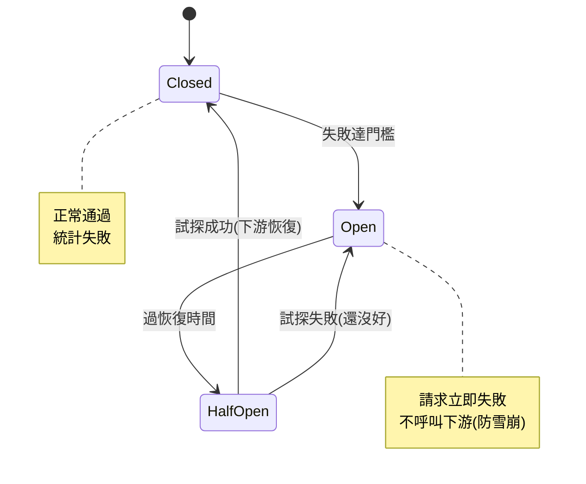

# 限流與熔斷 (rate limit / circuit breaker)

> 微服務環境裡，一個服務的故障會沿呼叫鏈**雪崩**——大家都卡在等那個掛掉的服務，執行緒耗盡，整個系統癱瘓。**熔斷器（circuit breaker）** 是防雪崩的關鍵：偵測到下游持續失敗，就「跳閘」快速失敗，不再送請求過去等死。這章講熔斷器與限流的協作防護。

## Why（為什麼）

微服務靠[網路呼叫](03-service-communication.md)互相依賴，而網路呼叫**會失敗、會變慢**。危險的是**級聯失敗（cascading failure）/ 雪崩**：

想像 訂單服務 同步呼叫 付款服務。某天付款服務變慢（負載高、GC、DB 慢）——每個呼叫要等 30 秒才逾時。於是訂單服務的執行緒一個個卡在「等付款服務」，很快**執行緒池耗盡**，訂單服務也無法處理任何請求（連不需要付款的也卡住）。接著呼叫訂單服務的 gateway 也卡住……**一個服務的慢/故障，沿呼叫鏈把整個系統拖垮**。這是分散式系統最可怕的故障模式。

**熔斷器（circuit breaker）** 是解法，靈感來自電路的斷路器：當偵測到某個下游**持續失敗**，熔斷器「**跳閘（open）**」——之後對該下游的呼叫**立即失敗（fast fail）**，不再真的送請求過去等逾時。這樣：呼叫方不再把執行緒浪費在等一個已知會失敗的下游、給下游喘息恢復的機會、故障被**隔離**而非蔓延。過一陣子熔斷器會**試探**下游是否恢復，好了就恢復正常。

**限流（rate limiter，見 [限流器](../20-security-system-design/11-system-design-rate-limiter.md)）** 是另一道防護——控制「送給下游的請求速率」，保護下游不被壓垮。兩者常搭配：限流控制**輸入速率**、熔斷處理**下游故障**。這章聚焦熔斷器（限流已在 Part 20 詳述）。

## Theory（理論：熔斷器的三態）

熔斷器是一個**狀態機**，有三個狀態：

- **Closed（關閉，正常）**：請求**正常通過**到下游。同時**統計失敗**——若失敗次數/比率超過門檻，跳到 Open。
- **Open（開啟，跳閘）**：請求**立即失敗**（不送到下游）——這就是「快速失敗」，避免浪費資源等一個已知會失敗的下游。維持一段**恢復時間（recovery timeout）** 後，跳到 Half-Open。
- **Half-Open（半開，試探）**：**放行少量試探請求**到下游。若成功 → 下游恢復了 → 回到 Closed（正常）；若失敗 → 還沒好 → 回到 Open（繼續跳閘、重新計時）。

狀態轉換：

```text
Closed --(失敗達門檻)--> Open --(過恢復時間)--> Half-Open --(試探成功)--> Closed
                                                  Half-Open --(試探失敗)--> Open
```

**為何要 Half-Open**：Open 一段時間後，下游**可能**恢復了，但你不能貿然把全部流量倒回去（萬一還沒好，又立刻打垮它）。Half-Open 用**少量試探**安全地探測——好了才逐步恢復，沒好就繼續跳閘。這是熔斷器優雅恢復的關鍵。

## Specification（規範：熔斷器參數與搭配）

**核心參數**：

- **失敗門檻（failure threshold）**：連續失敗幾次（或失敗率超過多少）就跳閘 Open。
- **恢復時間（recovery timeout）**：Open 維持多久後進 Half-Open 試探。
- **試探請求數**：Half-Open 放行幾個試探。

**搭配的韌性模式**（微服務的防護組合）：

- **逾時（timeout）**：呼叫下游設逾時，別無限等——這是熔斷器能運作的前提（要先能判定「失敗」）。
- **重試（retry）+ 指數退避 + 抖動**：暫時性失敗重試，但配退避避免重試風暴，且要求下游[冪等](../22-distributed-systems/06-idempotency.md)。
- **熔斷（circuit breaker）**：持續失敗時跳閘快速失敗。
- **艙壁隔離（bulkhead）**：把不同下游的呼叫用獨立的執行緒池/連線池隔開——一個下游耗盡它的池，不影響對其他下游的呼叫。
- **降級（fallback）**：熔斷/失敗時提供退路（回快取的舊資料、預設值、友善錯誤）而非硬失敗。

**Python 實務**：用 `pybreaker`、`tenacity`（重試）等函式庫，或服務網格（Istio/Envoy）在基礎設施層做熔斷。

## Implementation（底層：快速失敗如何防雪崩）

**熔斷器「快速失敗」為何能防雪崩**：回到訂單→付款的例子。**沒有熔斷器**時，付款服務慢，訂單服務的每個呼叫都要等 30 秒逾時——執行緒被卡住 30 秒、快速累積、耗盡執行緒池、訂單服務癱瘓。**有熔斷器**時，付款服務連續失敗達門檻後，熔斷器跳到 Open——之後訂單服務對付款的呼叫**立即失敗（毫秒級）**，執行緒**不被卡住**，訂單服務仍能處理其他請求（如查詢），只是「付款」這個功能暫時降級。**故障被限縮在「付款功能」，而非蔓延成「整個訂單服務癱瘓」**。同時付款服務不再被持續轟炸，有機會恢復。這就是熔斷器隔離故障、防止雪崩的核心機制。

**恢復時間與 Half-Open 的平衡**：恢復時間太短，會在下游還沒好時就頻繁試探、干擾它恢復；太長，則下游早好了還一直快速失敗、影響可用性。Half-Open 用少量試探請求安全探測——這是「儘快恢復」與「別太早壓垮剛恢復的下游」之間的平衡。

**熔斷器 vs 限流的分工**：

- **限流（rate limiter）** 保護**下游**——控制「我送給下游的速率」，別把它壓垮（也用於防濫用，見 [限流器](../20-security-system-design/11-system-design-rate-limiter.md)）。它看的是「速率」。
- **熔斷器（circuit breaker）** 保護**自己（呼叫方）**——當下游明顯掛了，別再浪費資源等它。它看的是「下游的失敗狀況」。
- 兩者互補：限流讓你不壓垮健康的下游，熔斷讓你不被掛掉的下游拖垮。完整的韌性還要加逾時、重試、艙壁、降級。

下面實作熔斷器的三態狀態機。

## Code Example（可執行的 Python 範例）

```python
# circuit_breaker.py — 熔斷器三態狀態機（純標準庫，用可注入時鐘）
from __future__ import annotations

from collections.abc import Callable
from typing import TypeVar

T = TypeVar("T")


class CircuitOpenError(RuntimeError):
    """熔斷開啟，快速失敗（不呼叫下游）。"""


class CircuitBreaker:
    """三態熔斷器：closed(正常) → open(跳閘) → half-open(試探) → closed。"""

    def __init__(self, fail_threshold: int = 3, recovery_time: float = 5.0) -> None:
        self.fail_threshold = fail_threshold
        self.recovery_time = recovery_time
        self.state = "closed"
        self.failures = 0
        self.opened_at = 0.0

    def call(self, func: Callable[[], T], now: float) -> T:
        if self.state == "open":
            if now - self.opened_at >= self.recovery_time:
                self.state = "half-open"  # 過恢復期 → 試探
            else:
                raise CircuitOpenError("熔斷開啟，快速失敗")
        try:
            result = func()
        except Exception:
            self.failures += 1
            # half-open 試探失敗、或 closed 累積失敗達門檻 → 跳閘
            if self.state == "half-open" or self.failures >= self.fail_threshold:
                self.state = "open"
                self.opened_at = now
            raise
        # 成功：half-open 試探成功 → 恢復；重置失敗計數
        if self.state == "half-open":
            self.state = "closed"
        self.failures = 0
        return result


def main() -> None:
    def failing() -> str:
        raise ConnectionError("下游掛了")

    def working() -> str:
        return "ok"

    cb = CircuitBreaker(fail_threshold=3, recovery_time=5.0)

    # 連續失敗達門檻 → 跳閘 open
    for _ in range(3):
        try:
            cb.call(failing, now=0.0)
        except ConnectionError:
            pass
    print(f"連續 3 次失敗後: state={cb.state}")

    # open 期間：立即快速失敗（不呼叫下游，保護自己）
    try:
        cb.call(working, now=1.0)
    except CircuitOpenError as exc:
        print(f"open 期間: {exc}（下游即使好了也不試，直到恢復期）")

    # 過恢復時間 → half-open 試探 → 成功 → 回 closed
    result = cb.call(working, now=6.0)
    print(f"過恢復期試探: 結果={result}, state={cb.state}（下游恢復，回正常）")


if __name__ == "__main__":
    main()
```

**預期輸出**：

```pycon
$ python circuit_breaker.py
連續 3 次失敗後: state=open
open 期間: 熔斷開啟，快速失敗（下游即使好了也不試，直到恢復期）
過恢復期試探: 結果=ok, state=closed（下游恢復，回正常）
```

逐段解說：

- **Closed → Open**：連續 3 次失敗達門檻，熔斷器跳閘到 `open`——判定下游掛了。
- **Open 快速失敗**：`open` 期間呼叫立即拋 `CircuitOpenError`（**不真的呼叫下游**）——保護呼叫方不把資源浪費在等一個已知故障的下游。這就是防雪崩的關鍵：呼叫方的執行緒不被卡住。
- **Open → Half-Open → Closed**：過了恢復時間（`now=6.0` ≥ 5），下一個呼叫進入 half-open **試探**，這次成功 → 判定下游恢復 → 回 `closed` 正常。
- **要點**：熔斷器用三態狀態機，在下游持續失敗時快速失敗（隔離故障、防雪崩），並用 half-open 安全地探測恢復。搭配逾時、重試、艙壁、降級構成完整韌性。真實用 pybreaker 或服務網格。

## Diagram（圖解：熔斷器狀態機）



## Best Practice（最佳實踐）

- **對每個下游依賴加熔斷器**：持續失敗時快速失敗，隔離故障防雪崩。
- **一定設逾時**：熔斷器要能判定失敗；無逾時的呼叫會卡死。
- **重試配指數退避 + 抖動 + 冪等**：暫時性失敗才重試，避免重試風暴。
- **用艙壁隔離不同下游**：獨立執行緒/連線池，一個下游耗盡不影響其他。
- **提供降級（fallback）**：熔斷/失敗時回快取舊值/預設值，而非硬失敗。
- **限流保護下游、熔斷保護自己**：兩者搭配（見 [限流器](../20-security-system-design/11-system-design-rate-limiter.md)）。
- **監控熔斷器狀態**：跳閘是重要告警訊號（見 [可觀測性](../19-cloud-native/08-observability.md)）。
- **用成熟方案**（pybreaker/tenacity/服務網格），別自己造不完整的。

## Common Mistakes（常見誤解）

- **同步呼叫無熔斷無逾時**：下游慢 → 執行緒卡死耗盡 → 級聯雪崩。
- **無逾時就想熔斷**：判定不了失敗，熔斷器形同虛設。
- **重試無退避**：對已過載的下游狂重試，加劇故障（重試風暴）。
- **重試非冪等操作**：重複扣款/重複下單。
- **沒有降級**：熔斷後硬失敗，使用者體驗差；應有退路。
- **所有下游共用執行緒池**：一個下游耗盡池拖垮對其他下游的呼叫；用艙壁。
- **恢復時間設太短/太長**：太短干擾下游恢復、太長影響可用性。
- **不監控熔斷狀態**：跳閘了沒人知道，錯過故障訊號。

## Interview Notes（面試重點）

- **能解釋級聯失敗/雪崩**，以及熔斷器如何用「快速失敗」隔離故障、防止蔓延。
- **能畫熔斷器三態狀態機**（closed/open/half-open）與轉換條件，並說明 half-open 的作用。
- **能區分限流與熔斷**：限流保護下游（控速率）、熔斷保護自己（下游故障時快速失敗）。
- **知道完整韌性組合**：逾時 + 重試(退避+冪等) + 熔斷 + 艙壁 + 降級。
- **知道熔斷器需逾時配合、重試需退避與冪等**。
- **知道用 pybreaker/服務網格實作、監控熔斷狀態**。

---

➡️ 下一章：[分散式設定與服務治理](08-service-governance.md)

[⬆️ 回 Part 21 索引](README.md)
