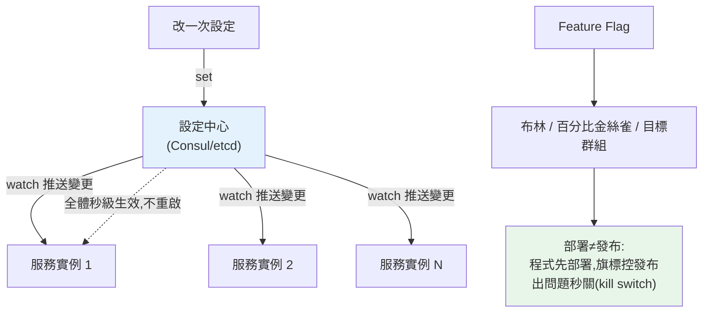

# 分散式設定與服務治理

> 20 個服務、每個跑 5 個實例——共 100 個行程。要改一個設定（如打開某功能、調整限流閾值），難道要逐一重新部署？**分散式設定管理**讓設定集中、可動態更新、不必重啟。而**服務治理**是這些跨服務管理能力的總稱。這章講集中式設定、feature flag 與服務治理的全貌。

## 💡 白話導讀（建議先讀）

連鎖集團 100 家分店要改一條規定（調整限流閾值、打開新功能）,
總不能**逐店重新裝潢**（逐服務改設定、重新部署）。
成熟的做法是**總部公告系統**——**設定中心（config center）**:

- **單一真實來源**:規定只存總部一份,所有分店從同一處讀——不會有兩家店規定不同版。
- **動態生效**:分店**訂閱**公告,總部一發布,全體**即時套用、不必重啟**——
  這是對[環境變數](../16-architecture/11-config-management.md)的關鍵升級
  (環境變數改了要重啟行程)。
- **有版本、可回滾、留紀錄**:誰改的、改了什麼、改壞了一鍵退回——「治理」的意思。

設定中心之上,最有生產力的應用是 **feature flag（功能旗標）**:
新功能藏在開關後面,**部署（deploy）與發布（release）從此分家**——
程式碼先上線但開關關著;之後先對 5% 使用者打開（金絲雀）、
觀察[監控指標](../19-cloud-native/08-observability.md)沒異常再全開;
出事不用回滾部署,**關開關**就是秒級回滾。

這章講設定中心的選型(Consul/etcd/雲端方案)、Python 端的訂閱與熱更新實作、
feature flag 的落地模式(百分比放量、按使用者分群)與技術債提醒
(旗標是借來的,功能穩定後要還——刪旗標)。

## Why（為什麼）

單一服務的[設定管理](../16-architecture/11-config-management.md)（環境變數、pydantic-settings）在微服務規模下遇到新挑戰：

- **設定散落各處**：100 個實例各自從環境變數讀設定，要改一個共通值（如「所有服務的日誌等級調成 DEBUG」）得改每個部署、全部重啟。
- **無法動態調整**：想臨時打開一個功能、調整限流閾值、切換降級開關——傳統設定要重新部署才生效，太慢（線上救火時要秒級生效）。
- **設定不一致**：不同實例讀到不同版本的設定，行為不一致、難除錯。
- **缺乏治理**：誰改了什麼設定、何時改的、能不能回滾——沒有集中管理就一團亂。

**分散式設定管理**解法：把設定**集中**在一個**設定中心**（Consul、etcd、Spring Cloud Config、K8s ConfigMap），服務啟動時拉取、且能**動態監聽變更**（設定改了，服務不重啟就套用新值）。

這屬於更大的**服務治理（service governance）** 範疇——管理眾多服務的橫切能力：設定管理、[服務發現](04-service-discovery.md)、[限流熔斷](07-rate-limit-circuit-breaker.md)、[可觀測性](../19-cloud-native/08-observability.md)、流量管理、安全策略。這章聚焦設定管理與 feature flag，並綜覽服務治理。

## Theory（理論：集中設定與動態更新）

**集中式設定管理**的核心：

- **單一真實來源（single source of truth）**：設定存在設定中心，所有服務從同一處讀——保證一致。
- **動態更新（dynamic reload / hot reload）**：服務**監聽**設定中心的變更，設定改了就**推送/拉取**新值並套用，**不必重啟**。這是相對傳統環境變數（改了要重啟）的關鍵進步。
- **分層與環境隔離**：全域設定、服務專屬設定、環境（dev/staging/prod）設定分層管理。
- **版本與稽核**：設定有版本、可回滾、記錄誰改了什麼（治理）。

**Feature Flag（功能旗標）** 是動態設定的重要應用——用一個開關控制功能的啟用：

```python
if feature_flags.is_enabled("new_checkout_flow", user):
    new_checkout()
else:
    old_checkout()
```

好處：**功能與部署解耦**（程式碼部署了但功能可先關著，隨時打開）、**漸進發布（canary）**（先對 1% 使用者開）、**A/B 測試**、**緊急關閉（kill switch）**（出問題秒關某功能，不必回滾部署）。這是現代持續交付的重要實踐。

**服務治理的其他面向**：流量管理（金絲雀、藍綠、流量鏡像）、策略執行（安全、限流、逾時的統一策略）、服務網格（Istio/Linkerd 在基礎設施層做治理）。

## Specification（規範：設定中心與 feature flag）

**集中設定的操作**：

```text
get(key)                     # 讀設定
set(key, value)              # 更新設定（觸發推送給訂閱者）
watch(key, callback)         # 監聽變更，變了就回呼（動態更新）
```

**設定的分層解析**（優先序，高覆蓋低）：

```text
環境專屬設定 > 服務專屬設定 > 全域預設
prod 的 rate_limit > 通用 rate_limit
```

**Feature flag 的進階形式**：

- **布林開關**：`enabled: true/false`。
- **百分比發布**：對 X% 的使用者啟用（金絲雀）。
- **目標群組**：對特定使用者/地區/版本啟用。

**常見工具**：Consul/etcd（設定中心 + watch）、K8s ConfigMap（配合重載）、Spring Cloud Config、LaunchDarkly/Unleash（feature flag 平台）。

**注意**：動態設定雖強大，但**不是所有設定都該動態化**——密鑰用[密鑰管理](../20-security-system-design/05-secrets-management.md)、關乎正確性的設定要謹慎（動態改錯會即時影響全體）。動態設定變更也該有**驗證、灰度、稽核、回滾**。

## Implementation（底層：watch 機制與 feature flag 評估）

**動態更新（watch）如何運作**：設定中心（如 etcd/Consul）支援**watch（監聽）** 機制——服務向設定中心註冊「我關心 key X 的變化」，當有人 `set` 改了 X，設定中心**主動通知**所有監聽者（推送），或監聽者用長輪詢感知變化。服務收到通知後，把新值套用到記憶體中的設定物件——**不必重啟行程**。這讓「改一個設定 → 全體實例秒級生效」成為可能，是線上調參、緊急開關的基礎。相比之下，環境變數是啟動時讀一次、之後不變，改了必須重啟。

**為何 feature flag 讓「部署」與「發布」解耦**：傳統上，「部署程式碼」= 「功能上線」——一旦部署，新功能就對所有人生效，出問題只能回滾整個部署（慢、影響其他一起部署的改動）。feature flag 把兩者拆開：**部署**時新功能程式碼進去了，但**旗標關著**（沒人看得到）；之後**獨立地**透過旗標**發布**——先對 1% 開（觀察）、逐步放大、有問題就**秒關旗標**（kill switch，不必回滾部署）。這大幅降低發布風險，是持續交付的關鍵能力。

**feature flag 評估邏輯**：一個旗標的「是否啟用」可以是簡單布林，也可以依**使用者屬性**動態評估——如「對 user_id % 100 < 10 的使用者啟用」（10% 金絲雀）。評估要**確定性**（同一使用者每次得到同樣結果，體驗一致）且**快**（每個請求可能評估多個旗標）。下面範例實作集中設定（含動態更新）與百分比 feature flag。

## Code Example（可執行的 Python 範例）

```python
# service_governance.py — 集中設定(動態更新) + feature flag（純標準庫，可執行）
from __future__ import annotations

from collections.abc import Callable
from dataclasses import dataclass, field


class ConfigCenter:
    """集中設定中心：get/set/watch，支援動態更新(不重啟)。"""

    def __init__(self) -> None:
        self._config: dict[str, object] = {}
        self._watchers: dict[str, list[Callable[[object], None]]] = {}

    def set(self, key: str, value: object) -> None:
        self._config[key] = value
        # 通知所有監聽者（動態更新，服務不必重啟）
        for callback in self._watchers.get(key, []):
            callback(value)

    def get(self, key: str, default: object = None) -> object:
        return self._config.get(key, default)

    def watch(self, key: str, callback: Callable[[object], None]) -> None:
        self._watchers.setdefault(key, []).append(callback)


@dataclass
class FeatureFlags:
    """功能旗標：布林開關 + 百分比金絲雀發布。"""

    _flags: dict[str, int] = field(default_factory=dict)  # flag → 啟用百分比

    def set_rollout(self, flag: str, percent: int) -> None:
        self._flags[flag] = percent

    def is_enabled(self, flag: str, user_id: int) -> bool:
        """依 user_id 確定性評估（同使用者結果一致）。"""
        percent = self._flags.get(flag, 0)
        return (user_id % 100) < percent


def main() -> None:
    # 集中設定 + 動態更新
    config = ConfigCenter()
    config.set("rate_limit", 100)
    applied = {"rate_limit": config.get("rate_limit")}

    # 服務監聽變更：設定改了自動套用（不重啟）
    config.watch("rate_limit", lambda v: applied.update(rate_limit=v))
    print(f"初始 rate_limit: {applied['rate_limit']}")
    config.set("rate_limit", 50)  # 線上調參
    print(f"動態更新後 rate_limit: {applied['rate_limit']}（服務未重啟）")

    # Feature flag：金絲雀發布（對 10% 使用者開新結帳流程）
    flags = FeatureFlags()
    flags.set_rollout("new_checkout", percent=10)
    enabled_users = [uid for uid in range(100) if flags.is_enabled("new_checkout", uid)]
    print(f"\n新結帳流程對 {len(enabled_users)} / 100 使用者啟用（10% 金絲雀）")

    # kill switch：出問題秒關（不必回滾部署）
    flags.set_rollout("new_checkout", percent=0)
    print(f"緊急關閉後啟用人數: {sum(flags.is_enabled('new_checkout', u) for u in range(100))}")


if __name__ == "__main__":
    main()
```

**預期輸出**：

```pycon
$ python service_governance.py
初始 rate_limit: 100
動態更新後 rate_limit: 50（服務未重啟）
新結帳流程對 10 / 100 使用者啟用（10% 金絲雀）
緊急關閉後啟用人數: 0
```

逐段解說：

- **`ConfigCenter`**：集中設定 + `watch` 監聽。`set` 時通知所有監聽者——服務的設定**動態更新、不必重啟**。
- **動態更新**：`rate_limit` 從 100 改成 50，監聽的服務**立即套用**（`applied` 更新），行程沒重啟。這就是線上調參的能力——救火時秒級生效。
- **Feature flag 金絲雀**：`new_checkout` 對 10% 使用者啟用——`user_id % 100 < 10` 確定性評估（同使用者每次一致），100 人中 10 人啟用。這是漸進發布，先小範圍驗證。
- **kill switch**：發現問題，把百分比設 0——**秒關功能，不必回滾部署**。這是 feature flag 讓部署與發布解耦的價值。
- **要點**：集中設定 + 動態更新讓跨服務調參不必逐一重啟；feature flag 讓功能發布與程式部署解耦、支援金絲雀與緊急關閉。這些是服務治理的核心能力。

## Diagram（圖解：集中設定與 feature flag）



## Best Practice（最佳實踐）

- **設定集中管理（設定中心）**：單一真實來源，跨服務一致。
- **支援動態更新**：常調的參數（限流閾值、日誌等級、開關）改了不必重啟。
- **用 feature flag 解耦部署與發布**：程式先部署、旗標控發布，支援金絲雀與 kill switch。
- **feature flag 評估要確定性 + 快**：同使用者體驗一致、不拖慢請求。
- **設定分層 + 環境隔離**：全域/服務/環境分層，優先序清楚。
- **設定變更要驗證、灰度、稽核、可回滾**：動態改錯會即時影響全體。
- **密鑰用專門的[密鑰管理](../20-security-system-design/05-secrets-management.md)**，別和一般設定混。
- **考慮服務網格（Istio/Linkerd）** 做基礎設施層的治理（流量、安全、可觀測性）。

## Common Mistakes（常見誤解）

- **設定散落各服務、改一個要全部重新部署**：慢、易不一致。
- **所有設定都動態化**：關乎正確性的設定動態改錯會即時全體出事；謹慎。
- **feature flag 評估不確定**：同使用者一下有一下沒有，體驗混亂。
- **部署即發布、無 feature flag**：新功能一部署就全量、出問題只能回滾整個部署。
- **動態設定變更無稽核/回滾**：改壞了不知誰改的、無法快速還原。
- **密鑰塞進一般設定中心明文存**：資安風險；用密鑰管理。
- **feature flag 用完不清理**：旗標越積越多，程式碼一堆 if 分支，技術債。
- **設定變更不灰度直接全量**：改壞即時影響所有使用者。

## Interview Notes（面試重點）

- **能說明分散式設定管理解決什麼**：集中、一致、動態更新（不重啟）、版本稽核。
- **能解釋動態更新（watch）機制**與它相對環境變數的優勢。
- **能講 feature flag 如何解耦部署與發布**：金絲雀、A/B、kill switch，降低發布風險。
- **知道 feature flag 評估要確定性**（同使用者一致）與百分比發布邏輯。
- **知道服務治理的範疇**：設定、發現、限流熔斷、可觀測性、流量管理、服務網格。
- **知道動態設定的風險**（改錯即時影響全體）與防護（驗證/灰度/稽核/回滾），密鑰要分開管。

---

⬅️ 這是 Part 21 的最後一章。


➡️ 下一章：[Part 21 統整：微服務全貌](09-summary.md)

[⬆️ 回 Part 21 索引](README.md)
