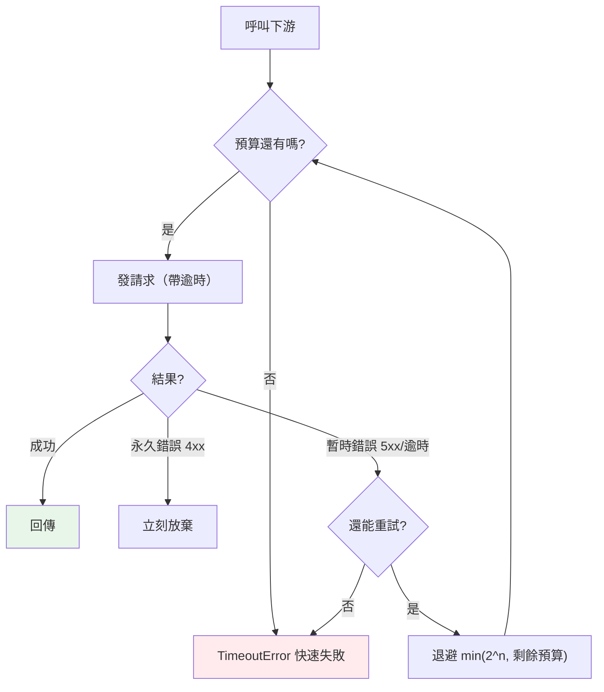

# 作為可靠的 HTTP 客戶端:逾時、重試與消費端熔斷

> 這本書到目前為止,幾乎都在教你「當 server」——收請求、驗證、回應。但資深後端有一半時間在「當 client」:可靠地呼叫第三方金流、簡訊、內部服務。而「呼叫別人」比你想的脆弱得多——這章教你把它做對。

## 💡 白話導讀（建議先讀）

前面 [07-rate-limit-circuit-breaker](07-rate-limit-circuit-breaker.md) 把限流、熔斷當「模式」講。
這章換一個**視角**:你不是被呼叫的那方,而是**主動去呼叫別人**的那方——也就是**HTTP 客戶端**。

先講為什麼這事很難。當你寫 `requests.get("https://api.金流商.com/charge")`,你其實把命運交給了
一個**你控制不了的網路和一台你控制不了的伺服器**。它可能:很慢(但沒斷)、突然斷線、回你 503、
或是收了你的請求但回應在半路弄丟了。**只要一個環節不可靠,你的服務就跟著不可靠**——
使用者點一次付款,卡在那裡轉圈 30 秒,最後還失敗。

要把「呼叫別人」做可靠,有幾個核心武器:

**1. 逾時(timeout)——最重要、最常被忘記的一個。** 預設情況下,很多 HTTP 客戶端**會無限等待**。
對方掛了不回應,你的請求就**永遠卡在那**,佔著一條連線、一個 [fd](../00-backend-foundations/07-file-descriptor-io.md)、
一個 worker。一堆請求都這樣卡著,你的服務就被拖垮了——這叫**連鎖故障**。所以:**每一個對外呼叫都必須設逾時**。

**2. 逾時預算(timeout budget)——比單次逾時更進階。** 假設使用者能忍受的總等待是 3 秒,
而你要重試 3 次。如果每次都設 3 秒逾時,重試三次就是 9 秒——早就超過使用者的耐心了。
正確做法是給整趟呼叫一個**總預算**(3 秒),每次重試從裡面扣時間,**用完就放棄**。
這樣不管重試幾次,總時間都在控制內。

**3. 重試 + 退避 + 抖動。** 對方暫時抽風(503、逾時)時,重試是合理的——但要聰明地重試:
- 只重試**暫時性**錯誤(503、逾時、連線重置)。**永久性**錯誤(400 參數錯、401 沒授權、404 不存在)
  重試一百次也一樣,要**立刻放棄**。
- 重試間隔要**指數退避 + 抖動**(和 [Part 14 Celery](../14-web/22-celery.md) 同一個道理),
  別立刻連環重試把已經很累的對方打得更慘。

**4. 消費端熔斷(circuit breaker)。** 如果某個下游已經連續失敗很多次,顯然它掛了——
這時繼續打它只是浪費時間、拖慢自己。熔斷器會**暫時「跳開」**,一段時間內直接快速失敗、不再打它,
給它喘息、也讓你自己快速回應(接 [ch07](07-rate-limit-circuit-breaker.md) 的熔斷,但這裡是**你當消費端**用它)。

用生活比喻:你打電話叫外送,對方一直忙線。你不會**握著話筒無限等**(逾時),
也不會**掛掉立刻重撥、每秒一次**(退避),更不會在**心裡覺得這家店今天大概沒開**之後還一直打(熔斷)。
你會等一下再打、打幾次沒用就改叫別家——**可靠的客戶端就是把這套常識寫進程式**。

這章的可執行範例,會把「逾時預算 + 只重試暫時錯誤 + 退避」這套核心邏輯做成可測的程式;
真實環境用 `httpx` 時,把「呼叫」換成一次 HTTP 請求即可。

## 🎯 什麼時候會用到

- **串接任何第三方 API**:金流、簡訊、推播、地圖、寄信、AI 服務——只要是「打別人的 HTTP」,這章全用得上。
- **微服務之間互相呼叫**:服務 A 呼叫服務 B,B 慢 / 掛時 A 不能跟著卡死。
- **任何「等外部」的地方**:爬資料、抓匯率、拉設定——設逾時、會重試、能熔斷。
- **寫第三方 SDK / wrapper 時**:把逾時、重試、錯誤分類封裝好,讓上層只管業務(見 [下一章](10-client-idempotency-cancellation.md))。

## Why（為什麼「呼叫別人」要這麼講究）

因為**你的可靠性 = 你自己的程式 × 你依賴的每個下游的可靠性**,而下游你控制不了,只能防禦。

- **沒逾時 = 一個慢下游拖垮整個服務**。請求無限卡住,佔滿連線與 worker,新請求無法處理——**連鎖故障**。
- **重試不分類 = 放大災難**。對永久錯誤(400/401)重試是浪費;對已經過載的下游猛重試是**重試風暴**,
  把它從「慢」打成「死」。
- **沒有總預算 = 使用者等到天荒地老**。單次逾時 × 重試次數會累加,不設總上限,尾端延遲(p99)爆炸。
- **沒熔斷 = 明知它掛了還一直打**。浪費你的資源與時間,也不給下游恢復的空間。

## Theory（理論：可靠客戶端的四層防禦）

```text
        ┌─────────────────────────────────────────┐
        │  ① 逾時（每次呼叫）+ ② 總預算（整趟）      │
        │  ③ 重試：只重試暫時錯誤 + 退避 + 抖動       │
        │  ④ 熔斷：連續失敗就跳開，快速失敗            │
        └─────────────────────────────────────────┘
              每一層都在回答同一句話：
        「下游不可靠時，別讓它把我也拖下水。」
```

**錯誤要分類**——這是重試決策的根本:

| 類別 | 例子 | 該重試嗎 |
|------|------|---------|
| 暫時性(transient) | 逾時、連線重置、503、429 | ✅ 重試(退避) |
| 永久性(permanent) | 400、401、403、404、422 | ❌ 立刻放棄 |
| 不確定(ambiguous) | 送出後逾時,不知對方收到沒 | ⚠️ 只有**冪等**操作能安全重試(見下一章) |

## Specification（規範：httpx 的關鍵設定）

實務上用 `httpx`(async 友善、現代)或 `requests`。關鍵設定:

```python
import httpx

# 逾時：connect / read / write / pool 可分開設
timeout = httpx.Timeout(5.0, connect=2.0)     # 總 5s、連線 2s

# 連線池：復用連線，避免每次重建（呼應連線池概念）
limits = httpx.Limits(max_connections=100, max_keepalive_connections=20)

client = httpx.Client(timeout=timeout, limits=limits)
# 用同一個 client 打多次（別每次 new 一個）
```

| 設定 | 意義 |
|------|------|
| `timeout` | **必設**;不設會無限等待 |
| `limits`(連線池) | 復用連線,控制最大併發連線數 |
| 重試 | httpx 本身不內建重試,用 `tenacity` 或自寫(如本章範例) |
| `Client` 復用 | 建一個長命 client 復用連線,別每次請求都新建 |

## Implementation（實作：核心是「預算 + 分類 + 退避」)

真實環境的重試靠 `tenacity` 或自寫迴圈。這裡把最核心、最該理解的邏輯——**逾時預算 + 錯誤分類 + 退避**
——抽成純函式(時鐘與 sleep 注入,可測),讓你看懂機制,再對應到 httpx。

## Code Example（可執行的 Python 範例）

```python
# reliable_client.py —— 可靠客戶端核心：逾時預算 + 只重試暫時錯誤 + 退避
from __future__ import annotations

from collections.abc import Callable


class TransientError(Exception):
    """暫時性失敗（逾時、503、連線重置）——值得重試。"""


class PermanentError(Exception):
    """永久性失敗（400、401、404）——重試也沒用，立刻放棄。"""


class TimeoutBudget:
    """整趟呼叫的總時間預算，跨重試共享（deadline propagation）。"""

    def __init__(self, total: float, clock: Callable[[], float]) -> None:
        self._deadline = clock() + total
        self._clock = clock

    def remaining(self) -> float:
        return self._deadline - self._clock()

    def expired(self) -> bool:
        return self.remaining() <= 0


def retry_call(
    fn: Callable[[], str],
    *,
    max_attempts: int,
    budget: TimeoutBudget,
    backoff: Callable[[int], float],
    sleep: Callable[[float], None],
) -> str:
    """重試 fn：只重試 TransientError，尊重預算，退避不超過剩餘時間。"""
    last: Exception | None = None
    for attempt in range(max_attempts):
        if budget.expired():
            raise TimeoutError("逾時預算用盡")
        try:
            return fn()
        except PermanentError:
            raise  # 永久錯誤不重試
        except TransientError as e:
            last = e
            if attempt + 1 < max_attempts:
                sleep(min(backoff(attempt), max(budget.remaining(), 0)))
    raise TimeoutError("重試用盡") from last


if __name__ == "__main__":
    now = {"t": 0.0}

    def clock() -> float:
        return now["t"]

    def sleep(seconds: float) -> None:
        now["t"] += seconds

    calls = {"n": 0}

    def flaky() -> str:
        calls["n"] += 1
        if calls["n"] < 3:
            raise TransientError("下游暫時 503")
        return "ok"

    budget = TimeoutBudget(total=10.0, clock=clock)
    result = retry_call(
        flaky, max_attempts=5, budget=budget, backoff=lambda a: 2.0**a, sleep=sleep
    )
    print("結果:", result)
    print("嘗試次數:", calls["n"], "耗用時間:", now["t"])
```

**預期輸出**：

```pycon
$ python reliable_client.py
結果: ok
嘗試次數: 3 耗用時間: 3.0
```

**逐段解說**:

- `TransientError` / `PermanentError`:**錯誤分類是重試決策的根本**。`retry_call` 對 `PermanentError`
  直接 `raise`(不重試)、對 `TransientError` 才退避重試。真實環境:把 HTTP 5xx/逾時 對映成前者、
  4xx 對映成後者。
- `TimeoutBudget` 用**注入的時鐘**算剩餘時間——這讓「總預算跨重試遞減」變得可測,也對應真實的
  deadline propagation(把「還剩多少時間」一路傳給下游)。
- `flaky` 前兩次拋暫時錯誤、第三次成功。退避 `2**attempt` = 第一次等 1 秒、第二次 2 秒,
  共 3 秒(< 10 秒預算),所以成功;若預算只有 2 秒,第三輪開始前 `budget.expired()` 就會擲 `TimeoutError`。
- 換成 httpx:把 `fn` 換成「一次 `client.get(...)`,依狀態碼 raise Transient/Permanent」即可,
  重試骨架完全不變。

**對應到 httpx**(示意):

```python
import httpx

client = httpx.Client(timeout=httpx.Timeout(5.0, connect=2.0))


def call_charge() -> str:
    try:
        resp = client.post("https://api.example.com/charge", json={"amount": 100})
    except (httpx.TimeoutException, httpx.ConnectError) as e:
        raise TransientError(str(e)) from e   # 網路層問題 → 可重試
    if resp.status_code >= 500 or resp.status_code == 429:
        raise TransientError(f"下游 {resp.status_code}")   # 5xx/限流 → 可重試
    if resp.status_code >= 400:
        raise PermanentError(f"請求錯誤 {resp.status_code}")  # 4xx → 別重試
    return resp.text
```

## Diagram（圖解：一次可靠呼叫的決策）



## Best Practice（最佳實踐）

- **每一個對外呼叫都設逾時**,沒有例外。這是防連鎖故障的第一道也是最重要的一道防線。
- **用整趟的逾時預算**,別讓「單次逾時 × 重試次數」把尾端延遲拉爆。
- **重試前先分類錯誤**:只重試暫時性;永久性立刻放棄;不確定的只重試冪等操作(下一章)。
- **退避 + 抖動**,別固定間隔猛重試(重試風暴)。
- **復用 `Client`(連線池)**,別每次請求 new 一個——省下重複建連線的開銷。
- **消費端也上熔斷**:對持續失敗的下游快速失敗,別把自己陪葬(接 [ch07](07-rate-limit-circuit-breaker.md))。
- **secret / base URL 從環境變數讀**(接 [ch09 環境變數](../00-backend-foundations/09-shell-env-diagnostics.md))。

## Common Mistakes（常見誤解）

- **「沒設逾時也沒差,反正對方會回」**。最危險的假設。對方掛了你就**無限等**,拖垮整個服務。**必設逾時**。
- **「失敗就無腦重試」**。對 4xx 重試是浪費;對過載下游猛重試是**重試風暴**。要**分類 + 退避**。
- **「每次呼叫都 `httpx.get(...)`」**。每次新建 client = 每次重建連線,慢又浪費。**復用一個 client**。
- **「重試逾時的寫入操作」**。危險!請求可能其實成功了(回應丟失),重試會**重複扣款**。
  不確定的操作只有**冪等**才能安全重試(下一章講怎麼做)。
- **「單次逾時設好就夠了」**。重試會累加時間,要有**總預算**才控得住使用者感受到的延遲。

## Interview Notes（面試重點）

- **「呼叫第三方 API 你會注意什麼?」**
  面試官想聽一整套:**必設逾時**(防無限等 / 連鎖故障)、**整趟逾時預算**、**錯誤分類後才決定重試**
  (暫時重試、永久放棄)、**退避 + 抖動**、**消費端熔斷**、**復用連線池**。能講出「逾時是最重要的」加分。

- **「什麼錯誤該重試、什麼不該?」**
  暫時性(逾時、連線重置、5xx、429)該重試;永久性(4xx:400/401/403/404/422)不該——重試也一樣失敗。
  **不確定**的(送出後逾時)只有**冪等**操作能安全重試。

- **「為什麼要逾時預算,不只是單次逾時?」**
  重試會讓總時間 = 單次逾時 × 次數 累加,不設總上限,p99 延遲會爆。預算給整趟一個上限,用完就放棄,
  保護使用者感受到的延遲。

- **「重試會不會造成問題?」**
  會——**重試風暴**(對過載下游雪上加霜,用退避+抖動緩解)和**重複副作用**
  (逾時可能其實成功了,重試造成重複扣款,要靠冪等鍵解決,見下一章)。

---

➡️ 下一章：[呼叫別人時的冪等、取消與 SDK 設計](10-client-idempotency-cancellation.md)

[⬆️ 回 Part 21 索引](README.md)
