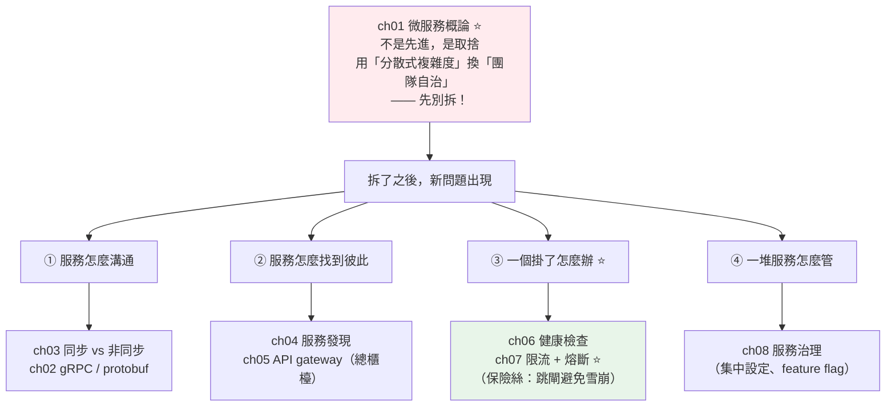

# Part 21 統整：微服務全貌

> 把這 8 章串成一張圖——它的第一課，是一個反直覺的建議：**先別拆。**

## 🗺️ 知識地圖（這 8 章怎麼串起來）

微服務不是「先進架構」，是**一個取捨**。這個 Part 先讓你**看清代價**，再教你**處理代價**。



**一句話串起來**：

**[微服務不是先進，是取捨](01-microservices-intro.md)**（ch01）——
用「**分散式系統的複雜度**」換「**團隊自治與獨立部署**」。
所以第一課是**先別拆**：團隊不夠大、痛點不明確，
**先寫好模組化的單體**（[Part 16 的分層與 DI](../16-architecture/README.md)），
等真的痛了再拆。

拆了之後，本來「一次函式呼叫」的事，變成「**跨網路呼叫**」——
而網路**慢、會失敗**。於是四類新問題冒出來：

- **怎麼溝通**（ch02 gRPC、ch03 同步 vs 非同步）
- **怎麼找到彼此**（ch04 服務發現、ch05 gateway）
- **一個掛了怎麼辦**（ch06 健康檢查、**ch07 限流 + 熔斷**）——**這是微服務的靈魂**
- **一堆服務怎麼管**（ch08 治理）

其中最關鍵的是 **[熔斷器](07-rate-limit-circuit-breaker.md)**（ch07）：
一個服務掛了，會沿呼叫鏈**雪崩**——大家都卡在等它，執行緒耗盡，全系統癱瘓。
熔斷器像**保險絲**：偵測到下游壞了就**跳閘（快速失敗）**，
不再陪葬，還給下游喘息的空間（下面的小實作會完整演一遍）。

## ⚡ 速查表（什麼情境用什麼）

| 情境 | 怎麼做 | 章節 |
|------|--------|------|
| **要不要拆微服務** | **先別拆**——團隊小 / 痛點不明確就用模組化單體 | [ch01](01-microservices-intro.md) |
| 服務間高頻內部通訊 | **gRPC + protobuf**（快、強型別、有合約）；對外仍用 REST | [ch02](02-grpc-protobuf.md) |
| 呼叫方需要**立刻**知道結果 | **同步**（REST/gRPC）——但要配逾時/重試/熔斷 | [ch03](03-service-communication.md) |
| 呼叫方**不需要**立刻知道結果 | **非同步**（訊息佇列）——解耦，對方掛了訊息在佇列等 | [ch03](03-service-communication.md) |
| 服務實例 IP 一直變 | **服務發現**（Consul/etcd）；K8s 內建（打 Service 名） | [ch04](04-service-discovery.md) |
| 客戶端不想記 20 個服務位址 | **API gateway**（單一入口 + 集中認證/限流） | [ch05](05-api-gateway.md) |
| **「還活著嗎」vs「能接客嗎」** | liveness（淺）vs readiness（深）——見 [Part 19](../19-cloud-native/07-graceful-shutdown.md) | [ch06](06-health-checks.md) |
| **下游服務掛了，別拖垮自己** | **熔斷器**——失敗率超標就跳閘（快速失敗） | [ch07](07-rate-limit-circuit-breaker.md) |
| 呼叫外部服務 | **一定要設 timeout**（不設就是無限等） | [ch07](07-rate-limit-circuit-breaker.md) |
| 重試失敗的請求 | **指數退避 + 抖動**，且**只重試冪等操作** | [ch07](07-rate-limit-circuit-breaker.md) |
| 熔斷/失敗時的降級 | **fallback**（推薦服務掛了就回熱門榜，別回 500） | [ch07](07-rate-limit-circuit-breaker.md) |
| 擋住暴衝流量 | **限流**（令牌桶，見 [Part 20](../20-security-system-design/11-system-design-rate-limiter.md)） | [ch07](07-rate-limit-circuit-breaker.md) |
| 改一個設定要動 100 個服務 | **集中設定中心**（動態生效、不必重啟） | [ch08](08-service-governance.md) |
| 新功能想先給 5% 使用者 | **feature flag**（部署與發布分家） | [ch08](08-service-governance.md) |

## 🔑 核心心智模型（帶得走的幾句話）

- **微服務是取捨，不是升級。** 它用「分散式複雜度」（網路會失敗、資料最終一致、
  跨服務除錯困難）換「團隊自治、獨立部署、按服務擴展」。
  **團隊不夠大就別拆**——「先單體，後微服務」是業界血淚共識。
- **跨服務呼叫 = 慢且會失敗。** 本來是函式呼叫（快、可靠），
  拆開後變成網路呼叫（慢、會逾時、會掛）。**所以每個同步呼叫都要穿「護具」**：
  timeout → retry（退避）→ circuit breaker → fallback。
- **熔斷器 = 保險絲。** 下游掛了，與其讓每個請求都**傻等 30 秒逾時**（執行緒全卡死、
  雪崩），不如**跳閘快速失敗**——保護自己的執行緒，也給下游喘息恢復的空間。
- **重試必須配冪等。** 不冪等的操作（如「扣款」）重試會**執行兩次**——
  沒有[冪等](../22-distributed-systems/06-idempotency.md)，重試就是賭博。
- **API gateway 是總櫃檯，但別讓它變聰明。** 認證、限流集中做很好；
  但**業務邏輯偷偷長進 gateway**，它就變成新的單體（「笨管道、智慧端點」）。
- **feature flag 讓「部署」和「發布」分家。** 程式碼先上線但開關關著，
  之後先開 5%、觀察沒問題再全開；出事**關開關就是秒級回滾**。

## 🛠️ 小實作：熔斷器三態，完整演一遍

熔斷器是微服務最經典、面試最高頻的一段。這支腳本模擬一個
「**先壞、後恢復**」的下游服務，看熔斷器如何 **Closed → Open → Half-Open → Closed**。

```python
# microservices_demo.py —— Part 21 主線：熔斷器（韌性的核心）
from __future__ import annotations

import time
from collections.abc import Callable
from enum import Enum
from typing import Any


class State(Enum):
    CLOSED = "關閉（正常通電）"      # 正常放行，同時統計失敗
    OPEN = "跳閘（快速失敗）"        # 連送都不送，直接失敗
    HALF_OPEN = "半開（試探）"       # 放少量請求試水溫


class CircuitBreaker:
    """ch07 熔斷器：下游掛了就跳閘，不再陪葬——給下游喘息、自己不卡死。"""

    def __init__(self, fail_threshold: int = 3, recovery_time: float = 0.3) -> None:
        self.fail_threshold = fail_threshold
        self.recovery_time = recovery_time
        self.state = State.CLOSED
        self.failures = 0
        self.opened_at = 0.0

    def call(self, func: Callable[[], Any]) -> Any:
        # OPEN：恢復時間到了就進 Half-Open 試探，否則直接快速失敗
        if self.state == State.OPEN:
            if time.monotonic() - self.opened_at >= self.recovery_time:
                self.state = State.HALF_OPEN
            else:
                raise RuntimeError("熔斷器 OPEN：快速失敗（連送都不送給下游）")

        try:
            result = func()
        except Exception:
            self._on_failure()
            raise
        else:
            self._on_success()
            return result

    def _on_failure(self) -> None:
        self.failures += 1
        # Half-Open 時只要再失敗，或 Closed 時累積到門檻 → 跳閘
        if self.state == State.HALF_OPEN or self.failures >= self.fail_threshold:
            self.state = State.OPEN
            self.opened_at = time.monotonic()

    def _on_success(self) -> None:
        self.failures = 0
        self.state = State.CLOSED


def demo() -> None:
    breaker = CircuitBreaker(fail_threshold=3, recovery_time=0.3)
    downstream_healthy = {"ok": False}      # 模擬：一開始壞的

    def call_downstream() -> str:
        if not downstream_healthy["ok"]:
            raise ConnectionError("下游服務掛了")
        return "200 OK"

    def attempt(label: str) -> None:
        try:
            result = breaker.call(call_downstream)
            print(f"  {label:8s} state={breaker.state.value:16s} → {result}")
        except Exception as exc:
            kind = "熔斷擋下" if "熔斷器 OPEN" in str(exc) else "呼叫失敗"
            print(f"  {label:8s} state={breaker.state.value:16s} → {kind}")

    print("【階段1】下游掛了，連續失敗 → 累積到門檻就跳閘")
    for i in range(1, 5):
        attempt(f"請求 {i}")

    print("\n【階段2】跳閘後：連送都不送，直接快速失敗（保護自己 + 給下游喘息）")
    attempt("請求 5")
    attempt("請求 6")

    print("\n【階段3】等過恢復時間 → 下游也修好了 → 試探成功 → 復電")
    time.sleep(0.35)
    downstream_healthy["ok"] = True
    attempt("請求 7")
    attempt("請求 8")


if __name__ == "__main__":
    demo()
```

**預期輸出**：

```pycon
$ python microservices_demo.py
【階段1】下游掛了，連續失敗 → 累積到門檻就跳閘
  請求 1   state=關閉（正常通電）     → 呼叫失敗
  請求 2   state=關閉（正常通電）     → 呼叫失敗
  請求 3   state=跳閘（快速失敗）     → 呼叫失敗
  請求 4   state=跳閘（快速失敗）     → 熔斷擋下

【階段2】跳閘後：連送都不送，直接快速失敗（保護自己 + 給下游喘息）
  請求 5   state=跳閘（快速失敗）     → 熔斷擋下
  請求 6   state=跳閘（快速失敗）     → 熔斷擋下

【階段3】等過恢復時間 → 下游也修好了 → 試探成功 → 復電
  請求 7   state=關閉（正常通電）     → 200 OK
  請求 8   state=關閉（正常通電）     → 200 OK
```

**這段輸出，就是熔斷器的全部精髓**：

**① Closed → Open（請求 1~3）：累積失敗到門檻就跳閘。**
前 3 個請求真的送到下游、真的失敗了。第 3 次失敗達到門檻（3），**熔斷器跳閘**。

**② Open（請求 4~6）：連送都不送，直接「熔斷擋下」。**
注意這裡的關鍵——**請求 4 之後，下游根本沒被呼叫**。
熔斷器**替下游擋掉了流量**：
- **保護自己**：不再有請求卡在「傻等下游逾時」上（避免執行緒耗盡、雪崩）。
- **保護下游**：一個正在掙扎的服務，最不需要的就是**繼續被打**——跳閘給它喘息空間。

**③ Half-Open → Closed（請求 7）：試探成功就復電。**
等過恢復時間（0.3 秒），熔斷器**放一個請求去試水溫**。
這時下游剛好也修好了 → **試探成功 → 回到 Closed（正常）**。
（如果試探又失敗，就回到 Open，重新計時——**不會一直傻試**。）

**這就是為什麼熔斷器是微服務韌性的核心**：
它讓「一個服務的故障」**停在原地**，而不是沿著呼叫鏈**雪崩成全系統癱瘓**。

## ✅ 自測清單（答不出來就回去讀）

- [ ] 微服務用什麼換什麼？什麼時候「不該」拆？（[ch01](01-microservices-intro.md)）
- [ ] gRPC 比 REST 快在哪？什麼時候用 gRPC、什麼時候用 REST？（[ch02](02-grpc-protobuf.md)）
- [ ] 同步和非同步通訊怎麼選？（提示：需不需要立刻知道結果）（[ch03](03-service-communication.md)）
- [ ] 服務發現解決什麼問題？K8s 怎麼做？（[ch04](04-service-discovery.md)）
- [ ] API gateway 的職責有哪些？什麼「不該」放進去？（[ch05](05-api-gateway.md)）
- [ ] liveness 和 readiness 探針差在哪？（[ch06](06-health-checks.md)）
- [ ] **熔斷器的三個狀態各在做什麼？為什麼需要 Half-Open？**（[ch07](07-rate-limit-circuit-breaker.md)）
- [ ] 「呼叫護具」有哪幾層？疊加的順序是什麼？（[ch07](07-rate-limit-circuit-breaker.md)）
- [ ] 為什麼重試「只能」重試冪等操作？（[ch07](07-rate-limit-circuit-breaker.md)）
- [ ] 集中設定中心比環境變數好在哪？（[ch08](08-service-governance.md)）
- [ ] feature flag 怎麼讓「部署」和「發布」分家？（[ch08](08-service-governance.md)）

## 🎯 面試速查

| 考點 | 面試官想聽到什麼 | 章節 |
|------|------------------|------|
| **該不該用微服務？** | 「**微服務是取捨，不是升級**。用『分散式複雜度』（網路失敗、最終一致、跨服務除錯難）換『團隊自治、獨立部署、按服務擴展』。**團隊不夠大、痛點不明確就別拆**——先寫好**模組化的單體**，等真的痛了（一個功能要跨多團隊、部署互相卡）再拆。」 | [ch01](01-microservices-intro.md) |
| **熔斷器的三態？**（高頻） | 「**Closed**（正常放行 + 統計失敗，超門檻 → Open）；**Open**（**快速失敗**，連送都不送給下游，維持恢復時間後 → Half-Open）；**Half-Open**（放**少量試探**：成功 → Closed，失敗 → 回 Open 重新計時）。目的：一個服務掛了，**別讓每個請求傻等逾時**而拖垮自己（雪崩），同時**給下游喘息**恢復的空間。」 | [ch07](07-rate-limit-circuit-breaker.md) |
| **服務間怎麼保證韌性？** | 「一套疊加的『護具』：**timeout**（永遠要設）→ **retry**（指數退避 + 抖動，**只重試冪等操作**）→ **circuit breaker**（重試也救不了時跳閘）→ **fallback**（降級回應：推薦掛了回熱門榜，別回 500）。」 | [ch07](07-rate-limit-circuit-breaker.md) |
| **gRPC vs REST？** | 「**gRPC**：HTTP/2 + protobuf 二進位，**快、強型別、有合約**（`.proto` 跨語言）——適合**內部高頻通訊**。**REST**：通用、好除錯、瀏覽器直接吃——適合**對外 API**。口訣：**對外 REST、內部 gRPC**。」 | [ch02](02-grpc-protobuf.md) |
| **服務發現？** | 「服務實例的 IP 會隨擴縮容、重啟一直變。**服務註冊中心**（Consul/etcd/Eureka）記錄『哪個服務有哪些健康實例在哪』，實例啟動時註冊、健康檢查維持、下線移除。**K8s 內建**——打 Service 的 DNS 名（如 `http://inventory-service`）就會被轉發到健康實例。」 | [ch04](04-service-discovery.md) |
| **API gateway 的價值與風險？** | 「**價值**：單一入口（客戶端只記一個位址）+ **集中橫切關注**（認證、限流、TLS 在一處做，不必每個服務重複）。**風險**：① 單點（要高可用）；② **業務邏輯偷偷長進 gateway** → 變成新的單體。原則：**笨管道、智慧端點**。」 | [ch05](05-api-gateway.md) |

---

🎉 **恭喜完成 Part 21！** 你知道怎麼讓「一堆服務」既能協作、又不會一起垮。

但微服務底下，藏著一整座更深的冰山——**分散式系統的理論**。
「兩個服務同時改同一筆資料誰贏？」「網路斷了怎麼辦？」「訊息重複送了會怎樣？」

接下來 [Part 22 分散式系統](../22-distributed-systems/README.md) 要面對這些**最硬的問題**——
從 **CAP 定理**（網路一定會斷，你要一致性還是可用性？）開始。

➡️ 下一 Part：[分散式系統 Distributed Systems](../22-distributed-systems/README.md)

[⬆️ 回 Part 21 索引](README.md)
