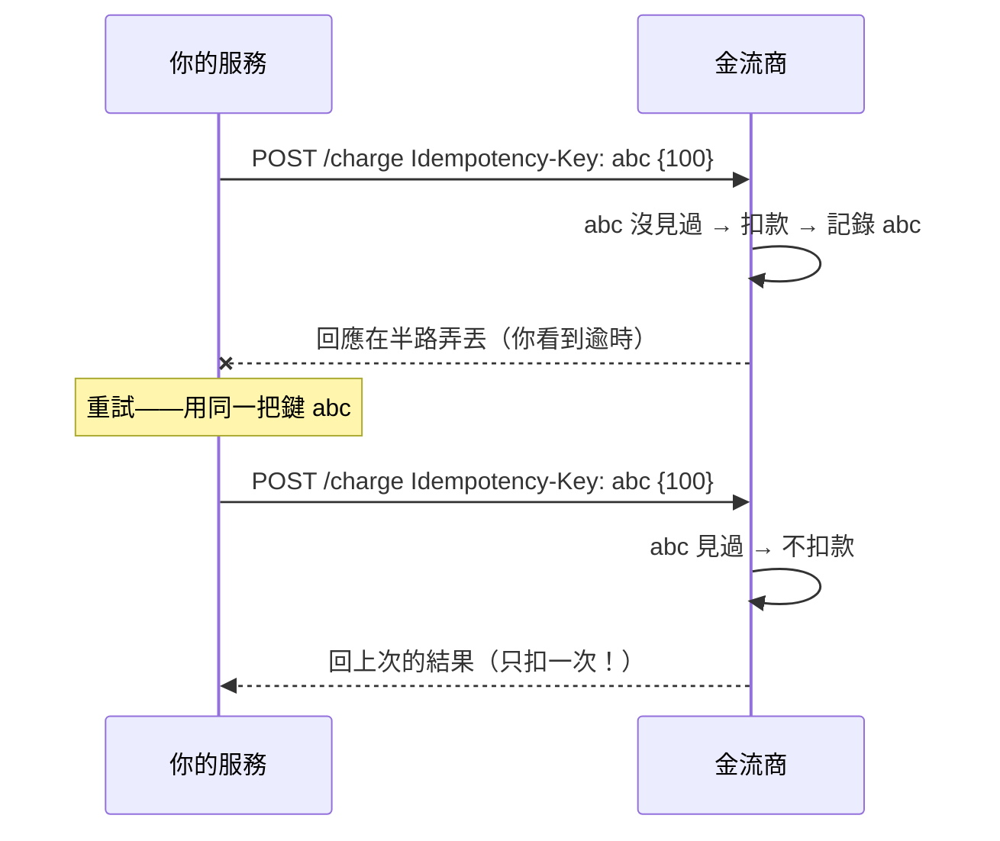

# 呼叫別人時的冪等、取消與 SDK 設計

> 上一章教你可靠地重試,但留了一個危險的尾巴:重試一個「送出後逾時」的付款,可能會**扣兩次款**。這章補上解法——冪等鍵,並談 asyncio 的取消,以及怎麼把這些封裝成一個好用的第三方 wrapper。

## 💡 白話導讀（建議先讀）

[上一章](09-reliable-http-client.md)結尾埋了一個坑:**重試不確定的操作很危險**。這章先把它填平。

**問題:重試可能造成重複副作用。**

想像你呼叫金流商「扣款 100 元」。請求送出去了,但**回應在半路弄丟了**(對方其實扣款成功,
只是那個「成功」的回覆沒回到你這)。你這邊看到的是「逾時」,於是**重試**——結果**扣了兩次款**。
使用者付一次錢被扣兩次,這是重大事故。

問題的根源:**逾時不代表失敗**,它代表「不知道成功還失敗」。對這種**不確定**的狀態重試,
就可能重複執行有副作用的操作。

**解法:冪等鍵(idempotency key)。**

你在**第一次**送請求時,自己產生一個**唯一的鍵**(例如根據訂單 id 算出來),放進請求裡
(通常是 `Idempotency-Key` header)。重試時,**用同一把鍵**。

對方(設計良好的 API,如 Stripe)收到請求會先看這把鍵:
- **沒見過** → 真的執行扣款,把結果記在這把鍵下。
- **見過** → 不再執行,直接回上次那筆的結果。

於是不管你送幾次,**只會真的扣一次款**——這就是「冪等」:**做一次和做多次,結果相同**。
關鍵是重試要**用同一把鍵**(所以鍵要能穩定地重算出來,而不是每次隨機產生)。

用生活比喻:冪等鍵就像**取件編號**。你拿同一張編號去櫃檯,不管問幾次,櫃檯只會給你**那一件**包裹,
不會每問一次就多給一件。

**第二件事:asyncio 的取消(cancellation)。**

上一章講「逾時」,但在 async 世界,逾時背後其實是**取消**。當你用
`asyncio.wait_for(coro, timeout=3)`,3 秒到了,asyncio 會**取消**那個還在跑的 coroutine——
在它裡面丟出一個 `CancelledError`。你可以用 `try/finally` 攔住這個時刻做**清理**
(關連線、回滾)。理解取消,你才知道逾時發生時「那個沒做完的呼叫」怎麼被收尾。

**第三件事:把這些封裝成 SDK / wrapper。**

逾時、重試、錯誤分類、冪等鍵……每次呼叫第三方都手寫一遍很痛苦也容易漏。資深做法是**封裝一層 client**:
上層只呼叫 `payment.charge(order_id, amount)`,底下的可靠性細節(逾時、重試、冪等鍵、錯誤轉換)
全藏在 wrapper 裡。這也讓你能在測試時**替換掉真的 HTTP**(呼應 [Part 12 的 mock](../12-testing/06-mock.md))。

這章的可執行範例,會讓你實作冪等鍵的產生與去重,以及一個用 asyncio 死線取消慢呼叫的例子。

## 🎯 什麼時候會用到

- **任何有副作用又可能重試的呼叫**:扣款、下單、發簡訊、建立資源——都要帶冪等鍵。
- **接第三方 webhook / 你送 webhook**:接收端要用冪等去重(對方會重送),呼應 [Part 14 ch20](../14-web/20-etag-conditional-webhook.md)。
- **async 服務裡呼叫外部**:用 `asyncio.wait_for` / `asyncio.timeout` 設死線,並在取消時清理。
- **團隊要重複呼叫同一個第三方**:把它封裝成內部 SDK,統一逾時 / 重試 / 冪等 / 錯誤處理。

## Why（為什麼）

- **正確性(避免重複副作用)**:重試 + 副作用 = 潛在的重複執行。冪等鍵是讓「安全重試」成立的前提。
- **資源不外洩**:取消一個逾時的呼叫時,若不清理,連線 / 交易 / 鎖會殘留。`try/finally` 保證收尾。
- **可維護與可測**:把可靠性邏輯集中在一個 wrapper,上層乾淨、行為一致,測試時可整組替換成假的。

## Theory（理論）

### 冪等鍵怎麼運作

```text
第一次： POST /charge   Idempotency-Key: abc123   {amount:100}
         對方：沒見過 abc123 → 執行扣款 → 記錄 abc123 → 結果
                                （回應在半路弄丟）

重試：   POST /charge   Idempotency-Key: abc123   {amount:100}   ← 同一把鍵！
         對方：見過 abc123 → 不執行 → 直接回上次的結果
```

**關鍵**:鍵要能**穩定重算**(同一個邏輯操作 → 同一把鍵),不能每次隨機。常見做法是由
「操作類型 + 業務識別碼(訂單 id)」雜湊而來。

### asyncio 取消

```text
asyncio.wait_for(coro, timeout=3)
        │  3 秒到
        ▼
向 coro 內部丟出 CancelledError
        │
   coro 裡的 try/finally 執行清理（關連線、回滾）
        │
   CancelledError 往上傳 → wait_for 轉成 TimeoutError
```

- **取消是合作式的**:asyncio 在 `await` 點丟 `CancelledError`,你用 `try/finally` 或
  `except asyncio.CancelledError` 做清理**後應該再讓它繼續往上傳**(別默默吞掉)。
- Python 3.11+ 也可用 `async with asyncio.timeout(3):`,語意更清楚。

## Specification（規範：相關工具）

| 工具 | 用途 |
|------|------|
| `Idempotency-Key` header | 業界慣例(Stripe 等):讓重試安全,對方據此去重 |
| `asyncio.wait_for(coro, timeout)` | 給 coroutine 設逾時,逾時取消並拋 `TimeoutError` |
| `async with asyncio.timeout(s)`(3.11+) | 同上,context manager 寫法 |
| `try/finally` in coroutine | 取消 / 逾時時保證清理(關連線、回滾) |
| wrapper / SDK class | 把逾時 / 重試 / 冪等 / 錯誤轉換封裝,上層只見業務方法 |

## Implementation（實作：冪等鍵 + 取消）

下面範例做兩件事:(1) 產生穩定的冪等鍵,並示範「同一把鍵重送只真的執行一次」;
(2) 用 `asyncio.wait_for` 給呼叫設死線,逾時取消。

## Code Example（可執行的 Python 範例）

```python
# client_idempotency.py —— 冪等鍵去重 + asyncio 死線取消
from __future__ import annotations

import asyncio
import hashlib
import json
from collections.abc import Awaitable, Callable


def make_idempotency_key(operation: str, **params: object) -> str:
    """由操作名 + 參數算出穩定的鍵（同參數 → 同鍵，重試才共用一把鍵）。"""
    blob = operation + "|" + json.dumps(params, sort_keys=True, ensure_ascii=False)
    return hashlib.sha256(blob.encode()).hexdigest()[:16]


class IdempotentSender:
    """帶冪等鍵送請求：同一把鍵重送，只真正呼叫下游一次，之後回既有結果。"""

    def __init__(self) -> None:
        self._done: dict[str, str] = {}
        self.calls = 0

    def send(self, key: str, do_call: Callable[[], str]) -> str:
        if key in self._done:
            return self._done[key]  # 重送 → 回既有結果，不再打下游
        self.calls += 1
        result = do_call()
        self._done[key] = result
        return result


async def call_with_deadline(
    coro_fn: Callable[[], Awaitable[str]], deadline: float
) -> str:
    """給一次呼叫設死線；逾時就取消底層 coroutine，回傳 fallback。"""
    try:
        return await asyncio.wait_for(coro_fn(), timeout=deadline)
    except asyncio.TimeoutError:
        return "timeout-cancelled"


if __name__ == "__main__":
    key = make_idempotency_key("charge", order_id="A1", amount=100)
    same = make_idempotency_key("charge", amount=100, order_id="A1")
    print("冪等鍵:", key, "| 參數順序不同但同鍵:", key == same)

    sender = IdempotentSender()
    print("首次送出:", sender.send(key, lambda: "charged"))
    print("重送(逾時重試):", sender.send(key, lambda: "charged"))
    print("下游實際被呼叫次數:", sender.calls)

    async def slow() -> str:
        await asyncio.sleep(10)
        return "done"

    print("設 0.01s 死線:", asyncio.run(call_with_deadline(slow, 0.01)))
```

**預期輸出**：

```pycon
$ python client_idempotency.py
冪等鍵: 68bbb1760694d443 | 參數順序不同但同鍵: True
首次送出: charged
重送(逾時重試): charged
下游實際被呼叫次數: 1
設 0.01s 死線: timeout-cancelled
```

**逐段解說**:

- `make_idempotency_key` 用 `json.dumps(..., sort_keys=True)` 保證**參數順序不影響鍵**——
  只要是同一個邏輯操作,重試時就能算出同一把鍵。這是冪等能成立的前提。
- `IdempotentSender.send` 的 `calls == 1`:同一把鍵送兩次,`do_call` 只真的被呼叫**一次**,
  第二次直接回既有結果。真實世界這個 `_done` 表在**對方的服務**裡(如 Stripe),你只要**帶對鍵**。
- `call_with_deadline` 用 `asyncio.wait_for` 設 0.01 秒死線,`slow()` 要睡 10 秒 → 被**取消** →
  轉成 `TimeoutError` → 回 fallback。這就是上一章「逾時」在 async 世界的真身:**取消**。

**封裝成 SDK / wrapper**(示意):

```python
class PaymentClient:
    """把逾時、重試、冪等鍵、錯誤轉換全藏起來，上層只見業務方法。"""

    def __init__(self, http: object, secret: str) -> None:
        self._http = http
        self._secret = secret

    def charge(self, order_id: str, amount: int) -> str:
        key = make_idempotency_key("charge", order_id=order_id, amount=amount)
        # 內部：帶 Idempotency-Key header、設逾時、分類錯誤後重試（見上一章）
        # 上層呼叫者完全不用管這些細節：
        return self._do_post("/charge", {"amount": amount}, idem_key=key)

    def _do_post(self, path: str, body: dict[str, int], idem_key: str) -> str:
        raise NotImplementedError  # 實作接 httpx + 上一章的 retry_call
```

上層只寫 `payment.charge("A1", 100)`;測試時把 `PaymentClient` 換成假的即可(可測)。

## Diagram（圖解：冪等鍵讓重試安全）



## Best Practice（最佳實踐）

- **有副作用的呼叫一律帶冪等鍵**,且重試用**同一把**;鍵由業務識別碼穩定算出,別隨機。
- **取消時要清理**:coroutine 裡用 `try/finally` 關連線 / 回滾;`except CancelledError` 清理後**再往上拋**,別吞掉。
- **把可靠性封裝成 client / SDK**:逾時、重試、冪等、錯誤轉換集中一處,上層只見業務方法,也好 mock。
- **接收端也要冪等**:你接別人的 webhook / 回呼時,同樣用鍵去重(對方會重送),呼應 [Part 14 ch20](../14-web/20-etag-conditional-webhook.md)。
- **鍵要有 TTL / 儲存**:冪等記錄不能無限長存;設合理過期,並存在可靠的地方(DB / Redis)。
- **`asyncio.timeout`(3.11+)比 `wait_for` 更清楚**:用 `async with asyncio.timeout(s):` 包住一段。

## Common Mistakes（常見誤解）

- **「逾時就是失敗,重試就好」**。逾時是**不確定**,可能其實成功了。有副作用的操作這樣重試會**重複執行**。
- **「冪等鍵每次隨機產生」**。那重試時鍵不同,對方無法去重,等於沒帶。鍵要能**穩定重算**。
- **「`except CancelledError` 裡把例外吞掉」**。會讓取消失效、任務殭死。清理完要**重新拋出**。
- **「wrapper 只是多包一層沒必要」**。不封裝就會每次手寫逾時 / 重試 / 冪等,到處漏、不一致、難測。
- **「冪等只有 server 要做」**。當 client 你要**帶鍵**、當 receiver(webhook)你要**用鍵去重**,兩端都要。

## Interview Notes（面試重點）

- **「重試一個付款請求會不會扣兩次?怎麼避免?」**
  會——若請求送出後逾時(其實成功了),重試就重複扣款。解法:**冪等鍵(Idempotency-Key)**。
  第一次帶一把由業務識別碼穩定算出的鍵,重試**用同一把**;對方據鍵去重,只執行一次。

- **「什麼是冪等?為什麼分散式系統一直提它?」**
  做一次和做多次結果相同。因為網路不可靠 + 至少一次投遞 / 重試普遍存在,**重複是常態**,
  冪等讓重複安全。呼應 [Part 22](../22-distributed-systems/README.md)。

- **「asyncio 的逾時底層是什麼?取消時要注意什麼?」**
  底層是**取消**:逾時會向 coroutine 丟 `CancelledError`。要用 `try/finally` 清理資源,
  且清理後**讓 CancelledError 繼續往上傳**,不要吞掉,否則取消失效。

- **「你會怎麼封裝一個第三方 API 客戶端?」**
  一個 wrapper/SDK class:對外只暴露業務方法(`charge(order_id, amount)`),內部封裝**逾時、
  錯誤分類 + 重試退避、冪等鍵、認證、錯誤轉換**。好處:一致、集中、可測(能整組 mock)。

---

➡️ 下一章：[Part 21 統整:微服務全貌](11-summary.md)

[⬆️ 回 Part 21 索引](README.md)
