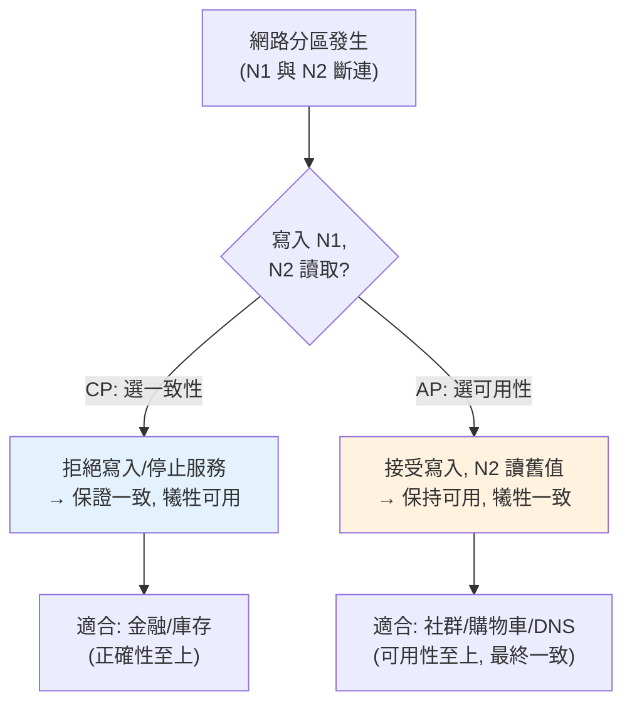

# 分散式系統概論與 CAP

> 一旦你的系統跨越多台機器，就進入了分散式系統的世界——網路會斷、節點會掛、時鐘不同步。**CAP 定理**揭示了一個殘酷的取捨：當網路分區發生時，你只能在「一致性」和「可用性」之間選一個。這章講分散式系統的本質難題與 CAP 的真義。

## 💡 白話導讀（建議先讀）

兩家分店共用一本帳,平時靠電話同步。某天**電話線斷了**（網路分區）,
客人還在上門,兩家店只有兩種選擇:

- **繼續各記各的帳**——生意不中斷（**可用性 A**）,但兩本帳可能記出衝突,
  之後要想辦法對帳（資料不一致）。
- **暫停營業,等電話修好**——絕不讓帳目出錯（**一致性 C**）,但客人吃閉門羹（犧牲可用性）。

這就是 **CAP 定理**。先破除最常見的誤解——「C、A、P 三選二,隨你挑」:
**P（分區容忍）根本不是選項,是必需品**,因為電話線（網路）**一定會斷**。
不容忍分區的「分散式系統」,斷線即全毀,那不叫分散式。

所以 CAP 的真正意思瘦得多:**當分區發生時,你選 C 還是 A**——

- **CP**:分區時拒絕服務保正確。金融交易、庫存扣減——寧可暫停,不可錯帳。
- **AP**:分區時繼續服務,事後修補。購物車、按讚數、社群動態——
  短暫看到舊資料無傷大雅,停止服務才是災難。

而且這是**按資料/操作分別選**的,不是整個系統一刀切:
同一個電商,扣款走 CP、瀏覽數走 AP。
分區之外的平時,取捨也沒消失——變成**延遲 vs 一致性**（PACELC 定理的補充）。
這章從「網路一定會出事」的世界觀講起,建立分散式系統的第一課。

## Why（為什麼）

只要你的系統有多個節點（多台伺服器、多個資料庫副本、[微服務](../21-microservices/README.md)），你就在做分散式系統——而分散式系統有一組**單機不存在**的根本難題：

- **網路不可靠**：訊息會遺失、延遲、亂序、重複；節點間可能**分區（partition）**——彼此連不上但各自還活著。
- **節點會獨立故障**：一台掛了，其他還在跑，系統要能處理「部分故障」。
- **沒有全域時鐘**：各節點時鐘不同步，無法可靠地判斷「哪件事先發生」。
- **一致性難**：資料複製到多個節點，怎麼保證大家看到的一致？

**這些不是工程沒做好，而是分散式的物理本質。** 而 **CAP 定理**（Eric Brewer）精煉了其中最核心的取捨。它說：一個分散式系統，在三個性質中**最多只能同時滿足兩個**：

- **C（Consistency，一致性）**：每次讀取都得到最新寫入的值（所有節點看到一致的資料）。
- **A（Availability，可用性）**：每個請求都能得到（非錯誤的）回應。
- **P（Partition tolerance，分區容忍）**：網路分區（節點間斷連）發生時系統仍運作。

理解 CAP，你才能做對分散式系統的核心設計決策——這章講清楚它的真義（以及最常見的誤解），為後續的[一致性模型](02-consistency-models.md)、[分散式鎖](03-distributed-lock.md)、[Saga](07-saga.md) 打底。

## Theory（理論：CAP 的真義）

**CAP 最常被誤解**成「三選二，隨你挑」。真相是：

**P（分區容忍）在分散式系統中不是選項，是必需品。** 因為網路分區**一定會發生**（網路本來就會斷）。如果你不容忍分區，那分區一發生系統就整個壞掉——這不叫分散式系統。所以真正的分散式系統**必須有 P**。

於是 CAP 的真正選擇，是**在「分區發生時」，你要 C 還是 A**：

- **CP（選一致性）**：分區時，為了不讓資料不一致，**拒絕服務**（回錯誤或等待）——犧牲可用性，保住一致性。例：分區時，少數派節點停止回應，避免讀到舊資料。適合「資料正確性至上」的系統（金融交易、庫存扣減）。
- **AP（選可用性）**：分區時，**繼續服務**（各分區各自回應）——犧牲強一致，各節點可能回不同（可能過時）的值，等分區恢復後再協調（最終一致）。適合「可用性至上、能容忍短暫不一致」的系統（社群動態、購物車、DNS）。

**關鍵洞見**：**沒有分區時，你可以同時有 C 和 A**（正常運作時不必犧牲）。CAP 只在**分區發生的那一刻**強迫你二選一。所以更精確的說法是「分區時，C 與 A 二選一」。

**PACELC 定理**是 CAP 的延伸，補上「沒有分區時」的取捨：**若分區（P）則 C 或 A（ELC）否則 latency 或 consistency**——就算沒分區，強一致（要跨節點協調）也會犧牲延遲。這揭示了一致性與延遲的普遍張力。

## Specification（規範：CP vs AP 系統）

**典型系統的 CAP 定位**：

| 系統 | 傾向 | 說明 |
|------|------|------|
| 傳統關聯式 DB（單主） | CP | 強一致，分區時可能不可用 |
| ZooKeeper / etcd | CP | 用於協調，一致性優先 |
| Cassandra / DynamoDB | AP（可調） | 高可用，最終一致（可調一致性等級） |
| Redis（單節點） | — | 單節點無 CAP 問題；叢集則有取捨 |
| DNS | AP | 高可用，最終一致（更新需傳播時間） |

**可調一致性（tunable consistency）**：很多現代系統（Cassandra、DynamoDB）讓你**逐操作**選擇一致性等級——用 **Quorum（法定人數）** 機制：

- 寫入要求 W 個節點確認、讀取要求 R 個節點回應。
- 若 **W + R > N**（總副本數），讀寫的節點集必有交集 → 讀得到最新寫入（強一致）。
- 若 W + R ≤ N → 可能讀到舊值（最終一致），但更快、更可用。

這讓你能**按需**在 C 與 A/延遲間權衡，而非全系統一刀切。

## Implementation（底層：為何分區強迫二選一）

**用一個具體場景理解 CAP**：假設一份資料複製在兩個節點 N1、N2（互為副本）。現在 N1、N2 之間的網路**斷了（分區）**，但各自還能被客戶端存取。此時客戶端 A 向 N1 寫入 `x=2`（原本 `x=1`）：

- **如果選一致性（CP）**：N1 收到寫入，但它**無法同步給 N2**（網路斷了）。為了不讓 N2 讀到舊值造成不一致，系統必須**拒絕**這個寫入（或讓 N2 停止服務讀取）——**犧牲可用性**。這樣任何成功的操作都保證一致，但分區期間部分請求被拒。
- **如果選可用性（AP）**：N1 接受寫入 `x=2` 並回應成功（保持可用）。此時另一個客戶端 B 從 N2 讀取——N2 還是 `x=1`（沒收到更新）→ **讀到舊值，不一致**。分區恢復後，N1、N2 再協調（如用 [向量時鐘/last-write-wins](02-consistency-models.md) 解決衝突），達成最終一致。

**你無法同時要 C 和 A**：在分區下，「N1 接受寫入」和「N2 讀到一致的值」不可能同時成立——因為它們之間的訊息傳不過去。這不是實作問題，是**資訊在分區間無法傳遞**的物理限制。這就是 CAP 的本質。下面的範例模擬這個取捨。

## Code Example（可執行的 Python 範例）

```python
# cap_demo.py — 分區下 CP vs AP 的取捨（純標準庫，可執行）
from __future__ import annotations


class Node:
    def __init__(self, name: str, value: int) -> None:
        self.name = name
        self.value = value


class ReplicatedStore:
    """兩節點副本；可模擬網路分區與 CP/AP 兩種策略。"""

    def __init__(self, mode: str) -> None:
        self.mode = mode  # "CP" 或 "AP"
        self.n1 = Node("N1", 1)
        self.n2 = Node("N2", 1)
        self.partitioned = False

    def partition(self) -> None:
        self.partitioned = True

    def write(self, value: int) -> tuple[bool, str]:
        """對 N1 寫入，需同步到 N2。"""
        if self.partitioned:
            if self.mode == "CP":
                return False, "拒絕寫入（分區時無法同步，保一致性犧牲可用性）"
            # AP：接受寫入，但只更新 N1（N2 暫時不一致）
            self.n1.value = value
            return True, "接受寫入（保可用性，N2 暫時不一致）"
        # 無分區：正常同步兩節點
        self.n1.value = self.n2.value = value
        return True, "寫入並同步兩節點"

    def read_from_n2(self) -> int:
        return self.n2.value


def main() -> None:
    # CP：分區時拒絕寫入，保證一致
    cp = ReplicatedStore("CP")
    cp.partition()
    ok, msg = cp.write(2)
    print(f"[CP] 寫入 x=2: 成功={ok} → {msg}")
    print(f"[CP] N2 讀取: {cp.read_from_n2()}（一致，因為根本沒讓不一致的寫入成功）")

    # AP：分區時接受寫入，但 N2 讀到舊值（最終一致）
    ap = ReplicatedStore("AP")
    ap.partition()
    ok, msg = ap.write(2)
    print(f"\n[AP] 寫入 x=2: 成功={ok} → {msg}")
    print(f"[AP] N2 讀取: {ap.read_from_n2()}（舊值！分區恢復後才會協調成一致）")


if __name__ == "__main__":
    main()
```

**預期輸出**：

```pycon
$ python cap_demo.py
[CP] 寫入 x=2: 成功=False → 拒絕寫入（分區時無法同步，保一致性犧牲可用性）
[CP] N2 讀取: 1（一致，因為根本沒讓不一致的寫入成功）

[AP] 寫入 x=2: 成功=True → 接受寫入（保可用性，N2 暫時不一致）
[AP] N2 讀取: 1（舊值！分區恢復後才會協調成一致）
```

逐段解說：

- **場景**：兩節點 N1、N2 互為副本，網路分區（`partition()`）後各自可存取但無法互通。
- **CP 模式**：分區時寫入 `x=2` **被拒絕**（`成功=False`）——因為無法同步到 N2，系統寧可拒絕也不讓資料不一致。代價：**犧牲可用性**（這個寫入請求失敗）。好處：N2 讀到的永遠一致（沒有不一致的寫入能成功）。
- **AP 模式**：分區時寫入 `x=2` **被接受**（`成功=True`）——保持可用，但只更新了 N1，N2 仍是舊值 `1`。代價：**犧牲一致性**（N2 讀到舊值）。好處：系統持續可用，分區恢復後再協調成最終一致。
- **要點**：分區發生時，CP 選一致（拒絕服務保正確）、AP 選可用（繼續服務容忍不一致）——**無法兼得**。這不是實作缺陷，是分區間資訊無法傳遞的物理必然。選 CP 還是 AP 取決於業務（金融要 CP、社群要 AP）。

## Diagram（圖解：CAP 在分區時的取捨）



## Best Practice（最佳實踐）

- **理解 P 是必需品**：分區一定會發生，真正的選擇是分區時要 C 還是 A。
- **依業務選 CP 或 AP**：正確性至上（金融/庫存）選 CP；可用性至上、能容忍短暫不一致（社群/購物車）選 AP。
- **善用可調一致性（Quorum）**：按操作在 C 與 A/延遲間權衡，而非全系統一刀切。
- **記住 W+R>N 給強一致**：需要讀到最新就調整讀寫法定人數。
- **AP 系統要設計衝突解決與最終一致**（見 [一致性模型](02-consistency-models.md)）。
- **考慮 PACELC**：就算沒分區，強一致也會犧牲延遲——別無腦追求強一致。
- **明確標示系統各部分的一致性保證**：讓使用者/開發者知道能期待什麼。

## Common Mistakes（常見誤解）

- **以為 CAP 是「三選二隨你挑」**：P 是必需品，真正是分區時 C 與 A 二選一。
- **以為要一直在 C 和 A 間犧牲**：只有分區發生時才強迫二選一，正常時可兼得。
- **無腦追求強一致**：忽略它對可用性與延遲的代價（PACELC）。
- **用 AP 系統卻期待強一致**：讀到舊值時當成 bug——那是設計取捨。
- **用 CP 系統卻不接受分區時的不可用**：一致性的代價就是分區時部分不可用。
- **不設計衝突解決**：AP 系統分區恢復後的資料衝突沒處理，導致資料錯亂。
- **以為「最終一致」= 立即一致**：最終一致有傳播延遲，短期會讀到舊值。

## Interview Notes（面試重點）

- **能正確陳述 CAP**：分散式系統在 C/A/P 中最多兩者，且 P 是必需品 → 分區時 C 與 A 二選一。
- **能糾正「三選二」的誤解**，並說明「只有分區時才強迫取捨、正常時可兼得」。
- **能用具體場景解釋為何分區下無法兼得 C 和 A**（分區間資訊無法傳遞）。
- **能舉 CP（ZooKeeper/etcd/傳統 DB）與 AP（Cassandra/DynamoDB/DNS）系統**及其適用。
- **知道可調一致性與 Quorum（W+R>N 給強一致）**。
- **知道 PACELC**（沒分區時一致性 vs 延遲的取捨）。

---

➡️ 下一章：[一致性模型](02-consistency-models.md)

[⬆️ 回 Part 22 索引](README.md)
