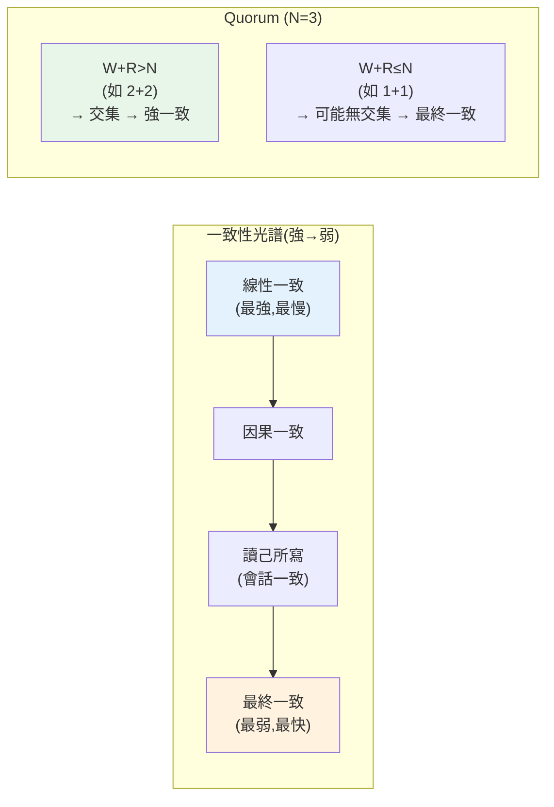

# 一致性模型

> 「一致性」不是非黑即白，而是一個光譜——從「所有人永遠看到最新值」的強一致，到「最終大家會一致但短期可能讀到舊值」的最終一致。選哪一種，決定了系統的正確性、可用性與效能。這章講一致性模型的光譜、Quorum 機制與衝突解決。

## Why（為什麼）

[CAP](01-distributed-intro-cap.md) 告訴我們分區時要在一致性與可用性間取捨。但「一致性」本身也有**不同強度**——這是一個光譜，不是開關。理解這個光譜很重要，因為：

- **不同業務需要不同一致性**：銀行餘額必須強一致（不能讀到過時餘額導致超額提款）；社群按讚數則可以最終一致（晚幾秒更新沒差）。
- **一致性越強，代價越高**：強一致要跨節點協調（等多數節點確認），犧牲延遲與可用性；弱一致快又可用，但要容忍/處理短暫不一致。
- **用錯一致性 = bug 或浪費**：該強一致的用了最終一致 → 資料錯亂（超賣、重複扣款）；該最終一致的硬求強一致 → 系統慢又脆弱。

一致性模型定義了「一個讀取能看到什麼」的保證。選對它，是分散式系統設計的核心決策。這章講清楚常見的一致性模型（強、最終、因果、讀己所寫）、實現強一致的 **Quorum** 機制，以及最終一致下的**衝突解決**。它承接 CAP、鋪陳後續的[快取一致性](05-caching-strategies.md)、[分散式鎖](03-distributed-lock.md)。

## Theory（理論：一致性光譜）

從強到弱的常見一致性模型：

- **強一致 / 線性一致（strong / linearizable consistency）**：**最嚴格**。所有操作看起來像在單一節點上、按全域順序**依序**發生。任何讀取都能看到「最近一次寫入」的結果，彷彿只有一份資料。代價：要跨節點協調、慢、分區時犧牲可用性。
- **順序一致（sequential consistency）**：所有節點看到的操作順序一致，但不要求對應真實時間。比線性一致稍弱。
- **因果一致（causal consistency）**：有**因果關係**的操作（A 導致 B）在所有節點上都按因果順序被看到；無因果關係的可以亂序。比強一致弱但比最終一致強，且比強一致好實現。
- **最終一致（eventual consistency）**：**最寬鬆**。若不再有新寫入，所有副本**最終**會收斂到一致——但**短期內不同節點可能讀到不同（過時）的值**。高可用、低延遲，但要容忍短暫不一致與處理衝突。

**面向客戶端的一致性保證**（實用的中間地帶）：

- **讀己所寫（read-your-writes）**：你**自己**寫入後，一定讀得到自己剛寫的（別人不一定）。避免「我改了資料卻看到舊值」的困惑。
- **單調讀（monotonic reads）**：一旦你讀到某個值，之後不會讀到「更舊」的值（時間不倒流）。
- **單調寫（monotonic writes）**：你的寫入按順序生效。

這些「會話一致性」保證比全域強一致便宜，卻能提供不錯的使用者體驗，是實務常用的折衷。

## Specification（規範：Quorum 機制）

**Quorum（法定人數）** 是在多副本間調節一致性的核心機制。設總副本數 **N**、寫入需 **W** 個節點確認、讀取需 **R** 個節點回應：

```text
W + R > N  →  讀寫節點集必有交集  →  讀得到最新寫入（強一致）
W + R ≤ N  →  可能無交集  →  可能讀到舊值（最終一致，但更快/更可用）
```

**常見配置**（N=3）：

- **W=3, R=1**：寫要全部確認（慢寫、快讀）、W+R=4>3 強一致。寫入慢、對寫入可用性敏感。
- **W=1, R=3**：寫一個就行（快寫）、讀要全部（慢讀）、W+R=4>3 強一致。讀慢。
- **W=2, R=2**：均衡，W+R=4>3 強一致（**Quorum 常用**）。容忍一個節點故障仍可讀寫。
- **W=1, R=1**：最快最可用，W+R=2≤3 → 最終一致，可能讀到舊值。

**權衡**：W 大 → 寫入慢但讀取新；R 大 → 讀取慢但看得到最新；W+R>N 保證強一致但犧牲延遲/可用性。可**逐操作**調整（重要寫入用高 W、一般讀用低 R）。

## Implementation（底層：Quorum 交集與衝突解決）

**W+R>N 為何保證強一致**：關鍵是**鴿籠原理**——若寫入更新了 W 個節點、讀取詢問了 R 個節點，且 W+R>N，那麼「被寫入的節點集」和「被讀取的節點集」**必定有交集**（至少一個節點同時在兩個集合裡）。這個交集節點**既收到了最新寫入、也被這次讀取詢問到**——所以讀取一定能「看到」最新的值（取多個回應中版本最新的）。反之若 W+R≤N，兩集合可能無交集，讀取問到的全是還沒收到更新的節點 → 讀到舊值。這就是 Quorum 用「集合交集」保證一致性的數學基礎。

**版本號/時間戳決定「最新」**：讀取拿到 R 個節點的回應，怎麼知道哪個最新？每個寫入帶一個**版本號（version）或時間戳**，讀取取版本最高的那個作為結果（並可順便修復落後的節點——read repair）。

**最終一致的衝突解決**：AP 系統分區恢復後，同一份資料可能在不同節點被不同地修改（衝突）。解決策略：

- **LWW（Last-Write-Wins，最後寫入獲勝）**：用時間戳，最晚的贏。簡單，但可能**丟失更新**（兩個並發寫，一個被覆蓋）。
- **向量時鐘（vector clock）**：追蹤每個節點的版本，能**偵測**並發衝突（而非盲目覆蓋），交給應用或 CRDT 解決。
- **CRDT（Conflict-free Replicated Data Type，無衝突複製資料型別）**：設計成「數學上可自動合併」的資料結構（如計數器、集合），並發修改能無衝突地收斂。

下面範例實作 Quorum 讀寫，展示 W+R>N 的強一致 vs W+R≤N 的最終一致。

## Code Example（可執行的 Python 範例）

```python
# quorum_demo.py — Quorum 讀寫：W+R>N 強一致 vs W+R<=N 最終一致（純標準庫）
from __future__ import annotations

from dataclasses import dataclass


@dataclass
class VersionedValue:
    value: int
    version: int


class QuorumStore:
    """N 個副本；寫入更新 W 個、讀取詢問 R 個，取版本最高者。"""

    def __init__(self, n: int) -> None:
        self.replicas = [VersionedValue(0, 0) for _ in range(n)]
        self._version = 0

    def write(self, value: int, w: int) -> None:
        """更新前 w 個副本（模擬只有 w 個節點確認）。"""
        self._version += 1
        for i in range(w):
            self.replicas[i] = VersionedValue(value, self._version)

    def read(self, r: int) -> int:
        """詢問前 r 個副本，回版本最高的值。"""
        queried = self.replicas[:r]
        latest = max(queried, key=lambda v: v.version)
        return latest.value


def main() -> None:
    n = 3

    # 強一致：W=2, R=2, W+R=4 > N=3 → 讀寫集必有交集
    strong = QuorumStore(n)
    strong.write(42, w=2)  # 更新副本 0,1
    print(f"[強一致 W=2,R=2] 寫 42 後讀取: {strong.read(r=2)}（W+R=4>3，讀到最新）")

    # 最終一致：W=1, R=1, W+R=2 <= N=3 → 可能無交集
    eventual = QuorumStore(n)
    eventual.write(42, w=1)  # 只更新副本 0
    # 讀副本... 若問到沒更新的節點就讀到舊值
    print(f"[最終一致 W=1,R=1] 寫 42 後讀副本 0: {eventual.read(r=1)}（剛好問到已更新的）")
    # 模擬問到落後的節點：直接看副本 2（沒被 W=1 更新到）
    print(f"[最終一致] 但副本 2 仍是: {eventual.replicas[2].value}（舊值！W+R<=N 不保證一致）")

    # 條件檢查
    print(f"\nW+R>N 保證強一致: 2+2>3 = {2 + 2 > 3}")
    print(f"W+R<=N 只保證最終一致: 1+1<=3 = {1 + 1 <= 3}")


if __name__ == "__main__":
    main()
```

**預期輸出**：

```pycon
$ python quorum_demo.py
[強一致 W=2,R=2] 寫 42 後讀取: 42（W+R=4>3，讀到最新）
[最終一致 W=1,R=1] 寫 42 後讀副本 0: 42（剛好問到已更新的）
[最終一致] 但副本 2 仍是: 0（舊值！W+R<=N 不保證一致）

W+R>N 保證強一致: 2+2>3 = True
W+R<=N 只保證最終一致: 1+1<=3 = True
```

逐段解說：

- **`QuorumStore`**：N 個副本，每個值帶**版本號**。`write(w)` 更新前 w 個副本（模擬只有 w 個節點確認）；`read(r)` 詢問 r 個副本、回**版本最高**的值。
- **強一致（W=2, R=2）**：W+R=4>N=3。寫更新了副本 0,1；讀詢問副本 0,1——**必有交集**（都碰到副本 0,1）→ 讀到最新值 42。這是 Quorum 保證強一致的機制。
- **最終一致（W=1, R=1）**：W+R=2≤N=3。寫只更新副本 0；若讀剛好問到副本 0 → 讀到 42，但**問到副本 2（沒被更新）→ 讀到舊值 0**。W+R≤N 不保證讀寫集交集，故只能最終一致。
- **副本 2 是舊值**：直接看副本 2 仍是 0——寫入還沒傳播到它。這示範了最終一致的「短期不一致」。
- **要點**：W+R>N 用「讀寫集必有交集」保證讀到最新（強一致），代價是更高的 W/R（慢、需更多節點在線）；W+R≤N 更快更可用但只最終一致。版本號決定「最新」，衝突用 LWW/向量時鐘/CRDT 解決。

## Diagram（圖解：一致性光譜與 Quorum）



## Best Practice（最佳實踐）

- **依業務選一致性強度**：金融/庫存要強一致；社群/計數可最終一致。
- **用 Quorum 調節**：需要讀到最新設 W+R>N（如 N=3, W=R=2）；重可用/低延遲用低 W/R。
- **善用會話一致性**（讀己所寫、單調讀）：便宜卻能大幅改善使用者體驗。
- **最終一致要設計衝突解決**：LWW（簡單但可能丟更新）、向量時鐘（偵測衝突）、CRDT（自動合併）。
- **寫入帶版本號/時間戳**：讀取據此判斷最新、支援衝突解決與 read repair。
- **別無腦全系統強一致**：代價高；按操作/資料調整。
- **明確文件化各資料的一致性保證**：讓開發者知道能期待什麼。

## Common Mistakes（常見誤解）

- **以為一致性是開關（強/無）**：它是光譜，有多種中間模型。
- **該強一致的用最終一致**：庫存/餘額讀到舊值 → 超賣、超額提款。
- **該最終一致的硬求強一致**：慢又脆弱，浪費。
- **最終一致不做衝突解決**：並發寫互相覆蓋、資料錯亂。
- **LWW 盲目用**：時間戳最晚的贏 → 靜默丟失更新（兩個並發寫丟一個）。
- **忽略時鐘偏移對 LWW 的影響**：各節點時鐘不同步，「最後」判斷不可靠。
- **W+R>N 卻以為一定快**：強一致犧牲延遲/可用性。
- **把最終一致的舊值當 bug**：那是設計取捨，不是錯誤。

## Interview Notes（面試重點）

- **能描述一致性光譜**：線性一致 → 因果 → 會話（讀己所寫/單調讀）→ 最終一致，及各自強度與代價。
- **能解釋 Quorum**：W+R>N 為何保證強一致（讀寫集必有交集/鴿籠原理），常見配置與權衡。
- **能講最終一致的衝突解決**：LWW（及其丟更新風險）、向量時鐘、CRDT。
- **知道會話一致性（讀己所寫）** 是實用的便宜折衷。
- **能依業務選一致性**（金融強一致、社群最終一致），且知道別無腦全強一致。
- **知道版本號/時間戳在判斷最新與衝突解決的角色**，及時鐘偏移對 LWW 的影響。

---

➡️ 下一章：[分散式鎖](03-distributed-lock.md)

[⬆️ 回 Part 22 索引](README.md)
