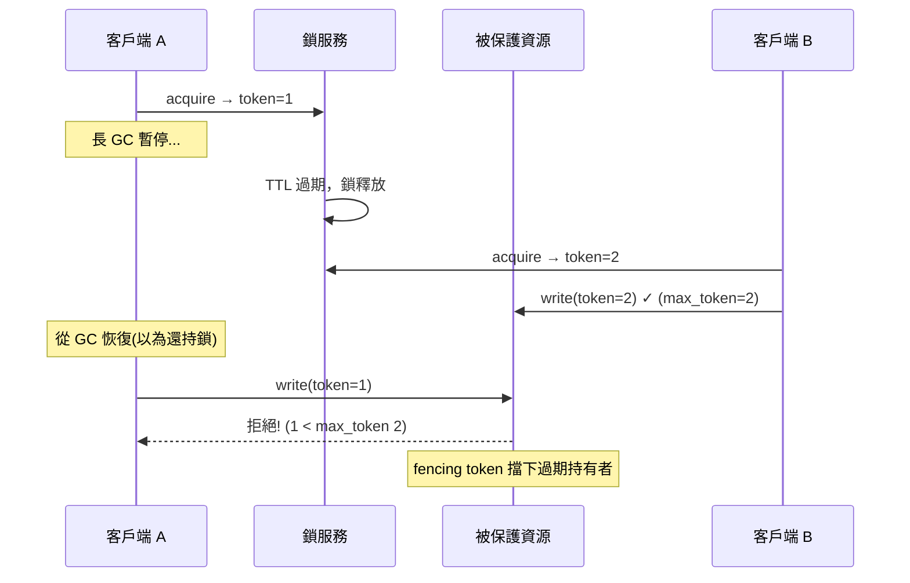

# 分散式鎖

> 單機用 `threading.Lock` 就能保護共享資源，但跨機器呢？多個服務實例要搶同一個資源（同一筆訂單、同一個庫存），需要**分散式鎖（distributed lock）**。但它比想像中危險——持鎖者可能卡住、鎖可能過期，一不小心就有兩個人同時持鎖。這章講分散式鎖的實作與陷阱。

## Why（為什麼）

單機內，多執行緒搶共享資源用 [`threading.Lock`](../09-concurrency/README.md)——同一行程內的鎖。但微服務環境是**多台機器、多個行程**：訂單服務跑 5 個實例，若兩個實例同時處理同一筆訂單的「扣庫存」，就可能**重複扣**、**超賣**。這時需要一個**跨行程、跨機器**的鎖——**分散式鎖**。

典型場景：

- **防止重複處理**：同一個定時任務在多實例上只該執行一次（leader election / 互斥）。
- **保護共享資源**：多實例更新同一筆資料時序列化（避免 race condition）。
- **協調**：確保某操作全系統同一時刻只有一個執行者。

分散式鎖通常用 **Redis**（`SET key value NX EX`）、**ZooKeeper/etcd**（臨時節點）實作。聽起來簡單，但**分散式鎖出了名地難做對**——因為分散式環境有單機沒有的問題：持鎖的節點可能**GC 暫停**、**網路分區**、**崩潰**，導致「它以為自己還持鎖，鎖卻已過期被別人拿走」→ **兩個節點同時持鎖** → 正是鎖要防止的災難。這章講清楚正確實作與 **fencing token** 這個關鍵防護。它連結[一致性](02-consistency-models.md)、[冪等](06-idempotency.md)。

## Theory（理論：分散式鎖的要求與危險）

**一個正確的分散式鎖要滿足**：

- **互斥（mutual exclusion）**：任一時刻最多一個持有者。
- **無死鎖（deadlock-free）**：持有者崩潰後鎖要能釋放（否則永久卡住）——所以鎖要有**過期時間（TTL）**。
- **容錯**：鎖服務本身要夠可靠。

**核心矛盾——TTL 帶來的危險**：為了避免「持有者崩潰後鎖永不釋放」，鎖必須有 TTL（如 30 秒後自動過期）。但這引入了致命問題：

**如果持有者在 TTL 內「還沒做完但被卡住了」怎麼辦？** 場景：實例 A 拿到鎖（TTL 30 秒），開始處理，但中途發生**長時間 GC 暫停**（或網路延遲、行程被凍結）40 秒。這期間鎖 TTL 到期、自動釋放，實例 B 拿到鎖開始處理。然後 A 從 GC 恢復——**它不知道自己的鎖已經過期**，繼續操作共享資源。此刻 **A 和 B 同時在操作** → 互斥被打破 → 資料損壞。這是分散式鎖最經典的陷阱，**單純的「鎖 + TTL」無法防止**。

**解法——fencing token（柵欄令牌）**：鎖服務每次授予鎖時，附一個**單調遞增的 token**（1, 2, 3…）。持有者操作共享資源時**帶上這個 token**，而**被保護的資源（如儲存）檢查 token**：只接受「token ≥ 目前見過的最大 token」的操作，拒絕較小的。這樣：A 拿到 token=33，卡住；B 拿到 token=34，寫入（資源記住 34）；A 恢復後帶 token=33 來寫 → 資源發現 33 < 34 → **拒絕**。即使 A 誤以為自己持鎖，它的過期操作也被 fencing token 擋下。**這是分散式鎖真正安全的關鍵。**

## Specification（規範：Redis 鎖與 fencing）

**基本 Redis 鎖**：

```python
# 取鎖：SET key unique_value NX EX ttl（NX=不存在才設、EX=過期秒數）
acquired = redis.set("lock:order:123", unique_token, nx=True, ex=30)

# 釋放：只有「持有者本人」能釋放（比對 unique_value，用 Lua 原子執行）
# 若直接 DEL 可能刪到「別人的鎖」（你的過期了、別人拿了新的）
```

**關鍵細節**：

- **`NX`（僅當不存在時設定）**：保證原子地「檢查 + 取鎖」，避免兩個同時取到。
- **`EX`（TTL）**：防持有者崩潰後死鎖。
- **釋放要驗證持有者**：用唯一值標記自己的鎖，釋放時比對（且用 Lua 腳本原子執行「比對 + 刪除」）——否則可能刪到別人的鎖。
- **fencing token**：取鎖時取得單調遞增 token，操作資源時帶上，資源端檢查。

**Redlock 演算法**（Redis 多節點鎖）：向多個獨立 Redis 節點取鎖，多數成功才算取得——提升容錯。但它有爭議（Martin Kleppmann 質疑其在時鐘/GC 下的安全性），**fencing token 仍是更根本的保護**。

**別重造**：用 `redis-py` 的鎖、`redlock-py`，或 ZooKeeper/etcd 的鎖原語。

## Implementation（底層：為何 fencing token 才是根本）

**「鎖 + TTL」的安全漏洞無法靠調參解決**：有人會想「把 TTL 設長一點就好」——但你**無法預知**最壞的 GC 暫停/網路延遲多長，設多長都可能被超過。也有人想「持有者定期續期（續租）」——但續期請求本身也可能因為 GC/網路延遲而遲到，鎖仍可能在續期成功前過期。**根本問題是：持有者無法可靠地知道「我現在還持有鎖嗎」**——它以為持有，但世界（鎖服務）可能已經改變。任何「持有者自己判斷」的方案都不可靠。

**fencing token 把安全性從「持有者的判斷」轉移到「資源的驗證」**：關鍵洞見是——不要求「持有者知道自己是否還持鎖」（做不到），而是讓**被保護的資源**來把關。資源維護「見過的最大 token」，只接受更大或相等的 token。這樣即使一個過期的持有者（帶舊 token）誤以為自己持鎖並發來操作，**資源會根據 token 大小拒絕它**——安全性由資源端的單調 token 檢查保證，不依賴任何節點對「自己是否持鎖」的（不可靠的）判斷。這就是為何 fencing token 是分散式鎖真正安全的解，而單純的鎖+TTL 不是。

**代價與限制**：fencing token 要求**被保護的資源支援 token 檢查**（能記住並比對最大 token）——不是所有資源都能改造。若資源無法支援（如呼叫一個不認 token 的外部 API），那就只能盡量降低風險（合理 TTL + 續期 + 冪等），並接受「鎖不是絕對安全」。這也是為何很多場景**用[冪等](06-idempotency.md)設計來容忍「偶爾兩個持有者」**，比追求完美的鎖更務實。下面範例實作鎖 + fencing token。

## Code Example（可執行的 Python 範例）

```python
# distributed_lock.py — 分散式鎖 + fencing token 防過期持有者（純標準庫，可執行）
from __future__ import annotations


class LockService:
    """發鎖並附單調遞增的 fencing token。"""

    def __init__(self) -> None:
        self._holder: str | None = None
        self._token = 0

    def acquire(self, client: str) -> int | None:
        """取鎖成功回 fencing token，失敗回 None。"""
        if self._holder is not None:
            return None
        self._holder = client
        self._token += 1
        return self._token

    def expire(self) -> None:
        """模擬 TTL 過期，鎖自動釋放。"""
        self._holder = None

    def release(self, client: str) -> None:
        if self._holder == client:
            self._holder = None


class ProtectedResource:
    """被保護的資源：只接受 token >= 見過的最大 token（fencing）。"""

    def __init__(self) -> None:
        self.max_token = 0
        self.data: list[str] = []

    def write(self, value: str, token: int) -> bool:
        """fencing 檢查：拒絕過期持有者（較小 token）的寫入。"""
        if token < self.max_token:
            return False  # 過期的持有者，拒絕
        self.max_token = token
        self.data.append(value)
        return True


def main() -> None:
    lock = LockService()
    resource = ProtectedResource()

    # 客戶端 A 取鎖，得 token=1
    token_a = lock.acquire("A")
    print(f"A 取鎖，token={token_a}")

    # A 卡住（長 GC 暫停）→ 鎖 TTL 過期自動釋放
    lock.expire()
    print("A 卡住(GC)，鎖 TTL 過期")

    # 客戶端 B 取鎖，得 token=2，寫入成功
    token_b = lock.acquire("B")
    print(f"B 取鎖，token={token_b}")
    assert token_b is not None
    print(f"B 寫入(token=2): {resource.write('B 的資料', token_b)}")

    # A 從 GC 恢復，誤以為自己還持鎖，帶舊 token=1 來寫
    assert token_a is not None
    ok = resource.write("A 的過期資料", token_a)
    print(f"A 恢復後寫入(token=1): {ok}  ← fencing token 擋下過期持有者！")
    print(f"資源最終資料: {resource.data}（只有 B 的，A 的被擋）")


if __name__ == "__main__":
    main()
```

**預期輸出**：

```pycon
$ python distributed_lock.py
A 取鎖，token=1
A 卡住(GC)，鎖 TTL 過期
B 取鎖，token=2
B 寫入(token=2): True
A 恢復後寫入(token=1): False  ← fencing token 擋下過期持有者！
資源最終資料: ['B 的資料']（只有 B 的，A 的被擋）
```

逐段解說：

- **`LockService`**：發鎖時附**單調遞增的 fencing token**（A 得 1、B 得 2）。
- **A 取鎖 → 卡住 → TTL 過期**：A 拿到 token=1，但長 GC 暫停中鎖 TTL 過期自動釋放——此時 A **不知道**自己的鎖沒了。
- **B 取鎖 → 寫入**：B 拿到 token=2，寫入資源（資源記住 max_token=2）。
- **A 恢復後的過期寫入被擋**：A 從 GC 恢復，**誤以為自己還持鎖**，帶舊 token=1 來寫。但資源檢查 `1 < max_token(2)` → **拒絕**（`False`）。即使 A 和 B 都「以為」自己持鎖，A 的過期操作被 fencing token 擋下。
- **最終只有 B 的資料**：互斥的安全性由資源端的 token 檢查保證，不依賴 A 對「自己是否持鎖」的錯誤判斷。
- **要點**：單純「鎖 + TTL」擋不住「持有者卡住→鎖過期→兩人同時持鎖」；fencing token 讓資源端拒絕過期持有者的操作，才是根本安全。

## Diagram（圖解：fencing token 防過期持有者）



## Best Practice（最佳實踐）

- **鎖一定要有 TTL**：防持有者崩潰後死鎖。
- **用 fencing token 防過期持有者**：資源端檢查單調 token，這才是根本安全。
- **釋放鎖要驗證持有者身分**（唯一值 + Lua 原子比對刪除）：別刪到別人的鎖。
- **取鎖用原子的 `SET NX EX`**：避免「檢查 + 設定」的 race。
- **盡量用[冪等](06-idempotency.md)設計容忍偶發雙持有者**：比追求完美鎖更務實。
- **別重造分散式鎖**：用 redis-py 鎖、redlock、ZooKeeper/etcd 原語。
- **鎖服務要高可用**：它是關鍵協調點。
- **鎖粒度適中**：太粗（一把大鎖）扼殺並發、太細（大量鎖）開銷大且易死鎖。

## Common Mistakes（常見誤解）

- **鎖沒 TTL**：持有者崩潰 → 鎖永不釋放 → 全體卡死。
- **只有鎖 + TTL、沒有 fencing token**：持有者卡住→鎖過期→兩人同時持鎖→資料損壞。
- **以為「TTL 設長一點」就安全**：無法預知最壞的 GC/延遲，設多長都可能被超過。
- **直接 DEL 釋放鎖**：可能刪到別人的鎖（你的過期了、別人拿了新的）；要驗證持有者。
- **非原子的「檢查存在 + 設定」**：兩個客戶端同時取到鎖；用 `SET NX`。
- **自己手刻分散式鎖**：微妙的競態與安全漏洞；用成熟方案。
- **過度依賴鎖而不用冪等**：鎖不是絕對安全；冪等更能容錯。
- **鎖粒度過粗**：一把大鎖序列化所有操作，扼殺並發。

## Interview Notes（面試重點）

- **能說出分散式鎖的三要求**：互斥、無死鎖（需 TTL）、容錯。
- **能講「鎖 + TTL」的致命陷阱**：持有者 GC/延遲卡住 → 鎖過期 → 兩人同時持鎖。
- **能解釋 fencing token 為何是根本解**：把安全性從「持有者判斷」轉到「資源端的單調 token 檢查」。
- **知道 Redis 鎖的細節**：`SET NX EX`、釋放要驗證持有者、Lua 原子性。
- **知道 Redlock 及其爭議**，以及 fencing token 更根本。
- **知道務實做法是「合理鎖 + 冪等容錯」**，別追求完美鎖；別重造輪子。

---

➡️ 下一章：[訊息佇列與事件驅動 (Kafka / RabbitMQ)](04-message-queue.md)

[⬆️ 回 Part 22 索引](README.md)
