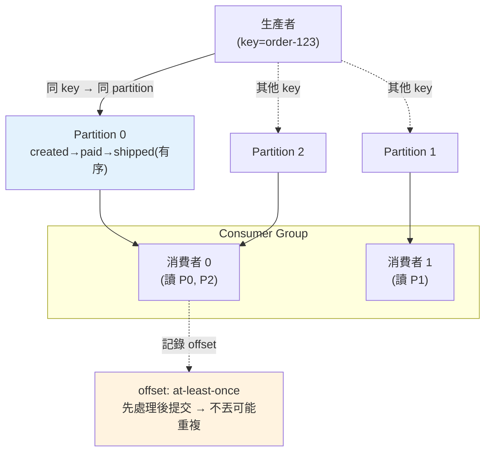

# 訊息佇列與事件驅動 (Kafka / RabbitMQ)

> 訊息佇列是分散式系統的骨架——它解耦服務、削峰填谷、可靠地傳遞事件。但 Kafka 和 RabbitMQ 是兩種不同哲學的工具，投遞語意（至少一次/最多一次/剛好一次）也常令人困惑。這章講訊息佇列的核心概念、兩大工具的差異、以及投遞保證。

## 💡 白話導讀（建議先讀）

[事件驅動章](../16-architecture/10-event-driven-mq.md)立了「公告欄」的世界觀;
這章比較兩個最主流的公告欄實作——它們是**兩種完全不同的哲學**:

- **RabbitMQ ＝郵局**:信件（訊息）投遞給收件人,**簽收後就銷毀**。
  強項是**靈活路由**(exchange 依規則分發、優先級、延遲投遞)與任務佇列。
  broker 主動推送、逐則追蹤簽收。
- **Kafka ＝報社檔案室**:報紙（事件）**永久存檔**（可設保留期）,
  讀者**自己記得讀到第幾期**（offset）,隨時可以**回頭重讀**。
  強項是**超高吞吐的事件流**:新訂閱者可從頭重放歷史、
  多組讀者互不干擾地各讀各的——事件溯源、資料管線的基石。

選型口訣:**任務分發、複雜路由選 RabbitMQ;事件流、要重放、高吞吐選 Kafka**。

第二個重點是**投遞語意**——訊息系統對「送達」的三種承諾:

- **至多一次**:可能丟,絕不重複(丟了就丟了,適合可容忍遺失的指標數據)。
- **至少一次**:絕不丟,**但可能重複**——這是實務預設,
  也是為什麼[下下章的冪等](06-idempotency.md)是必修:消費者必須「處理兩次結果不變」。
- **精確一次**:最貴,通常是「至少一次＋冪等消費」拼出來的效果,而非魔法。

這章用 Python 客戶端各跑一遍兩家系統,並示範 ack、重試、
死信佇列(處理不了的訊息別無限重試,進隔離區人工處理)。

## Why（為什麼）

[微服務](../21-microservices/03-service-communication.md) 的非同步通訊、[事件驅動架構](../16-architecture/10-event-driven-mq.md) 的核心，都是**訊息佇列（message queue / message broker）**。它讓服務之間**不直接呼叫**，而是透過中間的佇列傳遞訊息：

- **解耦**：生產者發訊息就走，不需知道誰消費、消費者是否在線。
- **削峰填谷**：流量暴增時佇列緩衝，消費者按自己的速度處理，不被瞬間壓垮。
- **可靠**：消費者掛了，訊息留在佇列，恢復後繼續——不丟訊息。
- **一對多**：一個事件多個訂閱者各自反應（pub/sub）。

但用訊息佇列要面對幾個核心問題，常是面試與實務的難點：

- **選哪個工具？** Kafka 和 RabbitMQ 哲學不同，適用場景不同。
- **投遞保證是什麼？** 訊息會不會丟？會不會重複？——「至少一次」「最多一次」「剛好一次」的差別。
- **順序怎麼保證？** 多消費者並行時訊息還有序嗎？
- **失敗了怎麼辦？** 處理失敗的訊息去哪（死信佇列）？

理解這些，才能正確地用訊息佇列建可靠的分散式系統。這章講清楚，並連結[冪等](06-idempotency.md)（處理重複的關鍵）。

## Theory（理論：兩種哲學與投遞語意）

**Kafka vs RabbitMQ——兩種不同的設計哲學**：

| 面向 | RabbitMQ（傳統訊息佇列） | Kafka（分散式日誌） |
|------|------------------------|-------------------|
| 模型 | 訊息**佇列**（消費後移除） | 持久**日誌**（訊息保留，可重讀） |
| 定位 | 靈活的訊息路由、任務佇列 | 高吞吐事件流、事件溯源 |
| 消費 | broker 推送、追蹤每則的確認 | consumer 拉取、自己記 offset |
| 順序 | 單佇列有序 | 單 partition 內有序 |
| 保留 | 消費後刪除 | 保留一段時間（可重播） |
| 吞吐 | 中高 | 極高（百萬級/秒） |

- **RabbitMQ**：傳統的**訊息代理**，擅長**靈活路由**（exchange/routing key）與**任務佇列**（work queue）。訊息被消費確認後就移除。適合「命令/任務分派」場景。
- **Kafka**：本質是**分散式的持久化日誌**。訊息寫進 **partition（分區）**，**保留**一段時間，消費者用 **offset（位移）** 記錄讀到哪。適合**高吞吐事件流**、**事件溯源**、**可重播**（重設 offset 重讀歷史）。

**投遞語意（delivery semantics）**——訊息傳遞的三種保證：

- **最多一次（at-most-once）**：訊息可能丟失，但**不會重複**。發了不確認、不重試。適合「丟了也沒差」（如度量取樣）。
- **至少一次（at-least-once）**：訊息**不會丟失**，但**可能重複**（失敗會重試）。**最常見**的保證。代價是**消費者必須[冪等](06-idempotency.md)**（處理兩次結果一致）。
- **剛好一次（exactly-once）**：不丟不重複——**最理想但最難**。純粹的 exactly-once 在分散式下幾乎不可能，通常是「at-least-once + 冪等/去重」在效果上達成，或用 Kafka 的交易機制在特定範圍實現。

**關鍵認知**：實務多用 **at-least-once + 消費者冪等**——接受「訊息可能重複」，靠冪等設計讓重複無害。

## Specification（規範：核心概念）

**Kafka 概念**：

- **Topic（主題）**：訊息的分類（如 `order.placed`）。
- **Partition（分區）**：topic 切成多個 partition 平行處理。**同一 partition 內有序**，跨 partition 不保證。用訊息的 key 決定進哪個 partition（同 key 進同 partition → 保序）。
- **Consumer Group（消費者群組）**：一組消費者**分工**消費一個 topic——每個 partition 只分給群組內**一個**消費者，實現**負載平衡 + 順序**。
- **Offset（位移）**：消費者記錄「讀到 partition 的哪個位置」，決定投遞語意（何時提交 offset）。

**投遞語意由 offset 提交時機決定**：

```text
先處理、後提交 offset  → at-least-once（處理成功但提交前崩潰 → 重讀 → 重複）
先提交 offset、後處理  → at-most-once（提交後崩潰 → 沒處理 → 丟失）
```

**RabbitMQ 概念**：Exchange（路由）→ Queue（佇列）→ Consumer；ack（確認）機制；死信佇列（DLQ）。

**死信佇列（Dead Letter Queue, DLQ）**：處理失敗（重試多次仍失敗）的訊息送到 DLQ，避免無限重試卡住、也不丟失——之後人工/程式處理。

## Implementation（底層：offset、consumer group、保序）

**offset 如何決定投遞語意**：Kafka 消費者從 partition 讀訊息、處理、然後**提交 offset**（記錄「我讀到這了」）。崩潰重啟後從「上次提交的 offset」繼續。關鍵在**何時提交**：

- **先處理成功、再提交 offset**（at-least-once）：若「處理完但還沒提交 offset」時崩潰，重啟後從舊 offset 重讀 → **同一則被處理兩次**（重複，但不丟）。這是最常用的——**寧可重複也不丟**，靠冪等消化重複。
- **先提交 offset、再處理**（at-most-once）：若「提交了但還沒處理完」時崩潰，重啟後從新 offset 開始 → **那則沒被處理**（丟失，但不重複）。

所以「不丟」和「不重複」的取捨，本質是「offset 提交」和「訊息處理」的順序——而分散式下這兩步無法原子完成，故總有一邊風險。實務選「至少一次（不丟）+ 冪等（消化重複）」。

**consumer group 如何負載平衡 + 保序**：一個 topic 有多個 partition，一個 consumer group 有多個消費者。Kafka 把每個 partition **分配給群組內一個消費者**（一個消費者可拿多個 partition，但一個 partition 只給一個消費者）。這達成：**負載平衡**（partition 分散給多個消費者並行）+ **partition 內保序**（同一 partition 只有一個消費者、順序處理）。要保證「同一實體的事件有序」（如同一訂單的所有事件），就用該實體 id 當 **key**，讓它們都進同一 partition → 被同一消費者按序處理。跨 partition 則無全域順序——這是「吞吐（多 partition 並行）」與「全域順序」的取捨。

下面範例模擬 partition 分配、consumer group 分工、與 at-least-once 的重複。

## Code Example（可執行的 Python 範例）

```python
# message_queue.py — partition 保序 + consumer group + at-least-once（純標準庫）
from __future__ import annotations

from collections import defaultdict


def partition_for(key: str, num_partitions: int) -> int:
    """同 key 進同 partition → 同實體事件保序（用確定性雜湊）。"""
    return sum(key.encode()) % num_partitions


class Topic:
    """模擬 Kafka topic：多 partition，同 key 保序。"""

    def __init__(self, num_partitions: int) -> None:
        self.num_partitions = num_partitions
        self.partitions: dict[int, list[str]] = defaultdict(list)

    def produce(self, key: str, msg: str) -> int:
        p = partition_for(key, self.num_partitions)
        self.partitions[p].append(msg)
        return p


def assign_partitions(num_partitions: int, num_consumers: int) -> dict[int, int]:
    """consumer group：每個 partition 分給一個消費者（負載平衡）。"""
    return {p: p % num_consumers for p in range(num_partitions)}


def main() -> None:
    topic = Topic(num_partitions=3)

    # 同一訂單的事件用同 key → 進同 partition → 保序
    for event in ("created", "paid", "shipped"):
        p = topic.produce("order-123", f"order-123:{event}")
    print(f"order-123 的 3 個事件都在 partition {p}（保序）:")
    print(f"  {topic.partitions[p]}")

    # consumer group：3 partition 分給 2 消費者
    assignment = assign_partitions(num_partitions=3, num_consumers=2)
    print(f"\npartition → 消費者 分配: {assignment}")
    print("  (每個 partition 只給一個消費者 → 負載平衡 + partition 內保序)")

    # at-least-once：處理成功但提交 offset 前崩潰 → 重讀 → 重複
    processed: list[str] = []

    def consume_at_least_once(messages: list[str], crash_after: int) -> None:
        for i, msg in enumerate(messages):
            processed.append(msg)  # 先處理
            if i == crash_after:  # 提交 offset 前崩潰
                return  # offset 沒提交 → 重啟後從頭重讀

    msgs = ["m0", "m1", "m2"]
    consume_at_least_once(msgs, crash_after=1)  # 處理 m0,m1 後崩潰(offset 未提交)
    consume_at_least_once(msgs, crash_after=99)  # 重啟：從頭重讀全部
    print(f"\nat-least-once 處理紀錄: {processed}")
    print("  m0,m1 被處理兩次(重複) → 消費者需冪等消化重複")


if __name__ == "__main__":
    main()
```

**預期輸出**：

```pycon
$ python message_queue.py
order-123 的 3 個事件都在 partition 0（保序）:
  ['order-123:created', 'order-123:paid', 'order-123:shipped']

partition → 消費者 分配: {0: 0, 1: 1, 2: 0}
  (每個 partition 只給一個消費者 → 負載平衡 + partition 內保序)

at-least-once 處理紀錄: ['m0', 'm1', 'm0', 'm1', 'm2']
  m0,m1 被處理兩次(重複) → 消費者需冪等消化重複
```

逐段解說：

- **partition 保序**：同一訂單（key=`order-123`）的三個事件用同 key → `partition_for` 算出同一個 partition → 依序存放。**同 key 進同 partition 保證同實體事件有序**（跨 partition 則無全域序）。
- **consumer group 分配**：3 個 partition 分給 2 個消費者（`{0:0, 1:1, 2:0}`）——每個 partition 只給一個消費者，達成負載平衡（並行）+ partition 內保序（單一消費者按序）。
- **at-least-once 重複**：消費者處理 m0、m1 後、**提交 offset 前崩潰** → offset 沒更新 → 重啟從頭重讀 → m0、m1 **被處理兩次**。處理紀錄是 `[m0, m1, m0, m1, m2]`——重複出現。這正是「至少一次」的特徵：不丟（m2 最終有處理）但可能重複。
- **要點**：Kafka 用 partition（保序 + 並行）+ consumer group（分工）+ offset（投遞語意）。at-least-once（先處理後提交 offset）不丟但會重複 → **消費者必須[冪等](06-idempotency.md)**。

## Diagram（圖解：Kafka topic / partition / consumer group）



## Best Practice（最佳實踐）

- **選對工具**：高吞吐事件流/可重播/事件溯源用 Kafka；靈活路由/任務佇列用 RabbitMQ。
- **用 at-least-once + 消費者[冪等](06-idempotency.md)**：接受重複、靠冪等消化，這是可靠的務實組合。
- **同實體事件用同 key 進同 partition**：保證該實體的事件有序。
- **offset 提交在處理成功之後**（at-least-once）：寧可重複也不丟。
- **設死信佇列（DLQ）**：處理多次失敗的訊息送 DLQ，別無限重試卡住、也不丟。
- **消費者失敗要能重試**（配退避），且操作冪等。
- **監控消費延遲（consumer lag）**：消費跟不上生產是重要告警。
- **依吞吐/順序需求決定 partition 數**：多 partition 高吞吐，但犧牲全域順序。

## Common Mistakes（常見誤解）

- **消費者不冪等卻用 at-least-once**：重複訊息 → 重複扣款/重複寄信。
- **以為能輕易做到 exactly-once**：純 exactly-once 極難；通常是 at-least-once + 冪等/去重。
- **先提交 offset 後處理**：崩潰時訊息丟失（at-most-once），非預期。
- **期待跨 partition 全域有序**：只有 partition 內有序；要保序就同 key。
- **不設 DLQ**：失敗訊息無限重試卡住佇列，或直接丟失。
- **用 Kafka 當普通任務佇列 / 用 RabbitMQ 硬撐超高吞吐事件流**：工具用錯場景。
- **不監控 consumer lag**：消費跟不上，訊息積壓爆炸沒人知道。
- **重試無退避**：對下游狂重試，加劇壓力。

## Interview Notes（面試重點）

- **能對比 Kafka（分散式日誌、高吞吐、可重播、offset）與 RabbitMQ（訊息佇列、靈活路由、消費即刪）** 的哲學與適用。
- **能講三種投遞語意**：at-most-once（丟不重）、at-least-once（不丟可能重，最常用）、exactly-once（最難），並知道實務用「at-least-once + 冪等」。
- **能解釋 offset 提交時機如何決定 at-least/at-most-once**。
- **能講 Kafka 的 partition（保序 + 並行）+ consumer group（分工）**，以及「同 key 同 partition 保序」。
- **知道消費者必須冪等**（因重複）、死信佇列處理失敗、監控 consumer lag。
- **知道「partition 數 vs 全域順序」的取捨**。

---

➡️ 下一章：[快取策略與一致性](05-caching-strategies.md)

[⬆️ 回 Part 22 索引](README.md)
