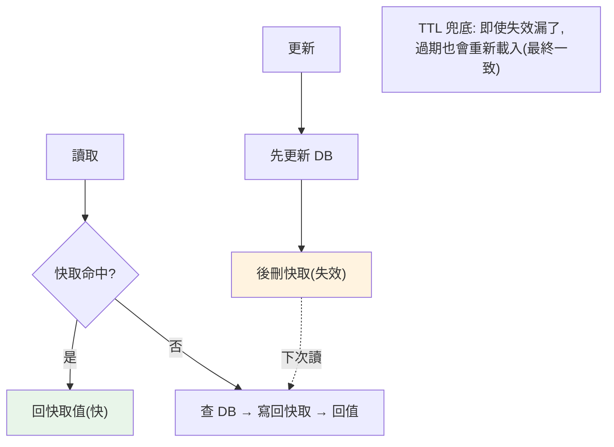

# 快取策略與一致性

> 快取是分散式系統效能的關鍵——把熱資料放記憶體，避免每次都打慢速的資料庫。但快取引入了一個經典難題：**快取與資料源如何保持一致**？「快取失效是電腦科學兩大難題之一」不是玩笑。這章講快取的讀寫策略、一致性問題與經典陷阱。

## 💡 白話導讀（建議先讀）

[Redis 章](../15-database/18-redis.md)的「櫃檯便條」解決了**讀得快**;
這章解決便條的**管理學**:便條和倉庫帳本(資料庫)怎麼保持一致?
便條大規模出事怎麼辦?

**讀寫策略**,主流就一套——**Cache-Aside(旁路快取)**:
讀:先看便條,沒有→進倉庫查→**抄一份貼上**→回覆。
寫:**先更新帳本,再撕掉便條**(刪除,不是更新)。
為什麼是「撕」不是「改」?改便條容易寫出競態(兩個寫入交錯,舊值蓋新值);
撕掉讓下一個讀的人去倉庫抄最新的,簡單且錯誤視窗小。
(順序也講究:先更 DB 再刪快取——反過來,刪完便條、DB 還沒更新完,
別人就把舊值抄回來了。)

再認識三個以「災難」為名的經典故障,面試必考:

- **雪崩(avalanche)**:大量便條**同時過期**→請求全體衝進倉庫→資料庫被壓垮。
  解法:過期時間加**隨機抖動**,別讓便條約好一起死。
- **穿透(penetration)**:一直有人問**根本不存在**的東西→便條永遠沒有→每次都進倉庫。
  解法:「查無此物」也貼張便條(快取空值),或布隆過濾器擋在門口。
- **擊穿(breakdown)**:一張**超熱門**便條剛好過期→萬人同一瞬間衝倉庫。
  解法:只放一個人進去抄(互斥重建),其他人等他貼回來;或熱點永不過期、背景刷新。

這章用 Python + Redis 把策略與三大災難的防護逐一實作。

## Why（為什麼）

資料庫查詢慢（磁碟 I/O、複雜查詢、[N+1](../15-database/20-n-plus-1.md)），而很多資料被**重複讀取**（熱門商品、使用者資料）。**快取**把這些熱資料放在快速的儲存（記憶體、Redis），讓讀取**命中快取**時免去打資料庫——延遲從幾十毫秒降到亞毫秒，資料庫壓力大減。在讀多寫少的系統（多數 Web 應用），快取是**最有效的效能優化之一**。

但快取帶來一個根本問題：**你現在有兩份資料——快取裡的和資料源（DB）裡的。當資料源更新了，快取裡的就過時了。** 於是：

- **一致性**：怎麼確保讀到的快取不是過時的髒資料？何時、如何讓快取失效？
- **失效時機**：更新資料時，是更新快取還是刪除快取？順序如何？並發下會不會產生髒資料？
- **雪崩問題**：大量快取同時過期、或熱點 key 失效瞬間大量請求打向 DB（thundering herd）怎麼辦？

有句名言：**「電腦科學只有兩件難事：快取失效（cache invalidation）和命名。」** 快取失效之所以難，正是因為「保持兩份資料一致」在並發與分散式下充滿微妙的陷阱。這章講清楚讀寫策略、一致性取捨與經典問題的解法。它承接 [Redis 快取](../15-database/18-redis.md)、[一致性模型](02-consistency-models.md)。

## Theory（理論：讀寫策略）

**讀取策略**：

- **Cache-Aside（旁路快取，最常用）**：應用先查快取——**命中**就回；**未命中**就查 DB、**寫回快取**、再回。應用主動管理快取。簡單、通用。缺點：未命中時多一次往返；首次一定 miss。
- **Read-Through（讀穿透）**：應用只跟快取打交道，快取自己負責在 miss 時去 DB 載入。邏輯封裝在快取層。

**寫入策略**：

- **Write-Through（寫穿透）**：寫入時**同時**更新快取和 DB（同步）。快取永遠是最新（一致性好），但寫入較慢（要寫兩處）。
- **Write-Back / Write-Behind（寫回）**：寫入時只更新快取，**稍後非同步**批次寫回 DB。寫入快，但 DB 短暫落後、快取掛了有丟資料風險。
- **Write-Around（繞寫）**：寫入直接寫 DB、**不寫快取**（讓下次讀取時 cache-aside 載入）。適合寫入的資料不常立即被讀。

**失效 vs 更新**——更新資料時，對快取做什麼？

- **失效（invalidate / delete）**：刪除快取項，讓下次讀取重新從 DB 載入。**通常優於更新**——簡單、避免並發更新快取的競態。
- **更新（update）**：直接把新值寫進快取。省一次 miss，但並發下容易產生髒資料（見 Implementation）。

**主流組合：Cache-Aside 讀 + 更新 DB 後刪除快取（invalidate）**——這是最常見且相對安全的模式。

## Specification（規範：cache-aside 與失效）

**Cache-Aside 讀取**：

```python
def get_user(user_id):
    key = f"user:{user_id}"
    cached = cache.get(key)
    if cached is not None:
        return cached                    # 命中
    user = db.query(user_id)             # 未命中 → 查 DB
    cache.set(key, user, ttl=300)        # 寫回快取（設 TTL）
    return user
```

**更新資料 + 失效快取**：

```python
def update_user(user_id, data):
    db.update(user_id, data)             # 先更新 DB
    cache.delete(f"user:{user_id}")      # 再刪快取（下次讀重新載入）
```

**關鍵細節**：

- **設 TTL（過期時間）**：即使失效邏輯有漏，TTL 也能兜底（最終一致）——**永遠設 TTL**。
- **「更新 DB 後刪快取」而非「先刪快取後更新 DB」**：順序影響並發下的一致性（見下）。
- **接受最終一致**：快取與 DB 間總有短暫不一致窗口（見 [一致性](02-consistency-models.md)）；分散式快取難做到強一致。

**經典問題與解法**：

- **快取穿透（cache penetration）**：查一個**不存在**的 key，每次都 miss 打 DB。解法：快取空值（null）、布隆過濾器。
- **快取擊穿（hotspot invalidation / thundering herd）**：熱點 key 過期瞬間，大量請求同時 miss 打 DB。解法：互斥重建（只讓一個請求重建、其他等）、邏輯過期、永不過期 + 背景刷新。
- **快取雪崩（cache avalanche）**：大量 key 同時過期，DB 瞬間壓力暴增。解法：TTL 加隨機抖動（錯開過期時間）。

## Implementation（底層：失效順序與並發髒資料）

**為何「更新後刪快取」優於「更新快取」**：考慮並發——兩個請求同時更新使用者資料。若採「**更新快取**」策略：請求 A 把 DB 設為 v1、請求 B 把 DB 設為 v2（B 後到，DB 最終是 v2）；但更新快取時可能亂序——A 的快取寫入慢到、蓋掉了 B 的 → **快取是 v1、DB 是 v2**，髒資料。而「**刪快取**」策略：兩個請求都是「更新 DB 後刪快取」，不管順序，最後快取都是「空的」→ 下次讀取從 DB 載入最新的 v2 → 一致。刪除是冪等的、不會殘留舊值，所以**失效比更新安全**。

**為何「先更新 DB、後刪快取」而非反過來**：若「先刪快取、後更新 DB」，在兩步之間，另一個讀請求 miss → 從 DB 讀到**舊值** → 寫回快取 → 然後你才更新 DB。結果快取又是舊值（髒）。「先更新 DB、後刪快取」則沒有這個窗口（更新完 DB 才刪快取，之後的讀取都會載入新值）。不過這順序仍有極小的競態窗口（如刪快取失敗），所以**TTL 兜底**很重要——即使某次失效漏了，TTL 到期也會強制重新載入，達成最終一致。

**thundering herd（快取擊穿）為何危險與解法**：一個超熱門的 key（如首頁資料）過期的**那一瞬間**，成千上萬個並發請求同時 cache miss、同時打向 DB 去重建——DB 被瞬間壓垮（明明只需要一次重建）。解法是**互斥重建**：miss 時用一個[鎖](03-distributed-lock.md)，只讓**第一個**請求去查 DB 重建快取，其他請求**等待**它重建完再讀快取——把「N 次 DB 查詢」變成「1 次」。下面範例展示 cache-aside、失效、與互斥重建防擊穿。

## Code Example（可執行的 Python 範例）

```python
# caching_strategies.py — cache-aside + 失效 + 防擊穿（純標準庫，可執行）
from __future__ import annotations


class Database:
    def __init__(self) -> None:
        self.data = {"user:1": "alice"}
        self.query_count = 0

    def query(self, key: str) -> str | None:
        self.query_count += 1
        return self.data.get(key)

    def update(self, key: str, value: str) -> None:
        self.data[key] = value


class CacheAside:
    """Cache-Aside：讀先查快取(miss 查 DB 寫回)、寫更新 DB 後刪快取。"""

    def __init__(self, db: Database) -> None:
        self.db = db
        self.cache: dict[str, str] = {}

    def get(self, key: str) -> str | None:
        if key in self.cache:  # 命中
            return self.cache[key]
        value = self.db.query(key)  # 未命中 → 查 DB
        if value is not None:
            self.cache[key] = value  # 寫回快取
        return value

    def update(self, key: str, value: str) -> None:
        self.db.update(key, value)  # 先更新 DB
        self.cache.pop(key, None)  # 後刪快取(失效，下次讀重新載入)


def main() -> None:
    db = Database()
    cache = CacheAside(db)

    # 第一次讀：miss → 查 DB → 寫回快取
    print(f"第一次讀 user:1 = {cache.get('user:1')}（DB 查詢 {db.query_count} 次）")
    # 第二次讀：命中快取 → 不查 DB
    print(f"第二次讀 user:1 = {cache.get('user:1')}（DB 查詢仍 {db.query_count} 次，命中快取）")

    # 更新：更新 DB 後刪快取
    cache.update("user:1", "alice_new")
    print(f"\n更新後快取已失效: {'user:1' not in cache.cache}")
    # 下次讀：miss → 從 DB 載入最新值（一致）
    print(f"更新後讀取 = {cache.get('user:1')}（重新從 DB 載入最新值）")

    # 防擊穿：熱點 key 失效時，互斥重建（只查一次 DB）
    db2 = Database()
    shared_cache: dict[str, str] = {}
    rebuild_lock = {"locked": False}
    db_hits = {"n": 0}

    def get_with_mutex(key: str) -> str | None:
        if key in shared_cache:
            return shared_cache[key]
        # miss：只讓一個請求重建（其他若已在重建就直接等結果）
        if not rebuild_lock["locked"]:
            rebuild_lock["locked"] = True
            db_hits["n"] += 1
            value = db2.data.get(key)
            if value is not None:
                shared_cache[key] = value
            rebuild_lock["locked"] = False
            return value
        return shared_cache.get(key)  # 其他請求等重建完

    # 模擬 3 個並發請求同時 miss（互斥後只查一次 DB）
    for _ in range(3):
        get_with_mutex("user:1")
    print(f"\n防擊穿: 3 個並發 miss 只查 DB {db_hits['n']} 次（互斥重建）")


if __name__ == "__main__":
    main()
```

**預期輸出**：

```pycon
$ python caching_strategies.py
第一次讀 user:1 = alice（DB 查詢 1 次）
第二次讀 user:1 = alice（DB 查詢仍 1 次，命中快取）

更新後快取已失效: True
更新後讀取 = alice_new（重新從 DB 載入最新值）

防擊穿: 3 個並發 miss 只查 DB 1 次（互斥重建）
```

逐段解說：

- **Cache-Aside 讀**：第一次讀 miss → 查 DB（query_count=1）→ 寫回快取；第二次讀命中快取 → **不查 DB**（query_count 仍 1）。這就是快取的價值——重複讀免打 DB。
- **更新 + 失效**：`update` 先更新 DB、**後刪快取**（失效）。下次讀 miss → 從 DB 載入**最新值** `alice_new`——保證讀到更新後的資料（而非殘留舊值）。這是「刪快取」而非「更新快取」的安全做法。
- **防擊穿**：模擬 3 個並發請求同時 miss 一個熱點 key。互斥重建讓**只有一個**請求去查 DB（db_hits=1）、其他等它重建完——把「3 次 DB 查詢」壓成「1 次」。真實熱點可能是幾千並發，這個保護避免 DB 被瞬間壓垮。
- **要點**：cache-aside（讀）+ 更新 DB 後刪快取（寫）+ TTL 兜底 + 互斥重建防擊穿，是分散式快取的實務組合。接受最終一致（短暫不一致窗口）。

## Diagram（圖解：cache-aside 與失效）



## Best Practice（最佳實踐）

- **用 Cache-Aside（讀）+ 更新 DB 後刪快取（寫）**：最常見且相對安全的組合。
- **失效用「刪除」而非「更新」快取**：避免並發下的髒資料。
- **順序是「先更新 DB、後刪快取」**：減少讀到舊值寫回的窗口。
- **永遠設 TTL 兜底**：即使失效邏輯有漏，TTL 保證最終一致。
- **TTL 加隨機抖動防雪崩**：錯開大量 key 的過期時間。
- **熱點 key 用互斥重建防擊穿**：miss 時只讓一個請求重建 DB。
- **快取空值/布隆過濾器防穿透**：擋掉查不存在 key 的請求。
- **接受最終一致**：分散式快取難強一致；明確可容忍的不一致窗口。

## Common Mistakes（常見誤解）

- **更新快取而非刪除**：並發下快取寫入亂序 → 髒資料；刪除更安全。
- **先刪快取後更新 DB**：中間的讀會把舊值寫回快取；應先更新 DB 後刪快取。
- **不設 TTL**：失效邏輯一旦有漏，髒資料永久存在。
- **大量 key 同 TTL 同時過期**：快取雪崩，DB 瞬間壓垮；加隨機抖動。
- **熱點 key 過期不做互斥重建**：thundering herd 打垮 DB。
- **不處理快取穿透**：查不存在的 key 每次打 DB，可被惡意利用。
- **追求快取與 DB 強一致**：分散式下代價極高；接受最終一致。
- **快取了不該快取的資料**（頻繁變動、個人化強）：命中率低、一致性難，得不償失。

## Interview Notes（面試重點）

- **能講讀寫策略**：Cache-Aside、Read-Through、Write-Through、Write-Back、Write-Around 及取捨。
- **能解釋「失效優於更新」與「先更新 DB 後刪快取」的並發原因**（避免髒資料/舊值寫回）。
- **知道 TTL 兜底的必要**（最終一致）。
- **能講三大經典問題與解法**：穿透（空值/布隆）、擊穿（互斥重建）、雪崩（TTL 抖動）。
- **知道快取與 DB 是最終一致**，強一致代價高。
- **能連結到 Redis、一致性模型、分散式鎖**（互斥重建用鎖）。

---

➡️ 下一章：[冪等性設計](06-idempotency.md)

[⬆️ 回 Part 22 索引](README.md)
