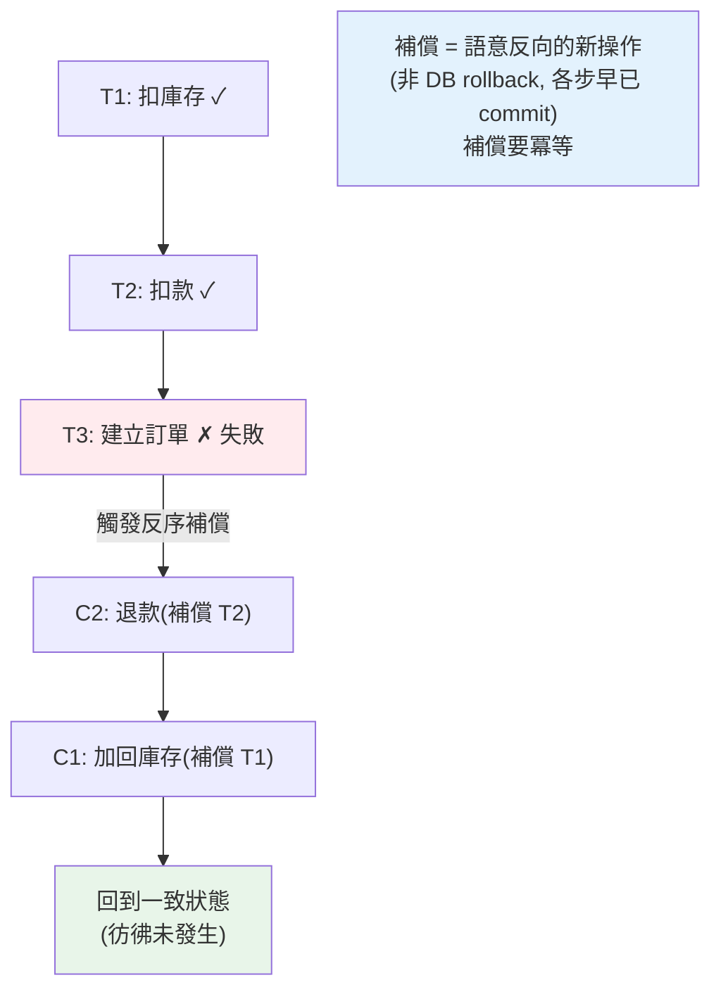

# Saga 與分散式交易

> 單體裡「下單 + 扣庫存 + 扣款」可以是一個 ACID 交易，全成功或全回滾。但拆成三個微服務、各有各的資料庫後，這個跨服務的「全有全無」怎麼保證？傳統的兩階段提交（2PC）太脆弱。**Saga 模式**是分散式交易的主流解——用一連串本地交易 + 補償操作達成最終一致。

## Why（為什麼）

一個下單流程要：扣庫存、扣款、建立訂單。在**單體 + 單一資料庫**時，這三步可以包在一個 [ACID 交易](../15-database/16-transactions.md)裡——**全成功提交、任一失敗全回滾**，資料庫保證原子性。簡單可靠。

但在**微服務**（見 [database-per-service](../21-microservices/01-microservices-intro.md)）裡，庫存、付款、訂單是三個服務、三個獨立資料庫。**沒有一個能橫跨三個資料庫的交易**——它們各自 commit 自己的。問題來了：如果扣庫存成功、扣款也成功、但建立訂單**失敗**了，怎麼辦？庫存和錢已經扣了，訂單卻沒建——**資料不一致**（使用者付了錢沒拿到訂單）。

傳統解法 **2PC（兩階段提交，Two-Phase Commit）**——用一個協調者讓所有參與者「準備好 → 一起提交」。但 2PC 在微服務**很少用**，因為：**同步阻塞**（所有參與者要鎖住資源等協調者，慢）、**協調者單點故障**（協調者掛在關鍵時刻，參與者卡死）、**可用性差**（違背微服務的自治）。

**Saga 模式**是主流解——把一個分散式交易拆成**一連串本地交易**，每步在自己的服務/資料庫完成；若某步失敗，就執行前面各步的**補償操作（compensating transaction）** 來「撤銷」它們的效果。Saga 用**最終一致**取代強一致，換取可用性與自治。這章講清楚 Saga 的兩種協調方式與補償設計。它建立在 [冪等](06-idempotency.md)、[訊息佇列](04-message-queue.md) 之上。

## Theory（理論：Saga 與補償）

**Saga 的核心**：把分散式交易拆成 N 個**本地交易** T1, T2, …, Tn，每個 Ti 在單一服務內完成（各自 ACID）。若全部成功，交易完成。若第 k 步 Tk 失敗，就**依相反順序**執行前面已成功步驟的**補償交易** Ck-1, …, C1，撤銷它們的效果——把系統帶回「彷彿什麼都沒發生」的一致狀態。

```text
成功：T1 → T2 → T3 → 完成
失敗：T1 → T2 → T3 失敗 → C2 → C1（補償 T2、T1）→ 回到一致狀態
```

**補償交易（compensating transaction）** 是「語意上的撤銷」——不是資料庫 rollback（各步早已 commit），而是一個**新的操作**來抵消前一步：扣了庫存 → 補償是「加回庫存」；扣了款 → 補償是「退款」。

**兩種 Saga 協調方式**：

- **Orchestration（編排，集中式）**：一個中央的 **Saga orchestrator（協調者）** 明確地依序呼叫每個步驟、並在失敗時觸發補償。流程集中、清楚、好監控/除錯。缺點：協調者是額外元件。
- **Choreography（協同，去中心式）**：沒有中央協調者，各服務**訂閱事件**、完成自己的步驟後**發出事件**觸發下一步；失敗時發補償事件。鬆耦合，但流程**散落各處**、難追蹤全貌、易形成複雜的事件網。

**取捨**：簡單流程用 choreography（鬆耦合）、複雜流程用 orchestration（可控、好追蹤）。

## Specification（規範：Saga 設計要點）

**每個步驟要定義「正向操作」與「補償操作」**：

```text
步驟1: 扣庫存      補償: 加回庫存
步驟2: 扣款        補償: 退款
步驟3: 建立訂單    補償: 取消訂單
```

**關鍵設計原則**：

- **補償要冪等**（見 [冪等](06-idempotency.md)）：補償本身也可能因重試被執行多次，要安全。
- **正向操作也要冪等**：Saga 步驟可能重試。
- **補償要能成功**：補償失敗很麻煩（要重試、告警、人工介入）——設計上讓補償盡量簡單可靠。
- **接受最終一致與中間狀態可見**：Saga 執行中，系統處於「部分完成」的中間狀態（庫存扣了但訂單還沒建）——這個狀態**對外可能可見**，要能容忍（如訂單顯示「處理中」）。
- **有些操作難補償**（如「已寄出實體商品」無法收回）——把這類**不可補償**的步驟放**最後**，或改設計。

**Saga 狀態要持久化**：orchestrator 要記錄「走到哪一步了」，這樣它崩潰重啟後能繼續（往前推進或往回補償），不會卡在中間狀態。

## Implementation（底層：補償 vs rollback、中間狀態）

**補償為何不是 rollback**：資料庫的 rollback 是「還沒 commit 前撤銷」——但 Saga 的每一步**早就各自 commit 了**（庫存服務扣完庫存就 commit 了自己的交易，錢也扣了 commit 了）。你**無法**再 rollback 一個已 commit 的交易。所以補償是**語意上的反向操作**——一個**新的、正向的**交易來抵消效果：「加回庫存」「退款」。這帶來一個重要差異：**補償不能保證「彷彿從未發生」**——中間狀態確實發生過、也 commit 過、甚至可能被觀察到（別的請求可能在補償前讀到「庫存已扣」）。這是 Saga 用最終一致換可用性的必然代價，設計時要接受「中間狀態可見」。

**為何補償順序相反**：若步驟依 T1→T2→T3 執行，補償要 C2→C1（反序）。因為後面的步驟可能依賴前面的——撤銷時要先撤銷依賴者、再撤銷被依賴者，就像堆疊的後進先出。

**為何補償與正向都要冪等**：Saga 在分散式下執行，每一步（正向或補償）都可能因網路問題被重試（見 [冪等](06-idempotency.md)、[至少一次投遞](04-message-queue.md)）。若「加回庫存」補償被執行兩次，庫存就多加了——所以補償必須冪等（用 idempotency key 或條件更新確保「只生效一次」）。這是 Saga 可靠的前提。

**orchestrator 的狀態機**：orchestrator 本質是一個**狀態機 + 持久化**——它記錄 saga 的當前狀態（進行到第幾步、成功/補償中），每完成一步就持久化狀態。崩潰重啟後，從持久化的狀態繼續（未失敗則推進下一步、已失敗則繼續補償）。這保證 saga 不會因協調者崩潰而永久卡在中間狀態。下面範例實作 orchestration saga + 失敗補償。

## Code Example（可執行的 Python 範例）

```python
# saga.py — Orchestration Saga：步驟 + 失敗時反序補償（純標準庫，可執行）
from __future__ import annotations

from collections.abc import Callable
from dataclasses import dataclass


@dataclass
class Step:
    name: str
    action: Callable[[], None]  # 正向操作
    compensation: Callable[[], None]  # 補償操作（語意反向）


class SagaOrchestrator:
    """依序執行步驟；任一步失敗，反序補償已完成的步驟。"""

    def run(self, steps: list[Step]) -> tuple[bool, list[str]]:
        completed: list[Step] = []
        log: list[str] = []
        try:
            for step in steps:
                step.action()
                completed.append(step)
                log.append(f"✓ {step.name}")
            return True, log
        except Exception as exc:
            log.append(f"✗ {step.name} 失敗: {exc}")
            # 反序補償已完成的步驟
            for step in reversed(completed):
                step.compensation()
                log.append(f"↩ 補償 {step.name}")
            return False, log


def main() -> None:
    # 模擬三個服務的狀態
    state = {"inventory": 10, "balance": 1000, "order": None}

    def make_steps(fail_at_order: bool) -> list[Step]:
        def deduct_inventory() -> None:
            state["inventory"] -= 1  # type: ignore[operator]

        def restore_inventory() -> None:
            state["inventory"] += 1  # type: ignore[operator]

        def charge() -> None:
            state["balance"] -= 100  # type: ignore[operator]

        def refund() -> None:
            state["balance"] += 100  # type: ignore[operator]

        def create_order() -> None:
            if fail_at_order:
                raise RuntimeError("訂單服務暫時不可用")
            state["order"] = "ORD-1"

        def cancel_order() -> None:
            state["order"] = None

        return [
            Step("扣庫存", deduct_inventory, restore_inventory),
            Step("扣款", charge, refund),
            Step("建立訂單", create_order, cancel_order),
        ]

    orch = SagaOrchestrator()

    # 情境 1：全部成功
    ok, log = orch.run(make_steps(fail_at_order=False))
    print(f"[成功情境] {' → '.join(log)}")
    print(f"  狀態: {state}\n")

    # 重設狀態
    state.update(inventory=10, balance=1000, order=None)

    # 情境 2：建立訂單失敗 → 反序補償(退款、加回庫存)
    ok, log = orch.run(make_steps(fail_at_order=True))
    print(f"[失敗情境] {' → '.join(log)}")
    print(f"  補償後狀態: {state}（庫存/餘額都回到原值，一致）")


if __name__ == "__main__":
    main()
```

**預期輸出**：

```pycon
$ python saga.py
[成功情境] ✓ 扣庫存 → ✓ 扣款 → ✓ 建立訂單
  狀態: {'inventory': 9, 'balance': 900, 'order': 'ORD-1'}

[失敗情境] ✓ 扣庫存 → ✓ 扣款 → ✗ 建立訂單 失敗: 訂單服務暫時不可用 → ↩ 補償 扣款 → ↩ 補償 扣庫存
  補償後狀態: {'inventory': 10, 'balance': 1000, 'order': None}（庫存/餘額都回到原值，一致）
```

逐段解說：

- **`Step`**：每步定義**正向操作**（action）與**補償操作**（compensation，語意反向）——扣庫存↔加回庫存、扣款↔退款、建訂單↔取消訂單。
- **成功情境**：三步依序成功——庫存 10→9、餘額 1000→900、訂單建立。交易完成。
- **失敗情境**：扣庫存✓、扣款✓、但**建立訂單失敗**（訂單服務不可用）。orchestrator 捕捉失敗，**反序補償**已完成的步驟：先補償「扣款」（退款，餘額回 1000）、再補償「扣庫存」（加回，庫存回 10）。
- **補償後一致**：最終狀態庫存 10、餘額 1000、訂單 None——**回到彷彿什麼都沒發生**的一致狀態。使用者沒被扣錢、庫存沒少。這就是 Saga 用補償達成的最終一致。
- **要點**：Saga 把分散式交易拆成本地交易 + 補償，失敗時反序補償撤銷效果。補償是新的正向操作（非 rollback），要冪等。中間狀態（扣了款還沒建訂單）確實發生過。

## Diagram（圖解：Saga 補償流程）



## Best Practice（最佳實踐）

- **微服務的分散式交易用 Saga**，別用 2PC（同步阻塞、協調者單點）。
- **每步定義正向 + 補償操作**：補償是語意反向的新操作。
- **正向與補償都要[冪等](06-idempotency.md)**：Saga 步驟可能重試。
- **簡單流程用 choreography、複雜流程用 orchestration**：後者集中可控、好追蹤。
- **持久化 Saga 狀態**：協調者崩潰後能繼續推進或補償，不卡在中間。
- **不可補償的步驟放最後**（如寄實體商品）：或改設計。
- **接受最終一致與中間狀態可見**：用「處理中」等狀態對外表達。
- **監控 Saga 與補償失敗**（見 [可觀測性](../19-cloud-native/08-observability.md)）：補償失敗需告警/人工介入。

## Common Mistakes（常見誤解）

- **微服務硬用 2PC 求強一致**：同步阻塞、協調者單點、可用性差。
- **以為補償是 DB rollback**：各步早已 commit，補償是新的反向操作，無法保證「彷彿從未發生」。
- **補償不冪等**：重試導致多退款/多加庫存。
- **正向操作不冪等**：重試導致多扣。
- **不持久化 Saga 狀態**：協調者崩潰後卡在中間狀態，資料不一致。
- **不可補償的操作放中間**：後面失敗時撤不掉，卡死。
- **忽略中間狀態可見**：別的請求讀到「部分完成」的狀態當成 bug。
- **補償失敗無告警/處理**：靜默的不一致，最難查。

## Interview Notes（面試重點）

- **能說明微服務為何不能用單一 ACID 交易**（database-per-service），以及 2PC 的缺點（阻塞、單點、可用性）。
- **能講 Saga**：一連串本地交易 + 失敗時反序補償，用最終一致換可用性。
- **能區分 orchestration（集中協調）vs choreography（事件協同）** 及取捨。
- **能解釋補償不是 rollback**（各步已 commit，補償是語意反向的新操作），中間狀態確實發生。
- **知道正向與補償都要冪等**、Saga 狀態要持久化。
- **知道不可補償步驟放最後、接受中間狀態可見、補償失敗要處理**。

---

➡️ 下一章：[分散式追蹤與可觀測性](08-distributed-tracing.md)

[⬆️ 回 Part 22 索引](README.md)
