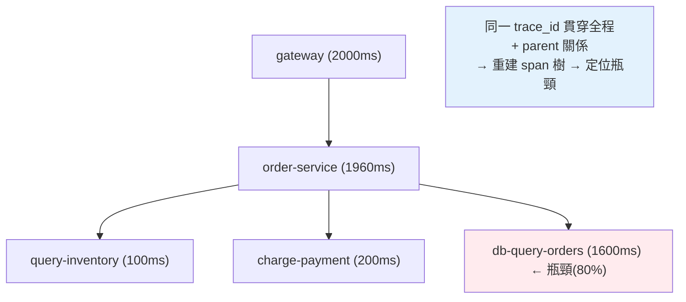

# 分散式追蹤與可觀測性

> 一個請求經過 gateway → 訂單服務 → 庫存服務 → 資料庫，花了 2 秒。**慢在哪一環？** 在單體裡加個 log 就知道，但跨越 5 個服務時，你需要**分散式追蹤（distributed tracing）**——把一個請求在所有服務裡的完整足跡串成一張圖。這是本書的最後一章，也是駕馭分散式系統複雜度的收尾。

## 💡 白話導讀（建議先讀）

病人在大醫院看病:掛號→內科→抽血→影像科→回診,全程**帶著同一張掛號單**,
每一站都在單上記錄「幾點進、幾點出」。最後把單子攤開——
整趟旅程哪一站等最久,一目瞭然。

分散式追蹤就是給**每個請求**發這張掛號單:

- **trace id ＝掛號單號**:請求進入系統時生成,**跟著請求跑遍所有服務**。
- **span ＝每一站的紀錄**:「訂單服務處理」「查資料庫」各是一個 span,
  記著開始/結束時間、屬於哪張單(trace id)、**上一站是誰**(parent span id)。
- **span 樹**:靠 parent id 串成呼叫樹,視覺化成瀑布圖——
  「這請求 2 秒:gateway 10ms → 訂單 50ms → **庫存服務 1.8s**」,兇手現形。

魔法藏在「單子怎麼跟著請求跑」——**context 傳播(propagation)**:
服務 A 呼叫 B 時,把 trace id/span id 塞進 **HTTP header**(W3C `traceparent` 標準)
一起送過去;B 收到後接著記,再傳給 C。斷了一環,旅程圖就斷一截——
所以實務都用 **OpenTelemetry** 的自動 instrumentation:
FastAPI、httpx、SQLAlchemy 一裝,header 傳遞與 span 記錄全自動。

它是[可觀測性三支柱](../19-cloud-native/08-observability.md)的第三柱,
排查動線再複習一次:**metrics 發現變慢 → trace 找到慢在哪一站 → logs 看那一站的細節**
(把 trace id 印進日誌,三者就串起來了)。這章用 OpenTelemetry + FastAPI
實際跑出一條跨服務的 trace。

## Why（為什麼）

分散式系統最難的不是建起來，而是**出問題時搞懂發生了什麼**。一個使用者請求可能：進 [API gateway](../21-microservices/05-api-gateway.md) → 呼叫訂單服務 → 訂單服務呼叫庫存服務和付款服務 → 各自查資料庫、打快取、發訊息。當這個請求變慢或出錯：

- **慢在哪一環？** 是 gateway、訂單服務、還是某個下游的資料庫查詢？
- **哪個服務出的錯？** 錯誤沿呼叫鏈冒上來，但根源在哪？
- **這個請求到底經過了哪些服務？** 呼叫關係在程式碼裡看不出全貌。

單機時，這些用 [log](../19-cloud-native/08-observability.md) 就能查。但跨服務時，每個服務有自己的 log，散落在不同機器——你**無法把「同一個請求」在各服務的足跡拼起來**。

**分散式追蹤**解決這點：為每個請求分配一個**唯一的 trace id**，並在**跨服務呼叫時傳遞**它；每個服務把自己處理這個請求的過程記成一個 **span**（帶 trace id、耗時、父子關係）。最後把所有 span 依 trace id 收集起來，就能重建**這個請求的完整路徑與各環節耗時**——一張跨服務的火焰圖，一眼看出慢在哪、錯在哪。

這是[可觀測性三大支柱](../19-cloud-native/08-observability.md)中的 traces，也是駕馭分散式複雜度的關鍵工具。作為全書最後一章，它把前面的微服務、通訊、Saga 等主題，收束到「如何觀測與理解這整個複雜系統」。

## Theory（理論：trace、span、context 傳播）

**核心概念**：

- **Trace（追蹤）**：**一個請求**在整個系統中的**完整旅程**，由一個唯一的 **trace id** 標識。一個 trace 包含多個 span。
- **Span（跨度）**：trace 中的**一個工作單元**——如「訂單服務處理請求」「查詢資料庫」。每個 span 有：唯一 span id、所屬 trace id、**parent span id**（形成父子樹）、操作名、**開始/結束時間**（→ 耗時）、標籤（tags）。
- **Span 樹**：span 透過 parent id 形成**樹狀結構**，反映呼叫關係——根 span（如 gateway）下有子 span（訂單服務），訂單服務下又有子 span（庫存查詢、付款）。

**Context 傳播（context propagation）—— 分散式追蹤的關鍵**：怎麼讓「同一個請求」在跨服務時保持同一個 trace id？靠**在服務間呼叫時傳遞 trace context**——通常透過 HTTP header（如 W3C 標準的 `traceparent`，含 trace id + parent span id）。服務 A 呼叫服務 B 時，把自己的 trace context 放進 header；B 收到後，用同一個 trace id 建立自己的 span（parent 指向 A 的 span）。這樣所有服務的 span 都掛在同一個 trace id 下、且父子關係正確——最後就能拼成完整的 span 樹。

**OpenTelemetry（OTel）** 是可觀測性的開放標準，統一了 trace/metrics/log 的產生與傳播，各語言有 SDK，能自動為常見框架（FastAPI、gRPC、DB driver）埋點。

## Specification（規範：追蹤的實作）

**Python 用 OpenTelemetry**：

```python
from opentelemetry import trace
tracer = trace.get_tracer("order-service")

with tracer.start_as_current_span("process_order") as span:
    span.set_attribute("order.id", order_id)
    with tracer.start_as_current_span("query_inventory"):  # 子 span
        check_inventory()
    with tracer.start_as_current_span("charge_payment"):   # 子 span
        charge()
```

- **`start_as_current_span`**：開一個 span，自動設好 trace id 與父子關係（巢狀 → 父子）。
- **自動傳播**：OTel 的 instrumentation 會自動在 HTTP/gRPC 呼叫時注入/提取 trace context（`traceparent` header），跨服務串接。
- **匯出**：span 送到後端（Jaeger、Zipkin、Tempo、雲端 APM）視覺化成火焰圖/瀑布圖。

**分析追蹤能回答**：

- **關鍵路徑（critical path）**：哪個 span 佔了最多時間 → 優化目標。
- **並行 vs 串行**：哪些子 span 是並行的、哪些串行。
- **錯誤定位**：哪個 span 標記了錯誤。
- **服務依賴圖**：從大量 trace 聚合出「誰呼叫誰」。

**採樣（sampling）**：全量追蹤成本高（每個請求都產 span），生產環境通常**採樣**——只追蹤一部分請求（如 1%），或用尾部採樣（保留出錯/慢的 trace）。

## Implementation（底層：span 樹與關鍵路徑）

**trace id 傳播如何串起跨服務足跡**：關鍵在於「同一個 trace id 貫穿全程」。入口服務（gateway）為請求生成 trace id 與根 span；每次跨服務呼叫，把 `trace id + 當前 span id` 透過 header 傳給下游；下游用**同一個 trace id** 建自己的 span，並把 `parent span id` 設為上游傳來的 span id。於是，即使 span 產生在**不同機器、不同服務**，它們都帶著**同一個 trace id**、且透過 parent id 記錄了呼叫關係。追蹤後端收集所有帶此 trace id 的 span，依 parent 關係重建成**span 樹**——這就是「把散落各服務的足跡拼成一個請求的完整旅程」的原理。沒有這個貫穿的 id 與父子關係，各服務的 log/span 就是一盤散沙。

**如何從 span 樹找出「慢在哪」**：每個 span 有耗時。一個請求慢，就看 span 樹裡**哪個 span 耗時最長**（且是關鍵路徑上的）。常見情況：根 span 耗時 2 秒，其中訂單服務 1.9 秒，而訂單服務的子 span 裡「查詢資料庫」佔了 1.8 秒——**瓶頸就是那個 DB 查詢**（可能是 [N+1](../15-database/20-n-plus-1.md) 或缺索引）。分散式追蹤把「2 秒慢在哪」這個跨 5 個服務難以回答的問題，變成「看火焰圖找最寬的那條」。這是它相對於分散 log 的最大價值——**視覺化的、有因果關係的、可定位瓶頸的**請求全景。下面範例用 span 樹計算各 span 耗時、找出關鍵瓶頸。

## Code Example（可執行的 Python 範例）

```python
# distributed_tracing.py — 建構 span 樹、找出最慢的 span（純標準庫，可執行）
from __future__ import annotations

from dataclasses import dataclass, field


@dataclass
class Span:
    span_id: str
    trace_id: str
    parent_id: str | None
    operation: str
    start_ms: float
    end_ms: float
    children: list[Span] = field(default_factory=list)

    @property
    def duration_ms(self) -> float:
        return self.end_ms - self.start_ms


def build_tree(spans: list[Span]) -> Span:
    """依 parent_id 重建 span 樹（同一 trace_id 的散落 span 拼成一棵）。"""
    by_id = {s.span_id: s for s in spans}
    root: Span | None = None
    for span in spans:
        if span.parent_id is None:
            root = span
        else:
            by_id[span.parent_id].children.append(span)
    assert root is not None
    return root


def find_slowest(root: Span) -> Span:
    """找出耗時最長的 span（瓶頸候選）。"""
    slowest = root
    stack = [root]
    while stack:
        node = stack.pop()
        if node.duration_ms > slowest.duration_ms:
            slowest = node
        stack.extend(node.children)
    return slowest


def print_tree(span: Span, depth: int = 0) -> None:
    print(f"  {'  ' * depth}{span.operation}: {span.duration_ms:.0f}ms")
    for child in sorted(span.children, key=lambda s: s.start_ms):
        print_tree(child, depth + 1)


def main() -> None:
    tid = "trace-abc"
    # 同一請求跨服務的 span（不同服務產生，但同一 trace_id）
    spans = [
        Span("s1", tid, None, "gateway", 0, 2000),
        Span("s2", tid, "s1", "order-service", 20, 1980),
        Span("s3", tid, "s2", "query-inventory", 30, 130),
        Span("s4", tid, "s2", "charge-payment", 140, 340),
        Span("s5", tid, "s2", "db-query-orders", 350, 1950),  # 瓶頸！
    ]

    root = build_tree(spans)
    print(f"Trace {tid} 的 span 樹（耗時）:")
    print_tree(root)

    slowest = find_slowest(root)
    # 排除根/父 span，找「自身」最耗時的葉節點類操作
    leaf_slowest = max(
        (s for s in spans if not s.children), key=lambda s: s.duration_ms
    )
    print(f"\n整體耗時: {root.duration_ms:.0f}ms")
    print(f"最慢的葉節點操作: {leaf_slowest.operation} ({leaf_slowest.duration_ms:.0f}ms)")
    print(f"  → 瓶頸定位：{leaf_slowest.operation} 佔了 "
          f"{leaf_slowest.duration_ms / root.duration_ms * 100:.0f}% 的時間")


if __name__ == "__main__":
    main()
```

**預期輸出**：

```pycon
$ python distributed_tracing.py
Trace trace-abc 的 span 樹（耗時）:
  gateway: 2000ms
    order-service: 1960ms
      query-inventory: 100ms
      charge-payment: 200ms
      db-query-orders: 1600ms

整體耗時: 2000ms
最慢的葉節點操作: db-query-orders (1600ms)
  → 瓶頸定位：db-query-orders 佔了 80% 的時間
```

逐段解說：

- **`Span`**：每個 span 帶 trace_id（貫穿全程）、parent_id（父子關係）、操作名、起訖時間（→ 耗時）。這些 span 產生於**不同服務**，但共用同一個 `trace-abc`。
- **`build_tree`**：依 parent_id 把散落的 span **重建成樹**——這正是追蹤後端做的事：把跨服務的 span 依 trace id + parent 關係拼成一個請求的完整旅程。
- **span 樹**：印出來一眼看出呼叫層次——gateway(2000ms) → order-service(1960ms) → 三個子操作。查庫存 100ms、扣款 200ms，但 **db-query-orders 佔了 1600ms**。
- **瓶頸定位**：`db-query-orders` 是最慢的葉操作，**佔整體 80% 的時間**——瓶頸就是它（可能是 [N+1](../15-database/20-n-plus-1.md) 或缺索引）。分散式追蹤把「2 秒慢在哪」這個跨服務難題，變成「看樹找最寬的那條」。
- **要點**：trace id 貫穿全程 + parent 關係 → 重建 span 樹 → 一眼定位瓶頸與錯誤。這是分散式系統除錯與優化的核心工具，相對散落的 log 有質的提升。

## Diagram（圖解：span 樹與瓶頸）



## Best Practice（最佳實踐）

- **用分散式追蹤觀測跨服務請求**：定位「慢在哪、錯在哪、經過哪」。
- **用 OpenTelemetry 標準 + 自動埋點**：跨語言、跨框架統一，減少手動工作。
- **確保 trace context 跨服務傳播**（`traceparent` header）：否則 span 串不起來。
- **每個 log 帶 trace id**（見 [可觀測性](../19-cloud-native/08-observability.md)）：串起 traces 與 logs。
- **生產環境採樣**：全量成本高，用機率/尾部採樣（保留慢/錯的 trace）。
- **關鍵路徑分析找瓶頸**：看 span 樹裡最寬的、關鍵路徑上的 span。
- **三大支柱協同**：metrics 發現異常 → traces 定位服務 → logs 看細節。
- **在關鍵操作加有意義的 span 與屬性**（order.id 等）：方便查詢與關聯。

## Common Mistakes（常見誤解）

- **沒有分散式追蹤，靠散落的 log 查跨服務問題**：無法把同一請求的足跡拼起來。
- **trace context 沒跨服務傳播**：每個服務各自一個 trace，串不起來。
- **log 不帶 trace id**：traces 與 logs 無法關聯。
- **生產全量追蹤**：成本高、影響效能；要採樣。
- **span 粒度不當**：太粗（看不出瓶頸）或太細（噪音多、開銷大）。
- **只看單一 trace 下結論**：偶發問題要看多個 trace 的聚合。
- **自己造追蹤系統**：重造輪子；用 OpenTelemetry + Jaeger/Tempo。
- **只有 traces 沒有 metrics/logs**：三支柱應協同，各有所長。

## Interview Notes（面試重點）

- **能說明分散式追蹤解決什麼**：把一個請求在多服務的足跡串成 span 樹，定位跨服務的慢/錯/路徑。
- **能講 trace / span / span 樹 / context 傳播**：trace id 貫穿、parent 關係、跨服務靠 header 傳播 context。
- **能解釋如何從 span 樹定位瓶頸**（看關鍵路徑上最耗時的 span）。
- **知道 OpenTelemetry 是標準**、自動埋點、`traceparent` 傳播。
- **知道生產要採樣**（機率/尾部）與 trace id 串起 logs 的價值。
- **能把追蹤放進可觀測性三支柱**：metrics 發現、traces 定位、logs 細節。

---

🎉 **恭喜你完成本書！** 從 Python 語法、物件模型、CPython 內部、並發，一路到 Web、資料庫、架構、雲原生、安全、微服務與分散式系統——你已建立起 **從零到 Senior/架構師** 的完整知識體系。接下來，把這些原理帶進真實專案、持續實作與深化，你就是能設計與駕馭複雜系統的 Python 工程師。

⬅️ 這是全書的最後一章。

[⬆️ 回 Part 22 索引](README.md) ｜ [🏠 回全書總覽](../README.md)
