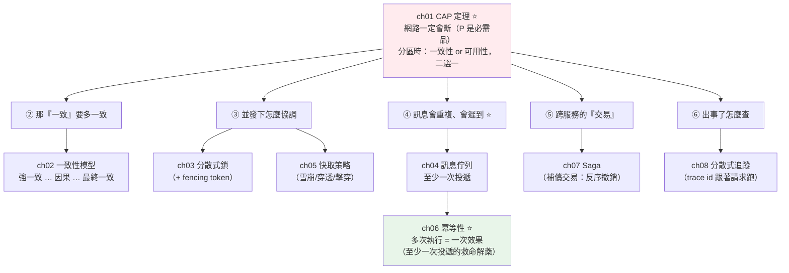

# Part 22 統整：分散式系統全貌

> 把這 8 章串成一張圖——它們的共同前提只有一句：**網路一定會出事。** 一旦接受這件事，所有設計都變得合理。

## 🗺️ 知識地圖（這 8 章怎麼串起來）

分散式系統的所有難題，都從**一個殘酷的事實**長出來：
**跨越多台機器後，網路會斷、節點會掛、時鐘不同步。**



**一句話串起來**：

一切從 **[CAP 定理](01-distributed-intro-cap.md)**（ch01）開始——
它不是「三選二」，而是：**P（分區容忍）是必需品**（網路一定會斷），
所以真正的選擇是**分區發生時，你要 C（一致性）還是 A（可用性）**。

接受了「網路會出事」，其餘各章都是在**處理它的後果**：

- **[一致性模型](02-consistency-models.md)**（ch02）：資料同步需要時間，
  那「多快能看到最新值」有一整條光譜（強一致 → 因果 → 最終一致）。
- **[訊息佇列](04-message-queue.md)（ch04）→ [冪等](06-idempotency.md)（ch06）**：
  訊息系統是**至少一次投遞**——**訊息一定會重複**。
  於是**冪等性**（多次執行 = 一次效果）成為**必修的救命解藥**。
- **[Saga](07-saga.md)**（ch07）：跨服務的 ACID 交易不存在了，
  改用「一串本地交易 + 出錯時反序補償」。
- **[分散式追蹤](08-distributed-tracing.md)**（ch08）：請求跨好幾個服務，
  用一個 **trace id 跟著它跑遍全程**，才查得出慢在哪、錯在哪。

## ⚡ 速查表（什麼情境用什麼）

| 情境 | 怎麼做／要知道 | 章節 |
|------|--------------|------|
| **分區時該保 C 還是 A** | 按**資料**分別選：錢/庫存 → **CP**（寧可拒絕）；讚數/動態 → **AP**（先服務、事後修補） | [ch01](01-distributed-intro-cap.md) |
| 選一致性等級 | 錢包用**強一致**、按讚用**最終一致**、要「別亂序」用**因果一致** | [ch02](02-consistency-models.md) |
| 多台機器搶同一資源 | **分散式鎖**（Redis `SET NX EX`）+ **fencing token**（防過期鎖亂寫） | [ch03](03-distributed-lock.md) |
| 分散式鎖釋放 | **用 Lua 腳本**（先驗「還是我的」再刪，否則會誤刪別人的） | [ch03](03-distributed-lock.md) |
| **同一操作可能被執行多次** | 🔴 **冪等**！用**唯一單號**（idempotency key）——記住處理過的、直接回上次結果 | [ch06](06-idempotency.md) |
| 任務分發 / 複雜路由 | **RabbitMQ**（郵局：簽收即銷毀） | [ch04](04-message-queue.md) |
| 事件流 / 要重放 / 高吞吐 | **Kafka**（報社檔案室：永久存檔、自己記 offset） | [ch04](04-message-queue.md) |
| 快取和 DB 一致性 | **Cache-Aside**：讀先查快取、寫**先更 DB 再刪快取**（不是更新） | [ch05](05-caching-strategies.md) |
| 大量 key 同時過期 | **雪崩**——過期時間加**隨機抖動** | [ch05](05-caching-strategies.md) |
| 一直查不存在的 key | **穿透**——快取空值 / 布隆過濾器 | [ch05](05-caching-strategies.md) |
| 熱門 key 剛好過期 | **擊穿**——互斥重建 / 熱點永不過期 | [ch05](05-caching-strategies.md) |
| **跨服務的「全有全無」** | **Saga**（本地交易串起來 + 失敗反序**補償**）——沒有跨服務 ACID | [ch07](07-saga.md) |
| Saga 怎麼協調 | **編排**（orchestrator 集中指揮，主流）vs **編舞**（各自訂閱事件） | [ch07](07-saga.md) |
| 一個請求跨多服務、慢在哪 | **分散式追蹤**：trace id 塞進 HTTP header 傳遞（W3C `traceparent`） | [ch08](08-distributed-tracing.md) |

## 🔑 核心心智模型（帶得走的幾句話）

- **網路一定會出事——這是分散式系統的第一公理。** 接受它，所有設計才合理：
  逾時、重試、冪等、補償……都是在「假設網路會斷」的前提下的必然產物。
- **CAP：P 是必需品，真正的選擇是分區時要 C 還是 A。** 而且是**按資料分別選**，
  不是整個系統一刀切（同一個電商：扣款走 CP、瀏覽數走 AP）。
- **「至少一次投遞」意味著「訊息一定會重複」。** 所以**冪等不是可選項，是必修**——
  唯一單號讓「重複執行」的傷害歸零。**沒有冪等，重試就是賭博。**
- **一致性是光譜，不是開關。** 強一致最好用但最貴（要跨節點協調、分區時犧牲可用性）；
  最終一致最便宜最能扛。**按業務語義選**——沒有「最好」，只有「最合適」。
- **分散式交易用 Saga，不是 2PC。** 跨服務的 ACID 幾乎不可行。
  Saga 把它拆成一串本地交易，失敗時**反序執行補償**（語意上的撤銷，不是資料庫回滾）。
- **補償也要冪等。** Saga 的補償步驟同樣可能被重複執行——
  所以 [ch06 冪等](06-idempotency.md) 是 [ch07 Saga](07-saga.md) 的地基。

## 🛠️ 小實作：冪等性——「至少一次投遞」的救命解藥

分散式系統裡，**重複執行無法避免**（網路逾時後客戶端重試、訊息佇列的至少一次投遞）。
這支腳本示範：**同樣被重試 3 次，不冪等的扣款會扣 3 次，冪等的只扣 1 次。**

```python
# distributed_demo.py —— Part 22 主線：冪等（讓「多次」等於「一次」）
from __future__ import annotations


class PaymentService:
    """模擬支付：網路逾時 → 客戶端重試 → 若不冪等就重複扣款。"""

    def __init__(self) -> None:
        self.balance = 1000
        self.charge_log: list[str] = []
        # ch06 冪等：記住處理過的單號，同單號直接回上次結果（不重做）
        self.processed: dict[str, int] = {}

    def charge_naive(self, amount: int) -> int:
        """🔴 不冪等：每次呼叫都扣一次。"""
        self.balance -= amount
        self.charge_log.append(f"扣款 {amount}")
        return self.balance

    def charge_idempotent(self, idempotency_key: str, amount: int) -> int:
        """✅ 冪等：用唯一單號，同單號只扣一次。"""
        if idempotency_key in self.processed:
            return self.processed[idempotency_key]      # 直接回上次的結果
        self.balance -= amount
        self.charge_log.append(f"扣款 {amount}（單號 {idempotency_key}）")
        self.processed[idempotency_key] = self.balance
        return self.balance


def demo() -> None:
    print("【ch06 冪等性】情境：網路逾時，客戶端不知成功沒 → 重試 3 次")

    print("\n  🔴 不冪等的扣款:")
    naive = PaymentService()
    for i in range(3):                          # 同一筆付款，因逾時被重試 3 次
        balance = naive.charge_naive(100)
        print(f"    第 {i + 1} 次重試 → 餘額 {balance}")
    print(f"    結果：扣了 {len(naive.charge_log)} 次！餘額 {naive.balance}  ← 被多扣 200！")

    print("\n  ✅ 冪等的扣款（同一個單號）:")
    idem = PaymentService()
    key = "order-abc-123"                       # 客戶端為「這一筆操作」生成唯一鍵
    for i in range(3):
        balance = idem.charge_idempotent(key, 100)
        print(f"    第 {i + 1} 次重試 → 餘額 {balance}")
    print(f"    結果：實際只扣了 {len(idem.charge_log)} 次！餘額 {idem.balance}  ← 正確")

    print("\n  → 重複執行無法避免（逾時、佇列至少一次投遞），")
    print("    但唯一單號讓「多次執行 = 一次效果」。這是分散式系統的必修。")


if __name__ == "__main__":
    demo()
```

**預期輸出**：

```pycon
$ python distributed_demo.py
【ch06 冪等性】情境：網路逾時，客戶端不知成功沒 → 重試 3 次

  🔴 不冪等的扣款:
    第 1 次重試 → 餘額 900
    第 2 次重試 → 餘額 800
    第 3 次重試 → 餘額 700
    結果：扣了 3 次！餘額 700  ← 被多扣 200！

  ✅ 冪等的扣款（同一個單號）:
    第 1 次重試 → 餘額 900
    第 2 次重試 → 餘額 900
    第 3 次重試 → 餘額 900
    結果：實際只扣了 1 次！餘額 900  ← 正確

  → 重複執行無法避免（逾時、佇列至少一次投遞），
    但唯一單號讓「多次執行 = 一次效果」。這是分散式系統的必修。
```

**兩個餘額（700 vs 900），說完整個 Part 22 的世界觀**：

**為什麼會被扣 3 次？** 因為在分散式系統裡，**你無法避免重複執行**：

- 客戶端送出扣款請求 → **網路逾時** → 客戶端**不知道到底成功了沒** → 只能重試。
- 訊息佇列是[至少一次投遞](04-message-queue.md) → 同一則訊息**本來就會重複**。

**你擋不住「重複」——只能讓「重複」不造成傷害。**
這就是**冪等**：客戶端為每筆操作生成一個**唯一單號**，
服務端**記住處理過的單號**，同單號再來**直接回上次的結果、不重做**。

於是不管重試幾次，**扣款只發生一次**（餘額停在 900）。

這個「**多次執行 = 一次效果**」的性質，是分散式系統裡**最重要、最常被面試問**的一個觀念——
Stripe 等支付 API 的 `Idempotency-Key` header 就是它的業界標準實作。
而且它也是 [Saga 補償](07-saga.md)、[訊息消費](04-message-queue.md)、[重試](../21-microservices/07-rate-limit-circuit-breaker.md) 的共同地基。

## ✅ 自測清單（答不出來就回去讀）

- [ ] CAP 定理常被誤解成「三選二」，真正的意思是什麼？（[ch01](01-distributed-intro-cap.md)）
- [ ] 為什麼說「P 是必需品」？（[ch01](01-distributed-intro-cap.md)）
- [ ] 強一致、因果一致、最終一致各是什麼？怎麼選？（[ch02](02-consistency-models.md)）
- [ ] 「讀不到自己的寫」是什麼情況？怎麼解？（[ch02](02-consistency-models.md)）
- [ ] 分散式鎖的 TTL 帶來什麼危險？fencing token 怎麼解？（[ch03](03-distributed-lock.md)）
- [ ] RabbitMQ 和 Kafka 的哲學差在哪？各適合什麼？（[ch04](04-message-queue.md)）
- [ ] 「至少一次投遞」為什麼逼你必須做冪等？（[ch04](04-message-queue.md)、[ch06](06-idempotency.md)）
- [ ] **哪些操作天生冪等？哪些不是？不冪等的怎麼救？**（[ch06](06-idempotency.md)）
- [ ] Cache-Aside 的讀寫流程？為什麼寫入是「刪快取」不是「更新」？（[ch05](05-caching-strategies.md)）
- [ ] 快取雪崩／穿透／擊穿各是什麼？怎麼防？（[ch05](05-caching-strategies.md)）
- [ ] 為什麼跨服務不能用傳統 ACID 交易？Saga 怎麼替代？（[ch07](07-saga.md)）
- [ ] Saga 的「補償」和資料庫的「回滾」差在哪？（[ch07](07-saga.md)）
- [ ] 分散式追蹤的 trace id 怎麼跟著請求跑？（[ch08](08-distributed-tracing.md)）

## 🎯 面試速查

| 考點 | 面試官想聽到什麼 | 章節 |
|------|------------------|------|
| **CAP 定理？**（高頻） | 「常被誤解成『三選二』。真相是 **P（分區容忍）是必需品**（網路一定會斷），所以真正的選擇是**分區發生時要 C 還是 A**：**CP** 拒絕服務保正確（金融）；**AP** 繼續服務事後修補（社群）。而且是**按資料分別選**，不是整個系統一刀切。」 | [ch01](01-distributed-intro-cap.md) |
| **什麼是冪等？為什麼重要？**（高頻） | 「**執行一次和多次，對系統狀態的影響相同**。重要是因為**分散式系統無法避免重複執行**——逾時後客戶端重試、訊息佇列的至少一次投遞。解法：**唯一單號（idempotency key）**——服務端記住處理過的，同單號直接回上次結果。**沒有冪等，重試就是賭博。**」 | [ch06](06-idempotency.md) |
| **哪些操作天生冪等？** | 「**天生冪等**：GET、設絕對值（`set x = 100`）、DELETE、PUT 全量替換。**天生不冪等**：相對變化（`x -= 100`）、INSERT/POST、發送（寄信）。不冪等的用**唯一單號**保護。」 | [ch06](06-idempotency.md) |
| **快取一致性 / 三大災難？** | 「**Cache-Aside**：讀先查快取，寫**先更 DB 再刪快取**（刪而非更新，避免競態）。三災：**雪崩**（大量 key 同時過期 → 加隨機抖動）、**穿透**（查不存在的 key → 快取空值/布隆過濾器）、**擊穿**（熱點 key 過期 → 互斥重建）。」 | [ch05](05-caching-strategies.md) |
| **RabbitMQ vs Kafka？** | 「**RabbitMQ ＝ 郵局**：訊息投遞、簽收即銷毀，強在**靈活路由與任務佇列**。**Kafka ＝ 報社檔案室**：事件**永久存檔、可重讀**，消費者自己記 offset，強在**高吞吐事件流、事件溯源、重放**。口訣：任務分發選 RabbitMQ，事件流/要重放選 Kafka。」 | [ch04](04-message-queue.md) |
| **分散式交易怎麼做？** | 「跨服務的 ACID 幾乎不可行（2PC 太脆）。用 **Saga**：把交易拆成一串**本地交易**，全成功就完成；某步失敗就**反序執行前面各步的補償交易**（語意上的撤銷，不是 DB 回滾）。協調有**編排**（orchestrator 集中指揮，主流）與**編舞**（各自訂閱事件）。補償同樣要冪等。」 | [ch07](07-saga.md) |
| **一個請求跨多服務、慢在哪？** | 「**分散式追蹤**。給每個請求一個 **trace id**，跟著它跑遍所有服務；每一站是一個 **span**（記開始/結束、parent id）。靠 **context 傳播**（trace id 塞進 HTTP header，W3C `traceparent`）串起來，視覺化成瀑布圖就看得出瓶頸在哪一站。用 OpenTelemetry 自動埋。」 | [ch08](08-distributed-tracing.md) |

---

🎉 **恭喜完成 Part 22！** 你已經走完 **Python 工程主線（Part 1–22）**——
從「變數是標籤」一路到「網路一定會出事」，
你有能力設計、實作、部署、並維運一個**分散式後端系統**了。

接下來是全書的另一條主線：**資料 / AI**（Part 23–31）。
你會發現前面學的一切——型別、async、快取、向量資料庫、可觀測性——
在 **LLM 應用**裡全部重新派上用場。
（如果你是走 AI 工程路線，[Part 28 LLM 基礎](../28-llm-genai/README.md) 是那條線的核心。）

➡️ 下一 Part：[分析用 SQL 與資料整理 Data Analysis](../23-data-analysis/README.md)

[⬆️ 回 Part 22 索引](README.md)
