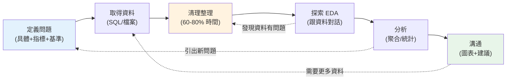

# 資料分析全貌與分析師工作流

> 資料分析不是「跑幾個函式生幾張圖」,而是一套**從商業問題到可行動洞察**的流程。同一份資料,好的分析師能挖出讓決策改變的洞察,差的只能產出「看起來很忙」的報表。這章先建立**分析師的工作流心智模型**——每一步在做什麼、為什麼——這是後面所有 SQL、pandas、統計技巧的骨架。

## Why(為什麼)

很多人學資料分析從「工具」入手(學 pandas、學 SQL、學畫圖),結果會用工具卻**不會分析**——因為缺了**流程與思維**。真實的資料分析工作,技術只佔一部分,更關鍵的是:

- **問對問題**:老闆問「為什麼營收下降」,你不能直接 `df.plot()`——要先釐清「哪個產品線?哪個時段?跟去年比還是上月比?下降多少算異常?」。**問題定義錯了,再漂亮的分析都沒用。**
- **懂資料的來龍去脈**:資料從哪來、怎麼收集、有什麼已知的髒/偏/缺?不懂就會被資料誤導(見 [EDA](08-eda.md) 與 [相關≠因果](../24-business-analytics/02-correlation-causation.md))。
- **把分析變成決策**:分析的終點不是「算出數字」,而是**讓某人做出更好的決定**。能否把發現**清楚傳達**給非技術的決策者([資料溝通](../24-business-analytics/08-data-storytelling.md)),往往比分析本身更決定價值。

所以這章先講**工作流**——一個貫穿全 Part 的地圖。理解每步的目的,你才知道學 [SQL 聚合](02-sql-aggregation.md)、[pandas 整理](06-pandas-groupby.md)、[統計檢定](../24-business-analytics/03-hypothesis-testing.md)各是為了服務流程的哪一環,而不是零散的技巧。

## Theory(理論:分析師工作流)

一個典型的資料分析專案,循以下階段(常需來回迭代,非嚴格線性):

1. **定義問題(Define)**:把模糊的商業問題轉成**可分析的具體問題**。「營收為何下降」→「Q3 華北區 A 產品營收較 Q2 下降 15%,是哪些客戶/通路貢獻了下降?」。定義**指標**、**比較基準**、**範圍**。
2. **取得資料(Acquire)**:從資料源撈數——多半是**用 [SQL](02-sql-aggregation.md) 查資料庫/[資料倉儲](../15-database/README.md)**,或讀檔(CSV/API)。這是分析師的日常起點。
3. **清理與整理(Clean & Wrangle)**:真實資料**永遠是髒的**——缺值、重複、格式不一、離群、型別錯。要清理成**乾淨、結構一致**的形狀(見 [pandas 整理](06-pandas-groupby.md)、[合併重塑](07-merge-reshape.md))。**這一步常佔掉分析師 60–80% 的時間。**
4. **探索(Explore, EDA)**:[探索性資料分析](08-eda.md)——看分布、算敘述統計、找模式與異常、驗證假設。這階段是「跟資料對話」,培養對資料的直覺。
5. **分析(Analyze)**:針對問題做**聚焦的分析**——[分組聚合](02-sql-aggregation.md)、[相關](../24-business-analytics/02-correlation-causation.md)、[統計檢定](../24-business-analytics/03-hypothesis-testing.md)、[時間序列](../24-business-analytics/05-time-series.md)、[商業指標](../24-business-analytics/06-business-metrics.md)。
6. **溝通(Communicate)**:把洞察用**圖表 + 敘事**傳達給決策者([視覺化](../24-business-analytics/07-visualization.md)、[說故事](../24-business-analytics/08-data-storytelling.md)),給出**可行動的建議**。

**核心心態**:分析是為了**回答問題、支持決策**,不是炫技。每一步都問「這對回答問題有幫助嗎?」

## Specification(規範:各階段的產出與工具)

| 階段 | 產出 | 主要工具 | 本書章節 |
|------|------|----------|----------|
| 定義問題 | 具體問題 + 指標 + 基準 + 範圍 | 溝通、業務理解 | 本章、[商業指標](../24-business-analytics/06-business-metrics.md) |
| 取得資料 | 原始資料集 | [SQL](02-sql-aggregation.md)、讀檔/API | ch02–05 |
| 清理整理 | 乾淨、結構一致的資料 | [pandas](06-pandas-groupby.md)、[merge/reshape](07-merge-reshape.md) | ch06–07 |
| 探索 EDA | 分布、統計摘要、異常清單 | [pandas](08-eda.md)、[敘述統計](../24-business-analytics/01-descriptive-stats.md) | ch08 |
| 分析 | 針對問題的量化結論 | [聚合](02-sql-aggregation.md)、[統計](../24-business-analytics/03-hypothesis-testing.md) | Part 24 |
| 溝通 | 圖表 + 洞察 + 建議 | [視覺化](../24-business-analytics/07-visualization.md)、報告 | Part 24 |

**分析師 vs 相關角色**(釐清定位):

- **Data Analyst(資料分析師)**:回答商業問題、產出洞察與報表——**SQL + 統計 + 溝通**是核心。這 Part 與 [Part 24](../24-business-analytics/README.md) 的主軸。
- **Data Scientist**:偏建模/預測([ML](../25-machine-learning/README.md))、實驗設計。
- **Data Engineer**:建資料管線/倉儲([Part 15](../15-database/README.md)、ETL)。
- **BI Analyst / Analytics Engineer**:偏儀表板、指標建模、[dbt](../24-business-analytics/README.md) 等。

角色有重疊,但分析師的**差異化價值在「把資料轉成商業決策」**。

## Implementation(底層:為何清理最花時間、迭代的本質)

**為何「清理」佔掉大半時間**:真實世界的資料**不是為分析而生**——它是業務系統運作的副產物。使用者亂填(大小寫、錯字、空值)、系統演進(欄位語意變了)、多源合併(格式不一)、記錄遺漏——這些讓原始資料充滿**缺值、重複、不一致、離群、型別錯**。而分析的所有結論**都建立在資料品質上**(garbage in, garbage out)。所以「把資料弄乾淨」不是雜活,是**保證結論正確的前提**,自然吃掉大部分工時。低估這步、急著跳到分析,是新手最常見的坑。

**為何工作流是「迭代」而非線性**:探索時常發現「這資料有問題」(退回清理)、或「這問題定義不對/不夠聚焦」(退回定義)、或分析結果引出新問題(再取數)。**好的分析是螺旋前進**:每一輪對問題與資料的理解都更深。把流程當成「一次跑完的直線」是誤解——它是**不斷回頭修正的循環**。

**分析師的槓桿在前段**:花時間**問對問題、理解資料**,遠比後段炫技的分析更決定成敗。一個定義精準的問題,用簡單的 [GROUP BY](02-sql-aggregation.md) 就能回答;一個模糊的問題,再花俏的模型也是白費。下面範例把整個工作流濃縮成一個可跑的縮影——原始髒資料 → 清理 → 聚合 → 洞察。

## Code Example(可執行的 Python 範例)

```python
# analyst_workflow.py — 分析工作流縮影:髒資料 → 清理 → 聚合 → 洞察(純標準庫)
from __future__ import annotations


def clean(rows: list[dict[str, str]]) -> list[dict[str, object]]:
    """清理:標準化區域名、解析金額、丟棄無法解析的(缺值/髒值)。"""
    cleaned: list[dict[str, object]] = []
    for row in rows:
        region = row["region"].strip().title()  # 標準化大小寫與空白
        try:
            amount = float(row["amount"])
        except ValueError:
            continue  # 空值/髒值 → 丟棄(真實中要記錄丟了多少、為何)
        cleaned.append({"region": region, "amount": amount})
    return cleaned


def aggregate(rows: list[dict[str, object]]) -> dict[str, float]:
    """聚合:按區域加總營收,由高到低排序。"""
    totals: dict[str, float] = {}
    for row in rows:
        region = str(row["region"])
        totals[region] = totals.get(region, 0.0) + float(row["amount"])
    return dict(sorted(totals.items(), key=lambda kv: kv[1], reverse=True))


def insight(totals: dict[str, float]) -> str:
    """洞察:把數字轉成一句可傳達的結論。"""
    top = max(totals, key=totals.__getitem__)
    share = totals[top] / sum(totals.values())
    return f"最高營收區域為 {top}(${totals[top]:.0f}),佔總額 {share:.0%}"


def main() -> None:
    # 原始資料:大小寫不一、缺值、髒值——真實資料的常態
    raw_sales = [
        {"region": "North", "amount": "1200"},
        {"region": "north", "amount": "800"},  # 大小寫不一致
        {"region": "South", "amount": ""},  # 缺值
        {"region": "South", "amount": "1500"},
        {"region": "North", "amount": "abc"},  # 髒值
    ]
    cleaned = clean(raw_sales)
    print(f"取得: {len(raw_sales)} 筆原始 → 清理後 {len(cleaned)} 筆(丟棄 2 筆)")

    totals = aggregate(cleaned)
    print(f"分析: 各區營收 {totals}")

    print(f"洞察: {insight(totals)}")


if __name__ == "__main__":
    main()
```

**預期輸出**:

```pycon
$ python analyst_workflow.py
取得: 5 筆原始 → 清理後 3 筆(丟棄 2 筆)
分析: 各區營收 {'North': 2000.0, 'South': 1500.0}
洞察: 最高營收區域為 North($2000),佔總額 57%
```

逐段解說:

- **`clean`**:同一個「North」有 `North`/`north` 兩種寫法——`title()` 標準化;`""` 和 `"abc"` 無法解析成金額 → **丟棄**。這就是清理:**把「機器記錄的雜訊」還原成「一致、可分析的事實」**。真實中丟棄要**記錄數量與原因**(丟太多可能資料源有問題)。
- **`aggregate`**:清理後才能正確 GROUP BY——若不先標準化,`North` 和 `north` 會被算成兩個區域,**結論就錯了**。這凸顯「清理是正確分析的前提」。
- **`insight`**:不只回傳數字(`North: 2000`),而是轉成**一句人話**:「North 佔 57%」——這才是決策者要的。分析的終點是**可傳達的洞察**,不是原始數字。
- **工作流縮影**:取得(raw)→ 清理 → 聚合(分析)→ 洞察(溝通)——五行資料走完整條鏈。真實中每步都放大成 [SQL 撈數](02-sql-aggregation.md)、[pandas 整理](06-pandas-groupby.md)、[統計分析](../24-business-analytics/03-hypothesis-testing.md)、[視覺化溝通](../24-business-analytics/07-visualization.md),但**骨架不變**。
- **迭代點**:「丟棄 2 筆」可能觸發回頭問「為什麼有髒值?資料源可靠嗎?」——這就是工作流的迭代本質。

## Diagram(圖解:分析師工作流)



## Best Practice(最佳實踐)

- **先問對問題再動手**:把模糊商業問題轉成具體、有指標與基準的問題,別急著跑程式。
- **理解資料來源與脈絡**:資料怎麼收集、有什麼已知偏誤/缺陷,才不被誤導。
- **認真對待清理**:它是正確結論的前提,別當雜活跳過;丟棄/修補要記錄。
- **迭代而非線性**:探索發現問題就回頭,分析引出新問題就再問——螺旋前進。
- **分析為決策服務**:每步問「這對回答問題有幫助嗎」,終點是可行動洞察。
- **溝通是價值放大器**:再好的分析講不清楚就沒用;投資[視覺化與敘事](../24-business-analytics/08-data-storytelling.md)。
- **可重現**:分析流程用程式碼/[notebook](../17-data-science/README.md)記錄,別靠手動點按(無法重跑、無法驗證)。

## Common Mistakes(常見誤解)

- **跳過問題定義直接跑分析**:方向錯,產出漂亮但沒用的報表。
- **低估清理**:急著分析髒資料,結論建在沙上(garbage in, garbage out)。
- **不懂資料脈絡**:被收集偏誤/缺陷誤導而不自知。
- **把工作流當線性**:不回頭修正,錯誤與誤解一路帶到底。
- **為分析而分析**:炫技複雜模型,卻回答不了商業問題。
- **只給數字不給洞察**:丟一堆表格給決策者,不轉成可行動的結論。
- **手動操作不可重現**:Excel 手點一輪,換月份要重來、無法驗證、易出錯。
- **混淆分析師與資料科學家/工程師**:分析師的核心價值在「資料→決策」,不是建模或建管線。

## Interview Notes(面試重點)

- **能描述分析師工作流**:定義問題→取得→清理→探索→分析→溝通,且為迭代循環。
- **能說明為何清理最花時間**:真實資料是業務副產物、充滿雜訊,而結論建立在資料品質上。
- **能強調「問對問題」的重要**:定義錯了再好的分析都沒用;分析為決策服務。
- **能區分分析師 vs 資料科學家 vs 資料工程師**:回答商業問題/洞察 vs 建模預測 vs 建管線。
- **能講分析師的核心技能**:SQL + 統計 + 溝通(把資料轉成決策)。
- **能講可重現的重要**:用程式碼/notebook 而非手動,才能重跑、驗證、協作。

---

➡️ 下一章:[分析用 SQL:聚合與分組](02-sql-aggregation.md)

[⬆️ 回 Part 23 索引](README.md)
