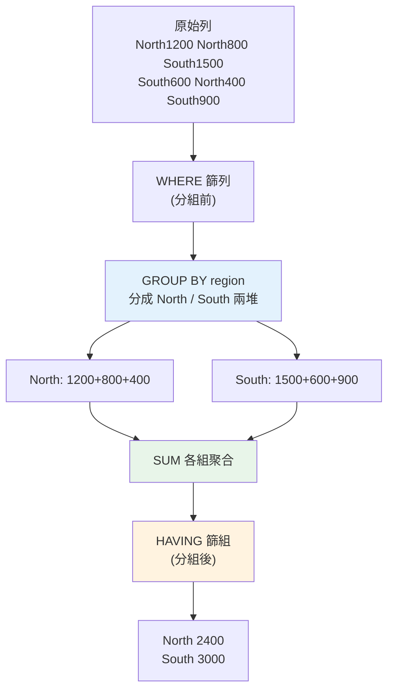

# 分析用 SQL:聚合與分組

> SQL 是資料分析師的**第一語言**。絕大多數分析的起點是「從資料庫撈數 + 聚合」——每個區域賣多少、每個月成長多少、每個客群平均消費多少。這一切的核心是 **GROUP BY + 聚合函式**。這章講分析師最常用的 SQL:聚合、分組、過濾分組(HAVING),用 stdlib `sqlite3` 實際跑。

## Why(為什麼)

為什麼分析師要用 SQL,而不是把資料全撈出來用 [pandas](06-pandas-groupby.md) 算?

- **資料在資料庫裡**:公司的資料多半存在[關聯式資料庫/資料倉儲](../15-database/README.md)(PostgreSQL、MySQL、BigQuery、Snowflake)。SQL 是**取用這些資料的通用語言**——不會 SQL,連資料都拿不到。
- **在資料庫裡聚合更有效率**:一張億筆的交易表,你要「各區月營收」——**在資料庫端 GROUP BY 聚合**,只傳回幾十列結果;若把億筆全撈到本機再算,光傳輸就撐爆。**「把計算推到資料所在處」** 是分析的基本功。
- **SQL 是分析的通用語**:報表工具、[BI 儀表板](../24-business-analytics/README.md)、資料管線都用 SQL。它是分析師與資料工程師、與其他分析師溝通的**共同語言**——一段 SQL 大家都看得懂。

**聚合(aggregation)** 是分析的核心動作:把**很多列**壓成**摘要的一列或幾列**——總和、平均、計數、最大最小。搭配 **GROUP BY**(分組),就能回答「**每個** X 的 Y 是多少」這類問題,這正是分析最常見的形態。這章從這裡開始。

> 本章假設你有 [Part 15 資料庫](../15-database/README.md)的 SQL 基礎(SELECT/WHERE/型別);這裡聚焦**分析用**的聚合與分組。

## Theory(理論:聚合與 GROUP BY)

**聚合函式(aggregate functions)** 把一組值壓成單一值:

- `COUNT(*)` / `COUNT(col)`:計數(`*` 算列數,`col` 算非 NULL 的數)。
- `SUM(col)`:總和。
- `AVG(col)`:平均。
- `MIN(col)` / `MAX(col)`:最小/最大。
- (進階)`COUNT(DISTINCT col)`:相異值個數。

**GROUP BY**:把資料**按某欄分組**,對**每組**各自套聚合。沒有 GROUP BY 時,聚合作用於**整張表**(得一列);有 GROUP BY 時,**每組得一列**。

「查各區總營收」的邏輯:先按 `region` 把列分成 North/South 兩堆,對每堆 `SUM(amount)`——得兩列(每區一列)。

**查詢的邏輯執行順序**(理解這個才不會寫錯):

```text
FROM      → 取哪張表
WHERE     → 過濾「列」(聚合前,篩原始列)
GROUP BY  → 分組
HAVING    → 過濾「組」(聚合後,篩分組結果)
SELECT    → 選欄位/算聚合
ORDER BY  → 排序
LIMIT     → 取前幾筆
```

**關鍵:WHERE vs HAVING**——`WHERE` 在**分組前**過濾原始列(如「只算今年的交易」),`HAVING` 在**分組後**過濾組(如「只留總營收 > 2000 的區域」)。用錯會得到錯誤結果或語法錯。

## Specification(規範:聚合查詢語法)

**基本聚合 + 分組**:

```sql
SELECT region,
       SUM(amount)  AS total,      -- 聚合要取別名,方便引用/閱讀
       COUNT(*)     AS order_count,
       AVG(amount)  AS avg_amount
FROM sales
WHERE amount > 0                    -- 分組前過濾列
GROUP BY region                     -- 按區域分組
HAVING SUM(amount) > 1000           -- 分組後過濾組
ORDER BY total DESC                 -- 按總營收降序
LIMIT 10;
```

**規則**:

- **SELECT 裡的非聚合欄位,必須出現在 GROUP BY**:選了 `region` 又選 `SUM(amount)`,`region` 必須 GROUP BY。否則(多數資料庫)報錯——因為一組多列,非聚合欄不知該取哪個值。
- **多欄分組**:`GROUP BY region, product` → 按「區域 × 產品」的每個組合各一列(交叉分析)。
- **聚合裡的 NULL**:`SUM`/`AVG`/`COUNT(col)` **忽略 NULL**;`COUNT(*)` 算所有列。這常是 bug 來源(見 Common Mistakes)。
- **別名**:聚合欄取 `AS name`,好讀且能在 ORDER BY 引用。

## Implementation(底層:為何 HAVING 不能用 WHERE、聚合的 NULL)

**為何過濾組要用 HAVING 而非 WHERE**:回到執行順序——`WHERE` 在 `GROUP BY` **之前**執行,那時**還沒有「組」的概念、還沒算聚合**,所以 `WHERE SUM(amount) > 1000` 會報錯(聚合值此時不存在)。`HAVING` 在 `GROUP BY` **之後**、聚合已算完才執行,才能對聚合結果過濾。**記法:WHERE 篩列(row)、HAVING 篩組(group)**。兩者可並用:`WHERE` 先剔除不要的列(如負數金額)、`HAVING` 再剔除不要的組(如小額區域)——先 WHERE 後 HAVING 也更有效率(先減少要分組的列)。

**聚合與 NULL 的陷阱**:`AVG(col)` 是「非 NULL 值的總和 ÷ 非 NULL 值的**個數**」——**NULL 不算進分母**。所以若有缺值,`AVG` 算的是「有值者的平均」,不是「全部除以總列數」。同理 `COUNT(col)` 只數非 NULL,`COUNT(*)` 數全部。這在有缺值時會造成「以為算了全部其實只算了有值的」的誤解——分析師必須清楚知道自己的聚合**分母是什麼**(見 [EDA 的缺值檢查](08-eda.md))。

**為何在資料庫端聚合**:資料庫有索引、查詢優化器、能在資料所在處並行聚合,只回傳**小小的結果集**。把原始大表整批撈到本機再用 pandas 算,浪費頻寬、記憶體、時間。**原則:能在 SQL 端做的聚合,就在 SQL 端做**(pandas 用於 SQL 難表達的複雜整理與探索)。下面範例用 `sqlite3`(stdlib)實跑各種聚合。

## Code Example(可執行的 Python 範例)

```python
# sql_aggregation.py — 分析用 SQL 聚合與分組(stdlib sqlite3,免安裝)
from __future__ import annotations

import sqlite3


def setup() -> sqlite3.Connection:
    conn = sqlite3.connect(":memory:")
    conn.execute(
        "CREATE TABLE sales(id INTEGER, region TEXT, product TEXT, amount REAL, qty INTEGER)"
    )
    conn.executemany(
        "INSERT INTO sales VALUES (?,?,?,?,?)",
        [
            (1, "North", "A", 1200, 3),
            (2, "North", "B", 800, 2),
            (3, "South", "A", 1500, 5),
            (4, "South", "B", 600, 1),
            (5, "North", "A", 400, 1),
            (6, "South", "A", 900, 3),
        ],
    )
    return conn


def main() -> None:
    conn = setup()

    print("各區總營收(GROUP BY + SUM/COUNT,降序):")
    for row in conn.execute(
        "SELECT region, SUM(amount) AS total, COUNT(*) AS cnt "
        "FROM sales GROUP BY region ORDER BY total DESC"
    ):
        print(f"  {row}")

    print("\n各產品平均金額與總銷量(AVG/SUM):")
    for row in conn.execute(
        "SELECT product, ROUND(AVG(amount), 1) AS avg_amt, SUM(qty) AS total_qty "
        "FROM sales GROUP BY product"
    ):
        print(f"  {row}")

    print("\nHAVING:總營收 > 2500 的區域(分組後過濾):")
    for row in conn.execute(
        "SELECT region, SUM(amount) AS total FROM sales GROUP BY region HAVING SUM(amount) > 2500"
    ):
        print(f"  {row}")

    print("\n區域 × 產品交叉(多欄 GROUP BY):")
    for row in conn.execute(
        "SELECT region, product, SUM(amount) AS total "
        "FROM sales GROUP BY region, product ORDER BY region, product"
    ):
        print(f"  {row}")

    conn.close()


if __name__ == "__main__":
    main()
```

**預期輸出**:

```pycon
$ python sql_aggregation.py
各區總營收(GROUP BY + SUM/COUNT,降序):
  ('South', 3000.0, 3)
  ('North', 2400.0, 3)

各產品平均金額與總銷量(AVG/SUM):
  ('A', 1000.0, 12)
  ('B', 700.0, 3)

HAVING:總營收 > 2500 的區域(分組後過濾):
  ('South', 3000.0)

區域 × 產品交叉(多欄 GROUP BY):
  ('North', 'A', 1600.0)
  ('North', 'B', 800.0)
  ('South', 'A', 2400.0)
  ('South', 'B', 600.0)
```

逐段解說:

- **各區總營收**:`GROUP BY region` 把 6 列分成 North/South 兩組,各 `SUM(amount)` + `COUNT(*)`。South 3000 > North 2400,`ORDER BY total DESC` 讓最高的在上——這是最典型的分析查詢「**每個** X 的總和,排序」。
- **各產品聚合**:`AVG(amount)` 算各產品平均(A 產品 (1200+1500+400+900)/4 = 1000)、`SUM(qty)` 算總銷量。一次查多個聚合是常態。`ROUND` 讓小數好讀。
- **HAVING**:先分組算 `SUM(amount)`,**再**用 `HAVING SUM(amount) > 2500` 過濾——只有 South(3000)留下,North(2400)被剔除。**這用 WHERE 做不到**(WHERE 時還沒有聚合值)。
- **多欄 GROUP BY**:`GROUP BY region, product` 產生「區域 × 產品」四種組合各一列——**交叉分析**,分析師常用來拆解「哪個區的哪個產品貢獻最多」(North 的 A 是 1600)。
- **要點**:聚合把多列壓成摘要、GROUP BY 讓「每組各一份」、HAVING 過濾組、多欄分組做交叉。這四招覆蓋分析師 SQL 的大半日常。

## Diagram(圖解:GROUP BY 聚合)



## Best Practice(最佳實踐)

- **在資料庫端聚合**:把計算推到資料所在處,只回傳小結果集,別整批撈回本機算。
- **聚合欄取別名(AS)**:好讀、可在 ORDER BY 引用。
- **WHERE 篩列、HAVING 篩組**:分組前的條件用 WHERE、針對聚合值的條件用 HAVING;能先 WHERE 就先 WHERE(更快)。
- **SELECT 的非聚合欄都要 GROUP BY**:否則報錯或得到不確定結果。
- **清楚聚合的分母**:`AVG`/`COUNT(col)` 忽略 NULL,知道自己在對「全部」還是「有值者」聚合。
- **多欄分組做交叉分析**:拆解「哪個維度組合貢獻多少」。
- **`COUNT(DISTINCT col)` 算相異數**:如「有多少個不同客戶下單」。
- **驗證聚合結果**:總和/計數對得上原始資料嗎?別讓 NULL/JOIN 悄悄改變分母(見 [JOIN](03-sql-joins.md))。

## Common Mistakes(常見誤解)

- **用 WHERE 過濾聚合值**:`WHERE SUM(x) > 100` 報錯;過濾聚合要用 HAVING。
- **SELECT 非聚合欄漏掉 GROUP BY**:報錯或(某些 DB)回不確定的值。
- **忘了 AVG/COUNT(col) 忽略 NULL**:以為算了全部,其實只算了有值的,分母錯。
- **`COUNT(*)` vs `COUNT(col)` 混淆**:前者算列數、後者算非 NULL 數,有缺值時結果不同。
- **把大表整批撈回本機再聚合**:浪費頻寬記憶體,該在 SQL 端做。
- **ORDER BY 用聚合但沒取別名**:可讀性差、易錯;取別名再排序。
- **多欄分組漏欄**:少一個分組欄,交叉的粒度就錯了。
- **不驗證聚合**:JOIN 造成的重複列讓 SUM 灌水而不自知(見 [JOIN 陷阱](03-sql-joins.md))。

## Interview Notes(面試重點)

- **能寫聚合 + 分組查詢**:GROUP BY + SUM/COUNT/AVG + ORDER BY,取別名。
- **能清楚 WHERE vs HAVING**:篩列 vs 篩組,對應執行順序(WHERE 在 GROUP BY 前、HAVING 在後)。
- **能講查詢邏輯執行順序**:FROM→WHERE→GROUP BY→HAVING→SELECT→ORDER BY→LIMIT。
- **知道聚合與 NULL**:AVG/COUNT(col) 忽略 NULL,COUNT(*) 不忽略;分母要清楚。
- **能講為何在資料庫端聚合**:把計算推到資料處,只傳小結果集。
- **能用多欄 GROUP BY 做交叉分析**、`COUNT(DISTINCT)` 算相異數。

---

➡️ 下一章:[SQL:JOIN 與多表分析](03-sql-joins.md)

[⬆️ 回 Part 23 索引](README.md)
