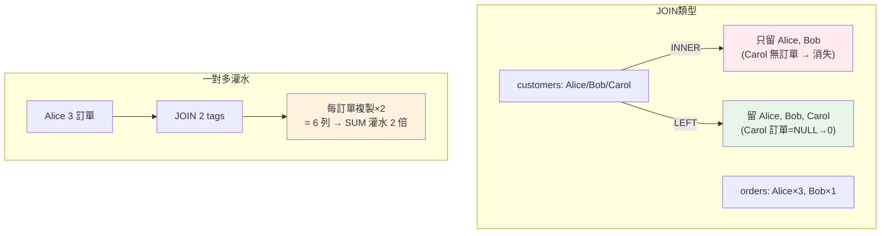

# SQL:JOIN 與多表分析

> 真實的分析很少只查一張表——客戶資料在 `customers`、訂單在 `orders`、商品在 `products`。要回答「哪個城市的客戶消費最多」,得把**多張表關聯起來**。這靠 **JOIN**。JOIN 看似簡單,卻是分析師**最容易出錯**的地方:INNER vs LEFT 選錯會漏資料、一對多 JOIN 會讓聚合**悄悄灌水**。這章講清楚。

## Why(為什麼)

資料庫用**正規化(normalization)** 把資料拆成多張表,避免重複(客戶名字只存一次在 `customers`,訂單只存 `customer_id` 參照)。這對儲存是好事,但分析時你需要的資訊**散在多張表**:

- 「各城市營收」→ 城市在 `customers`、金額在 `orders`,要**關聯**兩表。
- 「哪些客戶從沒下單」→ 要比對 `customers` 與 `orders`,找出**只在前者**的。
- 「每張訂單的商品名稱」→ 訂單存 `product_id`,名稱在 `products`,要**接上**。

**JOIN** 就是「把多張表**按關聯鍵拼起來**」的操作。分析師幾乎每個查詢都會用到,因為**有用的分析往往需要跨表的資訊**。

但 JOIN 是雙面刃——選錯 JOIN 類型會**默默漏掉或多算資料**,而且**不報錯**(結果照樣跑出來,只是錯的)。尤其**一對多 JOIN 造成聚合灌水**是分析師的經典陷阱:總營收莫名變兩倍,還找不到原因。這章不只教怎麼 JOIN,更教**怎麼不出錯**。

## Theory(理論:JOIN 類型)

JOIN 按「保留哪些列」分幾種:

- **INNER JOIN**:只保留**兩表都有匹配**的列。客戶有訂單、訂單有對應客戶——兩邊都對上才留。**沒下單的客戶會消失**。
- **LEFT JOIN(LEFT OUTER)**:保留**左表全部**,右表沒匹配的補 NULL。「所有客戶 + 他們的訂單(沒訂單的客戶也留,訂單欄為 NULL)」。**分析常用**——要「所有 X,不管有沒有 Y」。
- **RIGHT JOIN**:對稱於 LEFT(保留右表全部),實務少用(把左右對調用 LEFT 即可)。
- **FULL OUTER JOIN**:兩表全部保留,沒匹配的補 NULL(SQLite 較新版才支援)。
- **CROSS JOIN**:笛卡兒積(每列配每列),特殊用途。

**選 INNER 還是 LEFT?** 取決於問題:

- 「有訂單的客戶花了多少」→ **INNER**(只要有訂單的)。
- 「**所有**客戶各花了多少(含 0 元的)」→ **LEFT**(沒訂單的也要顯示為 0)。

**選錯的後果**:問「所有客戶消費」卻用 INNER,**沒下單的客戶被漏掉**——你以為列出了所有客戶,其實少了一批,分母錯、結論偏。

## Specification(規範:JOIN 語法與聚合)

**基本 JOIN**:

```sql
SELECT c.name, o.amount
FROM customers c                       -- 左表(取別名 c)
JOIN orders o ON c.id = o.customer_id  -- 關聯鍵:c.id = o.customer_id
```

**LEFT JOIN + 聚合(每客戶總消費,含無訂單者)**:

```sql
SELECT c.name,
       COUNT(o.id)             AS n_orders,   -- COUNT(o.id) 忽略 NULL,無訂單者為 0
       COALESCE(SUM(o.amount), 0) AS total    -- SUM 遇全 NULL 回 NULL,用 COALESCE 補 0
FROM customers c
LEFT JOIN orders o ON c.id = o.customer_id
GROUP BY c.id
ORDER BY total DESC;
```

**要點**:

- **表別名(`c`、`o`)**:多表時用別名,欄位加前綴(`c.name`、`o.amount`)避免歧義。
- **`ON` 指定關聯鍵**:通常是「主鍵 = 外鍵」(`customers.id = orders.customer_id`)。
- **LEFT JOIN 的 NULL 處理**:無匹配的右表欄是 NULL;`COUNT(o.id)` 自動忽略(得 0),`SUM` 全 NULL 得 NULL 要 `COALESCE(..., 0)` 補 0。
- **JOIN 後可 GROUP BY 聚合**:先拼表、再分組聚合——「各城市營收」= JOIN 後 `GROUP BY c.city`。

## Implementation(底層:JOIN 如何運作、一對多灌水)

**JOIN 的本質**:對左表每一列,找右表所有 `ON` 條件成立的列**配對**,產生「左列 + 右列」的新列。若左列在右表有 **N 個**匹配,就產生 **N 個**新列(左列的資料被**複製 N 次**)。這正是**灌水(fan-out)** 的根源。

**一對多 JOIN 灌水的陷阱**(分析師必懂):假設 `orders` 一個客戶多筆、`tags` 一個客戶多個標籤。你 JOIN `customers`→`orders`→`tags` 想算「每客戶總消費」——但 Alice 有 3 筆訂單、2 個標籤,JOIN 後她的每筆訂單**被複製成 2 列**(對應 2 個標籤),於是 `SUM(o.amount)` 把訂單金額**算了兩次**,總消費從 1000 灌成 2000!**它不報錯,結果照跑,只是錯的**——這是最陰險的分析 bug。

**為什麼**:JOIN 是「列的笛卡兒式配對」,兩個一對多的維度接在一起,粒度就從「一筆訂單」變成「訂單 × 標籤」,再對這個膨脹的粒度 SUM 就會重複計算。**解法**:別把兩個獨立的一對多關係 JOIN 在一起聚合;改用**子查詢/CTE 先各自聚合**(見 [CTE](05-sql-cte-pivot.md))、或 `COUNT(DISTINCT)`、或分開查。**核心防範:JOIN 聚合前,想清楚 JOIN 後的「一列代表什麼」**(粒度),粒度變了 SUM 就會錯。下面範例實跑 INNER/LEFT JOIN 與灌水陷阱。

## Code Example(可執行的 Python 範例)

```python
# sql_joins.py — JOIN 類型與一對多灌水陷阱(stdlib sqlite3)
from __future__ import annotations

import sqlite3


def setup() -> sqlite3.Connection:
    conn = sqlite3.connect(":memory:")
    conn.executescript("""
        CREATE TABLE customers(id INTEGER, name TEXT, city TEXT);
        CREATE TABLE orders(id INTEGER, customer_id INTEGER, amount REAL);
        INSERT INTO customers VALUES (1,'Alice','Taipei'),(2,'Bob','Tainan'),(3,'Carol','Taipei');
        INSERT INTO orders VALUES (101,1,500),(102,1,300),(103,2,800),(104,1,200);
        -- Carol(id=3)沒有任何訂單
    """)
    return conn


def main() -> None:
    conn = setup()

    print("INNER JOIN(只有有訂單的客戶,Carol 消失):")
    for row in conn.execute(
        "SELECT c.name, o.amount FROM customers c "
        "JOIN orders o ON c.id = o.customer_id ORDER BY c.name, o.amount"
    ):
        print(f"  {row}")

    print("\nLEFT JOIN + 聚合(所有客戶,含無訂單的 Carol=0):")
    for row in conn.execute(
        "SELECT c.name, COUNT(o.id) AS n_orders, COALESCE(SUM(o.amount),0) AS total "
        "FROM customers c LEFT JOIN orders o ON c.id = o.customer_id "
        "GROUP BY c.id ORDER BY total DESC"
    ):
        print(f"  {row}")

    print("\n各城市營收(JOIN 後 GROUP BY):")
    for row in conn.execute(
        "SELECT c.city, SUM(o.amount) AS total FROM customers c "
        "JOIN orders o ON c.id = o.customer_id GROUP BY c.city ORDER BY total DESC"
    ):
        print(f"  {row}")

    # 一對多灌水陷阱
    conn.execute("CREATE TABLE tags(customer_id INTEGER, tag TEXT)")
    conn.executemany("INSERT INTO tags VALUES (?,?)", [(1, "vip"), (1, "new")])
    print("\n⚠️ 灌水陷阱:Alice 有 2 個 tag,JOIN 後訂單被複製,SUM 灌水:")
    wrong = conn.execute(
        "SELECT c.name, SUM(o.amount) AS total FROM customers c "
        "JOIN orders o ON c.id=o.customer_id "
        "JOIN tags t ON c.id=t.customer_id WHERE c.id=1 GROUP BY c.id"
    ).fetchone()
    print(f"  灌水(錯): {wrong} — 訂單被算兩次,實際應為 1000")

    conn.close()


if __name__ == "__main__":
    main()
```

**預期輸出**:

```pycon
$ python sql_joins.py
INNER JOIN(只有有訂單的客戶,Carol 消失):
  ('Alice', 200.0)
  ('Alice', 300.0)
  ('Alice', 500.0)
  ('Bob', 800.0)

LEFT JOIN + 聚合(所有客戶,含無訂單的 Carol=0):
  ('Alice', 3, 1000.0)
  ('Bob', 1, 800.0)
  ('Carol', 0, 0)

各城市營收(JOIN 後 GROUP BY):
  ('Taipei', 1000.0)
  ('Tainan', 800.0)

⚠️ 灌水陷阱:Alice 有 2 個 tag,JOIN 後訂單被複製,SUM 灌水:
  灌水(錯): ('Alice', 2000.0) — 訂單被算兩次,實際應為 1000
```

逐段解說:

- **INNER JOIN**:只留兩表都有匹配的——Alice(3 筆)、Bob(1 筆)出現,**Carol 消失**(她沒訂單)。若你要「所有客戶」卻用了 INNER,就漏了 Carol。
- **LEFT JOIN + 聚合**:保留**所有客戶**——Carol 的 `n_orders=0`、`total=0`(`COUNT(o.id)` 忽略 NULL 得 0、`COALESCE(SUM,0)` 把全 NULL 補 0)。這才正確回答「**所有**客戶各消費多少」。**選 LEFT 讓沒下單的也現身**。
- **各城市營收**:JOIN 後 `GROUP BY c.city`——Taipei(Alice 1000)1000、Tainan(Bob)800。**跨表資訊(城市在 customers、金額在 orders)靠 JOIN 拼起來**才能分析。
- **⚠️ 灌水陷阱**:JOIN `orders`(Alice 3 筆)再 JOIN `tags`(Alice 2 個),Alice 的每筆訂單**被複製成 2 列**,`SUM(o.amount)` 把 1000 算成 **2000**!**沒報錯,結果照跑,但錯了。** 防範:別把兩個一對多 JOIN 在一起聚合,改用[子查詢/CTE 先各自聚合](05-sql-cte-pivot.md)。
- **核心教訓**:JOIN 前想清楚**選 INNER 還 LEFT**(要不要保留無匹配的)、JOIN 聚合前想清楚**一列代表什麼粒度**(避免灌水)。

## Diagram(圖解:INNER vs LEFT + 灌水)



## Best Practice(最佳實踐)

- **依問題選 JOIN 類型**:要「所有 X」用 LEFT、要「有匹配的 X」用 INNER;想清楚要不要保留無匹配列。
- **表用別名、欄加前綴**:多表時 `c.name`/`o.amount` 避免歧義、易讀。
- **LEFT JOIN 後處理 NULL**:`COUNT(fk)` 自然得 0、`SUM` 用 `COALESCE(...,0)` 補 0。
- **JOIN 聚合前確認粒度**:「JOIN 後一列代表什麼」——粒度變了 SUM/COUNT 就會灌水。
- **避免兩個一對多 JOIN 後聚合**:改用[子查詢/CTE 先各自聚合](05-sql-cte-pivot.md)再合。
- **驗證結果**:JOIN 後總筆數/總和對得上預期嗎?灌水時總和會異常變大。
- **用 `COUNT(DISTINCT)` 防重複計數**:粒度膨脹時算相異值較安全。
- **JOIN 鍵要有索引**:大表 JOIN 沒索引會很慢(見 [Part 15](../15-database/README.md))。

## Common Mistakes(常見誤解)

- **要「所有客戶」卻用 INNER JOIN**:沒匹配的被默默漏掉,分母錯、結論偏。
- **一對多 JOIN 後聚合灌水**:總和莫名變倍數,不報錯最難查。
- **LEFT JOIN 後忘處理 NULL**:`SUM` 得 NULL 顯示空白、排序/計算出錯。
- **`COUNT(*)` 在 LEFT JOIN 誤數**:無匹配列也算一列(有一列全 NULL),應 `COUNT(fk)`。
- **不確認 JOIN 後粒度**:以為一列一訂單,其實膨脹了。
- **欄位不加表前綴**:多表同名欄歧義、報錯或取錯。
- **以為 JOIN 出錯會報錯**:選錯類型/灌水都不報錯,結果照跑只是錯的。
- **大表 JOIN 無索引**:效能災難。

## Interview Notes(面試重點)

- **能區分 INNER vs LEFT JOIN**:兩表都匹配才留 vs 保留左表全部(無匹配補 NULL);依問題選。
- **能講一對多 JOIN 灌水**:JOIN 複製列使聚合重複計算,總和變倍數,不報錯;防範靠先各自聚合/DISTINCT。
- **能講 JOIN 的粒度概念**:JOIN 後「一列代表什麼」,聚合前必須確認。
- **能處理 LEFT JOIN 的 NULL**:COUNT(fk) 得 0、COALESCE 補 SUM。
- **能寫 JOIN + GROUP BY 的跨表聚合**(如各城市營收)。
- **知道 JOIN 選錯/灌水都不報錯**,要靠驗證總和/筆數抓出來。

---

➡️ 下一章:[SQL 進階:window functions](04-sql-window-functions.md)

[⬆️ 回 Part 23 索引](README.md)
