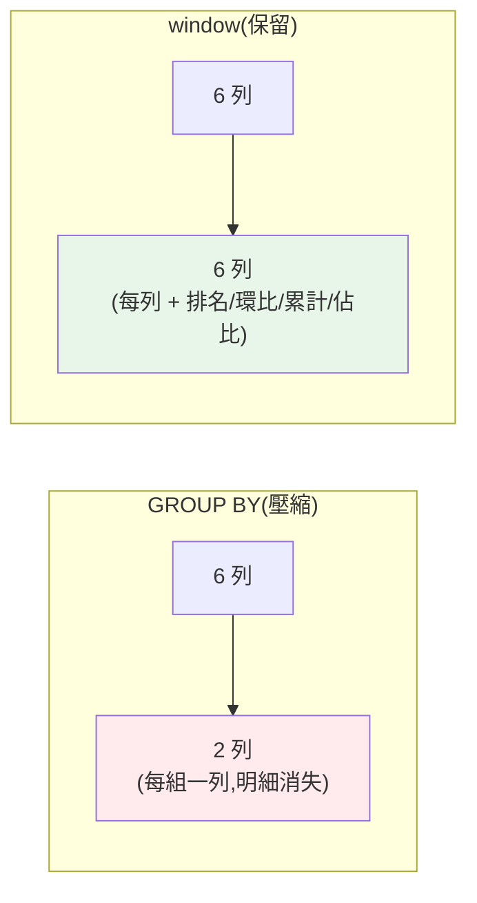

# SQL 進階:window functions

> [GROUP BY](02-sql-aggregation.md) 把多列**壓成一列**——但很多分析問題要「保留每一列,同時看到它在群體中的位置」:這筆訂單在該客戶中排第幾?這個月比上個月成長多少?累計到目前多少?這些都要 **window functions(視窗函式)**。它是**進階 SQL 的分水嶺**,也是分析師面試的高頻考點。這章講透。

## Why(為什麼)

有一整類分析問題,`GROUP BY` 做不到或很彆扭:

- **排名**:「每個地區**營收前 3 名**的月份」——要對每列算它在組內的排名,但仍**保留每一列**(GROUP BY 會壓縮掉)。
- **環比/同比**:「每個月營收比**上個月**成長多少」——要拿當列和**前一列**比,GROUP BY 沒有「前一列」的概念。
- **累計**:「營收的**逐月累計**」——每列要算「從開始到這列的總和」,是滑動的。
- **佔比**:「這筆訂單佔**當月總額**的百分比」——每列要同時知道自己的值和群體的總和。

用 `GROUP BY` 硬做這些,得靠[自我 JOIN 或子查詢](05-sql-cte-pivot.md),又臭又長又慢。**window functions** 專為此而生:**對「一個視窗(相關列的集合)」做計算,但不壓縮列**——每一列都保留,同時獲得「它與群體關係」的資訊(排名、與前列的差、累計、佔比)。

這是 `GROUP BY`(壓縮成組)和 window(保留列 + 群體視角)的關鍵差異。掌握 window functions,分析能力**跨一個台階**——很多原本要匯出到 [pandas](06-pandas-groupby.md) 繞的分析,一句 SQL 就搞定。

## Theory(理論:視窗的三要素)

window function 的語法核心是 `OVER (...)` 子句,定義「視窗」——即這列的計算要參考哪些列。三個要素:

```sql
函式() OVER (
  PARTITION BY 欄位   -- 1. 分區:把資料分組(類似 GROUP BY 但不壓縮)
  ORDER BY 欄位       -- 2. 排序:視窗內的順序(排名、LAG、累計需要)
  ROWS BETWEEN ...    -- 3. 框架:視窗涵蓋哪些列(累計/移動平均用)
)
```

- **PARTITION BY**:把資料分區,函式在**每個分區內**獨立計算。如 `PARTITION BY region`——各地區分開排名。**省略則整張表是一個分區。**
- **ORDER BY**:分區內的排序,決定「排名的順序」「誰是前一列」「累計的方向」。
- **框架(frame)**:`ROWS BETWEEN ... AND ...` 定義視窗涵蓋的列範圍——累計是「從開頭到目前」,移動平均是「前 N 列到目前」。

**常用 window functions**:

| 類別 | 函式 | 用途 |
|------|------|------|
| 排名 | `ROW_NUMBER()` | 唯一序號(1,2,3,4) |
| 排名 | `RANK()` | 排名,同值同名次、跳號(1,2,2,4) |
| 排名 | `DENSE_RANK()` | 排名,同值同名次、不跳號(1,2,2,3) |
| 偏移 | `LAG(col, n)` | 取前 n 列的值(環比) |
| 偏移 | `LEAD(col, n)` | 取後 n 列的值 |
| 聚合 | `SUM/AVG/COUNT() OVER(...)` | 累計、移動、佔比 |
| 分桶 | `NTILE(n)` | 分成 n 等份(四分位等) |

## Specification(規範:常見分析場景)

**分區排名**(每區內按營收排名):

```sql
SELECT region, month, amount,
       RANK() OVER (PARTITION BY region ORDER BY amount DESC) AS rnk
FROM sales;
```

**環比**(與上月比,LAG):

```sql
SELECT region, month, amount,
       amount - LAG(amount) OVER (PARTITION BY region ORDER BY month) AS mom_change
FROM sales;
-- 每區第一個月沒有「上月」→ LAG 回 NULL
```

**累計**(running total,SUM OVER + 框架):

```sql
SELECT region, month, amount,
       SUM(amount) OVER (PARTITION BY region ORDER BY month
                         ROWS BETWEEN UNBOUNDED PRECEDING AND CURRENT ROW) AS running
FROM sales;
```

**佔全體比例**(SUM OVER 無 PARTITION = 全表):

```sql
SELECT month, amount,
       ROUND(100.0 * amount / SUM(amount) OVER (), 1) AS pct_of_total
FROM sales;
```

**ROW_NUMBER vs RANK vs DENSE_RANK**(遇並列時的差異):值 [100,90,90,80] →

- `ROW_NUMBER`:1,2,3,4(強制唯一)
- `RANK`:1,2,2,4(並列同名次,**跳過** 3)
- `DENSE_RANK`:1,2,2,3(並列同名次,**不跳**)

## Implementation(底層:window vs GROUP BY、框架預設)

**window function 與 GROUP BY 的根本差異**:`GROUP BY` **改變輸出的粒度**(N 列 → 每組一列);window function **不改變粒度**(N 列進、N 列出),只是**每列多附一個「參考視窗算出的值」**。所以 window 能做到「保留明細 + 附上群體視角」——每筆訂單都在,還知道它排第幾、佔多少、比上筆多多少。這是 GROUP BY 辦不到的(它把明細壓掉了)。

**執行時機**:window functions 在 `SELECT` 階段計算,**在 `GROUP BY`/`HAVING` 之後、`ORDER BY` 之前**。這代表**不能在 `WHERE`/`HAVING` 裡直接用 window 函式**(那時還沒算)——要過濾 window 結果(如「取排名前 3」),得把 window 查詢包成[子查詢/CTE](05-sql-cte-pivot.md) 再在外層 `WHERE rnk <= 3`。這是超高頻的面試點與實務需求(Top-N per group)。

**框架(frame)的預設陷阱**:當你寫了 `ORDER BY` 但沒寫 `ROWS BETWEEN`,預設框架是 `RANGE BETWEEN UNBOUNDED PRECEDING AND CURRENT ROW`——多數情況等同累計,但遇到**並列值(peer)** 時 `RANGE` 會把同值的列一起算進來,可能不是你要的。做**精確的累計/移動**時,明確寫 `ROWS BETWEEN ...` 較安全、可預期。下面範例實跑分區排名、LAG 環比、累計、佔比。

## Code Example(可執行的 Python 範例)

```python
# sql_window.py — window functions:排名 / 環比 / 累計 / 佔比(stdlib sqlite3)
from __future__ import annotations

import sqlite3


def setup() -> sqlite3.Connection:
    conn = sqlite3.connect(":memory:")
    conn.executescript("""
        CREATE TABLE sales(month TEXT, region TEXT, amount REAL);
        INSERT INTO sales VALUES
          ('2024-01','North',1000),('2024-02','North',1200),('2024-03','North',900),
          ('2024-01','South',800),('2024-02','South',1500),('2024-03','South',1600);
    """)
    return conn


def main() -> None:
    conn = setup()

    print("每區內按營收排名(RANK OVER PARTITION):")
    for row in conn.execute(
        "SELECT region, month, amount, "
        "RANK() OVER (PARTITION BY region ORDER BY amount DESC) AS rnk "
        "FROM sales ORDER BY region, rnk"
    ):
        print(f"  {row}")

    print("\n月環比(LAG:當月 − 上月;每區首月為 None):")
    for row in conn.execute(
        "SELECT region, month, amount, "
        "amount - LAG(amount) OVER (PARTITION BY region ORDER BY month) AS mom "
        "FROM sales ORDER BY region, month"
    ):
        print(f"  {row}")

    print("\n逐月累計(running total):")
    for row in conn.execute(
        "SELECT region, month, "
        "SUM(amount) OVER (PARTITION BY region ORDER BY month "
        "ROWS BETWEEN UNBOUNDED PRECEDING AND CURRENT ROW) AS running "
        "FROM sales ORDER BY region, month"
    ):
        print(f"  {row}")

    print("\n佔全體比例(SUM OVER 無 PARTITION = 全表):")
    for row in conn.execute(
        "SELECT region, month, ROUND(100.0*amount/SUM(amount) OVER (), 1) AS pct "
        "FROM sales ORDER BY pct DESC LIMIT 3"
    ):
        print(f"  {row}")

    conn.close()


if __name__ == "__main__":
    main()
```

**預期輸出**:

```pycon
$ python sql_window.py
每區內按營收排名(RANK OVER PARTITION):
  ('North', '2024-02', 1200.0, 1)
  ('North', '2024-01', 1000.0, 2)
  ('North', '2024-03', 900.0, 3)
  ('South', '2024-03', 1600.0, 1)
  ('South', '2024-02', 1500.0, 2)
  ('South', '2024-01', 800.0, 3)

月環比(LAG:當月 − 上月;每區首月為 None):
  ('North', '2024-01', 1000.0, None)
  ('North', '2024-02', 1200.0, 200.0)
  ('North', '2024-03', 900.0, -300.0)
  ('South', '2024-01', 800.0, None)
  ('South', '2024-02', 1500.0, 700.0)
  ('South', '2024-03', 1600.0, 100.0)

逐月累計(running total):
  ('North', '2024-01', 1000.0)
  ('North', '2024-02', 2200.0)
  ('North', '2024-03', 3100.0)
  ('South', '2024-01', 800.0)
  ('South', '2024-02', 2300.0)
  ('South', '2024-03', 3900.0)

佔全體比例(SUM OVER 無 PARTITION = 全表):
  ('South', '2024-03', 1600.0, 22.9)
  ('South', '2024-02', 1500.0, 21.4)
  ('North', '2024-02', 1200.0, 17.1)
```

逐段解說:

- **分區排名**:`RANK() OVER (PARTITION BY region ORDER BY amount DESC)`——**各區獨立**排名,North 的最高月(2024-02, 1200)排第 1、South 的最高(2024-03, 1600)排第 1。**注意每列都保留**(6 列進、6 列出),只是多了 `rnk`——這是 window 與 GROUP BY 的關鍵差異。
- **月環比(LAG)**:`LAG(amount)` 取**同區前一月**的值,相減得環比變化。North 2 月比 1 月 +200、3 月比 2 月 −300(衰退)。**每區首月沒有上月 → `None`**。這種「與前期比」是分析師的麵包奶油,window 一句搞定(用 GROUP BY 要自我 JOIN)。
- **累計**:`SUM(...) OVER (... ROWS BETWEEN UNBOUNDED PRECEDING AND CURRENT ROW)`——各區逐月累加,North 1000→2200→3100。明確寫框架,精確可預期。
- **佔比**:`SUM(amount) OVER ()`(空 OVER = 全表總和),每列算佔比。South 3 月佔全體 22.9%。**同一列既有自己的值、又有全體總和**——window 讓「個體 vs 群體」一步到位。
- **面試高頻:Top-N per group**——「每區前 2 名」要把上面排名查詢包成 [CTE](05-sql-cte-pivot.md),外層 `WHERE rnk <= 2`(因為 WHERE 不能直接用 window)。

## Diagram(圖解:window vs GROUP BY)



## Best Practice(最佳實踐)

- **要「保留明細 + 群體視角」用 window**:排名、環比、累計、佔比——別用彆扭的自我 JOIN。
- **排名依需求選函式**:唯一序號 `ROW_NUMBER`、並列跳號 `RANK`、並列不跳 `DENSE_RANK`。
- **Top-N per group 用 window + 外層過濾**:CTE 包住排名,外層 `WHERE rnk <= N`(WHERE 不能直接用 window)。
- **累計/移動明確寫框架**:`ROWS BETWEEN ...`,別依賴 `RANGE` 預設(遇並列會意外)。
- **LAG/LEAD 做期間比較**:環比、同比一句搞定;注意邊界回 NULL。
- **`SUM() OVER ()` 算全體**:佔比分析的利器(個體/總體同列)。
- **PARTITION BY 定義「分開算」的維度**:各區、各客戶獨立排名/累計。
- **能在 SQL 端做就別匯出**:很多分析 window 一句解決,免撈回 pandas 繞。

## Common Mistakes(常見誤解)

- **在 WHERE/HAVING 直接用 window 函式**:報錯(window 在 SELECT 階段才算);要包子查詢/CTE 再過濾。
- **混淆 window 與 GROUP BY**:以為 window 會壓縮列——它不壓縮,每列都保留。
- **排名函式選錯**:要唯一序號用了 RANK(遇並列跳號),或反之。
- **累計不寫框架依賴預設**:`RANGE` 預設遇並列值會多算,要明確 `ROWS BETWEEN`。
- **忘了 LAG/LEAD 的邊界 NULL**:首列沒有前列、末列沒有後列,計算要處理 NULL。
- **PARTITION BY 漏掉**:整表當一區算,各組沒分開(排名/累計錯)。
- **ORDER BY 用在 window 卻沒 PARTITION**:全表一起排,可能不是要的粒度。
- **不知道 Top-N per group 要兩層**:試圖一層搞定而卡住。

## Interview Notes(面試重點)

- **能解釋 window vs GROUP BY**:window 不壓縮列(N 進 N 出,每列附群體視角),GROUP BY 壓縮成組。
- **能寫分區排名**:`RANK() OVER (PARTITION BY ... ORDER BY ...)`,並區分 ROW_NUMBER/RANK/DENSE_RANK。
- **能用 LAG/LEAD 做環比同比**、`SUM() OVER` 做累計/佔比。
- **能解 Top-N per group**:window 排名 + CTE 外層 `WHERE rnk <= N`(WHERE 不能直接用 window)。
- **能講視窗三要素**:PARTITION BY / ORDER BY / 框架(ROWS BETWEEN)。
- **知道 window 執行時機**(SELECT 階段,GROUP BY 後 ORDER BY 前)、累計要明確框架。

---

➡️ 下一章:[SQL:CTE、子查詢與樞紐分析](05-sql-cte-pivot.md)

[⬆️ 回 Part 23 索引](README.md)
