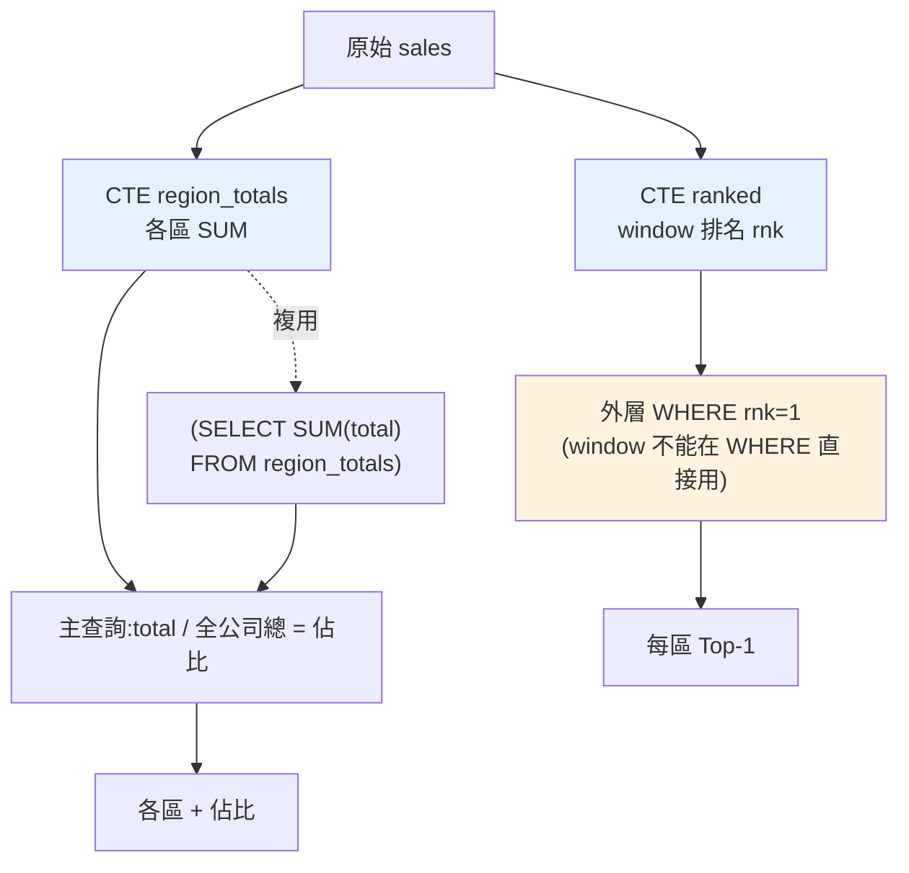

# SQL:CTE、子查詢與樞紐分析

> 真實的分析查詢常常是**多層的**:先算各區總額,再算每區佔比;先算每月營收,再挑出每區最高月;先各自聚合,再合併比較。硬塞進一個扁平查詢會變成一團亂麻。**CTE(通用資料表運算式)** 讓你把查詢拆成**有名字、可讀、可複用的步驟**。這章講 CTE、子查詢,以及分析師常用的 **CASE 樞紐**——把長格式轉成報表的寬格式。

## 💡 白話導讀(建議先讀)

真實的分析查詢是**多步驟料理**:先調醬(算各區月營收)、再醃肉(挑各區最高月)、
最後下鍋(算佔比)。硬把三步塞進一個巢狀大查詢,就是把所有食材丟一鍋——
能吃,但沒人看得懂,也沒法只嚐其中一步的味道。

**CTE(`WITH` 子句)** 讓你把備料步驟**一步步具名寫開**:

```sql
WITH monthly AS (          -- 步驟一:各區月營收
    SELECT region, month, SUM(amount) AS revenue ...
),
ranked AS (                -- 步驟二:用步驟一,排名
    SELECT *, RANK() OVER (PARTITION BY region ORDER BY revenue DESC) AS rk
    FROM monthly
)
SELECT * FROM ranked WHERE rk = 1;   -- 主查詢:各區最好的月份
```

好處全是工程味的:**由上而下讀**(像程式一步步)、**可單獨除錯**
(把主查詢改成 `SELECT * FROM monthly` 就能驗中間結果)、比層層巢狀的子查詢清爽得多。
口訣:**兩層以上的巢狀,就改寫成 CTE**。

後半講**樞紐(pivot)**:把「長流水帳」轉成「城市當列、月份當欄」的報表——
SQL 用 `CASE WHEN` 條件聚合硬轉(標準 SQL 沒有原生 PIVOT),
你會發現[下下章](07-merge-reshape.md) pandas 的 `pivot_table` 一行就做完——
這正是「SQL 撈數、pandas 精加工」分工的預告。

## Why(為什麼)

前面幾章的查詢都是「一步到位」,但真實分析常需要**分階段**:

- **依賴中間結果**:「每區營收**佔全公司**的百分比」——要先有「各區總額」和「全公司總額」兩個中間結果,才能相除。硬寫成一句要重複子查詢、又臭又長。
- **Top-N per group**:「每區營收**最高的月份**」——[window 排名](04-sql-window-functions.md)算出 `rnk`,但**不能在 WHERE 直接過濾 window**,必須把排名查詢包起來,外層再 `WHERE rnk = 1`。
- **[修正 JOIN 灌水](03-sql-joins.md)**:兩個一對多關係要各自聚合再合,得先分別 GROUP BY 成中間結果。
- **可讀性**:一個 5 層巢狀子查詢,三個月後你自己都看不懂。

**CTE(Common Table Expression,`WITH` 子句)** 是解法:把查詢拆成**具名的中間步驟**,像變數一樣命名、逐步組合、由上而下閱讀。它讓複雜分析**可讀、可維護、可除錯**——這是分析師寫出「別人(和未來的自己)看得懂」的 SQL 的關鍵。

另外,分析報表常需要**樞紐(pivot)**:把「長格式」(每列一個 region-product-amount)轉成「寬格式」(每列一個 region,各 product 各一欄)——這是報表/交叉表的標準形狀,SQL 用 **CASE WHEN + 聚合**達成。

## Theory(理論:CTE、子查詢、樞紐)

**CTE(`WITH`)**:在查詢前定義一個或多個**具名的臨時結果集**,主查詢再引用它們:

```sql
WITH step1 AS ( ... ),      -- 第一個中間步驟
     step2 AS ( ... step1 ... )  -- 可引用前面的 CTE
SELECT ... FROM step2;      -- 主查詢用最終結果
```

好處:**由上而下的閱讀順序**(像程式的一步步)、**具名**(語意清楚)、**可複用**(同一 CTE 引用多次)、**好除錯**(可單獨跑某個 CTE)。

**子查詢(subquery)**:巢狀在另一查詢裡的查詢。位置不同用途不同:

- **在 WHERE**:`WHERE amount > (SELECT AVG(amount) FROM sales)`——與整體比較(純量子查詢)。
- **在 FROM**:當成臨時表(CTE 的替代,但可讀性差)。
- **相關子查詢(correlated)**:引用外層的欄位,對每列各執行一次(強大但慢)。

**CTE vs 子查詢**:功能常可互換,但 **CTE 可讀性遠勝**——複雜查詢優先用 CTE。子查詢適合簡單的純量比較(如「高於平均」)。

**樞紐(pivot,長轉寬)**:用**條件聚合** `SUM(CASE WHEN cond THEN val ELSE 0 END)`——每個目標欄一個 CASE,把符合條件的值聚進該欄。這把「每列一筆」的長格式,轉成「每個類別一欄」的寬格式(交叉表)。

## Specification(規範:CTE 與樞紐語法)

**CTE 做分階段分析**(各區佔比):

```sql
WITH region_totals AS (
    SELECT region, SUM(amount) AS total FROM sales GROUP BY region
)
SELECT region, total,
       ROUND(100.0 * total / (SELECT SUM(total) FROM region_totals), 1) AS pct
FROM region_totals
ORDER BY total DESC;
```

**Top-N per group**(每區最高月,CTE + window + 外層過濾):

```sql
WITH ranked AS (
    SELECT region, month, SUM(amount) AS m_total,
           RANK() OVER (PARTITION BY region ORDER BY SUM(amount) DESC) AS rnk
    FROM sales GROUP BY region, month
)
SELECT region, month, m_total FROM ranked WHERE rnk = 1;
-- window 的 rnk 只能在包了一層之後,於外層 WHERE 過濾
```

**樞紐(CASE WHEN,產品營收展開成欄)**:

```sql
SELECT region,
       SUM(CASE WHEN product = 'A' THEN amount ELSE 0 END) AS product_A,
       SUM(CASE WHEN product = 'B' THEN amount ELSE 0 END) AS product_B
FROM sales GROUP BY region;
```

**子查詢**(高於全體平均):

```sql
SELECT month, region, amount FROM sales
WHERE amount > (SELECT AVG(amount) FROM sales);
```

## Implementation(底層:CTE 的本質、樞紐的欄位固定性)

**CTE 是「查詢的區域變數」**:它不建實體表,只是給一個子查詢**命名**,讓主查詢引用。多數資料庫會把 CTE **內聯(inline)** 進主查詢優化執行(邏輯上像先算好、實際上優化器可能融合)。所以 CTE 主要是**可讀性與組織**的工具,不必擔心它「多存了一份資料」。**遞迴 CTE**(`WITH RECURSIVE`)還能處理階層/圖(如組織樹、路徑),是進階題材。

**為何 Top-N per group 一定要兩層**:[window 函式](04-sql-window-functions.md)在 `SELECT` 階段才計算,而 `WHERE` 在 `SELECT` **之前**執行——所以你不能 `WHERE rnk = 1`(那時 `rnk` 還不存在)。必須用 CTE(或子查詢)先算出 `rnk`(成為一個「有 rnk 欄的結果集」),外層查詢才能把 `rnk` 當普通欄過濾。這是 SQL 執行順序的直接後果,也是**最高頻的分析面試題型**之一。

**SQL 樞紐的先天限制:欄位要固定**。`SUM(CASE WHEN product='A' ...)` 要你**事先列出每個目標欄**(product_A、product_B…)——若產品有 100 種,或種類會變動,手寫 100 個 CASE 不現實。**標準 SQL 的 pivot 是「欄位固定」的**;動態欄位要靠應用層(如 [pandas 的 `pivot_table`](07-merge-reshape.md),下一章)或資料庫特定擴充。所以:**少數已知類別用 SQL CASE 樞紐;多數/動態類別用 pandas 樞紐。** 下面範例實跑 CTE、Top-N、樞紐、子查詢。

## Code Example(可執行的 Python 範例)

```python
# sql_cte_pivot.py — CTE / Top-N per group / CASE 樞紐 / 子查詢(stdlib sqlite3)
from __future__ import annotations

import sqlite3


def setup() -> sqlite3.Connection:
    conn = sqlite3.connect(":memory:")
    conn.executescript("""
        CREATE TABLE sales(month TEXT, region TEXT, product TEXT, amount REAL);
        INSERT INTO sales VALUES
          ('2024-01','North','A',1000),('2024-01','North','B',500),('2024-02','North','A',1200),
          ('2024-01','South','A',800),('2024-02','South','B',1500),('2024-02','South','A',600);
    """)
    return conn


def main() -> None:
    conn = setup()

    print("CTE:各區總額 + 佔全公司比例:")
    for row in conn.execute("""
        WITH region_totals AS (
            SELECT region, SUM(amount) AS total FROM sales GROUP BY region
        )
        SELECT region, total,
               ROUND(100.0*total/(SELECT SUM(total) FROM region_totals), 1) AS pct
        FROM region_totals ORDER BY total DESC
    """):
        print(f"  {row}")

    print("\nTop-N per group(每區營收最高的月份):")
    for row in conn.execute("""
        WITH ranked AS (
            SELECT region, month, SUM(amount) AS m_total,
                   RANK() OVER (PARTITION BY region ORDER BY SUM(amount) DESC) AS rnk
            FROM sales GROUP BY region, month
        )
        SELECT region, month, m_total FROM ranked WHERE rnk = 1 ORDER BY region
    """):
        print(f"  {row}")

    print("\n樞紐(CASE WHEN:產品營收展開成欄):")
    for row in conn.execute("""
        SELECT region,
               SUM(CASE WHEN product='A' THEN amount ELSE 0 END) AS product_A,
               SUM(CASE WHEN product='B' THEN amount ELSE 0 END) AS product_B
        FROM sales GROUP BY region ORDER BY region
    """):
        print(f"  {row}")

    print("\n子查詢(高於全體平均金額的紀錄):")
    for row in conn.execute("""
        SELECT month, region, amount FROM sales
        WHERE amount > (SELECT AVG(amount) FROM sales) ORDER BY amount DESC
    """):
        print(f"  {row}")

    conn.close()


if __name__ == "__main__":
    main()
```

**預期輸出**:

```pycon
$ python sql_cte_pivot.py
CTE:各區總額 + 佔全公司比例:
  ('South', 2900.0, 51.8)
  ('North', 2700.0, 48.2)

Top-N per group(每區營收最高的月份):
  ('North', '2024-01', 1500.0)
  ('South', '2024-02', 2100.0)

樞紐(CASE WHEN:產品營收展開成欄):
  ('North', 2200.0, 500.0)
  ('South', 1400.0, 1500.0)

子查詢(高於全體平均金額的紀錄):
  ('2024-02', 'South', 1500.0)
  ('2024-02', 'North', 1200.0)
  ('2024-01', 'North', 1000.0)
```

逐段解說:

- **CTE 分階段**:`region_totals` 先算各區總額(North 2700、South 2900),主查詢再用它算佔比(且 `(SELECT SUM(total) FROM region_totals)` **複用**同一 CTE 算全公司總額)。**由上而下讀**,像程式的兩步——遠比把子查詢塞進一句清楚。
- **Top-N per group**:`ranked` CTE 先按區分月聚合並用 [`RANK()`](04-sql-window-functions.md) 排名,外層 `WHERE rnk = 1` 挑每區最高月(North 是 2024-01 的 1500、South 是 2024-02 的 2100)。**window 的 `rnk` 一定要包一層才能在 WHERE 過濾**——這是執行順序決定的經典兩層寫法。
- **樞紐(CASE)**:把「長格式」(每列 region-product-amount)轉成「寬格式」——每區一列、產品 A/B 各一欄。North 的 A 共 2200、B 共 500。`SUM(CASE WHEN ...)` 是 SQL 樞紐的標準手法,但**欄位要手動列**(A、B)——類別多就該用 [pandas pivot](07-merge-reshape.md)。
- **子查詢**:`WHERE amount > (SELECT AVG(amount) FROM sales)`——與全體平均(約 933)比,挑出高於平均的紀錄。純量子查詢適合這種「與整體比較」。
- **要點**:CTE 讓複雜分析可讀可組合、Top-N per group 靠 CTE+window+外層過濾、CASE 做固定欄樞紐、子查詢做整體比較。

## Diagram(圖解:CTE 分階段)



## Best Practice(最佳實踐)

- **複雜查詢用 CTE 拆步驟**:具名、由上而下、可複用、好除錯——遠勝深層巢狀子查詢。
- **Top-N per group = CTE + window + 外層過濾**:記住這個模式(window 不能在 WHERE 直接用)。
- **CTE 可複用**:同一中間結果多處引用,別重複寫子查詢。
- **CASE 樞紐用於少數已知類別**:類別多/動態改用 [pandas pivot](07-merge-reshape.md)。
- **純量子查詢做整體比較**:「高於平均」「佔總額」等。
- **[修正 JOIN 灌水](03-sql-joins.md)用 CTE 先各自聚合**:兩個一對多先分別 GROUP BY 再合。
- **給 CTE 有意義的名字**:`region_totals`、`ranked`——語意即文件。
- **避免過度巢狀**:超過 2–3 層子查詢就改 CTE,可讀性優先。

## Common Mistakes(常見誤解)

- **試圖在 WHERE 直接過濾 window 結果**:報錯;要用 CTE 包一層再外層過濾。
- **深層巢狀子查詢**:難讀難除錯難維護,應改 CTE。
- **樞紐硬寫大量 CASE**:類別多時不現實,該用 pandas 動態樞紐。
- **相關子查詢用在大表**:對每列各跑一次,效能差;常可改 JOIN/window。
- **CTE 名字無意義**:`t1`、`t2` 失去可讀性優勢。
- **以為 CTE 會存實體資料**:它是具名子查詢,優化器多會內聯,別誤以為有額外開銷或持久化。
- **樞紐後忘了 ELSE 0**:CASE 沒 ELSE 遇不符條件回 NULL,SUM 忽略 NULL(通常還好,但明確 ELSE 0 較清楚)。
- **用子查詢卻可用 CTE**:錯過可讀性;複雜就 CTE。

## Interview Notes(面試重點)

- **能用 CTE 拆解複雜查詢**:`WITH` 具名分步、可複用、由上而下,勝過巢狀子查詢。
- **能解 Top-N per group**:CTE + window 排名 + 外層 `WHERE rnk<=N`,並解釋為何要兩層(WHERE 在 window 前)。
- **能寫 CASE 樞紐**:`SUM(CASE WHEN ...)` 長轉寬,並知道欄位要固定(動態用 pandas)。
- **能區分 CTE vs 子查詢**:功能相近但 CTE 可讀性佳;純量子查詢適合整體比較。
- **知道相關子查詢的效能代價**、CTE 是具名子查詢(非實體表)。
- **能連結灌水修正**:兩個一對多用 CTE 先各自聚合再合。

---

➡️ 下一章:[pandas 資料整理:groupby 與聚合](06-pandas-groupby.md)

[⬆️ 回 Part 23 索引](README.md)
