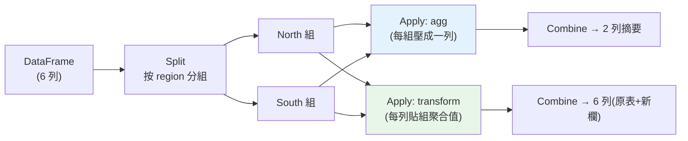

# pandas 資料整理:groupby 與聚合

> [SQL](02-sql-aggregation.md) 適合從資料庫撈數與初步聚合,但撈回本機後、要做**更靈活的整理與探索**時,[pandas](../17-data-science/README.md) 是分析師的主力。pandas 的 `groupby` 是 SQL `GROUP BY` 的對應,但更靈活——一次多重聚合、自訂函式、`transform` 保留原表(對應 [window](04-sql-window-functions.md))。這章講 pandas 分組聚合,並對照 SQL 幫你遷移直覺。

## 💡 白話導讀(建議先讀)

SQL 在資料庫端把數撈回來了,接下來的**靈活加工**輪到 pandas。
`groupby` 的心智模型和 [SQL GROUP BY](02-sql-aggregation.md)、
[Part 17 的發票分堆](../17-data-science/04-dataframe-operations.md)完全同源
——**split-apply-combine**——但 pandas 版多了幾把 SQL 沒有的好刀:

- **`agg`(聚合)＝壓縮**:每組壓成一列,對應 GROUP BY。
  一次多個統計:`df.groupby("region")["amount"].agg(["sum", "mean", "count"])`。
- **`transform`(轉換)＝不壓縮**:每列旁邊附上「所屬組的統計」,
  **列數不變**——認出來了嗎?這就是 [window function](04-sql-window-functions.md) 的
  pandas 版!最經典用法:「每筆訂單佔該區總額的比例」:

```python
df["pct"] = df["amount"] / df.groupby("region")["amount"].transform("sum")
```

- **`filter`(過濾)＝按組踢人**:整組不符合條件就整組刪(「只留總額破百萬的區」,
  對應 HAVING)。

**選錯 agg/transform 是新手頭號 bug**:要「每組一個數」用 agg;
要「每列旁邊附組資訊」用 transform。搞混的症狀是 shape 對不上或 NaN 滿天飛。

這章還有具名聚合(結果欄直接命名)、多鍵分組的 MultiIndex 處理、
以及「groupby + 排序 + head」做**每組 Top N**(又是那道面試菜,pandas 版)。

## Why(為什麼)

已經有 [SQL 聚合](02-sql-aggregation.md)了,為什麼還要 pandas groupby?

- **SQL 撈數、pandas 精整**:典型流程是「用 SQL 從資料庫撈出**適量**資料 → 用 pandas 做**靈活的整理、轉換、探索**」。pandas 在記憶體中操作,適合互動式、迭代式的分析([EDA](08-eda.md)),改個聚合、加個欄位立即看結果,比反覆改 SQL 跑資料庫快。
- **更靈活的聚合**:一次算多個聚合並各自命名、套**自訂函式**(SQL 內建函式做不到的)、`transform` 把分組結果**貼回原表**(SQL 要 window)、跟 [merge/reshape](07-merge-reshape.md) 無縫銜接。
- **與 Python 生態接軌**:算完直接[視覺化](../24-business-analytics/07-visualization.md)、[統計檢定](../24-business-analytics/03-hypothesis-testing.md)、餵給 [ML](../25-machine-learning/README.md)——都在同一個 Python 環境。

pandas 的 `groupby` 遵循 **split-apply-combine** 模型:**拆分**(按鍵分組)→ **套用**(對每組算聚合/轉換)→ **合併**(組回結果)。這和 SQL `GROUP BY` 是同一個概念,但 pandas 給你**更多套用方式**(agg 多聚合、transform 保形、apply 自訂)。掌握它,加上 SQL,分析師的資料處理能力就完整了。

> 本章假設你有 [Part 17 pandas 基礎](../17-data-science/README.md)(DataFrame/Series/索引)。

## Theory(理論:split-apply-combine)

`groupby` 的心智模型是 **split-apply-combine**(拆分—套用—合併):

1. **Split(拆分)**:按一或多個鍵把 DataFrame 分成多組(如按 `region` 分成 North/South 兩組)。
2. **Apply(套用)**:對每組**獨立**套一個操作:
   - **聚合(aggregate)**:每組壓成一個值(`sum`/`mean`/`count`…)——對應 [SQL GROUP BY](02-sql-aggregation.md),**改變粒度**(N 列 → 每組一列)。
   - **轉換(transform)**:每組算出與原組**同長度**的結果,貼回原位置(如「每列佔組內比例」)——對應 [SQL window](04-sql-window-functions.md),**不改變粒度**。
   - **過濾(filter)**:依組的性質保留/剔除整組(如「只留總額 > X 的組」)——對應 [SQL HAVING](02-sql-aggregation.md)。
3. **Combine(合併)**:把各組結果組回一個 DataFrame/Series。

**agg vs transform 的關鍵差異**(對應 GROUP BY vs window):

- `groupby(...).agg(...)`:**壓縮**——每組一列,得摘要表。
- `groupby(...).transform(...)`:**保形**——回傳與原表**等長**,把組的聚合值**廣播**回每一列,方便加成新欄(如佔比、離均差)。

## Specification(規範:groupby 常用寫法)

**單一聚合**:

```python
df.groupby("region")["amount"].sum()          # 各區總營收(Series)
df.groupby("region")["amount"].mean()
```

**多重具名聚合(named aggregation,推薦)**:

```python
df.groupby("region").agg(
    total=("amount", "sum"),        # 新欄名=(來源欄, 聚合函式)
    avg=("amount", "mean"),
    orders=("amount", "count"),
    total_qty=("qty", "sum"),
).reset_index()                      # reset_index 把分組鍵從索引變回欄
```

**多欄分組(交叉)**:

```python
df.groupby(["region", "product"])["amount"].sum().reset_index()
```

**transform(保留原表,加新欄)**:

```python
df["region_total"] = df.groupby("region")["amount"].transform("sum")  # 每列貼上所屬區的總額
df["pct_in_region"] = df["amount"] / df["region_total"] * 100          # 算佔區內比例
```

**自訂聚合函式**:

```python
df.groupby("region")["amount"].agg(lambda s: s.max() - s.min())  # 極差
```

**SQL ↔ pandas 對照**:

| SQL | pandas |
|-----|--------|
| `GROUP BY region` | `df.groupby("region")` |
| `SUM(amount) AS total` | `.agg(total=("amount","sum"))` |
| `GROUP BY a, b` | `df.groupby(["a","b"])` |
| `HAVING SUM(x)>N` | `.filter(lambda g: g["x"].sum()>N)` |
| window `SUM() OVER(PARTITION BY r)` | `.groupby("r")["x"].transform("sum")` |

## Implementation(底層:agg 壓縮 vs transform 廣播、索引)

**agg 與 transform 的機制差異**:`agg` 對每組回**一個純量**,結果的列數 = 組數(壓縮);`transform` 對每組回**與該組等長**的序列,結果**對齊回原 DataFrame 的索引**(廣播)。所以 `transform("sum")` 會把「該組的總和」複製到該組每一列——這正是要算「佔比、與組平均的差、組內排名」時需要的:你要**保留每列明細**,同時附上組的統計量。這對應 [SQL window](04-sql-window-functions.md) 的「不壓縮 + 附群體視角」。**選 agg 還 transform,取決於你要「摘要表」還是「原表加欄」。**

**分組鍵變成索引**:`groupby(...).agg(...)` 預設把**分組鍵放進索引**(index),不是普通欄。要當普通欄用(後續 [merge](07-merge-reshape.md)、輸出)常需 `.reset_index()` 把索引變回欄。這是新手常卡的點——聚合結果「找不到 region 欄」,因為它在索引裡。

**named aggregation 的好處**:`agg(total=("amount","sum"), ...)` 直接給每個聚合**命名**,輸出欄名乾淨(不是 `amount` 的多層欄),可讀、好接後續處理——比舊式 `agg({"amount":["sum","mean"]})`(產生 MultiIndex 欄)清爽得多,是現在的推薦寫法。下面範例實跑各種 groupby。

## Code Example(可執行的 Python 範例)

```python
# pandas_groupby.py — pandas 分組聚合:agg / 多欄 / transform(需要 pandas)
from __future__ import annotations

import pandas as pd


def main() -> None:
    df = pd.DataFrame(
        {
            "region": ["North", "North", "South", "South", "North", "South"],
            "product": ["A", "B", "A", "B", "A", "A"],
            "amount": [1200, 800, 1500, 600, 400, 900],
            "qty": [3, 2, 5, 1, 1, 3],
        }
    )

    # 1. 單一聚合(對應 SQL SUM ... GROUP BY)
    totals = df.groupby("region")["amount"].sum().sort_values(ascending=False)
    print("各區總營收:", totals.to_dict())

    # 2. 多重具名聚合
    agg = df.groupby("region").agg(
        total=("amount", "sum"),
        avg=("amount", "mean"),
        orders=("amount", "count"),
        total_qty=("qty", "sum"),
    ).reset_index()
    print("\n多重聚合:")
    print(agg.to_string(index=False))

    # 3. 多欄分組(交叉)
    cross = df.groupby(["region", "product"])["amount"].sum().reset_index()
    print("\n區域 × 產品:")
    print(cross.to_string(index=False))

    # 4. transform:保留原表,算佔區內比例(對應 SQL window)
    df["region_total"] = df.groupby("region")["amount"].transform("sum")
    df["pct_in_region"] = (df["amount"] / df["region_total"] * 100).round(1)
    print("\ntransform 佔區內比例:")
    print(df[["region", "product", "amount", "pct_in_region"]].to_string(index=False))


if __name__ == "__main__":
    main()
```

**預期輸出**:

```pycon
$ python pandas_groupby.py
各區總營收: {'South': 3000, 'North': 2400}

多重聚合:
region  total   avg  orders  total_qty
 North   2400   800.0      3          6
 South   3000  1000.0      3          9

區域 × 產品:
region product  amount
 North       A    1600
 North       B     800
 South       A    2400
 South       B     600

transform 佔區內比例:
region product  amount  pct_in_region
 North       A    1200           50.0
 North       B     800           33.3
 South       A    1500           50.0
 South       B     600           20.0
 North       A     400           16.7
 South       A     900           30.0
```

逐段解說:

- **單一聚合**:`groupby("region")["amount"].sum()`——對應 SQL 的 `SELECT region, SUM(amount) GROUP BY region`。South 3000 > North 2400。回傳 Series(index 是 region)。
- **多重具名聚合**:一次算 total/avg/orders/total_qty 並各自命名——比寫四段 SQL 或多層欄清爽。`reset_index()` 把 `region` 從索引變回欄(否則後續難用)。**named aggregation 是推薦寫法**。
- **多欄分組**:`groupby(["region","product"])`——交叉分析,對應 SQL 多欄 GROUP BY。North 的 A 共 1600。
- **transform 佔比**:`transform("sum")` 把「所屬區總額」**貼回每一列**(North 的 3 列都貼 2400),再算 `amount/region_total`——North 第一筆 A 佔區內 1200/2400 = **50%**。**注意輸出是 6 列(原表全保留)**,不像 agg 壓成 2 列。這正是 transform(保形)vs agg(壓縮)的差異,對應 [SQL window vs GROUP BY](04-sql-window-functions.md)。
- **SQL↔pandas 遷移**:有 SQL 底子的話,`GROUP BY`→`groupby`、`SUM AS`→`agg(name=(col,"sum"))`、window→`transform`——概念一一對應,直覺可平移。

## Diagram(圖解:split-apply-combine)



## Best Practice(最佳實踐)

- **SQL 撈數、pandas 精整**:資料庫端聚合減量,撈回本機用 pandas 做靈活整理探索。
- **用 named aggregation**:`agg(name=(col, func))` 一次多聚合並命名,輸出乾淨。
- **聚合後 `reset_index()`**:把分組鍵從索引變回欄,方便後續 merge/輸出。
- **要「原表加欄」用 transform、要「摘要表」用 agg**:對應 window vs GROUP BY。
- **多欄分組做交叉**:`groupby([...])`。
- **自訂邏輯用 agg(lambda)/apply**:SQL 內建函式做不到的用 Python 函式(但 apply 較慢,能用內建就用內建)。
- **借 SQL 直覺遷移**:GROUP BY→groupby、window→transform、HAVING→filter。
- **注意效能**:`apply` 逐組跑 Python 慢;優先向量化的內建聚合。

## Common Mistakes(常見誤解)

- **聚合後忘 reset_index**:分組鍵在索引裡,後續「找不到欄」而卡住。
- **該用 transform 卻用 agg**:想加「佔比」欄卻用 agg 壓成摘要,長度對不上原表。
- **濫用 apply**:能用內建向量化聚合卻寫 `apply(lambda)`,慢很多。
- **忽略聚合的 NaN 行為**:pandas 的 `sum`/`mean` 預設**跳過 NaN**(類似 SQL 忽略 NULL),分母要清楚(見 [EDA](08-eda.md))。
- **多層欄難處理**:舊式 `agg({"x":["sum","mean"]})` 產生 MultiIndex 欄;改 named aggregation。
- **把大表全撈回本機**:該在 SQL 端先聚合減量,別讓 pandas 吃下不必要的資料。
- **分組鍵型別不一致**:如 `North`/`north` 沒[清理](01-analyst-workflow.md)就分成兩組(同 SQL 問題)。
- **以為 groupby 會排序保證**:預設按鍵排序,但別依賴組內原順序(需要就明確 sort)。

## Interview Notes(面試重點)

- **能講 split-apply-combine**:拆分→套用(agg/transform/filter)→合併,是 groupby 的心智模型。
- **能區分 agg vs transform**:壓縮成摘要(對應 GROUP BY)vs 保形貼回原表(對應 window)。
- **能寫 named aggregation**:`agg(name=(col, func))`,一次多聚合並命名。
- **能做 SQL↔pandas 對照**:GROUP BY/SUM/window/HAVING 各自的 pandas 對應。
- **知道聚合後要 reset_index**、聚合跳過 NaN(分母意識)。
- **知道何時 SQL 何時 pandas**:資料庫端聚合減量、本機 pandas 靈活整理探索。

---

➡️ 下一章:[合併與重塑:merge / pivot / melt](07-merge-reshape.md)

[⬆️ 回 Part 23 索引](README.md)
