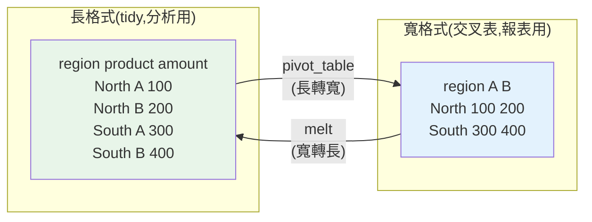

# 合併與重塑:merge / pivot / melt

> 分析師拿到的資料常常「形狀不對」——需要的欄位散在多個 DataFrame(要**合併**),或格式是長不是寬、寬不是長(要**重塑**)。pandas 的 `merge`(對應 [SQL JOIN](03-sql-joins.md))、`pivot_table`(長轉寬)、`melt`(寬轉長)是把資料**變成分析/報表需要的形狀**的三把關鍵工具。這章講透,並延續 [JOIN 的灌水陷阱](03-sql-joins.md)在 pandas 的對應。

## Why(為什麼)

「整理資料」很大一部分是「**把資料弄成對的形狀**」:

- **合併(merge)**:分析需要的資訊散在多個表/檔——客戶資料、訂單、產品目錄。要用 `merge` 按鍵**拼起來**,才能一起分析(如「各城市營收」需 customers 的城市 + orders 的金額)。這是 [SQL JOIN](03-sql-joins.md) 的 pandas 版,連**灌水陷阱**都一樣要小心。
- **長格式 vs 寬格式**:同一份資料有兩種形狀。**長格式(long/tidy)**——每列一個觀測(region, product, amount),適合**儲存與分析**(groupby、畫圖、餵 ML)。**寬格式(wide)**——每列一個實體、類別展開成欄(region × product 的交叉表),適合**人看與報表**。分析中常需在兩者間轉換:
  - **pivot(長轉寬)**:做交叉表/報表(對應 [SQL CASE 樞紐](05-sql-cte-pivot.md),但 pandas 能**動態產生欄**,不必手列)。
  - **melt(寬轉長)**:把報表式的寬資料還原成整齊的長格式,才好 groupby/畫圖。

這三個操作看似瑣碎,卻是「資料整理佔分析師 60–80% 時間」的核心組成。做不好,後面的分析根本無從下手。

## Theory(理論:merge 與 long/wide)

**merge(合併)**——按**鍵(key)** 把兩個 DataFrame 對齊拼接,`how` 決定保留哪邊:

- `how="inner"`:只留兩邊都有匹配的鍵(對應 [INNER JOIN](03-sql-joins.md))。
- `how="left"`:保留左表全部,右表無匹配補 `NaN`(對應 LEFT JOIN)。
- `how="right"` / `how="outer"`:保留右表 / 兩邊全部。
- `on="key"`:兩邊同名鍵欄;不同名用 `left_on`/`right_on`。

**tidy data(整齊資料)** 原則(長格式的理論基礎):

1. 每個**變數**一欄。
2. 每個**觀測**一列。
3. 每種**觀測單位**一張表。

整齊的長格式是**分析與工具的最愛**——groupby、[畫圖](../24-business-analytics/07-visualization.md)、[統計](../24-business-analytics/03-hypothesis-testing.md)、[ML](../25-machine-learning/README.md) 都預期這種形狀。而寬格式是**呈現**用的(人看交叉表方便)。所以:**分析時用長格式,報表時 pivot 成寬格式**。

**pivot / melt 是互逆操作**:

- **pivot / pivot_table**:長 → 寬。指定 `index`(留作列)、`columns`(展開成欄)、`values`(填入的值)、聚合函式(重複時如何合)。
- **melt**:寬 → 長。指定 `id_vars`(保持不動的欄)、其餘欄「融化」成 `variable`/`value` 兩欄。

## Specification(規範:三大操作)

**merge**:

```python
customers.merge(orders, on="cid", how="left")            # LEFT JOIN
customers.merge(orders, on="cid", how="left", indicator=True)  # 加 _merge 欄檢查匹配
df1.merge(df2, left_on="id", right_on="cust_id", how="inner")  # 鍵名不同
```

**pivot_table(長轉寬,能聚合、能動態產生欄)**:

```python
sales.pivot_table(
    index="region",       # 留作列的鍵
    columns="product",    # 展開成欄(動態:有幾種 product 就幾欄)
    values="amount",      # 填入的值
    aggfunc="sum",        # 重複時如何聚合(預設 mean)
    fill_value=0,         # 缺格填 0
)
```

**melt(寬轉長,還原成整齊格式)**:

```python
wide.reset_index().melt(
    id_vars="region",         # 不動的識別欄
    var_name="product",       # 融化後的「欄名」變數
    value_name="amount",      # 融化後的「值」變數
)
```

**pivot vs pivot_table**:`pivot` 純重塑(重複鍵會報錯);`pivot_table` **能聚合**(重複鍵用 `aggfunc` 合)——分析用 `pivot_table` 較安全。

## Implementation(底層:merge 灌水、validate、long/wide 取捨)

**merge 的灌水陷阱與 SQL 完全一樣**:[SQL JOIN 一對多會讓聚合灌水](03-sql-joins.md),pandas `merge` 同理——若右表對某鍵有多列,左列會被**複製多份**。若你接著 groupby sum,就會重複計算。**pandas 提供防呆:`validate` 參數**——`merge(..., validate="one_to_one")` / `"one_to_many"` / `"many_to_one"`,若實際關係不符會**直接報錯**,幫你在灌水發生前攔截。這是 SQL 沒有的好工具,**做 merge 時務必用 `validate` 宣告你預期的關係**,把「悄悄灌水」變成「明確報錯」。

**`indicator=True` 檢查匹配**:merge 後加一個 `_merge` 欄,標記每列是 `both`/`left_only`/`right_only`。用 `df["_merge"].value_counts()` 能一眼看出「多少列成功匹配、多少沒匹配」——**資料驗證的利器**。若你以為都會匹配卻有一堆 `left_only`,代表鍵有問題(型別不符、資料缺失),及早發現。

**long vs wide 的選擇不是美學,是功能**:pandas 的 groupby、seaborn 的畫圖、sklearn 的輸入,幾乎都預期**長格式**(每列一觀測)。寬格式(交叉表)給人看方便,但程式處理彆扭(欄名帶資料、欄數不定)。所以**經驗法則:進來的寬報表先 `melt` 成長格式做分析,要輸出報表時再 `pivot` 成寬**。搞混方向(該長卻寬)是新手畫不出圖、groupby 卡住的常見原因。下面範例實跑 merge、pivot、melt。

## Code Example(可執行的 Python 範例)

```python
# merge_reshape.py — merge / pivot_table / melt(需要 pandas)
from __future__ import annotations

import pandas as pd


def main() -> None:
    customers = pd.DataFrame(
        {"cid": [1, 2, 3], "name": ["Alice", "Bob", "Carol"], "city": ["Taipei", "Tainan", "Taipei"]}
    )
    orders = pd.DataFrame({"cid": [1, 1, 2], "amount": [500, 300, 800]})

    # 1. merge(left,保留所有客戶;Carol 無訂單 → NaN)
    left = customers.merge(orders, on="cid", how="left")
    print("left merge:")
    print(left.to_string(index=False))

    # 2. indicator 檢查匹配情況(資料驗證)
    checked = customers.merge(orders, on="cid", how="left", indicator=True)
    print("\n匹配情況:", checked["_merge"].value_counts().to_dict())

    # 3. pivot_table:長轉寬(交叉報表,動態產生欄)
    sales = pd.DataFrame(
        {
            "region": ["North", "North", "South", "South"],
            "product": ["A", "B", "A", "B"],
            "amount": [100, 200, 300, 400],
        }
    )
    wide = sales.pivot_table(
        index="region", columns="product", values="amount", aggfunc="sum", fill_value=0
    )
    print("\npivot_table 長轉寬:")
    print(wide.to_string())

    # 4. melt:寬轉長(還原成整齊長格式)
    long = wide.reset_index().melt(id_vars="region", var_name="product", value_name="amount")
    print("\nmelt 寬轉長:")
    print(long.to_string(index=False))


if __name__ == "__main__":
    main()
```

**預期輸出**:

```pycon
$ python merge_reshape.py
left merge:
 cid  name   city  amount
   1 Alice Taipei   500.0
   1 Alice Taipei   300.0
   2   Bob Tainan   800.0
   3 Carol Taipei     NaN

匹配情況: {'both': 3, 'left_only': 1, 'right_only': 0}

pivot_table 長轉寬:
product      A      B
region
North    100.0  200.0
South    300.0  400.0

melt 寬轉長:
region product  amount
 North       A   100.0
 South       A   300.0
 North       B   200.0
 South       B   400.0
```

逐段解說:

- **left merge**:保留所有客戶,Alice 的兩筆訂單各成一列(她被複製了)、Bob 一筆、**Carol 無訂單 → `amount` 為 `NaN`**。這是 [SQL LEFT JOIN](03-sql-joins.md) 的 pandas 版。**注意 Alice 被複製成兩列——若接著 sum 要小心灌水**(可用 `validate="one_to_many"` 宣告預期)。
- **indicator 檢查**:`_merge` 顯示 `both: 3`(3 列成功匹配)、`left_only: 1`(Carol 沒匹配)。**一眼看出匹配狀況**——若預期全匹配卻有 `left_only`,代表鍵有問題,及早抓。
- **pivot_table(長轉寬)**:把長格式(region, product, amount)轉成交叉表——region 作列、product 展開成 A/B 欄。**欄是動態產生的**(有幾種 product 就幾欄),不像 [SQL CASE 樞紐](05-sql-cte-pivot.md)要手列——這是 pandas 樞紐的優勢。`aggfunc="sum"` 處理重複、`fill_value=0` 補缺。
- **melt(寬轉長)**:把上面的寬交叉表**還原**成整齊長格式——每列一個 region-product-amount 觀測。這是 pivot 的逆操作。**拿到寬報表要分析,先 melt 成長格式**,才好 groupby/畫圖。
- **要點**:merge 拼表(注意灌水,用 validate/indicator 防呆)、pivot 長→寬(報表)、melt 寬→長(分析)。分析用長、呈現用寬。

## Diagram(圖解:long ↔ wide)



## Best Practice(最佳實踐)

- **merge 用 `validate` 宣告關係**:`one_to_one`/`one_to_many` 等,實際不符即報錯,防灌水。
- **merge 後用 `indicator` 驗證匹配**:`_merge` 的分布揪出沒匹配的鍵(型別/缺失問題)。
- **依問題選 `how`**:要「所有左表」用 left、要「都匹配」用 inner(同 [SQL JOIN](03-sql-joins.md))。
- **分析用長格式、報表用寬格式**:進來的寬資料先 melt,輸出報表再 pivot。
- **用 `pivot_table` 而非 `pivot`**:能聚合、處理重複鍵、`fill_value` 補缺,較安全。
- **merge 後檢查列數**:灌水時列數會異常變多;對照預期。
- **鍵型別要一致**:`int` 對 `str` 不會匹配(同 [清理](01-analyst-workflow.md)議題),先統一型別。
- **處理 merge 後的 NaN**:LEFT merge 的無匹配欄是 NaN,依語意 `fillna` 或保留。

## Common Mistakes(常見誤解)

- **merge 一對多後聚合灌水**:左列被複製,sum 重複計算(同 [SQL JOIN 陷阱](03-sql-joins.md));用 `validate` 防呆。
- **不驗證匹配**:以為都匹配,其實一堆 `left_only`(鍵型別/缺失),結論偏。
- **鍵型別不一致**:`1`(int)與 `"1"`(str)不匹配,靜默全變 NaN。
- **該用長格式卻硬用寬**:groupby/畫圖卡住,因為工具預期長格式。
- **用 `pivot` 遇重複鍵報錯**:分析用 `pivot_table`(能聚合)。
- **pivot 後忘 reset_index 就 melt**:index 沒放進 id_vars,融化結果缺識別欄。
- **melt 沒指定 id_vars**:識別欄也被融化,資料亂掉。
- **忽略 merge 後 NaN 的下游影響**:NaN 進聚合/計算導致意外結果。

## Interview Notes(面試重點)

- **能對照 merge 與 SQL JOIN**:how=inner/left/outer 對應各 JOIN,連灌水陷阱都一樣。
- **能講 merge 防呆**:`validate` 宣告關係(one_to_many 等)、`indicator` 驗證匹配——SQL 沒有的好工具。
- **能講 tidy data / long vs wide**:每變數一欄每觀測一列;分析用長、呈現用寬。
- **能用 pivot_table 長轉寬、melt 寬轉長**,並知道它們互逆、pivot_table 能聚合、欄動態產生。
- **知道 pandas 樞紐勝過 [SQL CASE](05-sql-cte-pivot.md)**:動態欄不必手列。
- **知道鍵型別一致、merge 後驗證列數/匹配**的重要。

---

➡️ 下一章:[探索性資料分析 EDA](08-eda.md)

[⬆️ 回 Part 23 索引](README.md)
