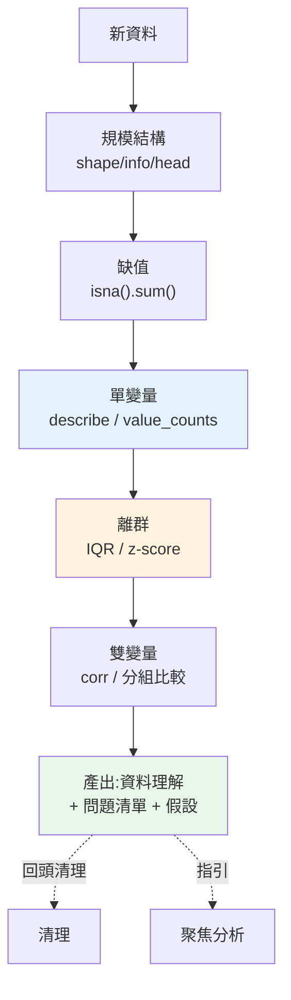

# 探索性資料分析 EDA

> 拿到一份新資料,別急著跑分析或建模——先**認識它**。有多少列多少欄?哪些欄有缺值?數值的分布長怎樣、有沒有離群?類別欄有哪些值、分布均不均?**探索性資料分析(EDA)** 就是「跟資料對話」的過程,目的是**建立對資料的理解、發現問題、形成假設**。跳過 EDA 直接分析,等於閉著眼睛開車。這章講 EDA 的方法與工具。

## 💡 白話導讀(建議先讀)

拿到新資料就直接跑分析,像**沒體檢就開藥**——藥效再好也可能開錯方向。
**EDA(exploratory data analysis,探索式資料分析)** 就是那套體檢流程,
目的只有一個:**先認識資料,再相信資料**。

體檢項目按順序做,這章給完整 checklist:

1. **量身高體重**(`df.shape`、`df.info()`):幾列幾欄、每欄什麼型別——
   「金額怎麼是字串?」這種病越早發現越好。
2. **驗血找缺失**(`df.isna().sum()`):哪些欄缺、缺多少——缺 3% 和缺 60% 的
   處理方式天差地遠。
3. **看數值分布**(`df.describe()` + 直方圖):平均與中位數差很大?→偏態或離群值。
   **平均數會說謊**(一個億萬富翁進來,全村「平均」變有錢)——搭配中位數與分位數看。
4. **看類別分布**(`value_counts()`):有沒有「台北/臺北/Taipei」三胞胎?
   某類別只有 3 筆(之後分組統計會不穩)?
5. **看關聯**(散佈圖、相關係數):兩變數有沒有關係——
   記住體檢報告的免責聲明:**相關不等於因果**(冰淇淋銷量和溺水人數高度相關,
   因為都是夏天)。

EDA 的產出不是圖表堆,是**一份「資料健康報告」+ 值得深挖的假設清單**——
它決定你後面的分析方向,是整個流程裡投資報酬率最高的一步。

## Why(為什麼)

**EDA(Exploratory Data Analysis)** 是分析流程中承先啟後的關鍵一步([工作流](01-analyst-workflow.md)的「探索」階段)。為什麼非做不可?

- **不認識資料就會被誤導**:一欄「年齡」裡混了個 `200`(輸入錯誤)、一欄「金額」有 30% 是缺值、某類別佔了 95%(嚴重不平衡)——**不先看清楚,你的平均值、相關、模型全被污染**,得出錯誤結論還不自知。
- **發現資料品質問題**:缺值、離群、重複、型別錯、不一致——EDA 是**發現這些問題**的地方,發現了才能回頭[清理](01-analyst-workflow.md)。
- **形成假設、指引分析方向**:看分布、看關係,常會**冒出洞察或問題**(「咦,這兩個變數好像相關」「這群客戶的行為特別不一樣」)——這些引導後續的[聚焦分析](../24-business-analytics/README.md)。
- **選對後續方法**:資料是常態分布還是偏態?類別平不平衡?有沒有離群?這些決定你該用什麼[統計](../24-business-analytics/01-descriptive-stats.md)、[圖表](../24-business-analytics/07-visualization.md)、模型。

EDA 沒有標準流程,但有**系統性的檢查清單**:規模與結構、缺值、數值分布、離群、類別分布、變數間關係。這章給你這套清單與對應的 pandas 工具,讓「認識資料」變成可靠的例行動作,而非隨興亂看。

## Theory(理論:EDA 的檢查維度)

系統性 EDA 涵蓋幾個維度(由整體到細節):

1. **規模與結構(shape & schema)**:幾列幾欄?每欄什麼型別?欄名意義?——`df.shape`、`df.info()`、`df.dtypes`、`df.head()`。
2. **缺值(missing)**:哪些欄有缺、缺多少比例?——`df.isna().sum()`。缺值多的欄要決定[處理策略](01-analyst-workflow.md)(丟棄/填補/保留)。
3. **數值欄的分布與統計(univariate numeric)**:集中趨勢(平均/中位數)、離散(標準差/四分位)、範圍、偏態——`df.describe()`(詳見 [Part 24 敘述統計](../24-business-analytics/01-descriptive-stats.md))。
4. **離群值(outliers)**:異常大/小的值,可能是錯誤或真實極端——**IQR 法**或 z-score。
5. **類別欄的分布(univariate categorical)**:有哪些類別、各佔多少、是否不平衡——`value_counts()`。
6. **變數間關係(bivariate)**:數值間的[相關](../24-business-analytics/02-correlation-causation.md)、類別與數值的關係——`corr()`、分組比較。

**單變量 → 雙變量 → 多變量**:先一個個欄看清楚(單變量),再看兩兩關係(雙變量),必要時多變量。EDA 高度依賴**視覺化**([Part 24 ch07](../24-business-analytics/07-visualization.md))——直方圖看分布、箱型圖看離群、散佈圖看關係;但數值摘要(本章重點)是視覺化的基礎。

## Specification(規範:EDA 工具箱)

| 維度 | pandas 工具 | 看什麼 |
|------|-------------|--------|
| 規模結構 | `df.shape`、`df.info()`、`df.head()` | 列數欄數、型別、樣貌 |
| 缺值 | `df.isna().sum()`、`df.isna().mean()` | 各欄缺值數/比例 |
| 數值統計 | `df.describe()` | count/mean/std/min/四分位/max |
| 離群 | IQR:`q1-1.5*iqr`、`q3+1.5*iqr` | 超出範圍的值 |
| 類別分布 | `df["col"].value_counts()`、`.nunique()` | 各類別數量、相異數 |
| 相關 | `df.corr()` | 數值欄兩兩相關係數 |
| 重複 | `df.duplicated().sum()` | 重複列數 |

**IQR 離群法**:

```text
Q1 = 第 25 百分位,Q3 = 第 75 百分位
IQR = Q3 − Q1(中間 50% 的範圍)
離群 = 值 < Q1 − 1.5×IQR 或 值 > Q3 + 1.5×IQR
```

**describe 的解讀**:`mean` 遠大於 `median`(50%)→ 右偏(有大值拉高);`std` 相對 `mean` 很大 → 離散大;`max` 遠離 `75%` → 可能有離群。

## Implementation(底層:IQR 為何穩健、缺值與相關的陷阱)

**IQR 法為何用來抓離群**:離群偵測不能用「平均 ± N 倍標準差」的天真做法——因為**離群值本身會拉高平均和標準差**,反而讓門檻變寬、抓不到它們(離群污染了判斷離群的統計量)。IQR 用**四分位數**(Q1、Q3),而四分位數是**穩健(robust)** 的——**不受極端值影響**(算的是位置,不是加總)。所以 `Q3 + 1.5×IQR` 這個門檻不會被離群自己污染,能穩定地把它們框出來。這也是[箱型圖](../24-business-analytics/07-visualization.md)判定離群的標準。

**離群不等於「錯誤」**:抓到離群後**不要無腦刪除**。離群可能是:(a) 真的錯誤(年齡 200)→ 該修/刪;(b) 真實的極端值(超級大客戶)→ **保留**,它可能正是最重要的訊號。EDA 的職責是**發現並標記**離群,**決定怎麼處理要靠領域知識**——刪掉真實極端值會抹掉重要資訊。

**缺值與相關的常見陷阱**:(1) `describe()`/`mean()` **自動跳過缺值**——所以 `count` 欄告訴你「這欄實際有幾個非缺值」,若某欄 count 遠小於總列數,代表缺很多,它的統計量只代表「有值的那部分」。(2) `corr()` 預設用**成對完整(pairwise complete)** 或需先 `dropna`——缺值處理方式會影響相關結果。(3) 相關只反映**線性**關係且**不代表因果**(見 [Part 24 ch02](../24-business-analytics/02-correlation-causation.md))。EDA 時要意識到這些,別被自動跳過的缺值或線性假設誤導。下面範例實跑一輪 EDA。

## Code Example(可執行的 Python 範例)

```python
# eda.py — 探索性資料分析:缺值/describe/離群/分布/相關(需要 pandas + numpy)
from __future__ import annotations

import numpy as np
import pandas as pd


def iqr_outliers(s: pd.Series) -> list[float]:
    """IQR 法抓離群:超出 [Q1-1.5IQR, Q3+1.5IQR] 的值(四分位穩健,不被離群污染)。"""
    q1, q3 = s.quantile(0.25), s.quantile(0.75)
    iqr = q3 - q1
    lo, hi = q1 - 1.5 * iqr, q3 + 1.5 * iqr
    return s[(s < lo) | (s > hi)].tolist()


def main() -> None:
    df = pd.DataFrame(
        {
            "age": [25, 30, 35, 40, 45, 50, 200, np.nan, 28, 33],  # 200 離群、1 缺值
            "income": [30, 45, 50, 60, 80, 90, 100, 55, None, 70],
            "city": ["A", "A", "B", "B", "A", "C", "B", "A", "C", "B"],
        }
    )

    # 1. 規模與缺值
    print(f"形狀: {df.shape}")
    print(f"缺值統計: {df.isna().sum().to_dict()}")

    # 2. 數值欄敘述統計
    print("\n數值欄 describe:")
    print(df[["age", "income"]].describe().round(1).to_string())

    # 3. 離群偵測
    print(f"\nage 離群值(IQR): {iqr_outliers(df['age'].dropna())}")

    # 4. 類別欄分布
    print(f"\ncity 分布: {df['city'].value_counts().to_dict()}")

    # 5. 數值欄相關
    print("\nage-income 相關(去缺值):")
    print(df[["age", "income"]].dropna().corr().round(2).to_string())


if __name__ == "__main__":
    main()
```

**預期輸出**:

```pycon
$ python eda.py
形狀: (10, 3)
缺值統計: {'age': 1, 'income': 1, 'city': 0}

數值欄 describe:
         age  income
count    9.0     9.0
mean    54.0    64.4
std     55.3    22.6
min     25.0    30.0
25%     30.0    50.0
50%     35.0    60.0
75%     45.0    80.0
max    200.0   100.0

age 離群值(IQR): [200.0]

city 分布: {'A': 4, 'B': 4, 'C': 2}

age-income 相關(去缺值):
         age  income
age     1.00    0.68
income  0.68    1.00
```

逐段解說:

- **規模與缺值**:10 列 3 欄;`age` 和 `income` 各缺 1 個。**第一步永遠先看規模與缺值**——知道資料多大、哪裡有洞。
- **describe 的線索**:`age` 的 `mean=54` 但 `median(50%)=35`——**平均遠大於中位數,強烈暗示右偏或有離群**(果然 `max=200` 遠離 `75%=45`)。`std=55.3` 比 `mean` 還大——離散異常大,也是離群的訊號。**光看 describe 就能嗅到「age 有問題」**。`count=9` 提醒你這欄只有 9 個有效值(跳過了 1 個缺值)。
- **離群偵測**:IQR 法精準抓出 `200`——因為四分位數(Q1=30, Q3=45)**不被 200 污染**,`Q3+1.5×IQR = 45+1.5×15 = 67.5`,200 遠超過。這就是 IQR 穩健的價值。**抓到後要判斷**:200 歲顯然是錯誤(該修/刪),不是真實極端值。
- **類別分布**:`city` A/B 各 4、C 只 2——看**類別是否平衡**(這裡還算均勻;若某類佔 95% 就要注意)。
- **相關**:age 與 income 相關 0.68(中度正相關)——**但這只是線性關係、且不代表因果**(見 [Part 24 ch02](../24-business-analytics/02-correlation-causation.md));且此處先 `dropna` 才算(缺值處理影響結果)。
- **EDA 的產出**:一份「資料理解 + 問題清單」——age 有離群要處理、有缺值要決定策略、age-income 可能有關係值得深究。這些**指引後續分析**。

## Diagram(圖解:EDA 流程)



## Best Practice(最佳實踐)

- **分析前一定先 EDA**:認識資料、發現問題、形成假設,別閉眼開車。
- **系統性檢查**:規模→缺值→單變量(數值/類別)→離群→雙變量,別隨興亂看。
- **同時看 mean 與 median**:差很多就是偏態/離群的訊號,別只看平均。
- **用 IQR 抓離群**:四分位穩健,不被離群自己污染;比「平均±N倍std」可靠。
- **離群發現後靠領域判斷**:錯誤才刪、真實極端值要留,別無腦刪除。
- **意識缺值的自動跳過**:describe/mean 跳過 NaN,`count` 告訴你有效數;分母要清楚。
- **搭配視覺化**:直方圖/箱型圖/散佈圖([Part 24](../24-business-analytics/07-visualization.md))讓分布與關係更直觀。
- **EDA 可重現**:用 [notebook](../17-data-science/README.md)/程式記錄探索過程,別手動點按。

## Common Mistakes(常見誤解)

- **跳過 EDA 直接分析/建模**:被缺值、離群、不平衡污染,結論錯誤而不自知。
- **只看平均不看分布**:偏態資料的平均會騙人(被極端值拉走),要看中位數/分布。
- **用「平均±N倍std」抓離群**:離群污染了平均與 std,反而抓不到;用 IQR。
- **抓到離群就無腦刪**:刪掉真實極端值抹掉重要訊號;要靠領域判斷。
- **忽略缺值比例**:某欄缺 50% 還照算平均,統計量只代表半份資料。
- **把相關當因果**:EDA 看到相關就下因果結論(見 [Part 24 ch02](../24-business-analytics/02-correlation-causation.md))。
- **不看類別平衡**:某類別佔 95% 卻沒發現,分析/模型嚴重偏。
- **EDA 手動不可重現**:Excel 點一輪,換資料要重來、無法驗證。

## Interview Notes(面試重點)

- **能說明 EDA 的目的**:認識資料、發現品質問題、形成假設、選對後續方法。
- **能列 EDA 檢查維度**:規模結構→缺值→單變量(數值/類別)→離群→雙變量關係。
- **能解釋 IQR 離群法為何穩健**:四分位數不被極端值污染,勝過「平均±N倍std」。
- **能解讀 describe**:mean vs median 判偏態、std/max 判離散與離群、count 判缺值。
- **知道離群不等於錯誤**:發現後靠領域判斷刪或留。
- **知道缺值自動跳過、相關≠因果**等陷阱。

---

➡️ 下一章:[🏗️ Capstone:SQL + pandas 端到端分析](09-capstone-analysis.md)

[⬆️ 回 Part 23 索引](README.md)
