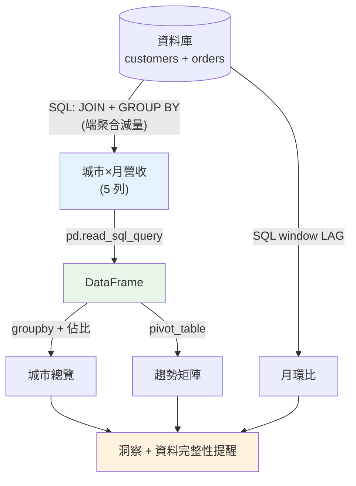

# 🏗️ Capstone:SQL + pandas 端到端分析

> 這是 Part 23 的整合實戰:把本 Part 的每個技能——[SQL 撈數](02-sql-aggregation.md)、[JOIN](03-sql-joins.md)、[window](04-sql-window-functions.md)、[pandas groupby](06-pandas-groupby.md)、[樞紐](07-merge-reshape.md)、[EDA](08-eda.md)——串成一個**真實分析師會做的完整流程**:從資料庫撈數 → pandas 整理分析 → 產出洞察。這章示範各技能如何在一個任務裡協作。

## 💡 白話導讀(建議先讀)

這章是 Part 23 的**畢業考**:一份訂單資料庫,從「老闆的一句話」走到
「附圖表的建議報告」,把前面每一招串成**接力賽**:

```text
SQL 跑第一棒(在資料庫端做重活):
  JOIN 多表 → GROUP BY 初步聚合 → 只撈「聚合後的小結果」回本機
     ↓ pd.read_sql_query
pandas 跑第二棒(本機做細活):
  groupby/transform 靈活加工 → pivot 做報表 → 佔比/排名/趨勢
     ↓
第三棒:圖表 + 洞察 + 可行動建議
```

分工原則值得背下來:**資料庫擅長「大量資料的減量」**(JOIN、聚合、過濾,
別把百萬列原始資料拉回本機);**pandas 擅長「小資料的靈活加工」**
(多步驟轉換、樞紐、和視覺化無縫銜接)。
在哪邊做哪件事,是分析師的基本功,也是面試常問的判斷題。

走完這章你會得到一個可複用的**分析專案模板**:
問題定義 → SQL 撈數 → 清理 → EDA → 分析 → 結論與建議,
每一步都有程式碼與檢查點。之後接 [Part 24 商業分析](../24-business-analytics/README.md),
把技術產出翻譯成商業語言。

## Why(為什麼)

前面每章教一個技能,但真實分析是**把它們組合起來回答一個商業問題**。一個典型任務「分析各城市營收表現」會用到:

- **SQL 撈數**:資料在資料庫,用 [JOIN + 聚合](03-sql-joins.md)把「城市(customers)× 月營收(orders)」撈出來——**在資料庫端先聚合減量**([ch02](02-sql-aggregation.md))。
- **pandas 分析**:撈回本機後用 [groupby](06-pandas-groupby.md) 算各城市總營收與佔比、用 [pivot](07-merge-reshape.md) 排成城市×月的矩陣看趨勢。
- **SQL window**:用 [LAG](04-sql-window-functions.md) 算月營收環比看成長動能。
- **洞察**:把數字轉成一句決策者要的結論。

這章示範**技能的協作**——什麼時候用 SQL、什麼時候用 pandas、怎麼銜接(`pd.read_sql_query`)。這正是分析師日常的縮影:**SQL 負責從資料源高效取數與初步聚合,pandas 負責靈活的整理、樞紐與探索,兩者無縫接力**。

## Theory(理論:SQL 與 pandas 的分工)

端到端分析的骨架,是 **SQL 與 pandas 的分工接力**:

```text
資料庫(大量原始資料)
   │  SQL:JOIN 多表 + GROUP BY 聚合(在資料庫端減量)
   ▼
撈回本機的聚合結果(適量,pd.read_sql_query)
   │  pandas:groupby 再聚合 / pivot 樞紐 / 計算佔比 / EDA
   ▼
洞察 + 圖表 + 建議
```

**分工原則**:

- **SQL 做「重活」**:多表 [JOIN](03-sql-joins.md)、初步 [GROUP BY 聚合](02-sql-aggregation.md)、[window](04-sql-window-functions.md)——在資料庫端做,利用其效能與索引,**只撈回需要的聚合結果**(不是整張原始大表)。
- **pandas 做「細活」**:撈回後的靈活整理——[樞紐](07-merge-reshape.md)、計算衍生欄(佔比、成長率)、[EDA](08-eda.md)、[視覺化](../24-business-analytics/07-visualization.md)、餵給[統計](../24-business-analytics/03-hypothesis-testing.md)/[ML](../25-machine-learning/README.md)。
- **銜接點**:`pandas.read_sql_query(sql, conn)` 直接把 SQL 查詢結果讀成 DataFrame——兩個世界的橋樑。

**為何這樣分工**:資料庫擅長大規模的關聯與聚合(有索引、優化器);pandas 擅長記憶體中的靈活操作與互動探索。**各用所長**——不要把整張億筆大表撈回本機才用 pandas 聚合(慢、爆記憶體),也不要用 SQL 硬做複雜的迭代式探索(彆扭)。

## Specification(規範:分析任務的步驟)

**任務**:分析電商各城市的營收表現(哪個城市貢獻最高、各月趨勢、成長動能)。

| 步驟 | 工具 | 產出 |
|------|------|------|
| 1. 撈數 | SQL:`JOIN` customers×orders + `GROUP BY city, month` | 城市×月營收明細 |
| 2. 讀入 | `pd.read_sql_query` | DataFrame |
| 3. 城市總覽 | pandas `groupby` + 佔比 | 各城市總營收、佔比 |
| 4. 趨勢矩陣 | pandas `pivot_table` | 城市×月營收矩陣 |
| 5. 成長動能 | SQL window `LAG` | 月營收環比 |
| 6. 洞察 | 轉成結論 | 一句可行動的建議 |

**銜接程式碼**:

```python
import sqlite3, pandas as pd
conn = sqlite3.connect(...)
df = pd.read_sql_query("SELECT ...", conn)   # SQL → DataFrame
```

## Implementation(底層:接力的取捨與資料流)

**為何在 SQL 端 JOIN + GROUP BY 而非撈原始表**:orders 可能有百萬筆。若 `SELECT * FROM orders` 全撈回本機再用 pandas JOIN customers、groupby city——傳輸百萬筆、吃光記憶體、慢。改在 SQL 端 `JOIN + GROUP BY city, month`,資料庫用索引高效聚合,**只回傳幾十列**(城市×月的組合)。**把聚合推到資料所在處**,是處理大資料的基本功([ch02](02-sql-aggregation.md) 講過)。

**為何撈回後還要 pandas**:SQL 撈回的是「城市×月營收」的長格式。要看**趨勢矩陣**(城市為列、月為欄)得 [pivot](07-merge-reshape.md)——pandas 的 `pivot_table` 動態產生月份欄,比 [SQL CASE](05-sql-cte-pivot.md) 靈活;要算**佔比**(各城市佔總營收%)是衍生計算,pandas 一行搞定;後續要[畫圖](../24-business-analytics/07-visualization.md)也在 pandas 生態。**撈回的適量資料,pandas 做靈活的最後一哩。**

**注意 [JOIN 的資料完整性](03-sql-joins.md)**:此例用 INNER JOIN，**沒有訂單的客戶(城市)不會出現**在結果——若問題是「所有城市」(含 0 營收的),要改 [LEFT JOIN](03-sql-joins.md)。分析師要清楚自己的 JOIN 決定了「誰在、誰不在」結果裡,別讓沒訂單的城市悄悄消失而誤判。下面範例跑完整流程。

## Code Example(可執行的 Python 範例)

```python
# capstone_analysis.py — SQL 撈數 → pandas 分析 → 洞察(sqlite3 + pandas)
from __future__ import annotations

import sqlite3

import pandas as pd


def build_db() -> sqlite3.Connection:
    conn = sqlite3.connect(":memory:")
    conn.executescript("""
        CREATE TABLE customers(cid INTEGER, name TEXT, city TEXT);
        CREATE TABLE orders(oid INTEGER, cid INTEGER, month TEXT, amount REAL);
        INSERT INTO customers VALUES
          (1,'Alice','Taipei'),(2,'Bob','Tainan'),(3,'Carol','Taipei'),(4,'Dave','Kaohsiung');
        INSERT INTO orders VALUES
          (101,1,'2024-01',500),(102,1,'2024-02',700),(103,2,'2024-01',800),
          (104,3,'2024-01',300),(105,3,'2024-02',400),(106,1,'2024-03',600),
          (107,2,'2024-03',1000);
    """)  # Dave(Kaohsiung)沒有訂單
    return conn


def main() -> None:
    conn = build_db()

    # 步驟 1-2:SQL 撈數(JOIN + 聚合)→ DataFrame
    df = pd.read_sql_query(
        "SELECT c.city, o.month, SUM(o.amount) AS revenue, COUNT(*) AS orders "
        "FROM orders o JOIN customers c ON o.cid = c.cid "
        "GROUP BY c.city, o.month",
        conn,
    )
    print("步驟1 SQL 撈數(城市×月營收明細):")
    print(df.to_string(index=False))

    # 步驟 3:pandas 各城市總覽 + 佔比
    city = (
        df.groupby("city")
        .agg(total=("revenue", "sum"), orders=("orders", "sum"))
        .reset_index()
    )
    city["pct"] = (city["total"] / city["total"].sum() * 100).round(1)
    city = city.sort_values("total", ascending=False)
    print("\n步驟3 各城市總營收與佔比:")
    print(city.to_string(index=False))

    # 步驟 4:pandas 樞紐(城市×月趨勢矩陣)
    matrix = df.pivot_table(index="city", columns="month", values="revenue", fill_value=0)
    print("\n步驟4 城市×月營收矩陣:")
    print(matrix.to_string())

    # 步驟 5:SQL window 月營收環比
    mom = pd.read_sql_query(
        "WITH monthly AS (SELECT month, SUM(amount) AS rev FROM orders GROUP BY month) "
        "SELECT month, rev, rev - LAG(rev) OVER (ORDER BY month) AS mom_change FROM monthly",
        conn,
    )
    print("\n步驟5 全公司月營收環比:")
    print(mom.to_string(index=False))

    # 步驟 6:洞察
    top = city.iloc[0]
    print(f"\n步驟6 洞察: {top['city']} 貢獻最高營收 ${top['total']:.0f}(佔 {top['pct']}%)")
    print("       注意:Kaohsiung 無任何訂單(INNER JOIN 已排除),若要追蹤需另查。")

    conn.close()


if __name__ == "__main__":
    main()
```

**預期輸出**:

```pycon
$ python capstone_analysis.py
步驟1 SQL 撈數(城市×月營收明細):
  city   month  revenue  orders
Tainan 2024-01    800.0       1
Tainan 2024-03   1000.0       1
Taipei 2024-01    800.0       2
Taipei 2024-02   1100.0       2
Taipei 2024-03    600.0       1

步驟3 各城市總營收與佔比:
  city  total  orders  pct
Taipei 2500.0       5 58.1
Tainan 1800.0       2 41.9

步驟4 城市×月營收矩陣:
month   2024-01  2024-02  2024-03
city
Tainan    800.0      0.0   1000.0
Taipei    800.0   1100.0    600.0

步驟5 全公司月營收環比:
  month    rev  mom_change
2024-01 1600.0         NaN
2024-02 1100.0      -500.0
2024-03 1600.0       500.0

步驟6 洞察: Taipei 貢獻最高營收 $2500(佔 58.1%)
       注意:Kaohsiung 無任何訂單(INNER JOIN 已排除),若要追蹤需另查。
```

逐段解說:

- **步驟 1-2 SQL 撈數**:`JOIN customers×orders + GROUP BY city, month`——**在資料庫端**把兩表關聯並聚合成「城市×月營收」,`pd.read_sql_query` 讀成 DataFrame。**只撈回 5 列聚合結果**,而非原始訂單明細——這是「把重活推到資料庫」。
- **步驟 3 城市總覽**:pandas [groupby](06-pandas-groupby.md) 再聚合成各城市總營收,算**佔比**(Taipei 58.1%、Tainan 41.9%)並排序——衍生計算與排序,pandas 一氣呵成。
- **步驟 4 趨勢矩陣**:[pivot_table](07-merge-reshape.md) 把長格式轉成城市×月矩陣——一眼看出 Tainan 2 月無營收(斷檔)、Taipei 3 月下滑。**寬格式適合人看趨勢**。
- **步驟 5 成長動能**:SQL [window `LAG`](04-sql-window-functions.md) 算全公司月營收環比——2 月 −500(衰退)、3 月 +500(回升)。**成長率分析回到 SQL** 因為 window 最擅長。
- **步驟 6 洞察 + 資料完整性提醒**:轉成一句結論(Taipei 貢獻最高),並**主動點出 INNER JOIN 排除了無訂單的 Kaohsiung**——這是分析師的專業:**知道自己的 JOIN 決定了誰在結果裡**,並向決策者說明限制,避免誤判「Kaohsiung 沒營收 = 不重要」(其實是根本沒訂單,可能是另一個問題)。
- **技能協作**:SQL(JOIN/聚合/window)+ pandas(groupby/pivot/佔比)在一個任務裡**各司其職、無縫接力**——這就是分析師的日常。

## Diagram(圖解:端到端資料流)



## Best Practice(最佳實踐)

- **SQL 做重活、pandas 做細活**:資料庫端 JOIN + 聚合減量,pandas 做靈活整理/樞紐/佔比/探索。
- **在資料庫端先聚合**:只撈回需要的聚合結果,別把原始大表整批拉回本機。
- **用 `pd.read_sql_query` 銜接**:SQL 查詢結果直接進 DataFrame。
- **清楚 JOIN 決定了「誰在結果裡」**:INNER 會排除無匹配者;要「全部」用 LEFT,並向決策者說明。
- **趨勢用 pivot 寬格式、成長率用 SQL window**:各用最擅長的工具。
- **洞察要附限制與提醒**:主動點出資料的排除/缺口(如無訂單的城市),避免誤判。
- **流程可重現**:SQL + pandas 都在程式碼/[notebook](../17-data-science/README.md)裡,可重跑、可驗證、可交接。
- **驗證每步**:撈回列數、佔比加總是否 100%、樞紐總和對得上——步步核對。

## Common Mistakes(常見誤解)

- **把原始大表整批撈回本機**:該在 SQL 端聚合減量,否則慢又爆記憶體。
- **忽略 INNER JOIN 排除了誰**:無訂單的城市消失,誤判「沒營收」而非「沒資料」。
- **全用 SQL 或全用 pandas**:硬用 SQL 做迭代探索很彆扭、硬用 pandas 做大表聚合很慢;該分工。
- **樞紐與長格式搞混**:趨勢要寬(pivot)、分析要長,用錯形狀卡住。
- **洞察不附限制**:只報「Taipei 最高」,不提資料排除了誰,誤導決策。
- **不驗證中間結果**:佔比沒加到 100%、樞紐總和對不上而不自知。
- **手動流程不可重現**:換月份要重來、無法驗證。

## Interview Notes(面試重點)

- **能描述 SQL + pandas 的端到端分析流程**:SQL JOIN/聚合撈數 → pandas 整理/樞紐/佔比 → 洞察。
- **能講 SQL 與 pandas 的分工**:資料庫端重活(關聯/聚合/window),本機 pandas 細活(樞紐/衍生欄/探索)。
- **能講為何在資料庫端聚合**:利用索引/優化器、只撈回聚合結果、省傳輸與記憶體。
- **能講 JOIN 決定結果範圍**:INNER 排除無匹配者,要說明限制、必要時用 LEFT。
- **知道 `pd.read_sql_query` 是銜接點**、趨勢用 pivot、成長率用 window。
- **能強調洞察要附資料限制**:專業分析師會主動點出排除/缺口。

---

🎉 **恭喜你完成 Part 23!** 你已掌握分析師的核心取數與整理能力——SQL(聚合/JOIN/window/CTE)與 pandas(groupby/merge/樞紐/EDA),並能端到端串起來。接下來 [Part 24](../24-business-analytics/README.md) 把這些資料轉成**統計洞察與商業決策**。

➡️ 下一 Part:[統計分析與商業洞察](../24-business-analytics/README.md)

[⬆️ 回 Part 23 索引](README.md)
