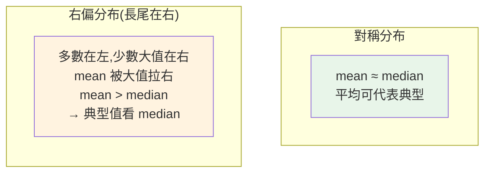

# 描述統計與分布

> [EDA](../23-data-analysis/08-eda.md) 時你用了 `describe()`,但那些數字——平均、中位數、標準差、四分位——各代表什麼、什麼時候該看哪個、為什麼「只看平均」會害你下錯結論?**描述統計(descriptive statistics)** 是分析師的基本功:用少數幾個數字**準確概括**一大堆資料。用錯了,整份分析的地基就歪了。這章講透這些統計量與它們背後的分布觀念。

## Why(為什麼)

你有一萬筆客戶消費金額,老闆問「我們客戶大概花多少?」——你不能把一萬個數字唸給他聽,要用**一個代表值**概括。但**選錯代表值會嚴重誤導**:

- 「平均消費 5000 元」聽起來不錯——但若其中有幾個豪擲百萬的大戶,**平均被拉高**,實際上**大多數客戶只花 500 元**。用平均回答「典型客戶花多少」是錯的,該用**中位數**。
- 「平均送達時間 3 天」——但若標準差很大(有的當天到、有的等兩週),「平均 3 天」掩蓋了**極不穩定**的體驗。只看集中趨勢、不看**離散**,漏掉關鍵。
- 兩個部門平均績效都是 80 分——但一個很整齊(78~82)、一個兩極(50 和 100)。**分布形狀**不同,管理意義天差地別。

**描述統計**就是用**集中趨勢**(典型值在哪)、**離散程度**(散得多開)、**分布形狀**(對稱還偏斜)這幾個面向,**準確**地概括資料。關鍵是**知道每個統計量在什麼情況下會騙你**——尤其「平均」在偏態資料的誤導性,是分析師最該內化的一課。這章讓你不再被單一數字牽著走。

## Theory(理論:三個面向)

描述一份資料的分布,看三個面向:

**1. 集中趨勢(central tendency)——「典型值」在哪**:

- **平均數(mean)**:所有值加總 ÷ 個數。**受極端值影響大**(一個大戶就拉高)。
- **中位數(median)**:排序後正中間的值。**穩健(robust)**——不受極端值影響。
- **眾數(mode)**:出現最多次的值。適合類別/離散資料。

**2. 離散程度(dispersion)——「散得多開」**:

- **全距(range)**:max − min。簡單但只看兩端、易受極端值影響。
- **變異數(variance)/標準差(std)**:各值離平均的平均平方距離(std 是其平方根,回到原單位)。**最常用的離散度量**,但也受極端值影響。
- **四分位距(IQR)**:Q3 − Q1(中間 50% 的範圍)。**穩健**,不受極端值影響(見 [IQR 離群](../23-data-analysis/08-eda.md))。
- **變異係數(CV)**:std ÷ mean(相對離散),**可跨不同量綱/尺度比較**(比較「薪資」和「年齡」誰更分散)。

**3. 分布形狀(shape)**:

- **偏態(skewness)**:對稱?右偏(長尾在右,少數大值,`mean > median`)?左偏(`mean < median`)?
- **峰態(kurtosis)**:尖峰厚尾的程度。

## Specification(規範:何時用哪個)

| 情境 | 用集中趨勢 | 用離散 | 理由 |
|------|-----------|--------|------|
| 對稱、無極端值 | 平均數 | 標準差 | 平均能代表典型,std 常用 |
| 偏態/有極端值(收入、房價) | **中位數** | **IQR** | 平均被極端值拉走,中位數/IQR 穩健 |
| 類別資料 | 眾數 | — | 平均/中位數對類別無意義 |
| 跨尺度比較離散 | — | **變異係數** | 相對離散,可比不同量綱 |

**判斷偏態的簡易法**:比較 mean 與 median。

- `mean ≈ median` → 大致對稱。
- `mean > median`(且差很多)→ **右偏**(有大值把平均拉高)。收入、消費金額、等待時間常右偏。
- `mean < median` → 左偏。

**stdlib `statistics` 模組**(免裝):`mean`、`median`、`mode`、`stdev`(樣本標準差)、`pstdev`(母體)、`variance`、`quantiles`(分位數)、`correlation`/`linear_regression`(3.10+)。分析大資料用 [pandas](../23-data-analysis/06-pandas-groupby.md)/numpy,小資料或教學用 `statistics` 即可。

## Implementation(底層:mean 為何被拉走、樣本 vs 母體 std)

**為何 mean 被極端值拉走、median 不會**:mean 是**加總**除以個數——每個值都**按其大小**貢獻,所以一個 100 萬的大戶,對 mean 的貢獻等於 2000 個 500 元客戶。它「參與計算的是數值本身」。median 只看**排序後的位置**(正中間那個),一個值不管多大,它只佔「一個位置」——所以極端值**推不動** median。這就是 median「穩健」的數學根源,也是**偏態資料要用 median 代表典型值**的原因(見下面範例:右偏資料 mean=120 但 median=30,典型客戶其實是 30)。同理 IQR(四分位)穩健、std/range 不穩健。

**樣本標準差 vs 母體標準差(n−1 的玄機)**:`statistics.stdev`(樣本)除以 **n−1**,`pstdev`(母體)除以 **n**。為什麼樣本要 n−1(貝索校正,Bessel's correction)?因為你用**樣本平均**去估離散時,樣本平均本身就是「最貼合這批樣本」的點,會**系統性低估**真實母體的離散——除以 n−1(而非 n)把估計值**放大一點**做校正,得到母體變異數的無偏估計。**實務:你手上的資料幾乎都是「樣本」(從母體抽的一部分),所以多數情況用 `stdev`(n−1)**;只有當資料就是完整母體時才用 `pstdev`。pandas 的 `.std()` 預設也是 n−1(樣本)。下面範例對比對稱 vs 右偏資料,展示 mean 的誤導。

## Code Example(可執行的 Python 範例)

```python
# descriptive_stats.py — 描述統計:集中/離散/分布,mean vs median(stdlib statistics)
from __future__ import annotations

import statistics as st


def summary(data: list[float]) -> dict[str, float]:
    """基本描述統計摘要。"""
    return {
        "mean": round(st.mean(data), 1),
        "median": st.median(data),
        "stdev": round(st.stdev(data), 1),  # 樣本標準差(n-1)
        "min": min(data),
        "max": max(data),
    }


def cv_percent(data: list[float]) -> float:
    """變異係數:std/mean,相對離散(可跨量綱比較)。"""
    return round(st.stdev(data) / st.mean(data) * 100, 1)


def main() -> None:
    symmetric = [10, 20, 30, 40, 50]
    skewed = [10, 20, 30, 40, 500]  # 500 是極端值(右偏)

    print("對稱資料:", summary(symmetric))
    print("右偏資料:", summary(skewed))
    print("→ 右偏時 mean(120) 遠大於 median(30):平均被極端值拉走,")
    print("  『典型客戶』該看 median=30,不是 mean=120。")

    # 四分位數
    data = [3, 7, 8, 5, 12, 14, 21, 13, 18]
    q1, q2, q3 = st.quantiles(data, n=4)
    print(f"\n四分位 Q1={q1} Q2(中位)={q2} Q3={q3}")

    # 變異係數:跨尺度比較離散
    stable = [100, 110, 90, 105, 95]
    volatile = [10, 50, 30, 70, 20]
    print(f"\n變異係數 CV%:穩定組 {cv_percent(stable)} vs 波動組 {cv_percent(volatile)}")
    print("  → CV 讓不同平均的兩組能公平比『相對波動』。")


if __name__ == "__main__":
    main()
```

**預期輸出**:

```pycon
$ python descriptive_stats.py
對稱資料: {'mean': 30, 'median': 30, 'stdev': 15.8, 'min': 10, 'max': 50}
右偏資料: {'mean': 120, 'median': 30, 'stdev': 212.7, 'min': 10, 'max': 500}
→ 右偏時 mean(120) 遠大於 median(30):平均被極端值拉走,
  『典型客戶』該看 median=30,不是 mean=120。

四分位 Q1=6.0 Q2(中位)=12 Q3=16.0

變異係數 CV%:穩定組 7.9 vs 波動組 66.9
```

逐段解說:

- **對稱資料**:`mean = median = 30`——分布對稱時,平均能代表典型值。`stdev=15.8` 反映離散。
- **右偏資料**:同樣是 10~40 加一個 `500`——**`mean` 暴衝到 120,但 `median` 還是 30**。一個極端值把平均拉走了 4 倍!若你回答「典型客戶花 120」就**大錯**——**5 個客戶裡 4 個只花 10~40**,典型是 30。**這是分析師最該內化的一課:偏態資料看 median,別被 mean 騙。** `stdev=212.7` 也被極端值撐爆(對照穩健的 median/IQR)。
- **四分位**:`quantiles(n=4)` 回 Q1/Q2/Q3——中間 50% 的資料落在 Q1(6)到 Q3(16),Q2(12)是中位數。這是[箱型圖](07-visualization.md)與 [IQR 離群](../23-data-analysis/08-eda.md)的基礎。
- **變異係數**:穩定組(平均 100)CV=7.9%,波動組(平均 36)CV=66.9%——**CV 把離散「相對化」**,即使兩組平均差很多,也能公平比「誰波動大」。比較「薪資的波動」和「年齡的波動」這種不同量綱的離散時特別有用(直接比 std 不公平,因為量綱不同)。
- **要點**:集中趨勢別只看 mean(偏態用 median)、離散看 std/IQR/CV、用 mean vs median 判偏態。

## Diagram(圖解:對稱 vs 右偏)



## Best Practice(最佳實踐)

- **偏態資料看 median 不看 mean**:收入、消費、等待時間等常右偏,median 才是典型值。
- **同時報集中與離散**:只給平均不給 std/IQR,掩蓋了穩定性;兩者一起看。
- **用 mean vs median 判偏態**:差很多就是偏態訊號,別只看平均。
- **偏態/有離群用穩健統計**:median、IQR 不受極端值影響。
- **跨尺度比離散用 CV**:不同量綱/平均的組別,比相對波動才公平。
- **類別資料用眾數**:平均/中位數對類別無意義。
- **樣本用 stdev(n−1)、母體用 pstdev(n)**:多數情況資料是樣本,用 n−1(pandas 預設亦然)。
- **搭配[分布視覺化](07-visualization.md)**:直方圖/箱型圖看形狀,數字 + 圖一起理解。

## Common Mistakes(常見誤解)

- **偏態資料用平均代表典型值**:被極端值拉走,誤導決策(最經典的錯)。
- **只報平均不報離散**:「平均 3 天送達」掩蓋了極不穩定的體驗。
- **不看分布形狀就下結論**:兩組平均相同但分布迥異,意義天差地別。
- **對類別算平均**:如「平均顏色」無意義,該用眾數/次數。
- **偏態資料硬用 std**:被極端值撐爆;用 IQR。
- **跨量綱直接比 std**:不公平(量綱不同),該用 CV。
- **混淆樣本與母體 std**:樣本該用 n−1;用錯低估離散。
- **以為平均永遠代表「典型」**:只有對稱分布才成立。

## Interview Notes(面試重點)

- **能解釋 mean vs median 的差異與適用**:median 穩健(位置)、mean 受極端值影響(數值);偏態用 median。
- **能用 mean vs median 判斷偏態**:mean > median → 右偏。
- **能列離散度量**:range/std/IQR/CV,並知道 IQR 穩健、CV 可跨量綱比較。
- **能解釋樣本 std 為何除 n−1**:貝索校正,修正樣本平均造成的低估(無偏估計)。
- **能舉偏態資料例子**:收入、消費、等待時間右偏,該看 median。
- **知道要同時看集中 + 離散 + 形狀**,並搭配視覺化。

---

➡️ 下一章:[相關、關聯與因果](02-correlation-causation.md)

[⬆️ 回 Part 24 索引](README.md)
