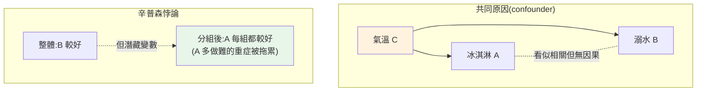

# 相關、關聯與因果

> 「A 和 B 有相關」是分析中最常見、也**最常被誤用**的發現。相關係數 0.9 很誘人,但「相關」離「A 導致 B」還很遠——搞混這兩者,是分析師會犯的**最昂貴的錯誤**:基於假因果做決策,砸錢改了 A 卻發現 B 沒動。這章講相關怎麼算、怎麼讀,以及為什麼**相關不等於因果**、如何避免這個陷阱(含經典的辛普森悖論)。

## 💡 白話導讀(建議先讀)

**「冰淇淋賣越多,溺水的人越多」**——所以吃冰會溺水?
當然不是,是**夏天**同時讓兩者上升。這就是全資料分析最貴的一個陷阱:
**把相關當成因果**。搞混它,你會信心滿滿地做出害慘公司的決策。

先講**相關(correlation)** 本身的兩個坑:

- 相關係數 r 從 −1 到 +1,**只量「線性」關係**。
  U 型的強關係(如「價格 vs 銷量」可能先升後降),r 可能接近 0——
  **`r≈0` 不代表無關係,只代表無直線關係**,一定要配散佈圖看。
- r 很高也可能是**巧合**(找夠多變數,總有幾對假性高相關)。

再講為什麼「相關 ≠ 因果」,三種可能都會製造相關:

1. **反了**:不是 A 導致 B,是 B 導致 A。
2. **第三者(共同原因)**:冰淇淋和溺水的「夏天」——統計學叫**混淆變數**。
3. **純巧合**。

那怎麼才能宣稱因果?黃金標準是**隨機對照實驗(A/B 測試)**——
[隨機分組](04-ab-test-statistics.md)切斷了混淆變數,才敢說「是這個改動造成的」。
這章教你算相關、畫相關矩陣,但更重要的是**在報告裡誠實**:
沒做實驗時,說「相關」「可能有關」,別說「導致」——這是分析師的專業底線。

## Why(為什麼)

發現「廣告花費和營收相關 0.85」,老闆說「那就多花廣告費!」——**這可能是災難性的錯誤推論**。相關只告訴你「兩者一起變動」,不告訴你「誰導致誰」或「是不是第三者導致兩者」:

- **可能是反向因果**:不是廣告帶來營收,而是**營收好的月份公司才捨得多投廣告**(因果方向相反)。
- **可能是共同原因(confounder)**:冰淇淋銷量和溺水人數高度相關(0.99!),但冰淇淋不會害人溺水——**是「夏天/氣溫」同時推高兩者**。氣溫是**潛藏的共同原因**。
- **可能是巧合**:資料夠多,總能找到一些**偽相關**(spurious correlation)——尼可拉斯凱吉的電影數與泳池溺水數也能「相關」。

基於「相關 = 因果」做決策,可能**砸大錢改了 A,結果 B 紋風不動**(因為根本沒有因果,或改錯了源頭)。這是分析師最該警惕的推論謬誤。

更陰險的是**辛普森悖論(Simpson's paradox)**:整體資料呈現一個趨勢,**分組後每一組卻呈現相反趨勢**——若沒意識到潛藏的分組變數,你會下完全相反的結論。這章教你**正確理解相關、並在下因果結論前保持警惕**——這是分析師專業與業餘的分水嶺。

## Theory(理論:相關與因果)

**相關(correlation)**:衡量兩個變數**一起變動**的程度與方向。

- **Pearson 相關係數 r**:範圍 −1 到 +1。
  - `r > 0`:正相關(一起漲)。`r < 0`:負相關(一漲一跌)。`r ≈ 0`:無**線性**關係。
  - `|r|` 越接近 1，**線性**關係越強。
- **關鍵限制**:Pearson r 只捕捉**線性**關係。**非線性**關係(如 U 型)即使關係很強,r 可能接近 0。所以 `r≈0` 不代表「無關係」,只代表「無線性關係」——要配合[散佈圖](07-visualization.md)看。

**因果(causation)**:A 的改變**導致** B 的改變。相關是因果的**必要非充分**條件——有因果通常有相關,但**有相關不一定有因果**。

**相關不代表因果的三種情形**:

1. **反向因果**:其實是 B → A(方向相反)。
2. **共同原因(confounder)**:C 同時影響 A 和 B,A、B 本身無因果(冰淇淋–溺水–氣溫)。
3. **巧合/偽相關**:純屬隨機,尤其在大量變數中挖掘時。

**如何逼近因果**:唯一可靠的方式是**控制實驗**——[隨機對照試驗 / A/B 測試](04-ab-test-statistics.md)。隨機分組**打散了所有潛在共同原因**,讓兩組唯一系統性差異就是你的介入,才能歸因於因果。觀察性資料只能用統計方法(控制變數、因果推論)謹慎逼近,永遠不如實驗可靠。

## Specification(規範:讀相關與辛普森悖論)

**相關係數解讀(經驗參考,依領域而異)**:

| \|r\| | 線性關係強度 |
|------|------|
| 0.0–0.3 | 弱 |
| 0.3–0.7 | 中 |
| 0.7–1.0 | 強 |

**辛普森悖論(Simpson's paradox)**:整體趨勢與分組趨勢相反。經典例:

```text
療法 A vs B 的成功率:
  輕症:A 93% > B 87%(A 較好)
  重症:A 73% > B 69%(A 較好)
  但整體:A 78% < B 83%(B 較好!?)
```

**為何反轉**:A 被大量用在**重症**(成功率天生低)、B 多用在**輕症**——「病情嚴重度」是潛藏變數,**扭曲了整體比較**。分組後(控制嚴重度)才看到 A 其實每組都較好。**教訓:整體比較可能被資料的組成結構(潛藏變數)誤導,務必檢查是否該分組看。**

## Implementation(底層:confounder 為何致命、辛普森悖論的加權)

**confounder(共同原因)為何是相關分析的頭號敵人**:當 C 同時影響 A 和 B,A 與 B 會**自然地一起變動**(因為都跟著 C 動),產生強相關——但 A、B 之間**沒有任何直接因果**。冰淇淋(A)和溺水(B)都被氣溫(C)推動:夏天氣溫高 → 冰淇淋賣得多 **且** 游泳的人多 → 溺水多。你看到 A–B 相關 0.99,但停售冰淇淋**不會**減少溺水。**分析師必須主動問:有沒有一個 C 能同時解釋 A 和 B?** 找不到共同原因、又能排除反向因果,才敢謹慎談因果(且最好用實驗驗證)。

**辛普森悖論的數學本質是「加權」**:整體成功率不是各組成功率的簡單平均,而是**按各組的樣本量加權**。若 A 的樣本**集中在低成功率的組**(重症),即使 A 在每組都贏,整體加權後仍可能輸——因為 A 的整體被「它多做的那個難組」拖累。這不是統計把戲,而是**「組成不同」的真實後果**:比較兩個療法時,若它們面對的病人結構不同,直接比整體是**不公平的**,要**控制(分組)** 才公平。這也是為何[實驗要隨機分組](04-ab-test-statistics.md)——隨機化讓兩組的結構自動一致,消除這種扭曲。下面範例算相關並演示辛普森悖論。

## Code Example(可執行的 Python 範例)

```python
# correlation_causation.py — 相關係數 + 辛普森悖論(stdlib statistics)
from __future__ import annotations

import statistics as st


def main() -> None:
    # 1. 高相關 ≠ 因果:冰淇淋銷量 vs 溺水數
    ice_cream = [10, 20, 30, 40, 50]
    drownings = [2, 4, 5, 8, 10]
    r = st.correlation(ice_cream, drownings)
    print(f"冰淇淋銷量 vs 溺水數 相關 r = {round(r, 3)}")
    print("  → r 很高,但兩者都由『氣溫』驅動(共同原因),")
    print("    停售冰淇淋不會減少溺水——相關 ≠ 因果。")

    # 2. 辛普森悖論:整體與分組趨勢相反
    # (成功數, 總數)
    groups = {
        "輕症": {"A": (81, 87), "B": (234, 270)},
        "重症": {"A": (192, 263), "B": (55, 80)},
    }
    print("\n辛普森悖論(療法 A vs B 成功率):")
    a_success = a_total = b_success = b_total = 0
    for name, data in groups.items():
        a_s, a_n = data["A"]
        b_s, b_n = data["B"]
        print(f"  {name}: A={a_s / a_n:.0%}  B={b_s / b_n:.0%}  → A 較高")
        a_success, a_total = a_success + a_s, a_total + a_n
        b_success, b_total = b_success + b_s, b_total + b_n

    print(f"  整體:  A={a_success / a_total:.0%}  B={b_success / b_total:.0%}  → B 較高(反轉!)")
    print("  原因:A 多用於重症(成功率天生低),整體被拖累;")
    print("    『病情嚴重度』是潛藏變數,要分組看才公平。")


if __name__ == "__main__":
    main()
```

**預期輸出**:

```pycon
$ python correlation_causation.py
冰淇淋銷量 vs 溺水數 相關 r = 0.99
  → r 很高,但兩者都由『氣溫』驅動(共同原因),
    停售冰淇淋不會減少溺水——相關 ≠ 因果。

辛普森悖論(療法 A vs B 成功率):
  輕症: A=93%  B=87%  → A 較高
  重症: A=73%  B=69%  → A 較高
  整體:  A=78%  B=83%  → B 較高(反轉!)
  原因:A 多用於重症(成功率天生低),整體被拖累;
    『病情嚴重度』是潛藏變數,要分組看才公平。
```

逐段解說:

- **相關 ≠ 因果**:冰淇淋與溺水 `r = 0.99`——**極高相關**。若天真推論「賣冰淇淋害人溺水」就荒謬。真相是**氣溫是共同原因**(confounder):夏天同時推高冰淇淋銷量和游泳/溺水。**看到高相關,先問「有沒有共同原因 C?」**——這是防止假因果的第一道防線。
- **辛普森悖論**:療法 A 在**輕症(93% vs 87%)和重症(73% vs 69%)都贏** B——分組看,A 明顯較好。但**整體卻是 B(83%)贏 A(78%)**!為什麼?因為 A 被大量用在**重症**(263 人,成功率天生低),把 A 的整體平均拖垮;B 多用在輕症。**「病情嚴重度」是潛藏變數**,扭曲了整體比較。
- **加權的本質**:A 整體 = (81+192)/(87+263) = 273/350 = 78%——它的分母大量落在低成功率的重症組。整體是**按樣本量加權**的,不是各組平均。
- **教訓**:若只看整體「B 較好」就選 B,是**錯的**——控制嚴重度後 A 其實每組都好。**務必檢查是否有潛藏變數該分組看**,別被整體數字誤導。這也是為何[實驗要隨機分組](04-ab-test-statistics.md)(消除這種結構差異)。
- **面試金句**:「相關不代表因果;要建立因果,最可靠的是[隨機對照實驗](04-ab-test-statistics.md)」。

## Diagram(圖解:confounder 與辛普森)



## Best Practice(最佳實踐)

- **看到相關先問「有沒有共同原因」**:找得到 confounder 就別談因果。
- **明確區分相關與因果的措辭**:報告寫「A 與 B 相關」,別擅自寫成「A 導致 B」。
- **要因果就做[實驗](04-ab-test-statistics.md)**:隨機對照試驗/A B 是建立因果的黃金標準。
- **檢查是否該分組(辛普森)**:整體比較前,想想有沒有潛藏變數扭曲組成。
- **r≈0 不代表無關係**:只代表無線性關係;配合[散佈圖](07-visualization.md)看非線性。
- **警惕偽相關**:大量變數中挖掘總能找到巧合相關;要有理論支持。
- **考慮反向因果**:別預設 A→B,可能是 B→A。
- **報告因果結論要極度謹慎**:觀察性資料的因果宣稱要標明侷限。

## Common Mistakes(常見誤解)

- **把相關當因果下決策**:砸錢改 A 卻發現 B 不動(根本沒因果或改錯源頭)。
- **忽略共同原因**:冰淇淋–溺水式的假因果,沒看到氣溫。
- **只看整體忽略辛普森**:潛藏變數讓整體趨勢與真相相反。
- **r≈0 就說「無關係」**:漏掉非線性關係。
- **在大量變數中挖到相關就宣稱發現**:偽相關;要有理論/實驗支持。
- **不考慮反向因果**:預設方向而搞錯誰導致誰。
- **用觀察性資料下強因果結論**:沒有實驗控制,confounder 無法排除。
- **報告措辭把相關寫成因果**:誤導決策者。

## Interview Notes(面試重點)

- **能解釋「相關不代表因果」**:並舉共同原因(冰淇淋–溺水–氣溫)、反向因果、巧合三種情形。
- **能講如何建立因果**:隨機對照實驗/A B——隨機化打散共同原因。
- **能解釋辛普森悖論**:整體與分組趨勢相反,潛藏變數扭曲組成(加權效應);要分組看。
- **能講 Pearson r 的限制**:只捕捉線性關係,r≈0 不代表無關係。
- **能講 confounder 為何致命**:同時影響 A、B 產生假相關;分析時主動找共同原因。
- **知道觀察性 vs 實驗性資料**的因果可信度差異。

---

➡️ 下一章:[假設檢定與顯著性](03-hypothesis-testing.md)

[⬆️ 回 Part 24 索引](README.md)
