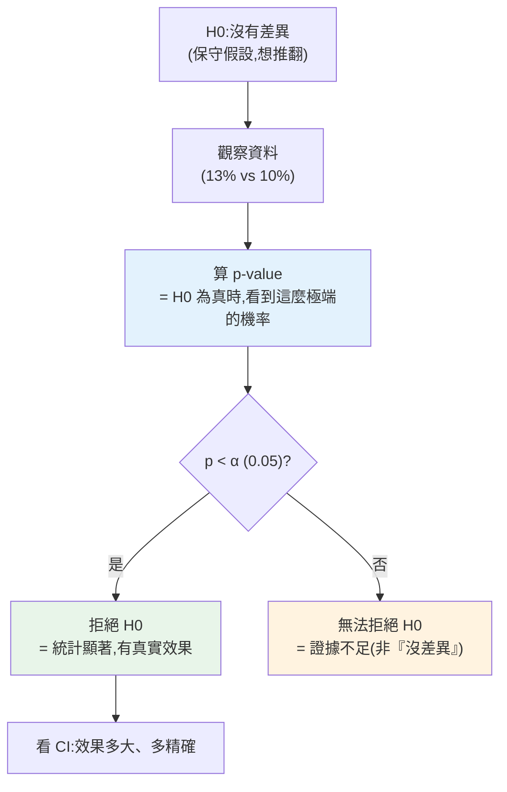

# 假設檢定與顯著性

> 你把網站按鈕從藍色改成綠色,新版轉換率 13%、舊版 10%。**這 3% 是真的改善,還是隨機波動?** 如果只是運氣,你把全站都改成綠色就白忙一場。**假設檢定(hypothesis testing)** 是回答「這個差異是真的,還是碰巧」的統計方法——它是資料分析從「看數字」升級到「下有信心的結論」的關鍵。這章講假設檢定的邏輯、p-value、顯著性與信賴區間。

## 💡 白話導讀(建議先讀)

按鈕從藍改綠,新版轉換率 13%、舊版 10%。**這 3% 是真本事,還是擲骰子的運氣?**
擲 10 次硬幣也可能 6 正 4 反,你不會就說「這硬幣偏心」。
假設檢定就是一套**判斷「差異是真的還是碰巧」的數學程序**。

它的邏輯是**反證法**,像法庭審判:

1. **先假設「無罪」**——虛無假設 H₀:「新舊沒差,那 3% 純屬運氣」。
2. **看證據有多離譜**——算 **p-value**:「**假如真的沒差**,
   光靠運氣能撞出這麼大(或更大)差異的機率有多少?」
3. **判決**:p-value 很小(通常 < 0.05)→「運氣撞出來的機率太低了,
   不合理」→ **推翻 H₀**,認定差異是真的(統計顯著)。

最重要的是搞懂 **p-value 到底是什麼**,因為它是全統計最常被講錯的概念:

> p-value **不是**「新版更好的機率」,**不是**「H₀ 為真的機率」。
> 它是:**假設 H₀ 為真,看到這麼極端資料的機率**。

還有兩個必懂的陷阱這章會講透:
**統計顯著 ≠ 實務重要**(樣本夠大時,0.01% 的無用差異也會「顯著」);
**別偷看提前喊停**(數據還在跑就天天看、一到顯著就收——p-value 會被玩壞)。
下一章的 [A/B 測試](04-ab-test-statistics.md)就是這套邏輯的實戰版。

## Why(為什麼)

分析中最危險的錯誤之一,是**把隨機波動當成真實效果**:

- 你比較兩組數字,一組高一點——但**任何兩組樣本本來就會有差異**,即使它們來自同一個母體(純運氣)。丟兩次各 100 次硬幣,正面數幾乎不會剛好相等。
- 若你看到「13% > 10%」就宣布「新版更好、全面上線」,可能是**被雜訊騙了**——換一批使用者,結果可能反過來。基於雜訊做決策,浪費資源、甚至傷害產品。

**假設檢定**用統計嚴謹地問:「**如果新舊版其實一樣好(沒有真實差異),那麼觀察到『13% vs 10%』這麼大的差距,純屬運氣的機率有多大?**」如果這個機率**很小**(如 < 5%),我們就有信心說「這差異不太可能是運氣,應該是真的」。這個機率就是 **p-value**。

這是分析師、[產品實驗](04-ab-test-statistics.md)、科學研究共通的推論框架。掌握它,你才能負責任地說「這個改善是真的」而非「看起來好像變好了」——**用證據強度支撐結論,而非憑感覺**。這章建立這套邏輯,下一章 [A/B 測試](04-ab-test-statistics.md)是它最重要的商業應用。

## Theory(理論:假設檢定的邏輯)

假設檢定是一種**反證法(proof by contradiction)** 式的推論:

1. **虛無假設(H₀,null hypothesis)**:假設「**沒有效果/沒有差異**」(新舊版一樣好、兩組來自同母體)。這是我們**想推翻**的保守假設。
2. **對立假設(H₁,alternative)**:「**有效果/有差異**」(我們想證明的)。
3. **算 p-value**:**假設 H₀ 為真**,計算「觀察到當前這麼極端(或更極端)的資料」的機率。
4. **下結論**:
   - p-value **很小**(< 顯著水準 α,通常 0.05)→ 「若 H₀ 為真,這麼極端的資料太不可能了」→ **拒絕 H₀**,認為有真實效果(**統計顯著**)。
   - p-value **不夠小** → **無法拒絕 H₀**——**注意:這不是「證明沒差異」**,只是「證據不足以說有差異」。

**p-value 的正確定義**(極易被誤解):**在 H₀ 為真的前提下,觀察到當前或更極端結果的機率。** 它**不是**「H₀ 為真的機率」,也**不是**「效果為真的機率」——這是最常見的誤解。

**兩類錯誤**:

- **型一錯誤(Type I,偽陽性)**:H₀ 其實為真,卻拒絕了(誤報「有效果」)。機率 = α(顯著水準)。
- **型二錯誤(Type II,偽陰性)**:H₀ 其實為假,卻沒拒絕(漏報真實效果)。機率 = β;`1−β` = **檢定力(power)**。

## Specification(規範:顯著性、CI、檢定選擇)

**顯著水準 α**:拒絕 H₀ 的門檻,通常 **0.05**(容忍 5% 偽陽性)。`p < α` → 顯著。α 是**事前**決定的,不是看到 p 才調。

**信賴區間(confidence interval, CI)**:效果大小的區間估計。「95% CI = [1.0%, 5.0%]」意思是——用這方法反覆抽樣,95% 的區間會涵蓋真實值。**CI 比 p-value 資訊更豐富**:不只說「有沒有差異」,還說「差異多大、多精確」。**CI 不含 0(對差異而言)↔ 差異顯著**(p < 0.05)。

**常見檢定的選擇**:

| 情境 | 檢定 |
|------|------|
| 兩組**比例/轉換率**比較 | 雙比例 z 檢定、卡方檢定 |
| 兩組**平均值**比較 | 兩樣本 t 檢定 |
| 多組平均值比較 | ANOVA |
| 類別變數關聯 | 卡方檢定 |

**大樣本**時,比例檢定可用**常態近似(z 檢定)**——這正是 stdlib `statistics.NormalDist` 能做的(下面範例)。實務中 **`scipy.stats`** 提供完整的 t 檢定、卡方、ANOVA 等(`ttest_ind`、`chi2_contingency`…);本章用 stdlib 示範原理,生產分析用 scipy。

## Implementation(底層:z 檢定怎麼算、p-value 與樣本量)

**雙比例 z 檢定的機制**:比較兩組轉換率 p₁、p₂。步驟:(1) 算合併比例 `p_pool = (x₁+x₂)/(n₁+n₂)`(H₀ 下兩組同母體,故合併估計);(2) 算標準誤 `SE = √(p_pool(1−p_pool)(1/n₁+1/n₂))`——差異的抽樣波動大小;(3) 算 `z = (p₁−p₂)/SE`——差異是標準誤的幾倍;(4) z 透過[常態分布](01-descriptive-stats.md)的 CDF 轉成 p-value(雙尾 = `2×(1−Φ(|z|))`)。**直覺:z 衡量「觀察到的差異」相對於「純隨機能造成的波動」有多大**——差異遠大於波動(|z| 大)→ 不太可能是運氣 → p 小。

**為何樣本量決定一切(檢定力)**:同樣是「13% vs 10%」的差異,2000 人一組時 p=0.003(顯著),但 100 人一組時 p=0.51(不顯著)!為什麼?**樣本越大,標準誤越小**(SE 含 `1/n`),同樣的差異除以更小的 SE 得到更大的 z、更小的 p。**小樣本下,即使有真實效果也可能因雜訊太大而測不出來(型二錯誤)**。這是[實驗設計](04-ab-test-statistics.md)的核心:**要偵測小效果,需要大樣本**——事前用檢定力分析算需要多少樣本,否則做了實驗卻「測不出來」而白費。

**「不顯著」≠「沒有效果」**:小樣本那個例子,效果(13% vs 10%)其實存在,只是**證據不足**。把「p > 0.05」讀成「兩者相同/沒差異」是嚴重誤解——正確說法是「在此樣本下,沒有足夠證據宣稱有差異」(可能是真沒差,也可能是樣本太小)。下面範例實作雙比例 z 檢定與信賴區間。

## Code Example(可執行的 Python 範例)

```python
# hypothesis_testing.py — 雙比例 z 檢定 + 信賴區間(stdlib statistics)
from __future__ import annotations

import math
from statistics import NormalDist


def two_proportion_z_test(x1: int, n1: int, x2: int, n2: int) -> tuple[float, float]:
    """雙比例 z 檢定(大樣本常態近似)。回 (z, 雙尾 p-value)。
    H0:兩組比例相同。x=成功數, n=樣本數。"""
    p1, p2 = x1 / n1, x2 / n2
    p_pool = (x1 + x2) / (n1 + n2)  # H0 下合併估計
    se = math.sqrt(p_pool * (1 - p_pool) * (1 / n1 + 1 / n2))
    z = (p1 - p2) / se
    p_value = 2 * (1 - NormalDist().cdf(abs(z)))  # 雙尾
    return z, p_value


def diff_confidence_interval(
    x1: int, n1: int, x2: int, n2: int, conf: float = 0.95
) -> tuple[float, float]:
    """兩比例差異的信賴區間。"""
    p1, p2 = x1 / n1, x2 / n2
    se = math.sqrt(p1 * (1 - p1) / n1 + p2 * (1 - p2) / n2)
    z_crit = NormalDist().inv_cdf(1 - (1 - conf) / 2)
    diff = p1 - p2
    return diff - z_crit * se, diff + z_crit * se


def main() -> None:
    # 大樣本:實驗組 260/2000=13%,對照組 200/2000=10%
    z, p_value = two_proportion_z_test(260, 2000, 200, 2000)
    print("大樣本:實驗組 13% vs 對照組 10%(各 2000 人)")
    print(f"  z = {z:.3f}, p-value = {p_value:.4f}, 顯著(α=0.05)? {p_value < 0.05}")

    lo, hi = diff_confidence_interval(260, 2000, 200, 2000)
    print(f"  差異 95% CI: [{lo * 100:.2f}%, {hi * 100:.2f}%] → 不含 0,差異顯著")

    # 小樣本:相同效果(13% vs 10%)但各只 100 人
    z2, p_value2 = two_proportion_z_test(13, 100, 10, 100)
    print("\n小樣本:相同的 13% vs 10%,但各只 100 人")
    print(f"  p-value = {p_value2:.4f}, 顯著? {p_value2 < 0.05}")
    print("  → 同樣效果,樣本太小就測不出來(證據不足,非『沒差異』)")


if __name__ == "__main__":
    main()
```

**預期輸出**:

```pycon
$ python hypothesis_testing.py
大樣本:實驗組 13% vs 對照組 10%(各 2000 人)
  z = 2.974, p-value = 0.0029, 顯著(α=0.05)? True
  差異 95% CI: [1.02%, 4.98%] → 不含 0,差異顯著

小樣本:相同的 13% vs 10%,但各只 100 人
  p-value = 0.5061, 顯著? False
  → 同樣效果,樣本太小就測不出來(證據不足,非『沒差異』)
```

逐段解說:

- **大樣本檢定**:實驗組 13% vs 對照組 10%,各 2000 人。`z=2.974`(差異是標準誤的近 3 倍)、`p=0.0029`——**若兩版本其實一樣,只有 0.29% 機率會看到這麼大的差距**。0.29% < 5% → **拒絕 H₀,差異統計顯著**,有信心說新版更好。
- **信賴區間**:差異的 95% CI = [1.02%, 4.98%]——**不含 0**,與「顯著」一致。而且它告訴你**更多**:真實改善大概在 1%~5% 之間。**CI 比單一 p-value 資訊更豐富**(有方向、有大小、有精確度),報告應優先呈現 CI。
- **小樣本對比(關鍵教學點)**:**完全相同的效果**(13% vs 10%),但各只 100 人 → `p=0.5061`,**不顯著**!同一個真實差異,樣本從 2000 降到 100,就從「顯著」變「測不出來」。**原因:小樣本的標準誤大,雜訊淹沒了訊號**。這說明**樣本量決定檢定力**——要偵測效果,樣本要夠。
- **「不顯著」的正確解讀**:小樣本的 `p>0.05` **不代表「兩版本相同」**,而是「這點資料不足以宣稱有差異」。把它讀成「證明沒差」是嚴重錯誤。
- **面試金句**:「p-value 是『假設沒有效果時,看到這麼極端資料的機率』,不是『沒有效果的機率』」。

## Diagram(圖解:假設檢定流程)



## Best Practice(最佳實踐)

- **用檢定判斷差異真假**:別看到數字高一點就下結論,先問「是不是隨機波動」。
- **事前定 α(通常 0.05)**:別看到 p 才調門檻(p-hacking)。
- **優先報信賴區間**:CI 有方向、大小、精確度,比單一 p-value 資訊豐富。
- **樣本量要夠(檢定力)**:事前算需要多少樣本才測得出目標效果,否則白做。
- **「不顯著」≠「沒差異」**:是「證據不足」,別誤讀為「兩者相同」。
- **選對檢定**:比例用 z/卡方、平均用 t 檢定、多組用 ANOVA。
- **生產分析用 scipy.stats**:t 檢定/卡方/ANOVA 完整實作(本章用 stdlib 講原理)。
- **顯著 ≠ 重要**:統計顯著只說「不是運氣」,效果**大不大、值不值得**要看 CI 與商業意義。

## Common Mistakes(常見誤解)

- **把隨機波動當真實效果**:沒做檢定就宣布「變好了」,被雜訊騙。
- **誤解 p-value**:以為是「H₀ 為真的機率」或「效果為假的機率」——都錯(是 H₀ 下看到極端資料的機率)。
- **「不顯著」讀成「沒差異」**:其實是證據不足,可能是樣本太小。
- **p-hacking**:反覆試不同切法/看到 p 才調 α,直到「顯著」——假發現。
- **忽略樣本量/檢定力**:小樣本測不出真實效果(型二錯誤)還以為沒效果。
- **只看 p 不看效果大小**:統計顯著但效果微小(大樣本易顯著),商業上無意義。
- **多重比較不校正**:同時測很多假設,偽陽性暴增(要 Bonferroni 等校正)。
- **選錯檢定**:比例用了 t 檢定、忽略資料型態假設。

## Interview Notes(面試重點)

- **能正確定義 p-value**:H₀ 為真時,觀察到當前或更極端資料的機率;**不是** H₀ 為真的機率。
- **能講假設檢定邏輯**:H₀(無差異)→ 算 p → p<α 拒絕 H₀(顯著)。
- **能區分型一/型二錯誤**:偽陽性(α)vs 偽陰性(β),1−β = 檢定力。
- **能講「不顯著 ≠ 沒差異」**:證據不足,常因樣本太小。
- **能講樣本量與檢定力**:大樣本才測得出小效果;事前算樣本量。
- **能講 CI 優於 p-value**:有效果大小與精確度;CI 不含 0 ↔ 顯著。
- **能區分統計顯著 vs 實務重要**:顯著不代表效果大/值得。

---

➡️ 下一章:[A/B 測試的統計分析](04-ab-test-statistics.md)

[⬆️ 回 Part 24 索引](README.md)
