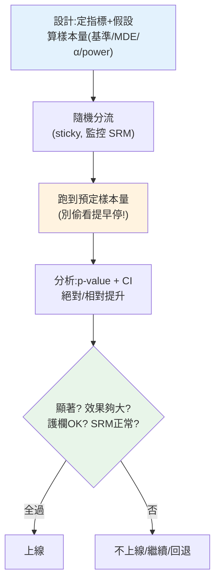

# A/B 測試的統計分析

> [Part 30 講過怎麼把流量分流](../30-production-ai/08-ab-testing-versioning.md)做 A/B——那是**工程**面;這章講 A/B 的**統計**面:實驗前要算**需要多少樣本**、實驗後要**正確判讀結果**、以及避開那些會讓你得出**假結論**的陷阱(偷看、多重比較、樣本比失衡)。A/B 測試是資料分析師建立**因果**([相關≠因果](02-correlation-causation.md)的解方)、驅動產品決策最有力的工具,但**做錯統計比不做還糟**——它給你「有數據支持」的錯覺。

## Why(為什麼)

A/B 測試是[隨機對照實驗](02-correlation-causation.md)的商業版:隨機把使用者分成**對照組(control,舊版)** 和**實驗組(treatment,新版)**,比較指標。因為隨機分組**打散了所有[共同原因](02-correlation-causation.md)**,兩組唯一的系統性差異就是「新版 vs 舊版」——所以差異能**歸因於因果**(這正是觀察性資料做不到的)。這讓 A/B 成為產品決策的黃金標準。

但**統計沒做對,A/B 會給你危險的假信心**:

- **樣本不夠就看結果**:實驗跑兩天、各 200 人,看到「新版高 3%」就上線——但[小樣本測不出真實效果、也可能是雜訊](03-hypothesis-testing.md)。沒事前算樣本量,實驗可能**根本沒有檢定力**,結論不可信。
- **偷看(peeking)提早喊停**:每天看結果,一看到「顯著」就停——這**大幅膨脹偽陽性**(因為你給了自己很多次「碰巧顯著」的機會)。
- **樣本比失衡(SRM)**:預期 50/50 卻變成 55/45——代表分流有 bug,實驗**根本無效**卻不自知。

A/B 的價值全靠**統計嚴謹**支撐。做對了,你能有信心地說「這個改動真的帶來 X% 提升」;做錯了,你會基於雜訊或偏誤做決策,還以為「有數據」。這章教你把 A/B 的統計做對。

## Theory(理論:A/B 的統計流程)

一個嚴謹的 A/B 測試,統計上分**設計 → 執行 → 分析**:

**1. 設計(實驗前)**:

- **定義指標**:主要指標(轉換率、留存…)+ 護欄指標(不能惡化的:延遲、退訂)。
- **設定假設**:H₀「新舊無差異」、H₁「有差異」(見 [假設檢定](03-hypothesis-testing.md))。
- **算樣本量(關鍵!)**:根據 **基準率**、想偵測的**最小可偵測效果(MDE)**、**顯著水準 α**(0.05)、**檢定力 power**(常 0.8),算出**每組需要多少樣本**。這決定實驗要跑多久。**先算樣本量,才知道實驗要收多少資料**。

**2. 執行**:

- 隨機分流(確定性 sticky,見 [Part 30](../30-production-ai/08-ab-testing-versioning.md))、跑到**預定樣本量/時間**才看結果(別偷看)。
- 監控**樣本比(SRM)**:實際分流比是否符合設計(50/50)。

**3. 分析**:

- 用 [假設檢定](03-hypothesis-testing.md)(比例用 z/卡方、平均用 t 檢定)算 p-value 與**信賴區間**。
- 判斷:顯著?效果多大(相對/絕對提升)?護欄指標有沒有惡化?**統計顯著 + 效果夠大 + 護欄 OK** 才上線。

**檢定力(power)= 1−β**:當真有效果時,實驗**偵測得到**的機率。power 0.8 = 有 80% 機會抓到真實效果。樣本量、效果大小、α、power 四者連動——固定其三可求第四。

## Specification(規範:樣本量與結果判讀)

**樣本量公式**(雙比例,每組):

```text
n = (z_α/2·√(2·p̄·(1−p̄)) + z_β·√(p₁(1−p₁)+p₂(1−p₂)))² / (p₂−p₁)²

p₁ = 基準率,p₂ = p₁ + MDE,p̄ = (p₁+p₂)/2
z_α/2:雙尾臨界值(α=0.05 → 1.96),z_β:power 的臨界值(0.8 → 0.84)
```

**直覺**:MDE 越小(要偵測越細的效果)→ 樣本量**暴增**(分母平方);基準率、α、power 也影響。**要抓小提升,得收大量樣本**。

**結果判讀清單**:

| 檢查 | 判準 |
|------|------|
| 統計顯著 | p < 0.05(或 CI 不含 0) |
| 效果大小 | 相對/絕對提升夠大,有商業意義 |
| 護欄指標 | 延遲/退訂/成本等未惡化 |
| 樣本比(SRM) | 實際分流比接近設計(否則實驗無效) |
| 樣本量達標 | 收滿預定樣本才判讀 |

**絕對提升 vs 相對提升**:10% → 12% 是**絕對 +2 個百分點**、**相對 +20%**。報告要講清楚是哪個(相對提升聽起來大,但要看基數)。

## Implementation(底層:偷看為何膨脹偽陽性、SRM 的意義)

**偷看(peeking)為何危險**:[假設檢定](03-hypothesis-testing.md)的 α=0.05 保證「**單次**檢定的偽陽性率 5%」。但如果你**每天偷看、一顯著就停**,等於做了很多次檢定——**每次都有 5% 機會碰巧顯著**,累積下來偽陽性率遠超 5%(可能 20~30%)。就像賭骰子,多丟幾次總會出現你要的點數。**結果:你「提早發現的顯著」很可能是假的**,一停就上線,埋下假結論。**解法**:(a) 事前定樣本量,**收滿才看**;(b) 若要期中分析,用**序貫檢定(sequential testing)/ α 消耗**等專門方法校正。**別隨意偷看提早喊停**是 A/B 的鐵律。

**SRM(Sample Ratio Mismatch,樣本比失衡)**:你設計 50/50 分流,但實際收到 5500 vs 4500——這**不正常**。隨機分流下,比例應非常接近 50/50(大樣本尤其)。顯著偏離代表**分流系統有 bug**(某類使用者被錯誤分配、某組漏記、bot 汙染單組…)。**一旦 SRM,兩組不再可比,整個實驗作廢**——因為你不知道偏差怎麼影響了結果。用卡方檢定測 SRM,**發現就先修分流、別信結果**。這是資深分析師/實驗平台的標準健檢。

**為何要事前算樣本量**:樣本量決定[檢定力](03-hypothesis-testing.md)。太小 → 真有效果也測不出(浪費實驗);過大 → 拖太久、成本高。**事前算**讓你知道「要跑多久才有 80% 機會抓到目標效果」,實驗才有意義。下面範例實作樣本量估算與結果分析。

## Code Example(可執行的 Python 範例)

```python
# ab_test.py — A/B 樣本量估算 + 結果分析(stdlib statistics)
from __future__ import annotations

import math
from statistics import NormalDist


def sample_size_per_group(
    baseline: float, mde: float, alpha: float = 0.05, power: float = 0.8
) -> int:
    """每組所需樣本量。baseline=基準率, mde=最小可偵測效果(絕對)。"""
    p1, p2 = baseline, baseline + mde
    z_alpha = NormalDist().inv_cdf(1 - alpha / 2)
    z_beta = NormalDist().inv_cdf(power)
    p_bar = (p1 + p2) / 2
    numerator = (
        z_alpha * math.sqrt(2 * p_bar * (1 - p_bar))
        + z_beta * math.sqrt(p1 * (1 - p1) + p2 * (1 - p2))
    ) ** 2
    return math.ceil(numerator / mde**2)


def analyze_ab(x_c: int, n_c: int, x_t: int, n_t: int) -> dict[str, object]:
    """分析 A/B 結果:轉換率、提升、顯著性。"""
    p_c, p_t = x_c / n_c, x_t / n_t
    p_pool = (x_c + x_t) / (n_c + n_t)
    se = math.sqrt(p_pool * (1 - p_pool) * (1 / n_c + 1 / n_t))
    z = (p_t - p_c) / se
    p_value = 2 * (1 - NormalDist().cdf(abs(z)))
    return {
        "control": round(p_c, 4),
        "treatment": round(p_t, 4),
        "abs_lift": round(p_t - p_c, 4),  # 絕對提升(百分點)
        "rel_lift": round((p_t - p_c) / p_c, 3),  # 相對提升
        "p_value": round(p_value, 4),
        "significant": p_value < 0.05,
    }


def main() -> None:
    # 實驗前:算樣本量
    n = sample_size_per_group(baseline=0.10, mde=0.02)
    print(f"設計:基準 10%,要偵測 +2 個百分點提升")
    print(f"  每組需 {n} 人(α=0.05, power=0.8)→ 決定實驗要跑多久")

    # 實驗後:分析結果(收滿樣本)
    result = analyze_ab(x_c=430, n_c=4300, x_t=520, n_t=4300)
    print("\n分析:對照 430/4300 vs 實驗 520/4300")
    for key, value in result.items():
        print(f"  {key}: {value}")
    print("  → 顯著且相對提升 20.9%;上線前再確認護欄指標與 SRM。")


if __name__ == "__main__":
    main()
```

**預期輸出**:

```pycon
$ python ab_test.py
設計:基準 10%,要偵測 +2 個百分點提升
  每組需 3841 人(α=0.05, power=0.8)→ 決定實驗要跑多久

分析:對照 430/4300 vs 實驗 520/4300
  control: 0.1
  treatment: 0.1209
  abs_lift: 0.0209
  rel_lift: 0.209
  p_value: 0.002
  significant: True
  → 顯著且相對提升 20.9%;上線前再確認護欄指標與 SRM。
```

逐段解說:

- **樣本量估算**:基準 10%、要偵測 +2 個百分點(到 12%),每組需 **3841 人**。**這是實驗前就要算的**——它告訴你「要收多少資料、跑多久」。若你的流量每天 500 人/組,就得跑約 8 天。**沒算樣本量就開跑,可能收太少(沒檢定力)或太多(浪費)**。注意:MDE 若改成 +1%(更細),樣本量會暴增到近 4 倍(分母平方)。
- **結果分析**:收滿樣本後(這裡各 4300 > 3841 達標),對照 10% vs 實驗 12.09%——**絕對提升 +2.09 個百分點、相對提升 +20.9%**、`p=0.002` 顯著。**報告要講清楚絕對還是相對**(相對 20.9% 聽起來大,但基於 10% 的基數)。
- **上線決策不只看 p**:即使顯著,還要確認 **(a) 效果夠大有商業意義、(b) 護欄指標(延遲/退訂/成本)沒惡化、(c) SRM 正常(分流比 50/50)、(d) 樣本量達標**。全過才上線——**顯著只是必要條件之一**。
- **CI 補充**:實務也應報差異的[信賴區間](03-hypothesis-testing.md),說明「真實提升大概在多少範圍」。
- **鐵律**:收滿預定樣本才判讀,**別偷看提早喊停**(膨脹偽陽性)。

## Diagram(圖解:A/B 統計流程)



## Best Practice(最佳實踐)

- **實驗前算樣本量**:依基準率、MDE、α、power 算每組需求,決定跑多久;別盲目開跑。
- **收滿預定樣本才判讀**:別偷看提早喊停(膨脹偽陽性);要期中看用序貫檢定校正。
- **監控 SRM**:分流比顯著偏離設計 → 實驗有 bug,作廢重來,別信結果。
- **看主要指標 + 護欄指標**:主要要漲、護欄(延遲/退訂/成本)不能惡化。
- **報告絕對 + 相對提升 + CI**:講清楚基數,附信賴區間說明效果範圍。
- **顯著 ≠ 該上線**:還要效果夠大(商業意義)、護欄 OK、SRM 正常。
- **隨機化 + sticky 分流**:確保因果可歸因、體驗一致(見 [Part 30](../30-production-ai/08-ab-testing-versioning.md))。
- **小心多重比較**:同時測多指標/多變體,偽陽性膨脹,要校正。

## Common Mistakes(常見誤解)

- **不算樣本量就開跑**:可能沒檢定力(測不出)或浪費(收太多)。
- **偷看提早喊停**:一顯著就停,大幅膨脹偽陽性,假結論。
- **忽略 SRM**:分流失衡卻照分析,結果無效還信以為真。
- **只看主要指標不看護欄**:轉換漲了但延遲/退訂爆了也上線。
- **混淆絕對與相對提升**:報「提升 20%」不說是相對還絕對,誤導。
- **顯著就上線**:忽略效果大小與商業意義(大樣本易顯著但效果微小)。
- **多重比較不校正**:測 10 個指標總有一個「顯著」(偽陽性)。
- **沒隨機化/非 sticky 分流**:無法歸因因果、體驗不一致、實驗汙染。

## Interview Notes(面試重點)

- **能講 A/B 為何能建立因果**:隨機分組打散共同原因,差異可歸因於介入。
- **能講樣本量估算的作用與連動**:基準/MDE/α/power 四者連動;MDE 越小樣本越大;事前算決定實驗時長。
- **能講偷看為何危險**:多次檢定膨脹偽陽性;要收滿樣本或用序貫檢定。
- **能講 SRM**:樣本比失衡代表分流 bug,實驗作廢。
- **能講上線決策**:顯著 + 效果夠大 + 護欄 OK + SRM 正常 + 樣本達標。
- **能區分絕對 vs 相對提升**、知道要報 CI、小心多重比較。

---

➡️ 下一章:[時間序列分析基礎](05-time-series.md)

[⬆️ 回 Part 24 索引](README.md)
