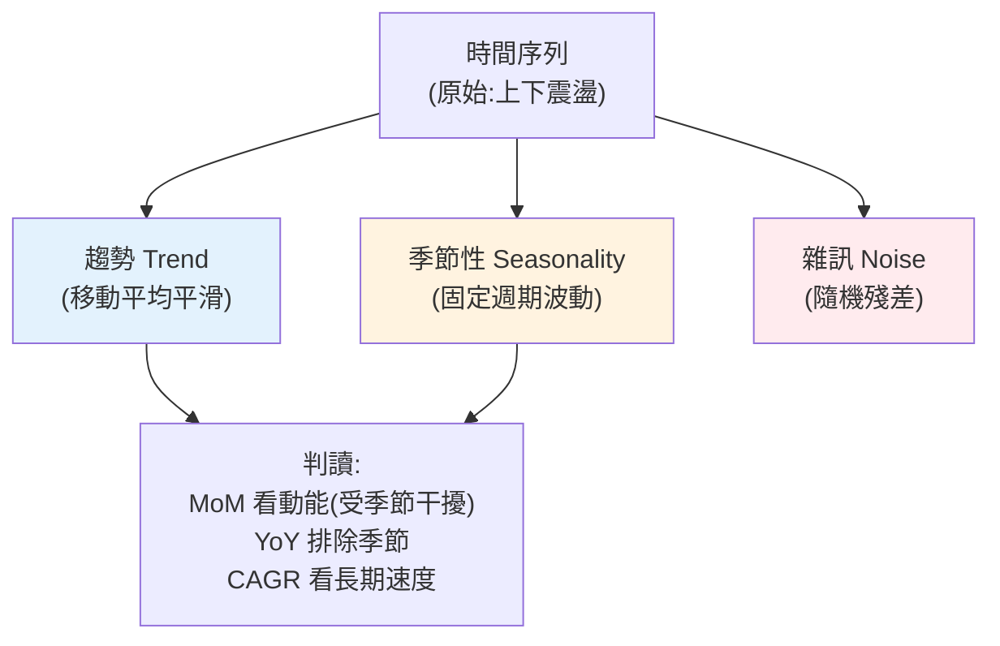

# 時間序列分析基礎

> 商業資料大多帶著**時間**:每日活躍用戶、每月營收、每週訂單。分析這類資料不能當成一堆獨立的數字——它們**有順序、有趨勢、有季節性**。「這個月營收掉了 10%」是壞消息還是正常季節波動?「成長很快」是真趨勢還是短期反彈?**時間序列分析**幫你從時間資料中分辨**趨勢、季節性、雜訊**,做出對的判讀。這章講分析師最常用的時間序列技巧。

## 💡 白話導讀(建議先讀)

商業資料大多黏著**時間**:每日活躍用戶、每月營收、每週訂單。
這種資料不能當一袋各自獨立的數字看——它們**有順序、會遺傳**(今天受昨天影響)。
分析它的第一步,是把一條起伏的曲線**拆成三股**:

- **趨勢(trend)**＝長期方向:整體在漲還是在跌?
  用**移動平均**(把每 7 天平均一次)抹掉短期抖動,趨勢就浮出來。
- **季節性(seasonality)**＝固定週期的重複:每年 12 月旺季、每週末低谷、每天午餐尖峰。
- **雜訊(noise)**＝扣掉前兩者剩下的隨機波動。

**為什麼要拆?** 因為不拆就會鬧笑話:
「這個月營收比上個月跌了!」——如果每年這個月都是淡季(季節性),
那根本不是壞消息。**跟去年同月比(YoY),而不是跟上月比(MoM)**,
就是在校正季節性。這章教你用分解(加法/乘法模型)把「表面波動」還原成「真實訊號」。

實務三招會反覆用到:**移動平均**(平滑看趨勢)、
**同比/環比**(YoY 校季節、MoM 看動能)、
**簡單預測**(用趨勢+季節外推下期)。
提醒一個大坑:時間序列資料**不能隨機切訓練/測試集**——
會用未來預測過去(資料洩漏),要**按時間切**。這章把這些時間資料的特殊規矩講清楚。

## Why(為什麼)

時間資料有它獨特的陷阱,不懂就會誤判:

- **單月比較會被雜訊/季節性誤導**:「12 月營收比 11 月掉 10%」——恐慌嗎?若你的生意每年 12 月都因假期淡季下滑,這是**正常季節性**,不是警訊。反之「6 月比 5 月漲 5%」若每年 6 月都該大漲 20%,其實是**表現不佳**。**孤立地比兩個時間點,沒有意義**——要放進趨勢與季節脈絡。
- **短期波動掩蓋長期趨勢**:每日數字上上下下(雜訊),盯著單日看不出方向。**移動平均**把雜訊平滑掉,才看得見底層趨勢是漲是跌。
- **成長率的表達與陷阱**:「成長 20%」是跟上月比(環比 MoM)還是去年同月比(同比 YoY)?兩者意義完全不同——同比能**排除季節性**(都跟去年同季節比),環比反映**近期動能**但受季節干擾。

**時間序列分析**給你工具把時間資料**拆解**成:**趨勢(trend,長期方向)+ 季節性(seasonality,週期波動)+ 雜訊(noise,隨機)**,分別理解。這讓你能回答「這個變化是真趨勢、季節效應、還是雜訊?」——這是商業分析最核心的判讀能力之一(營收、用戶、庫存的追蹤都靠它)。

## Theory(理論:趨勢、季節、雜訊)

時間序列通常可**分解**成三個成分:

- **趨勢(trend)**:長期的方向(持續成長/衰退)。用**移動平均**平滑短期波動後浮現。
- **季節性(seasonality)**:固定週期的重複波動(每年 12 月旺季、每週末低谷、每天尖峰時段)。
- **雜訊/殘差(noise/residual)**:扣掉趨勢與季節後剩下的隨機波動。

**分解模型**:加法 `y = 趨勢 + 季節 + 雜訊`(季節振幅固定)或乘法 `y = 趨勢 × 季節 × 雜訊`(季節振幅隨規模放大)。理解資料是哪種,決定怎麼分析。

**核心工具**:

- **移動平均(moving average)**:每點取「前 N 期的平均」,**平滑雜訊、凸顯趨勢**。窗口越大越平滑但越遲鈍。
- **環比(MoM/period-over-period)**:與**前一期**比的變化率。反映**近期動能**,但**受季節性干擾**。
- **同比(YoY/year-over-year)**:與**去年同期**比。**排除季節性**(都跟同季節比),看真實成長。
- **累計/歷史新高(cummax)**:追蹤是否突破紀錄。
- **CAGR(複合年均成長率)**:多期成長的年化平均,平滑掉單期波動看長期速度。

## Specification(規範:pandas 時間序列工具)

pandas 對時間序列有一級支援(`DatetimeIndex`):

```python
import pandas as pd
idx = pd.date_range("2023-01-01", periods=12, freq="MS")  # 每月初
s = pd.Series([...], index=idx)

s.rolling(window=3).mean()   # 3 期移動平均(平滑趨勢)
s.pct_change() * 100         # 環比變化率 %
s.pct_change(periods=12)     # 同比(12 期前,需跨年資料)
s.cummax()                   # 累計最大(歷史新高)
s.resample("QS").sum()       # 重採樣(月→季)
s.diff()                     # 一階差分(去趨勢)
s.shift(1)                   # 位移(取前一期,同 SQL LAG)
```

**成長率公式**:

```text
環比 MoM% = (本期 − 上期) / 上期 × 100
同比 YoY% = (本期 − 去年同期) / 去年同期 × 100
CAGR = (末值/初值)^(1/期數) − 1
```

**選 MoM 還 YoY**:有明顯季節性(零售、旅遊)→ 看 **YoY**(排除季節);要看近期反應(剛上線的功能)→ 看 **MoM**(但要意識季節干擾)。**兩者搭配看**最全面。

## Implementation(底層:移動平均為何平滑、YoY 為何排除季節)

**移動平均為何能平滑雜訊、凸顯趨勢**:雜訊是**隨機**的——有正有負、期望為零。把連續 N 期**平均**,正負雜訊會**互相抵消**,剩下的主要是穩定的趨勢成分。所以 `rolling(3).mean()` 讓「上上下下的日線」變成「平滑的趨勢線」。**代價是遲鈍**:窗口越大平滑越多,但對**轉折的反應越慢**(趨勢反轉了,移動平均要幾期後才跟上)。且移動平均頭 N−1 期是 `NaN`(沒足夠歷史)。選窗口大小是「平滑 vs 靈敏」的權衡——看日資料常用 7 天(去除週內季節)、看月資料用 3 或 12。

**YoY 為何能排除季節性**:季節性是**固定週期**的——若每年 12 月都旺、2 月都淡,那麼「今年 12 月 vs 去年 12 月」比較的**兩點季節位置相同**,季節效應**相互抵消**,剩下的差異就是**真實的年成長**。反之環比「12 月 vs 11 月」比較的兩點季節位置不同(旺季 vs 平季),漲跌混雜了季節效應,無法直接解讀為成長。**所以有季節性時,YoY 是判斷「真的成長了嗎」的正解**;MoM 適合看沒有強季節、或需要即時反應的場景。下面範例用 pandas 算移動平均、MoM、cummax、CAGR。

## Code Example(可執行的 Python 範例)

```python
# time_series.py — 時間序列:移動平均 / 環比 / 歷史新高 / CAGR(需要 pandas)
from __future__ import annotations

import pandas as pd


def cagr(start: float, end: float, periods: int) -> float:
    """複合成長率:多期成長的幾何平均(平滑單期波動)。"""
    return (end / start) ** (1 / periods) - 1


def main() -> None:
    idx = pd.date_range("2023-01-01", periods=12, freq="MS")
    revenue = pd.Series(
        [100, 120, 130, 110, 140, 160, 150, 170, 180, 160, 190, 210], index=idx, name="revenue"
    )

    df = pd.DataFrame({"revenue": revenue})
    df["ma3"] = revenue.rolling(window=3).mean().round(1)  # 移動平均(平滑趨勢)
    df["mom_pct"] = (revenue.pct_change() * 100).round(1)  # 環比
    df["cummax"] = revenue.cummax()  # 歷史新高

    print("時間序列綜合表(末 5 月):")
    print(df.tail(5).to_string())

    print("\n環比 MoM%(部分):")
    mom = df["mom_pct"].dropna()
    print({str(k.date()): v for k, v in list(mom.items())[:4]})

    total_cagr = cagr(revenue.iloc[0], revenue.iloc[-1], len(revenue) - 1)
    print(f"\n首→末月營收 CAGR: {total_cagr * 100:.1f}%/月(平滑後的月均成長)")
    print(f"對照:單看 12 月 MoM = {df['mom_pct'].iloc[-1]}%(受單月波動影響)")


if __name__ == "__main__":
    main()
```

**預期輸出**:

```pycon
$ python time_series.py
時間序列綜合表(末 5 月):
            revenue    ma3  mom_pct  cummax
2023-08-01      170  160.0     13.3     170
2023-09-01      180  166.7      5.9     180
2023-10-01      160  170.0    -11.1     180
2023-11-01      190  176.7     18.8     190
2023-12-01      210  186.7     10.5     210

環比 MoM%(部分):
{'2023-02-01': 20.0, '2023-03-01': 8.3, '2023-04-01': -15.4, '2023-05-01': 27.3}

首→末月營收 CAGR: 7.0%/月(平滑後的月均成長)
對照:單看 12 月 MoM = 10.5%(受單月波動影響)
```

逐段解說:

- **移動平均 `ma3`**:原始營收上下震盪(180→160→190→210),但 3 月移動平均 `160→166.7→170→176.7→186.7` **平滑地一路上升**——**雜訊被抹平,趨勢清晰浮現**(穩定成長)。單看原始數字的 10 月 `160`(比 9 月 180 掉),會誤以為衰退;但移動平均顯示**底層趨勢仍向上**,那只是單月波動。這就是移動平均的價值:**別被單期雜訊嚇到,看平滑趨勢**。
- **環比 `mom_pct`**:每月變化率上下跳(+20%、+8%、−15%、+27%…)——**波動大、難解讀**。10 月 −11.1% 看似警訊,但放進趨勢(移動平均仍升)就知道是正常波動。**環比反映動能但受雜訊/季節干擾**,別孤立解讀。
- **歷史新高 `cummax`**:追蹤是否突破紀錄——12 月 210 是新高。適合追蹤「是否創新高」的指標。
- **CAGR vs 單月**:首月 100 →末月 210,**CAGR = 7%/月**——這是**平滑掉所有單月波動後的真實月均成長速度**。對照「12 月單月 MoM = 10.5%」——單月數字受波動影響大,CAGR 才反映**長期速度**。報告「成長多快」時,CAGR 比挑某個單月的成長率更誠實。
- **要點**:移動平均看趨勢(別被單期騙)、環比/同比看變化(注意季節)、CAGR 看長期速度、cummax 追新高。

## Diagram(圖解:時間序列分解)



## Best Practice(最佳實踐)

- **別孤立比較兩個時間點**:放進趨勢與季節脈絡,單月漲跌可能只是雜訊/季節。
- **用移動平均看趨勢**:平滑雜訊,別被單期波動嚇到;窗口依資料週期選(日資料常 7 天)。
- **有季節性看 YoY**:同比排除季節效應,反映真實成長;MoM 看近期動能但注意季節。
- **報長期成長用 CAGR**:平滑單期波動,比挑某個月的成長率誠實。
- **明確標示 MoM/YoY**:別讓「成長 20%」語意不清。
- **用 pandas 的時間序列工具**:`rolling`/`pct_change`/`resample`/`shift`——為時間資料設計。
- **辨識加法 vs 乘法季節**:振幅固定用加法、隨規模放大用乘法,影響分析方式。
- **進階用專門工具**:趨勢/季節分解(`statsmodels` 的 STL)、預測(ARIMA、Prophet)。

## Common Mistakes(常見誤解)

- **孤立比較單月**:忽略季節性,把正常淡季當警訊、旺季不足當成長。
- **盯單期數字看趨勢**:被雜訊誤導;要用移動平均平滑。
- **有季節性卻只看 MoM**:季節效應混進去,誤判成長。
- **MoM/YoY 不標示**:「成長 20%」語意不清,誤導。
- **用單月成長率代表長期速度**:單月波動大,該用 CAGR。
- **移動平均窗口亂選**:太小沒平滑效果、太大太遲鈍;要配合資料週期。
- **忽略移動平均的 NaN 與遲滯**:頭幾期無值、轉折反應慢,別誤讀。
- **把季節波動當異常**:每年重複的模式不是異常,是季節性。

## Interview Notes(面試重點)

- **能講時間序列的三成分**:趨勢、季節性、雜訊,及加法/乘法分解。
- **能解釋移動平均為何平滑**:隨機雜訊平均後互相抵消,凸顯趨勢;代價是遲滯。
- **能區分 MoM vs YoY**:YoY 排除季節(同季節比),MoM 看動能但受季節干擾;有季節性看 YoY。
- **能講 CAGR**:多期成長的年化幾何平均,平滑單期波動看長期速度。
- **能講為何不能孤立比較兩時間點**:要放進趨勢與季節脈絡。
- **知道 pandas 時間序列工具**(rolling/pct_change/resample)與進階(STL/ARIMA/Prophet)。

---

➡️ 下一章:[商業指標:cohort / funnel / retention](06-business-metrics.md)

[⬆️ 回 Part 24 索引](README.md)
