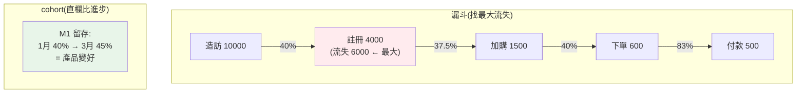

# 商業指標:cohort / funnel / retention

> 分析師不只算統計數字,更要算**商業指標**——把資料轉成生意能理解、能行動的語言:使用者在哪一步流失(**漏斗**)?新用戶留得住嗎(**留存**)?不同時間加入的用戶表現如何(**cohort**)?這些指標直接連結到成長、營收、產品決策。這章講分析師必備的三大商業分析框架:漏斗、留存、cohort。

## Why(為什麼)

老闆不會問「轉換率的 p-value 是多少」,他會問「**為什麼註冊的人不下單**」「**新用戶會不會流失**」「**這波行銷帶來的用戶好不好**」。回答這些要用**商業指標框架**,而非單純的統計量:

- **漏斗(funnel)**:使用者從進站到完成目標(購買、註冊)要經過**多個步驟**,每步都會流失一些人。漏斗分析告訴你**每一步流失多少、最大的漏洞在哪**——這直接指向「該優化哪一步」。不看漏斗,你只知道「轉換率低」,不知道**低在哪個環節**。
- **留存(retention)**:獲取新用戶很貴,但若他們用一次就走,再多獲取也是漏水的桶。留存率告訴你**產品留不留得住人**——這是產品健康度的核心指標,比「總用戶數」更真實(總數可能靠燒錢買來、留不住)。
- **cohort(世代分析)**:把用戶按「**加入時間**」分組,追蹤各組隨時間的表現。這能回答「**產品有沒有變好**」——若 3 月加入的 cohort 留存比 1 月的高,代表產品在進步;也能公平比較不同行銷活動帶來的用戶品質(避免[辛普森式](02-correlation-causation.md)的混淆)。

這些框架是分析師與**產品、成長、營運**團隊溝通的共同語言,也是把資料連到**商業行動**的橋樑。掌握它們,你的分析才能真正影響決策,而非停在「數字很有趣」。

## Theory(理論:三大框架)

**漏斗(funnel)分析**:

使用者達成目標的**有序步驟**(造訪 → 註冊 → 加購物車 → 下單 → 付款)。每步計算:

- **階段轉換率**:這步人數 / 上一步人數(這一步留下多少)。
- **累計轉換率**:這步人數 / 最頂端人數(整體走到這的比例)。
- **流失(drop-off)**:上一步 − 這步(這步漏掉多少人)。找出**最大流失點**——優化的優先目標。

**留存(retention)分析**:

用戶在**首次使用後**的第 N 期是否仍活躍。`留存率(第 N 期)= 第 N 期仍活躍的人 / 初始人數`。通常隨時間**遞減**——健康的產品會**趨於平穩**(留下一群忠實用戶),不健康的持續下滑到零。

**cohort(世代)分析**:

把用戶按**加入時間**(如註冊月份)分成 **cohort**,追蹤**每個 cohort** 隨時間的指標(常是留存)。排成**cohort 留存矩陣**:列 = cohort(加入月)、欄 = 相對時間(M0/M1/M2…)、值 = 留存率。

- **橫看一列**:某 cohort 隨時間的留存衰退。
- **直看一欄**:不同 cohort 在「加入後同樣久」的表現對比——**判斷產品是否隨時間變好**(新 cohort 的 M1 留存高於舊 cohort → 進步)。

## Specification(規範:指標計算)

**漏斗**:

```text
階段轉換率 = 本階段人數 / 前階段人數
累計轉換率 = 本階段人數 / 首階段人數
流失數 = 前階段人數 − 本階段人數  → 最大者是首要優化點
```

**留存矩陣**(每格 = 該 cohort 在該期的留存%):

```text
留存率(cohort C, 第 N 期) = C 在第 N 期活躍人數 / C 的 M0 人數
```

**其他核心商業指標**:

| 指標 | 意義 |
|------|------|
| **Conversion Rate** | 完成目標的比例 |
| **Retention / Churn** | 留存率 / 流失率(互補:churn = 1 − retention) |
| **DAU/MAU** | 日活/月活躍用戶;比值反映黏著度 |
| **LTV(生命週期價值)** | 一個用戶帶來的總價值 |
| **CAC(獲客成本)** | 獲取一個用戶的成本;LTV/CAC > 1 才健康 |
| **ARPU** | 每用戶平均營收 |

## Implementation(底層:漏斗定位問題、cohort 排除混淆)

**漏斗為何能定位問題**:總轉換率(造訪→付款 5%)只是個結果,不告訴你**問題在哪**。拆成漏斗後,你看到「造訪→註冊只留 40%(流失 6000 人)」——**最大流失發生在第一步**。這把「轉換率低」這個模糊問題,**定位到具體環節**(註冊流程太複雜?價值沒講清楚?),優化才有方向。**漏斗的價值是把單一數字拆成可行動的環節診斷**——找最大流失點、集中資源優化它,槓桿最大。

**cohort 為何能排除混淆、看出產品進步**:若只看「整體留存率」,它會被**用戶組成的變化**扭曲——這個月狂拉新用戶(新用戶留存天生低)會拉低整體留存,讓你誤以為「產品變差」,其實只是新用戶佔比高(這是[辛普森悖論](02-correlation-causation.md)的商業版)。**cohort 分析固定「加入時間」這個變數**:比較「1 月 cohort 的 M1」和「3 月 cohort 的 M1」——兩者都是「加入後 1 個月」,基礎相同,差異才真正反映**產品在這段時間有沒有變好**。**cohort 把「時間」這個混淆變數控制住**,是判斷產品迭代成效的正解。

**留存矩陣的三角形狀**:越新的 cohort，能觀察的期數越少(3 月加入的還沒到 M3)——所以矩陣是**右上三角有值、右下為空**。分析時**別拿觀察期不同的數字硬比**(比較不同 cohort 要看**相同的相對期 MN**,不是絕對日期)。下面範例算漏斗與 cohort 留存矩陣。

## Code Example(可執行的 Python 範例)

```python
# business_metrics.py — 漏斗分析 + cohort 留存矩陣(需要 pandas)
from __future__ import annotations

import pandas as pd


def analyze_funnel(stages: list[tuple[str, int]]) -> None:
    """漏斗:各階段轉換率、累計、找最大流失點。"""
    top = stages[0][1]
    prev = None
    for stage, n in stages:
        step = f"{n / prev * 100:.1f}%" if prev else "  -  "
        overall = f"{n / top * 100:.1f}%"
        print(f"  {stage}: {n:>6}  階段轉換={step:>7}  累計={overall}")
        prev = n
    drops = [(stages[i][0], stages[i - 1][1] - stages[i][1]) for i in range(1, len(stages))]
    worst = max(drops, key=lambda x: x[1])
    print(f"  → 最大流失:進入「{worst[0]}」流失 {worst[1]} 人(優先優化)")


def cohort_retention(df: pd.DataFrame, periods: list[str]) -> None:
    """cohort 留存矩陣:各 cohort 相對 M0 的留存%。"""
    for _, row in df.iterrows():
        m0 = row["M0"]
        cells = []
        for p in periods:
            v = row[p]
            cells.append(f"{v / m0 * 100:.0f}%" if pd.notna(v) else "  -")
        print(f"  {row['cohort']}: " + "  ".join(f"{c:>4}" for c in cells))


def main() -> None:
    print("漏斗分析:")
    analyze_funnel(
        [("造訪", 10000), ("註冊", 4000), ("加購物車", 1500), ("下單", 600), ("付款", 500)]
    )

    print("\nCohort 留存矩陣(留存%,右下為未來未觀測):")
    cohorts = pd.DataFrame(
        {
            "cohort": ["2024-01", "2024-02", "2024-03"],
            "M0": [1000, 800, 1200],
            "M1": [400, 360, 540],
            "M2": [250, 200, None],
            "M3": [180, None, None],
        }
    )
    cohort_retention(cohorts, ["M0", "M1", "M2", "M3"])
    print("  → 直看 M1 欄:40% → 45% → 45%,新 cohort 留存上升 = 產品在變好")


if __name__ == "__main__":
    main()
```

**預期輸出**:

```pycon
$ python business_metrics.py
漏斗分析:
  造訪:  10000  階段轉換=  -    累計=100.0%
  註冊:   4000  階段轉換=  40.0%  累計=40.0%
  加購物車:   1500  階段轉換=  37.5%  累計=15.0%
  下單:    600  階段轉換=  40.0%  累計=6.0%
  付款:    500  階段轉換=  83.3%  累計=5.0%
  → 最大流失:進入「註冊」流失 6000 人(優先優化)

Cohort 留存矩陣(留存%,右下為未來未觀測):
  2024-01: 100%   40%   25%   18%
  2024-02: 100%   45%   25%     -
  2024-03: 100%   45%     -     -
  → 直看 M1 欄:40% → 45% → 45%,新 cohort 留存上升 = 產品在變好
```

逐段解說:

- **漏斗**:10000 造訪最後只有 500 付款(累計 5%)。**拆開看每步**:造訪→註冊只留 40%(**流失 6000 人**,最大漏洞!)、加購物車→下單也只 40%。**最大流失在第一步(註冊)**——這告訴成長團隊:**優化註冊流程的槓桿最大**(6000 人的漏洞 vs 付款步驟只漏 100 人)。反之付款步驟轉換 83.3% 已經不錯,優化它效益小。**漏斗把「轉換率 5%」變成「該修註冊」的可行動洞察**。
- **cohort 留存矩陣**:每列一個加入月、每欄一個相對期(M0=加入當月 100%,之後遞減)。**橫看一列**:1 月 cohort 從 100%→40%→25%→18%,留存衰退並趨穩(留下約 18% 忠實用戶)。
- **cohort 的關鍵——直看一欄**:M1 欄是 `40% → 45% → 45%`——**越新的 cohort，加入後 1 個月的留存越高**!這代表**產品在變好**(可能改善了新手引導)。若只看「整體留存」會被組成變化掩蓋,cohort **固定了「加入時間」**才看得出這個進步趨勢。
- **三角形狀**:3 月 cohort 只到 M1(還沒到 M2/M3),所以右下是空的——**比較 cohort 要看相同的相對期 MN**,別拿觀察期不同的硬比。
- **要點**:漏斗定位流失環節(找最大漏洞優先修)、留存看產品黏著、cohort 直欄比對判斷產品是否進步(控制時間混淆)。

## Diagram(圖解:漏斗與 cohort)



## Best Practice(最佳實踐)

- **用漏斗定位流失環節**:別只看總轉換率,拆步驟找最大流失點,集中資源優化槓桿最大處。
- **留存看產品健康**:比總用戶數真實;看留存是否趨穩(留下忠實用戶)還是持續歸零。
- **cohort 控制加入時間**:直欄比對同相對期,判斷產品是否隨迭代變好(排除組成混淆)。
- **比較 cohort 看相同相對期(MN)**:別拿觀察期不同的絕對日期硬比。
- **churn = 1 − retention**:兩者互補,看你溝通習慣。
- **關注 LTV/CAC**:獲客要划算(LTV > CAC),留存好才撐得起 LTV。
- **指標連到行動**:每個指標都要能回答「所以該做什麼」,別為算而算。
- **DAU/MAU 看黏著度**:比值高代表用戶頻繁回來。

## Common Mistakes(常見誤解)

- **只看總轉換率不拆漏斗**:知道低卻不知低在哪個環節,無從優化。
- **優化錯環節**:去優化流失小的步驟(付款 83%),忽略最大漏洞(註冊)。
- **只看總用戶數不看留存**:靠燒錢買來的用戶留不住,漏水的桶。
- **看整體留存不看 cohort**:被用戶組成變化掩蓋,誤判產品變差/變好([辛普森](02-correlation-causation.md)商業版)。
- **拿觀察期不同的 cohort 硬比**:新 cohort 還沒到 MN,比絕對日期不公平。
- **忽略 LTV/CAC**:狂拉用戶但 CAC > LTV,越成長越虧。
- **指標算完不連到行動**:數字很多但沒人知道該做什麼。
- **混淆留存與活躍**:留存是「回不回來」,不是「用多少」,別搞混。

## Interview Notes(面試重點)

- **能做漏斗分析**:算各階段/累計轉換率、找最大流失點,並解釋為何優化該點槓桿最大。
- **能講留存分析**:留存率定義、健康產品會趨穩、比總用戶數真實。
- **能解釋 cohort 分析**:按加入時間分組、直欄比同相對期判斷產品是否進步,控制時間混淆。
- **知道比較 cohort 要看相同相對期 MN**、留存矩陣的三角形狀。
- **能列核心商業指標**:conversion/retention/churn/DAU-MAU/LTV/CAC/ARPU 及其意義。
- **能把指標連到行動**:每個指標回答「該做什麼」,LTV/CAC 判斷成長健康度。

---

➡️ 下一章:[資料視覺化與圖表選擇](07-visualization.md)

[⬆️ 回 Part 24 索引](README.md)
