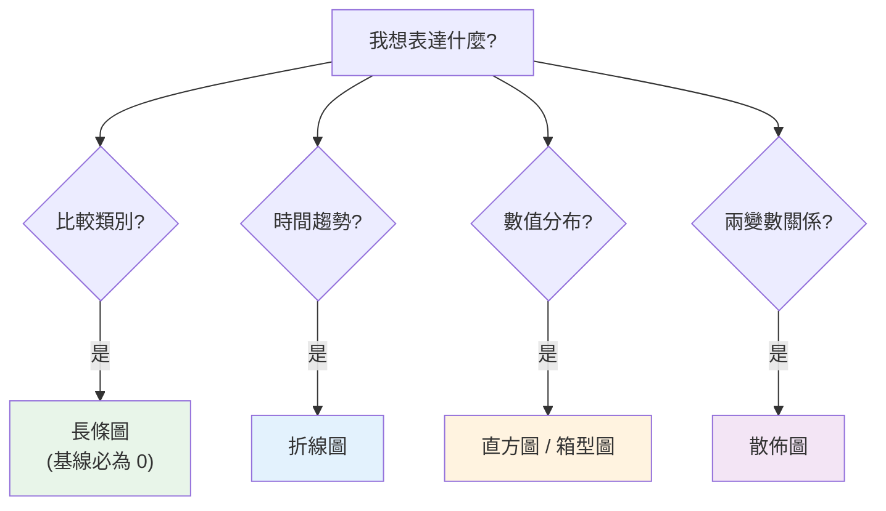

# 資料視覺化與圖表選擇

> 一張對的圖,能讓決策者三秒看懂你花三天算出的洞察;一張錯的圖,能讓正確的資料傳達錯誤的訊息(甚至誤導、欺騙)。**資料視覺化**不是「把數字畫成圖」那麼簡單——它是**選對圖表類型**、**誠實呈現**、**凸顯重點**的專業。這章講分析師的視覺化原則:什麼資料配什麼圖、怎麼避免誤導、怎麼讓圖說出洞察。

## Why(為什麼)

視覺化是分析師**傳達洞察**的主要媒介(見 [資料溝通](08-data-storytelling.md)),但它有兩面:

- **對的圖讓洞察一目了然**:人腦處理視覺遠快於數字。「各區營收」用[長條圖](#)三秒看出高低;用表格要逐格讀。「營收趨勢」用[折線圖](#)一眼看出漲跌;用一堆數字看不出方向。**選對圖 = 讓大腦免費幫你理解**。
- **錯的圖誤導甚至欺騙**:同一份資料,把長條圖 y 軸從 95 而非 0 開始,能讓「100 vs 102」看起來像「差一倍」——**視覺謊言**。用圓餅圖畫 20 個類別,誰都看不懂。用雙 y 軸硬湊出「相關」。這些**要嘛是無心之過、要嘛是刻意誤導**,分析師都該避免(且要能識破別人的)。

視覺化的核心是**誠實地、有效地**把資料的訊息傳給人。這需要:(1) **依「你想表達什麼 + 資料型態」選對圖表**;(2) **遵守誠實原則**(軸從 0、不扭曲比例);(3) **凸顯重點、去除雜訊**(data-ink ratio)。做好視覺化,你的分析才能真正被理解、被信任、被行動。這章給你這套原則。

## Theory(理論:圖表選擇與誠實原則)

**圖表選擇的核心:先問「我想表達什麼關係?」** 圖表類型由**分析目的**決定,再配合**資料型態**:

| 目的 | 常用圖表 | 適用資料 |
|------|----------|----------|
| **比較(comparison)** | 長條圖 bar | 類別間數值比較 |
| **趨勢(trend)** | 折線圖 line | 時間序列 |
| **分布(distribution)** | 直方圖 histogram、箱型圖 boxplot | 單一數值變數 |
| **關係(relationship)** | 散佈圖 scatter | 兩個數值變數 |
| **組成(composition)** | 堆疊長條、圓餅(少類別) | 部分佔整體 |
| **排名(ranking)** | 排序長條圖 | 類別排序 |

**誠實呈現的原則**:

- **長條圖 y 軸必須從 0 開始**:長條的**長度**編碼數值,截斷基線會**扭曲長度比例**、誇大差異(最常見的視覺謊言)。折線圖可不從 0(它編碼的是**位置/趨勢**,非長度)。
- **不扭曲比例**:面積/氣泡圖的大小要正比於數值(別用半徑當數值,面積會平方放大)。
- **保持一致的尺度**:多圖比較用相同軸範圍,別各自縮放製造假象。
- **避免雙 y 軸誤導**:兩條線用不同尺度硬湊,容易暗示不存在的關係。

**Tufte 的 data-ink ratio**:墨水應盡量用在**呈現資料**上,去除無意義的裝飾(3D 效果、花俏背景、多餘格線)——**less is more**,雜訊越少,訊息越清楚。

## Specification(規範:選圖與避坑)

**選圖決策**:`圖表 = f(分析目的, 資料型態)`。

```text
要「比較類別」→ 長條圖(不是圓餅,人難比角度)
要「看時間趨勢」→ 折線圖
要「看數值分布」→ 直方圖(形狀)/ 箱型圖(離群、四分位)
要「看兩變數關係」→ 散佈圖
要「看佔比」→ 堆疊長條 or 圓餅(僅限 2-5 類別)
```

**常見誤導手法(要避免 + 要識破)**:

| 手法 | 問題 |
|------|------|
| 長條圖 y 軸不從 0 | 誇大差異(扭曲長度) |
| 圓餅圖太多類別 | 無法比較角度,看不懂 |
| 雙 y 軸不同尺度 | 暗示假關係 |
| 3D 圖表 | 扭曲比例、遮擋 |
| 面積/氣泡用半徑編碼 | 面積平方放大,誤導 |
| 挑選有利的時間範圍(cherry-picking) | 隱藏不利趨勢 |

**Python 工具**:[matplotlib](../17-data-science/README.md)(基礎、全控制)、seaborn(統計圖、美觀預設)、plotly(互動)。分析師常用 matplotlib/seaborn 出靜態報告圖。

## Implementation(底層:為何長條圖截斷軸是謊言、圓餅為何難讀)

**長條圖截斷 y 軸為何是視覺謊言**:長條圖用**長條的長度**來編碼數值——長度是「從基線到頂端」的距離。若基線是 0,長度就正比於數值(100 的長條是 50 的兩倍長,正確)。但若基線設在 95,「100」的可見長度是 5、「102」是 7——**視覺長度比變成 7:5 = 1.4:1**,但真實數值比只有 102:100 = 1.02:1。讀者的大腦用「長度比」解讀,於是把「2% 的差異」看成「40% 的差異」——**被誇大了近 14 倍**(見下面範例)。這是新聞和簡報中最常見的操縱手法。**規則:編碼長度的圖(長條)基線必須為 0;編碼位置的圖(折線)可以不從 0。**

**圓餅圖為何常是壞選擇**:人眼**善於比較長度(位置),不善於比較角度(面積)**。圓餅用角度/扇形面積編碼佔比,當有超過 3~5 個類別、或幾個佔比接近時,**你根本分不出誰大誰小**(30% 和 33% 的扇形看起來一樣)。同樣的資料用**長條圖**(比長度)一眼就分出高低。所以**多數情況長條圖優於圓餅**;圓餅只在「2~3 個類別、且要強調『佔整體』」時勉強可用。**選圖要順應人類視覺的強項(比長度),避開弱項(比角度/面積)。** 下面範例實作圖表選擇建議與截斷軸誇大偵測。

## Code Example(可執行的 Python 範例)

```python
# visualization.py — 圖表選擇建議 + 截斷軸誇大偵測(純標準庫)
from __future__ import annotations


def recommend_chart(purpose: str, data_type: str) -> str:
    """依分析目的 + 資料型態推薦圖表。"""
    rules = {
        ("comparison", "categorical"): "長條圖 bar chart",
        ("trend", "time_series"): "折線圖 line chart",
        ("distribution", "numeric"): "直方圖 / 箱型圖",
        ("relationship", "two_numeric"): "散佈圖 scatter",
        ("composition", "parts_of_whole"): "堆疊長條 / 圓餅(僅 2-5 類別)",
        ("ranking", "categorical"): "排序長條圖",
    }
    return rules.get((purpose, data_type), "先釐清分析目的與資料型態")


def bar_baseline_exaggeration(y_min: float, values: list[float]) -> float:
    """長條圖 y 軸從 y_min 起(非 0)時的誇大倍數 = 視覺長度比 / 真實比。
    回 1.0 = 誠實;> 1 = 誇大差異。"""
    if y_min <= 0:
        return 1.0  # 基線為 0,誠實
    v_small, v_large = min(values), max(values)
    visual_ratio = (v_large - y_min) / (v_small - y_min)
    true_ratio = v_large / v_small
    return round(visual_ratio / true_ratio, 2)


def main() -> None:
    print("圖表選擇建議:")
    for purpose, data_type in [
        ("trend", "time_series"),
        ("comparison", "categorical"),
        ("relationship", "two_numeric"),
        ("distribution", "numeric"),
    ]:
        print(f"  {purpose:12} + {data_type:12} → {recommend_chart(purpose, data_type)}")

    print("\n截斷軸誇大偵測(長條圖,值 100 vs 102):")
    print(f"  基線 0(誠實): 誇大 {bar_baseline_exaggeration(0, [100, 102])} 倍")
    factor = bar_baseline_exaggeration(95, [100, 102])
    print(f"  基線 95(截斷): 誇大 {factor} 倍")
    print(f"    → 真實只差 2%,但長條看起來差 {(factor - 1) * 100:.0f}% 更多,誤導!")


if __name__ == "__main__":
    main()
```

**預期輸出**:

```pycon
$ python visualization.py
圖表選擇建議:
  trend        + time_series  → 折線圖 line chart
  comparison   + categorical  → 長條圖 bar chart
  relationship + two_numeric  → 散佈圖 scatter
  distribution + numeric      → 直方圖 / 箱型圖
截斷軸誇大偵測(長條圖,值 100 vs 102):
  基線 0(誠實): 誇大 1.0 倍
  基線 95(截斷): 誇大 1.37 倍
    → 真實只差 2%,但長條看起來差 37% 更多,誤導!
```

逐段解說:

- **圖表選擇**:`recommend_chart` 把「分析目的 + 資料型態」對應到圖表——趨勢配折線、比較配長條、關係配散佈、分布配直方/箱型。**先問「我想表達什麼」再選圖**,而非隨手畫個圖。這個對應表是分析師的基本功。
- **截斷軸偵測**:同樣是「100 vs 102」——基線 0 時誇大倍數 `1.0`(誠實,視覺比 = 真實比);基線 95 時誇大 `1.37` 倍——**長條的視覺長度比被放大了 37%**,讓「2% 的微小差異」看起來像「顯著差異」。這就是為什麼**長條圖基線必須為 0**:否則長度編碼被扭曲,誠實的資料傳達誤導的訊息。
- **識破他人的圖**:看到長條圖「差很多」,先檢查 **y 軸從哪開始**——若不是 0,差異可能被誇大。這是分析師(和一般讀者)該有的批判眼光。
- **實作出圖**:真實中用 [matplotlib](../17-data-science/README.md)/seaborn 畫,記得 `ax.set_ylim(bottom=0)` 讓長條從 0 起、去除多餘裝飾(data-ink)。本範例聚焦**選圖原則與誠實檢查**(可執行、確定性),出圖 API 見 Part 17。
- **要點**:依目的選圖(比較→長條、趨勢→折線、關係→散佈、分布→直方)、長條基線必為 0、順應視覺強項(比長度勝過比角度)。

## Diagram(圖解:選圖決策)



## Best Practice(最佳實踐)

- **先問「想表達什麼」再選圖**:比較→長條、趨勢→折線、分布→直方/箱型、關係→散佈。
- **長條圖 y 軸從 0**:編碼長度,截斷會誇大差異(折線可不從 0)。
- **多用長條、少用圓餅**:人比長度勝過比角度;圓餅僅限 2-5 類別。
- **去除雜訊(data-ink)**:拿掉 3D、花俏背景、多餘格線,凸顯資料。
- **凸顯重點**:用顏色/標註引導視線到關鍵洞察,別讓讀者自己找。
- **一致的尺度**:多圖比較用相同軸範圍,別各自縮放。
- **標題說結論**:圖標題寫「北區營收領先」而非「各區營收」(見 [說故事](08-data-storytelling.md))。
- **識破誤導**:看圖先檢查軸範圍、尺度、時間範圍是否被操縱。

## Common Mistakes(常見誤解)

- **長條圖 y 軸不從 0**:誇大微小差異,最常見的視覺謊言。
- **用圓餅畫很多類別**:分不出誰大誰小,該用長條。
- **隨手畫圖不想目的**:圖表類型與想傳達的訊息不匹配。
- **雙 y 軸硬湊關係**:不同尺度暗示不存在的相關。
- **3D / 花俏裝飾**:扭曲比例、遮擋、分散注意力。
- **面積/氣泡用半徑編碼**:面積平方放大,誤導大小。
- **cherry-picking 時間範圍**:挑有利區間,隱藏不利趨勢。
- **圖標題只寫維度不寫結論**:讓讀者自己猜重點。

## Interview Notes(面試重點)

- **能依目的選圖**:比較→長條、趨勢→折線、分布→直方/箱型、關係→散佈、組成→堆疊。
- **能解釋長條圖為何要從 0**:編碼長度,截斷基線扭曲長度比、誇大差異;折線編碼位置可不從 0。
- **能解釋圓餅的問題**:人比角度弱,多類別分不清,長條較佳。
- **能識破誤導手法**:截斷軸、雙 y 軸、3D、cherry-picking、半徑編碼面積。
- **知道 data-ink ratio**:去除裝飾凸顯資料;圖標題說結論。
- **知道視覺化是誠實 + 有效地傳達洞察**,順應人類視覺強項。

---

➡️ 下一章:[資料溝通與說故事](08-data-storytelling.md)

[⬆️ 回 Part 24 索引](README.md)
