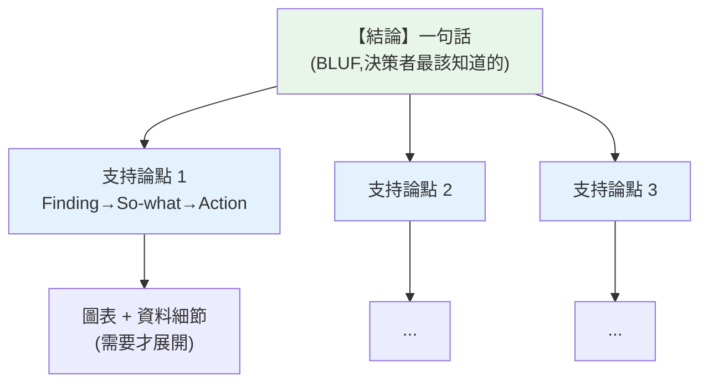

# 資料溝通與說故事

> 你花了三天,用 [SQL 撈數](../23-data-analysis/02-sql-aggregation.md)、[統計檢定](03-hypothesis-testing.md)、[cohort 分析](06-business-metrics.md),得出一個重要洞察——然後在會議上花 30 分鐘講一堆數字,決策者聽完一臉茫然,什麼都沒改變。**分析的價值不在算出洞察,而在讓洞察被理解、被相信、被行動。** 這是資料溝通與說故事的功夫,也是分析師「差」與「頂尖」的最大分水嶺。這章講怎麼把分析變成能驅動決策的敘事。

## Why(為什麼)

技術好的分析師很多,但能**影響決策**的分析師稀有——差別往往不在分析能力,而在**溝通能力**:

- **決策者沒時間也沒背景聽細節**:高管要的是「所以呢?我該做什麼?」不是你的 SQL 怎麼寫、p-value 多少。**把一堆數字丟給他們 = 讓他們自己做分析**——他們沒時間,結果就是「這報告很詳細」然後束之高閣。
- **人靠故事理解、記憶、行動**,不靠數據表。同樣的發現,「轉換率 15%」是個數字;「每 100 個想買的客戶,有 85 個卡在註冊放棄了」是個能讓人**在意、想解決**的故事。
- **洞察沒轉成行動就是零價值**:分析的終點不是「發現了 X」,而是「因此**該做 Y**」。少了這一步(so-what → action),再精彩的分析都只是資訊,不是決策。

**資料溝通**的核心:用**受眾聽得懂的語言**、**先講結論**的結構、**故事化**的敘事、**明確的行動建議**,把分析轉成決策。這不是「把技術包裝得漂亮」,而是**分析工作的最後一哩、也是價值兌現的關鍵一哩**。做不好,前面所有努力都打折;做好了,你的分析才真正改變了什麼。這章給你這套溝通框架。

## Theory(理論:金字塔原則與 SCR)

**金字塔原則(Pyramid Principle,Barbara Minto)——先講結論,再給支持**:

跟學術論文「鋪陳→推導→結論」相反,商業溝通要**倒過來**:

```text
【結論/主張】(一句話,決策者最該知道的)
    ├── 支持論點 1(發現 + 意涵)
    ├── 支持論點 2
    └── 支持論點 3
        └── 各自的資料細節(需要時才展開)
```

**為什麼先講結論**:決策者時間有限、注意力在開頭最集中。先給結論,他立刻知道「這關乎什麼、要不要繼續聽」;之後的細節是**支持**,想深究才看。若你把結論藏在最後(像論文),他可能在你鋪陳時就走神或打斷。**BLUF(Bottom Line Up Front,結論先行)** 是商業溝通鐵律。

**SCR / SCQA 敘事結構**(讓分析變故事):

- **Situation(情境)**:大家都同意的背景(「我們 Q3 想提升營收」)。
- **Complication(衝突/問題)**:出現了什麼問題/變化(「但轉換率停滯」)。
- **Resolution(解決)/ Question→Answer**:你的分析發現與建議(「分析發現卡在註冊,建議簡化流程」)。

這個「背景→衝突→解決」的弧線,把乾巴巴的數據**變成有張力的故事**,讓人跟著你的邏輯走。

**每個洞察三件套:Finding → So-what → Action**:發現(數據)→ 意涵(對業務代表什麼)→ 行動(該做什麼)。**只有 finding 是報數字,加上 so-what 和 action 才是洞察。**

## Specification(規範:溝通框架)

**組織報告的結構**:

```text
1. 結論先行(BLUF):一句話講最重要的發現與建議
2. 支持論點(金字塔):3 個左右關鍵發現,每個 = Finding + So-what + Action
3. 敘事弧線(SCR):背景 → 問題 → 解決,串起邏輯
4. 佐證細節:圖表(見 ch07)、資料,放在支持論點下,需要才展開
5. 明確的下一步:具體、可行動的建議
```

**針對受眾調整(audience tailoring)**:

| 受眾 | 想聽 | 給什麼 |
|------|------|--------|
| **高管 / 決策者** | 結論、影響、該做什麼 | So-what + Action,少細節,重商業影響 |
| **產品 / 營運** | 發現 + 具體建議 | Finding + Action,可操作的細節 |
| **分析 / 技術同儕** | 方法、細節、嚴謹度 | 完整 Finding + 方法論 + 侷限 |

**同一份分析,對不同受眾講不同版本**——不是內容不同,是**詳略與切入點**不同。

## Implementation(底層:為何先結論、為何要 so-what、誠實原則)

**為何「先結論」違反直覺卻正確**:分析師的自然衝動是「按我探索的順序講」——先講資料怎麼來、怎麼清、怎麼算,最後才到結論(像重現偵探破案過程)。但**聽眾不是來看你破案的,是來拿結論做決定的**。按探索順序講,聽眾在你鋪陳時不知道「這要導向哪」,容易失去耐心或誤解。**先給結論**,聽眾有了「錨」,後面的每個細節他都知道「這是在支持那個結論」,理解與信任都更高。**把你發現的順序,和你呈現的順序分開**——這是新手分析師最難跨過、也最有價值的一課。

**為何 so-what 不可省**:一個 finding(「北區營收下降 15%」)對分析師意義明顯,但對決策者可能無感——**他需要你翻譯成業務語言**:「北區是我們最大市場,15% 下降等於每月少 200 萬,且趨勢在惡化」。**so-what 是把「資料事實」轉成「業務影響」的橋樑**——沒有它,決策者不知道該不該在意。再進一步 action(「建議調查北區競品降價的影響」)才給出方向。**Finding 是你的,so-what 和 action 是替聽眾想的**——這體現分析師是否真的站在決策者角度。

**誠實與侷限**:好的溝通**不是操縱**。要誠實呈現(別[誤導性圖表](07-visualization.md))、標明分析的**侷限與不確定性**(樣本、假設、[相關非因果](02-correlation-causation.md))。過度簡化到失真、或藏起不利資料,短期或許有效,長期會摧毀你的**可信度**——而可信度是分析師最重要的資產。**在「清楚」與「誠實」間,兩者都要**。下面範例把分析結果組成金字塔式敘事並針對受眾調整。

## Code Example(可執行的 Python 範例)

```python
# storytelling.py — 把分析組成金字塔敘事 + 受眾調整(純標準庫)
from __future__ import annotations

from dataclasses import dataclass


@dataclass
class Insight:
    finding: str  # 發現(數據事實)
    so_what: str  # 意涵(對業務代表什麼)
    action: str  # 建議行動


def pyramid_summary(headline: str, insights: list[Insight]) -> str:
    """金字塔原則:先結論(headline),再支持論點(每個 = finding+so-what+action)。"""
    lines = [f"【結論】{headline}", "", "【支持論點】"]
    for i, ins in enumerate(insights, 1):
        lines.append(f"  {i}. 發現:{ins.finding}")
        lines.append(f"     意涵:{ins.so_what}")
        lines.append(f"     建議:{ins.action}")
    return "\n".join(lines)


def tailor_for(audience: str, insight: Insight) -> str:
    """針對受眾調整詳略。"""
    if audience == "executive":
        return f"{insight.so_what} → {insight.action}"  # 只講影響與行動
    return f"{insight.finding}(意涵:{insight.so_what})"  # 給技術細節


def main() -> None:
    insights = [
        Insight(
            finding="註冊→下單轉換僅 15%,最大流失在註冊步驟(流失 60%)",
            so_what="大量潛在客戶卡在註冊,直接損失營收",
            action="簡化註冊流程:社群登入、減少必填欄位",
        ),
        Insight(
            finding="3 月 cohort 的 M1 留存 45%,高於 1 月的 40%",
            so_what="近期產品改動有效,新用戶更願意回訪",
            action="延續該方向,加碼新手引導優化",
        ),
    ]

    print(pyramid_summary("提升註冊轉換是本季最高槓桿的成長機會", insights))

    print("\n同一洞察,不同受眾:")
    print(f"  對高管: {tailor_for('executive', insights[0])}")
    print(f"  對分析師: {tailor_for('analyst', insights[0])}")


if __name__ == "__main__":
    main()
```

**預期輸出**:

```pycon
$ python storytelling.py
【結論】提升註冊轉換是本季最高槓桿的成長機會

【支持論點】
  1. 發現:註冊→下單轉換僅 15%,最大流失在註冊步驟(流失 60%)
     意涵:大量潛在客戶卡在註冊,直接損失營收
     建議:簡化註冊流程:社群登入、減少必填欄位
  2. 發現:3 月 cohort 的 M1 留存 45%,高於 1 月的 40%
     意涵:近期產品改動有效,新用戶更願意回訪
     建議:延續該方向,加碼新手引導優化

同一洞察,不同受眾:
  對高管: 大量潛在客戶卡在註冊,直接損失營收 → 簡化註冊流程:社群登入、減少必填欄位
  對分析師: 註冊→下單轉換僅 15%,最大流失在註冊步驟(流失 60%)(意涵:大量潛在客戶卡在註冊,直接損失營收)
```

逐段解說:

- **金字塔結構**:**先給一句結論**(「提升註冊轉換是本季最高槓桿的成長機會」)——決策者一眼就知道重點與該關注什麼。**再列支持論點**,每個是 Finding + So-what + Action 三件套。這是 BLUF(結論先行),不是把結論藏在最後。
- **三件套的力量**:第一個洞察——**Finding**(轉換 15%、註冊流失 60%)是[漏斗分析](06-business-metrics.md)的數字;**So-what**(卡住的客戶=損失營收)把數字翻成**業務影響**;**Action**(簡化註冊)給**明確方向**。**只有 finding 是報數字,加上 so-what + action 才驅動決策**。
- **受眾調整**:同一個洞察——**對高管**只講「影響 → 行動」(他要的是決策依據,不是 15% 怎麼算的);**對分析師同儕**給完整發現與細節(他要驗證嚴謹度)。**內容相同,詳略與切入點依受眾調整**——這是溝通的專業。
- **敘事弧線(未在程式碼但同等重要)**:報告開頭用 SCR 鋪陳——「我們要成長(情境),但轉換停滯(衝突),分析發現卡在註冊、簡化可解(解決)」——讓數據**變成有張力的故事**,聽眾跟著邏輯走。
- **要點**:結論先行(金字塔/BLUF)、每個洞察 finding→so-what→action、SCR 敘事、依受眾調整詳略、誠實標侷限。

## Diagram(圖解:金字塔溝通)



## Best Practice(最佳實踐)

- **結論先行(BLUF)**:一句話講最重要的發現與建議,別把結論藏在最後。
- **每個洞察 Finding→So-what→Action**:報數字不夠,要翻成業務影響 + 明確行動。
- **用 SCR 敘事弧線**:背景→衝突→解決,把數據變故事,讓人跟著邏輯走。
- **針對受眾調整**:高管講影響與行動、技術同儕給方法與細節;內容同、詳略不同。
- **呈現順序 ≠ 探索順序**:別按你怎麼算的順序講,按決策者怎麼理解的順序講。
- **誠實 + 標侷限**:別用[誤導圖表](07-visualization.md),標明假設/不確定/[相關非因果](02-correlation-causation.md);可信度是最重要資產。
- **少即是多**:一份報告聚焦 2-3 個關鍵洞察,別塞滿所有分析。
- **圖表說結論**:標題寫洞察(「北區領先」)而非維度(「各區營收」)。

## Common Mistakes(常見誤解)

- **把數字丟給決策者**:讓他們自己做分析,結果報告被束之高閣。
- **按探索順序講(結論在最後)**:聽眾在鋪陳時失去耐心或誤解。
- **只給 Finding 不給 So-what/Action**:報了數字卻沒說「所以呢、該做什麼」。
- **不分受眾一套講到底**:對高管講技術細節、對技術同儕只給結論,兩邊都不對。
- **塞滿所有分析**:貪多失焦,關鍵洞察被淹沒。
- **用誤導手法包裝**:短期有效,長期摧毀可信度。
- **不標侷限**:過度確定的宣稱,一旦被打臉信任崩塌。
- **圖標題只寫維度**:讓讀者自己找重點,錯失引導機會。

## Interview Notes(面試重點)

- **能講金字塔原則 / BLUF**:結論先行,再給支持論點;呈現順序 ≠ 探索順序。
- **能講 Finding→So-what→Action**:把數據翻成業務影響與行動,才是洞察。
- **能講 SCR / SCQA 敘事**:背景→衝突→解決,讓數據變故事。
- **能講受眾調整**:高管要影響/行動、技術同儕要方法/細節,同內容不同詳略。
- **能強調溝通是分析價值兌現的最後一哩**:洞察沒被理解/行動就是零價值。
- **能講誠實與可信度**:別誤導、標侷限;可信度是分析師最重要的資產。

---

➡️ 下一章:[🏗️ Capstone:商業分析報告](09-capstone-report.md)

[⬆️ 回 Part 24 索引](README.md)
