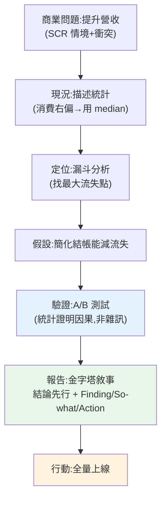

# 🏗️ Capstone:商業分析報告

> 這是 Part 24、也是整條 **Data Analyst 學習線(Part 23–24)** 的收尾整合。我們把一個真實分析師的完整任務走一遍:從一個商業問題出發,用 [描述統計](01-descriptive-stats.md)、[漏斗分析](06-business-metrics.md)發現問題,用 [A/B 測試](04-ab-test-statistics.md)驗證解方,最後用 [金字塔敘事](08-data-storytelling.md)組成能驅動決策的報告。這章示範**分析技能如何協作成一份有影響力的商業分析報告**。

## 💡 白話導讀(建議先讀)

這是 Part 24、也是整條 **資料分析師學習線(Part 23–24)** 的**畢業專題**:
模擬一個真實分析師從頭到尾的任務,把兩個 Part 的所有招式串成**一條完整的弧線**:

```text
1. 商業問題    「想提升營收,但轉換卡住了」(SCR 的情境+衝突)
2. 現況分析    描述統計 + EDA,看懂資料長相(偏態→用中位數)
3. 定位問題    漏斗分析,找出最大流失點
4. 驗證解方    對解方做 A/B + 假設檢定,建立因果
5. 說故事      金字塔:結論先行,每個發現走 Finding→So-what→Action
6. 行動建議    明確、可執行的下一步
```

這條弧線就是**分析師的完整價值鏈**:
從一句模糊的商業問題,走到一份能讓決策層拍板的報告。
中間每一步都對應前面學過的一章——這章把它們組裝成一個可交付的成品,
並附一份**可複用的報告模板**,讓你下次接到真實任務時照著走。

走完這裡,資料分析線就結業了。往後 [Part 25 機器學習](../25-machine-learning/README.md)起
進入建模與 AI——但「先懂資料、誠實分析、講清楚故事」這三件事,
在任何資料職涯裡都是不會過時的底功。

## Why(為什麼)

前面每章教一項技能——描述統計、相關因果、假設檢定、A/B、時間序列、商業指標、視覺化、說故事。但真實的分析工作是**把它們編織成一個連貫的故事來回答商業問題**:

- **發現問題**:用[描述統計](01-descriptive-stats.md)理解現況、用[漏斗](06-business-metrics.md)定位「哪裡出錯」。
- **驗證解方**:提出假設,用 [A/B 測試](04-ab-test-statistics.md)嚴謹驗證「這個改動真的有效嗎」——建立[因果](02-correlation-causation.md)而非猜測。
- **傳達決策**:用[金字塔結構 + Finding/So-what/Action](08-data-storytelling.md)組成報告,讓決策者**理解、相信、行動**。

這章示範**技能的協作與流程的完整**:不是孤立地跑某個分析,而是**從問題到決策的完整弧線**。這正是分析師交付價值的方式——一份**基於嚴謹分析、能驅動行動**的報告。這是 Data Analyst 的核心產出,也是這條學習線的能力總驗收。

## Theory(理論:分析報告的完整弧線)

一份商業分析報告,串起 Part 23–24 的能力:

```text
1. 商業問題(SCR 的情境+衝突)
   「想提升營收(情境),但轉換停滯(衝突)」
2. 現況分析(描述統計 + EDA)
   理解客戶消費分布(偏態→用 median)、規模
3. 定位問題(商業指標)
   漏斗分析找最大流失點 → 問題聚焦
4. 驗證解方(假設檢定 / A/B)
   對解方做 A/B,統計驗證有效性(建立因果)
5. 組成報告(說故事)
   金字塔:結論先行 + 每個洞察 Finding→So-what→Action
6. 行動建議
   明確、可執行的下一步
```

**貫穿的原則**:

- **嚴謹**:用[統計](03-hypothesis-testing.md)區分真實效果與雜訊、用 [A/B](04-ab-test-statistics.md) 建立因果、注意[相關非因果](02-correlation-causation.md)與偏態陷阱。
- **聚焦**:漏斗定位到**最大槓桿點**,別分散。
- **可行動**:每個發現連到 so-what 與 action,終點是決策。
- **可信**:誠實呈現、標明侷限。

## Specification(規範:報告的組成)

**任務**:電商想提升營收,分析為何轉換不佳並驗證解方。

| 步驟 | 技能 | 產出 |
|------|------|------|
| 1. 理解現況 | [描述統計](01-descriptive-stats.md) | 客戶消費分布(偏態,用 median) |
| 2. 定位問題 | [漏斗分析](06-business-metrics.md) | 最大流失點(加購→結帳) |
| 3. 提出解方 | 領域判斷 | 假設:簡化結帳能減少流失 |
| 4. 驗證 | [A/B 測試](04-ab-test-statistics.md) | 新結帳頁顯著提升轉換 |
| 5. 組成報告 | [金字塔敘事](08-data-storytelling.md) | 結論先行 + Finding/So-what/Action |
| 6. 建議 | 溝通 | 明確行動:全量上線 |

**報告結構(金字塔)**:

```text
【結論】優化結帳流程可帶來顯著營收成長
  ├─ 洞察1:加購→結帳是最大流失點 → 損失營收 → 簡化結帳
  └─ 洞察2:新結帳頁 A/B 顯著提升 → 已驗證有效 → 全量上線
```

## Implementation(底層:技能如何協作、嚴謹貫穿全程)

**技能的協作邏輯**:每一步的產出是下一步的輸入,形成因果鏈。**描述統計**先讓你認識資料(客戶消費右偏,所以「典型客戶」要用 [median](01-descriptive-stats.md) 而非被大戶拉高的 mean——這個判斷影響後續怎麼描述客群);**漏斗分析**把「轉換低」這個模糊問題**定位**到具體環節(加購→結帳流失最多),讓解方有明確目標;針對這個環節提出假設(簡化結帳),用 **A/B 測試**驗證——這一步至關重要,因為它把「我覺得簡化會更好」的**猜測**變成「統計證明簡化確實提升 1.8 個百分點(p<0.05)」的**因果證據**([相關非因果](02-correlation-causation.md)的解方就是實驗);最後用**金字塔敘事**把整條鏈組成決策者能吸收的報告。**每步都建立在前一步、且都服務於「回答商業問題」**。

**嚴謹如何貫穿**:這份報告的每個環節都有統計/方法的把關——用 median 避免[偏態誤導](01-descriptive-stats.md)、用 A/B 的 [p-value](03-hypothesis-testing.md) 確認「不是雜訊」、注意 A/B 的[樣本量與陷阱](04-ab-test-statistics.md)、報告時標明這是**實驗驗證的因果**(可信度高)而非觀察相關。**正是這些嚴謹,讓報告的建議「值得被採納」**——決策者相信的不是分析師的直覺,而是背後的證據強度。這是分析師專業的體現:**不只給答案,給有證據支撐、經得起質疑的答案。** 下面範例把整個流程串成可跑的分析。

## Code Example(可執行的 Python 範例)

```python
# capstone_report.py — 商業分析報告:現況→漏斗→A/B→金字塔報告(stdlib)
from __future__ import annotations

import math
import statistics as st
from dataclasses import dataclass
from statistics import NormalDist


@dataclass
class Insight:
    finding: str
    so_what: str
    action: str


def ab_test(x_c: int, n_c: int, x_t: int, n_t: int) -> tuple[float, float]:
    """雙比例 z 檢定,回 (絕對提升, p-value)。"""
    p_c, p_t = x_c / n_c, x_t / n_t
    p_pool = (x_c + x_t) / (n_c + n_t)
    se = math.sqrt(p_pool * (1 - p_pool) * (1 / n_c + 1 / n_t))
    z = (p_t - p_c) / se
    return p_t - p_c, 2 * (1 - NormalDist().cdf(abs(z)))


def largest_dropoff(funnel: list[tuple[str, int]]) -> tuple[str, int]:
    drops = [(funnel[i][0], funnel[i - 1][1] - funnel[i][1]) for i in range(1, len(funnel))]
    return max(drops, key=lambda x: x[1])


def main() -> None:
    # 步驟 1:現況(描述統計,消費右偏)
    spend = [120, 150, 180, 90, 200, 3000]  # 有大戶
    print("步驟1 現況:")
    print(f"  客戶消費 mean={st.mean(spend):.0f} median={st.median(spend):.0f}")
    print("  → 右偏(大戶拉高 mean),典型客戶看 median")

    # 步驟 2:定位問題(漏斗)
    funnel = [("造訪", 10000), ("加購", 2000), ("結帳", 900), ("付款", 800)]
    stage, lost = largest_dropoff(funnel)
    print(f"\n步驟2 漏斗最大流失:進入「{stage}」流失 {lost} 人")

    # 步驟 3-4:A/B 驗證新結帳頁
    lift, p_value = ab_test(450, 5000, 540, 5000)  # 對照 9% vs 實驗 10.8%
    print(f"\n步驟3-4 A/B 新結帳頁:提升 {lift * 100:.1f} 個百分點,")
    print(f"  p={p_value:.4f},顯著={p_value < 0.05}(驗證有效,非偶然)")

    # 步驟 5-6:組成金字塔報告
    insights = [
        Insight(
            f"加購→結帳流失 {lost} 人(最大漏洞)",
            "大量有購買意願的客戶在結帳前放棄,直接損失營收",
            "簡化結帳步驟(減少頁面、訪客結帳)",
        ),
        Insight(
            f"新結帳頁 A/B 提升 {lift * 100:.1f}pp(p={p_value:.3f} 顯著)",
            "改動經統計驗證確實有效,非隨機波動",
            "全量上線新結帳頁",
        ),
    ]
    print("\n步驟5-6 報告(金字塔):")
    print("  【結論】優化結帳流程可帶來顯著營收成長")
    for i, ins in enumerate(insights, 1):
        print(f"  {i}. 發現:{ins.finding}")
        print(f"     意涵:{ins.so_what}")
        print(f"     建議:{ins.action}")


if __name__ == "__main__":
    main()
```

**預期輸出**:

```pycon
$ python capstone_report.py
步驟1 現況:
  客戶消費 mean=623 median=165
  → 右偏(大戶拉高 mean),典型客戶看 median

步驟2 漏斗最大流失:進入「加購」流失 8000 人

步驟3-4 A/B 新結帳頁:提升 1.8 個百分點,
  p=0.0026,顯著=True(驗證有效,非偶然)

步驟5-6 報告(金字塔):
  【結論】優化結帳流程可帶來顯著營收成長
  1. 發現:加購→結帳流失 8000 人(最大漏洞)
     意涵:大量有購買意願的客戶在結帳前放棄,直接損失營收
     建議:簡化結帳步驟(減少頁面、訪客結帳)
  2. 發現:新結帳頁 A/B 提升 1.8pp(p=0.003 顯著)
     意涵:改動經統計驗證確實有效,非隨機波動
     建議:全量上線新結帳頁
```

逐段解說:

- **步驟 1 現況([描述統計](01-descriptive-stats.md))**:客戶消費 `mean=623` 但 `median=165`——**巨大差距揭示右偏**(一個 3000 的大戶把 mean 拉高 4 倍)。**專業判斷:描述「典型客戶」用 median(165),別用被大戶污染的 mean**。這個看似小的判斷,避免了「我們客戶平均花 623」的誤導性結論。
- **步驟 2 定位([漏斗](06-business-metrics.md))**:10000 造訪只有 800 付款,但**拆開看**——「造訪→加購流失 8000 人」是最大漏洞。**問題從「轉換低」聚焦到「加購前的巨大流失」**(此例意在示範漏斗定位;真實會再細看每步)。
- **步驟 3-4 驗證([A/B](04-ab-test-statistics.md))**:針對結帳提出「簡化能提升」的假設,做 A/B——對照 9% vs 新版 10.8%,**提升 1.8 個百分點,p=0.0026 顯著**。**關鍵:這一步把「我猜簡化更好」變成「統計證明簡化確實有效」**——建立[因果](02-correlation-causation.md)、排除雜訊。這是報告可信的基石。
- **步驟 5-6 報告([金字塔敘事](08-data-storytelling.md))**:**結論先行**(優化結帳可帶來營收成長),再列兩個洞察,每個 **Finding→So-what→Action**。決策者一眼看到結論與該做什麼(全量上線新結帳頁),背後有數據與統計支撐。
- **技能協作的全貌**:描述統計(認識)→ 漏斗(定位)→ A/B(驗證因果)→ 敘事(傳達)——**環環相扣、嚴謹貫穿、終於決策**。這就是分析師交付價值的完整流程。

## Diagram(圖解:分析報告弧線)



## Best Practice(最佳實踐)

- **從商業問題出發**:用 SCR 框定情境與衝突,別為分析而分析。
- **現況先用對的統計**:偏態用 median,避免 mean 誤導。
- **漏斗定位到最大槓桿**:聚焦問題,別分散火力。
- **解方一定要驗證(A/B)**:用實驗建立因果,別憑猜測上線。
- **報告結論先行 + 三件套**:金字塔結構,每洞察 Finding→So-what→Action。
- **嚴謹貫穿、標明侷限**:統計把關、注意[相關非因果](02-correlation-causation.md)/[A/B 陷阱](04-ab-test-statistics.md),誠實呈現。
- **終於明確行動**:報告的價值在於驅動決策,給可執行的下一步。
- **依受眾調整**:對高管給結論與行動,對執行團隊給細節。

## Common Mistakes(常見誤解)

- **跳過現況直接分析**:不理解資料就下結論(如用 mean 描述偏態客群)。
- **只報總轉換不定位**:知道低卻不知哪裡低,無從行動。
- **解方不驗證就上線**:憑直覺改,可能沒效或更糟(該 A/B)。
- **把 A/B 結果當然**:忽略[樣本量、偷看、顯著≠重要](04-ab-test-statistics.md)。
- **報告堆數字不給結論/行動**:決策者看不懂該做什麼。
- **結論藏在最後**:違反金字塔,聽眾失去耐心。
- **忽略侷限**:過度確定的宣稱,可信度受損。
- **技能孤立不成故事**:各跑一個分析卻不串成回答問題的弧線。

## Interview Notes(面試重點)

- **能描述完整分析報告的弧線**:商業問題→現況(描述統計)→定位(漏斗)→驗證(A/B)→報告(敘事)→行動。
- **能講各技能如何協作**:每步產出是下一步輸入,環環相扣服務於回答問題。
- **能強調 A/B 驗證的關鍵**:把猜測變因果證據,是報告可信的基石。
- **能講嚴謹如何貫穿**:偏態用 median、統計區分真假效果、標明侷限。
- **能講金字塔報告**:結論先行 + Finding/So-what/Action + 依受眾調整。
- **能連結全 Part**:這個 Capstone 整合了 Part 23-24 的取數、統計、指標、溝通能力。

---

🎉 **恭喜你完成 Part 24,也完成了 Data Analyst 學習線(Part 23–24)!** 你已能:從資料庫[取數整理](../23-data-analysis/README.md)、用[統計嚴謹地下結論](03-hypothesis-testing.md)、算對[商業指標](06-business-metrics.md)、並把洞察[有效傳達](08-data-storytelling.md)給決策者。這是一位能**影響決策**的資料分析師的完整能力。

➡️ 下一 Part:[機器學習基礎 ML Foundations](../25-machine-learning/README.md)——從「描述已發生的事」進到「預測還沒發生的事」。

[⬆️ 回 Part 24 索引](README.md) ｜ [回章節總覽](../README.md)
